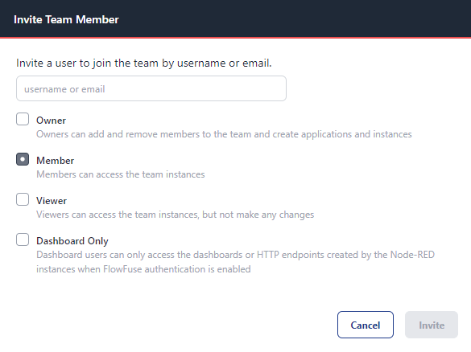
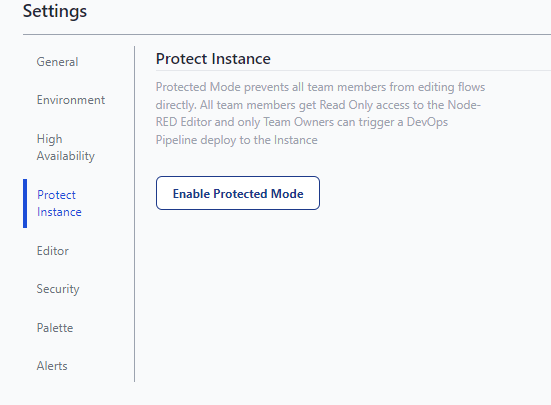

Role-based access Control (RBAC) is a crucial component of modern software platforms. It provides granular control over access rights and enhances security. Integrating RBAC into the FlowFuse platform brings this level of sophistication to Node-RED, allowing users to manage their environments with precision and confidence. This blog will explore how FlowFuse's RBAC system improves both security and user experience within the Node-RED ecosystem.

<!--more-->

## Roles Overview

FlowFuse offers a variety of roles that cater to different levels of access within the Node-RED environment, ensuring that users can tailor their platform according to their needs. These roles include:

1. Owner - The highest level of access with full control over team settings, instances, and features.
2. Member - Functions similarly to Owner, but inhibits the abilities to change instance states and manage members.
3. Viewer - Allows users to visualize and see flows and dashboards.  This is great for collaboration across multi tenant teams.
4. Dashboard Only - Designed for end users that will interact with Dashboards, but don't have a reason to see or edit flows.

{data-zoomable}

For further details see [documentation](/docs/user/team/#role-based-access-control) for full granularity of roles.

## Instance Protection Mode

A useful feature of FlowFuse's RBAC system is the Instance Protection Mode. This mode adds an additional layer of security by locking down critical Node-RED instances, preventing unauthorized modifications to configuration and nodes. The protection mode is particularly useful in production environments and areas in which need an extra layer of protection for any unintentional updates or changes.

{data-zoomable}

## The Impact on User Experience
FlowFuse's RBAC system significantly enhances the user experience for Node-RED users by providing a secure, customizable, and controlled environment. Teams can collaborate more efficiently and safely, knowing that access is properly managed and critical systems are protected.

## Conclusion
FlowFuse's integration of RBAC into the Node-RED ecosystem represents a significant enhancement in how users can interact with, manage, and secure their Node-RED instances. By offering detailed control over access rights and introducing features like Instance Protection Mode, FlowFuse not only secures Node-RED environments but also greatly improves their manageability and the overall user experience. With RBAC, users can now tailor their Node-RED platforms according to their specific needs while ensuring that security and collaboration are at the forefront of their operations.

For more information on how to implement and utilize Role-Based Access Control within FlowFuse, please refer to our [documentation](/docs/user/team/#role-based-access-control).
