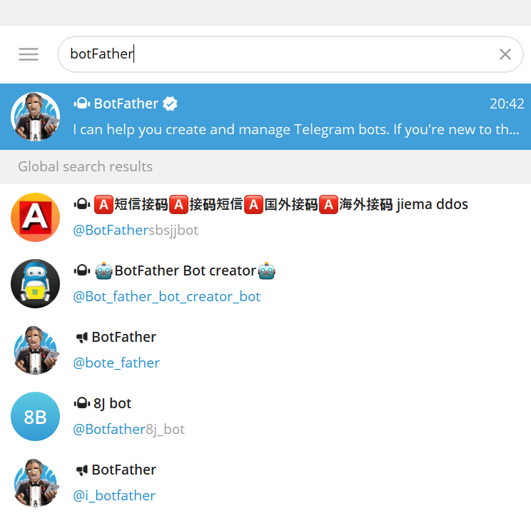
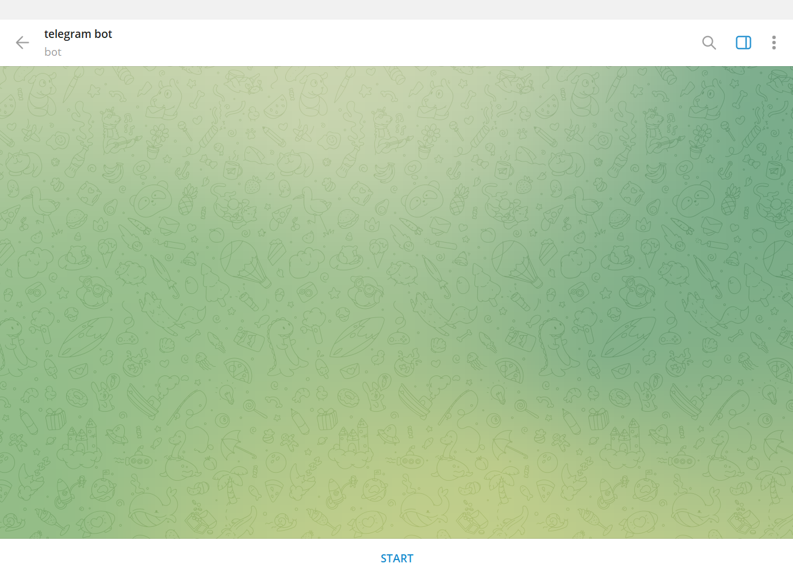
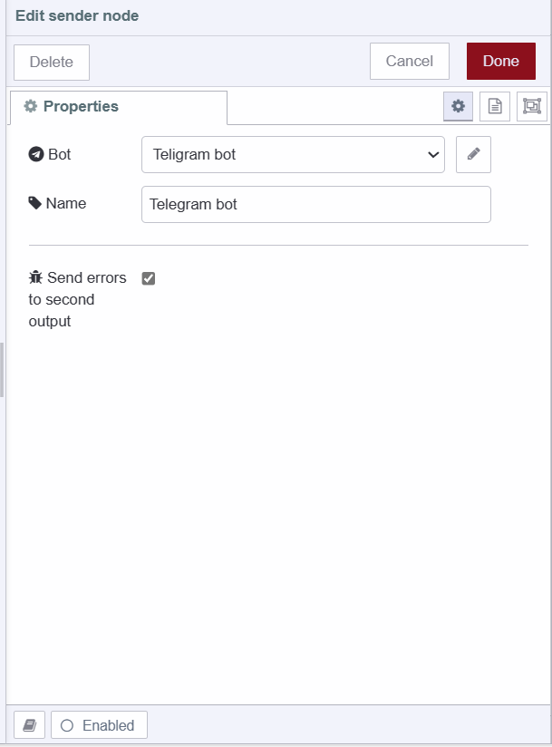
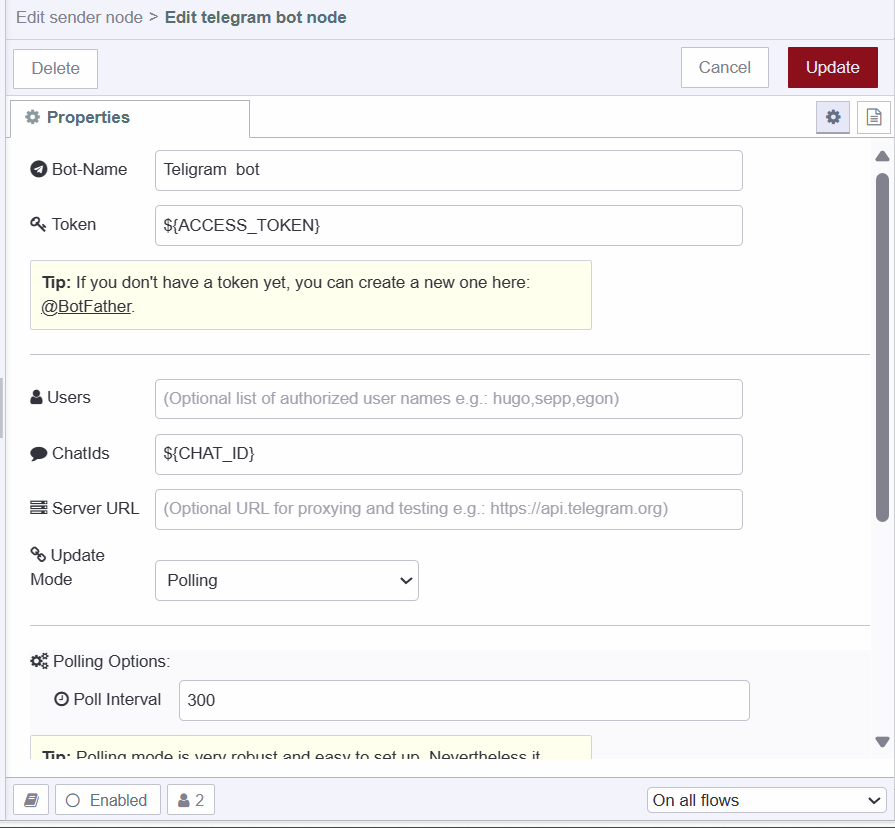
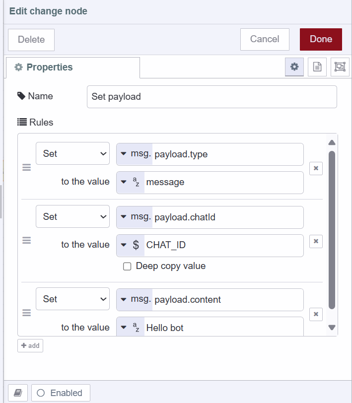
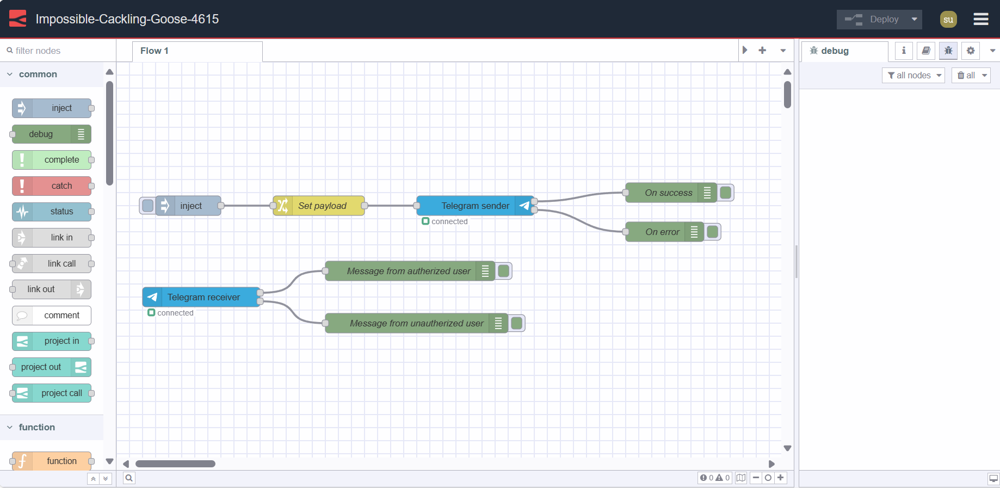

Integrating messaging applications or services in home automation is becoming common. Telegram is a popular choice among those messaging platforms. Today, in this guide, we will demonstrate how to integrate Telegram with Node-RED applications for sending and receiving messages

<!--more-->

## Creating a bot in Telegram

- Navigate to your Telegram application and click on the top right search icon, make sure you have a Telegram account and are logged in with it.
- Then type “botFather” and you'll see many accounts. Make sure to select the one with the blue verified tick.

{data-zoomable}

- After that, you'll see the chat interface. Type `/newbot` and press enter to send the command.
- The bot will ask for a name, which will be the display name of your bot. You can choose any name you like.
- Next, it will ask for a unique username for your bot. The username should not include spaces and must end with 'bot' for example telegram_bot or telegrambot
- Once you have entered a correct and unique username, you’ll receive a message confirming that you have successfully created the bot. It will contain the secret access token and a link to initiate your bot.
- Click on the provided link. You'll be directed to the chat interface between you and the created bot, with a start button at the bottom. Click on that button to activate your bot.

{data-zoomable}

## Obtaining your Telegram Chat ID

Telegram chat ID is a unique identifier for a chat or a group in Telegram, which is required for sending and receiving messages. In this section, you'll learn how to obtain your own and your group's Telegram chat IDs.

### Obtaining your Telegram Chat ID

- Open your Telegram app Click on the top right search icon and type “Get My ID”

{data-zoomable}

- Click on the first account you'll see, the chat interface will open, and type `/start` and press enter.
- After that, you’ll receive a message containing your Chat ID and User ID.

### Obtaining your Telegram group Chat ID

- Add `@getmyid_bot` to the group on which you want to send or receive messages using Node-RED.
- Once the bot joins the group, the bot will send the chat ID.

## Installing custom node

- Switch to the "Install" tab
- Search for "node-red-contrib-telegrambot"
- Click "Install"

## Adding environment variables

Utilizing environment variables is crucial while doing any configuration in your application as they contain sensitive information. Environment variables enable you to configure nodes or applications without exposing such information in the flow.json. For more details refer to [Using Environment Variables with Node-RED](https://flowfuse.com/blog/2023/01/environment-variables-in-node-red/).

- Go to Instance settings, and switch to the “Environment” tab.
- Click the top right “Add variable” button.
- Add variables for a secret access token and chat ID.
- Click on the "Save settings" button and restart the instance by clicking on the top "action" button and selecting the "Restart" option.

{data-zoomable}

## Configuring custom node

- Drag a Sender node onto the canvas.
- Click on it, then enable the "send error on second output" option. By doing this, you can separate the error message from the output that confirms your message has been sent successfully.

{data-zoomable}

- Then click on the edit icon next to the Bot input field.
- Enter your bot name and the environment variable name set for the access token into the Token field, and enter the environment name set for the chat ID into the chatIds input field as shown below, and keep other settings unchanged.

{data-zoomable}

## Sending a message to telegram

- Drag an Inject node onto the canvas.
- Drag a Change node onto the canvas. Set msg.payload.type as "message"  To explore other types, refer to the [node readme](https://flows.nodered.org/node/node-red-contrib-telegrambot), set msg.payload.chatId as the environment variable added for the chat ID, and then set msg.payload.content as the message you want to send.

{data-zoomable}

- Drag two debug nodes onto the canvas.
- Connect the Inject node's output to the change node's input, and the change node's output to the sender node's input which you have dragged while adding configurations.
- Connect one Debug node's input to the first output of the Sender node and the second Debug node's input to the Sender node's second output.

## Receiving a message from a telegram 

1. Drag a Receiver node onto the canvas.
2. Click on the node, and ensure you have selected the correct bot configuration that you have added.
3. For the Receiver node, you'll see two outputs: one for receiving messages from authorized users, and another for receiving messages from unauthorized users.
4. To add users to your authorized user list, click on the receiver node and click on the edit icon next to the bot input field, then add users separated by commas into the users input field.
5. Drag two Debug nodes onto the canvas.
6. Connect the first Debug node’s input to the first output of the Receiver node and the second Debug node’s input to the second output of the Receiver node.

## Deploying the flow

{data-zoomable}

- Deploy the flow by clicking the top right Deploy button.

Now that we're set up to send messages with our Telegram bot, simply click 'Inject' to send a message. You'll receive a notification from Telegram. Alternatively, check your bot's account on Telegram to see messages sent via Node-RED. To test receiving messages, send a message to your bot, and you'll see an object printed on debug containing the message along with other information

## Conclusion

In this guide, you've learned how to seamlessly integrate Telegram with Node-RED for sending and receiving messages. From creating your custom bot to obtaining your chat ID, configuring nodes, and sending and receiving messages.
