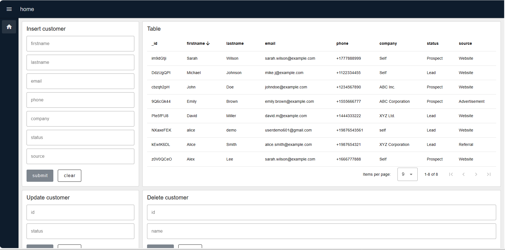

MongoDB, a popular NoSQL database, is a favored choice among developers. As MongoDB continuously releases updates to enhance efficiency and suitability for manufacturing purposes, we find providing content around MongoDB for our Node-RED users essential. In this guide, I will cover everything from MongoDB foundations to setup, providing you with step-by-step instructions for integration into your Node-RED applications.

<!--more-->

## What is MongoDB

MongoDB is an open-source, NoSQL database system designed for flexibility and scalability in handling data for modern applications. It stores data in documents, which are JSON-like structures. MongoDB offers a schema-less approach where each document can have its unique structure. This flexibility allows for easy schema evolution and dynamic querying. MongoDB is widely used in web and mobile applications for its ability to handle large volumes of data and support real-time applications efficiently.

In MongoDB, instead of tables, rows, and columns as in SQL databases, we have collections, documents, and fields.

{data-zoomable}

## Why choose MongoDB?

- MongoDB's schema-less approach fosters agile development without predefined structures, contrasting with SQL databases.
- MongoDB's distributed architecture facilitates seamless horizontal scaling across multiple nodes, ensuring consistent performance. Although some SQL databases, such as PostgreSQL, can also be scaled horizontally, the process may be more complex.
- MongoDB's query language and document-oriented data model are aligned with modern programming paradigms, which boosts developer efficiency.
- MongoDB a fully managed cloud database service, provides tools like Atlas Data Explorer, Real-Time Performance Metrics, Atlas Search, and Atlas Data Lake. These simplify database management with automated backups, point-in-time recovery, security features, and seamless scalability, which enhances operational efficiency for developers and administrators. Additionally, MongoDB has released Atlas specialized for manufacturing. For more information, refer to  [MongoDB Launches Atlas for Manufacturing and Automotive](https://www.mongodb.com/company/newsroom/press-releases/mongodb-atlas-for-manufacturing-and-automotive)
- More Importantly, MongoDB's native support for JSON documents simplifies data storage and retrieval, making it perfect for integration with Node-RED.

## Setting Up MongoDB with Node-RED
To kickstart the MongoDB integration with Node-RED, let's begin by installing the MongoDB custom node and familiarizing ourselves with MongoDB configuration details:

### Installing MongoDB custom node

- Click the Node-RED Settings (top-right)
- Click "Manage Palette"
- Switch to the "Install" tab
- Search for `node-red-contrib-mongodb4`

### Understanding MongoDB Configuration

While writing the article, I have utilized MongoDB Atlas, but feel free to choose any MongoDB setup, as the instructions in the article are adaptable for any setup. To establish a connection between our Node-RED application and the MongoDB database, it's essential to have the following configuration details prepared:

- `Host`: IP address or hostname of your MongoDB server.
- `Port`: By default, MongoDB uses port 27017. ( If you're using a managed MongoDB service like MongoDB Atlas, this information may not be required.)
- `Database`: The name of the MongoDB database you want to connect to.
- `User`: Username with the necessary privileges to access the specified database.
- `Password`: Corresponding password for the username.

To learn about advanced configurations such as TLS/SSL, please refer to the [node's readme](https://flows.nodered.org/node/node-red-contrib-mongodb4).

### Adding Environment variables

Using environment variables during configuration is crucial to prevent exposing sensitive information directly within the flow. To learn more about it refer to [Using Environment Variables in Node-RED.](https://flowfuse.com/blog/2023/01/environment-variables-in-node-red/)

{data-zoomable}

- Navigate to the instance's “setting” and then go to the “environment” tab.
- Click on the add variable button and “add variables” for each of the configuration data that we discussed in the above section.
- Click on the save button and restart the instance by clicking on the top right Action button and selecting the restart option.

### Configuring MongoDB node

Now let's configure MongoDB4 node using added environment variables 

- Drag the MongoDB4 node onto the canvas.
- Click on the node to select it, Then, click on the edit icon next to the connection input field.
- Add your environment variables as shown in the image below.

{data-zoomable}

## Using MongoDB with Node-RED

In this section, we'll delve into leveraging MongoDB to perform operations such as storing, retrieving, updating, and deleting data within Node-RED. To enhance understanding and engagement, we'll develop a basic customer relationship manager system utilizing MongoDB and Node-RED. 

For the CRM system we will develop, the data structure will be as follows:

```json
{
_id: "NXaxeFEK"
firstname: "alice"
lastname: "demo"
email: "userdemo601@gmail.com"
phone: "+19876543561"
company: "self"
status: "Prospect"
source: "website"
}

```

### Understanding MongoDB Operations

Before we move to practical implementation, we need to gain an understanding of MongoDB operations that will be used in this guide.

MongoDB operations refer to the actions or commands executed on a MongoDB database to perform various tasks such as inserting, querying, updating, and deleting data.

- InsertOne: Adds a single document to a MongoDB collection.
- Find: Retrieves documents based on specified criteria.
- UpdateOne: Updates a single document based on specified criteria.
- DeleteOne: Deletes a single document based on specified criteria.
- Drop: Deletes an entire MongoDB collection.

MongoDB provides a rich set of operations to learn more about them refer to their [official documentation](https://www.mongodb.com/basics/crud).

### Installing Nanoid custom node

NanoID is a small, secure, URL-friendly unique string ID generator for JavaScript. It's designed to generate compact IDs ideal for usage in URLs, short IDs, or other situations where a concise yet unique identifier is needed. We will use it to generate a user-friendly customer ID instead of manually entering or generating them using random numbers.

Install `node-red-contrib-friendly-id` via the palette manager which is a node that will allow us to use NanoID in Node-RED. 

### Installing Dashboard 2.0 

To build a user-friendly interactive UI for our CRM system, we will utilize Node-RED Dashboard 2.0 by following these [instructions](https://flowfuse.com/blog/2024/03/dashboard-getting-started/) to quickly set up and get started.

### Inserting Customer Data into the Database

1. Drag a ui-form widget onto the canvas, select ui-group for it, and add the form elements for `firstname`, `lastname`, `email`, `phone`, `company`, `status` and `source`.

{data-zoomable}

2. Drag the friendly-id node onto Canvas, click on and select and select mode as “Generate a random FriendlyId (nanoid)”, set the size according to your need, and output-to `msg.payload._id`.

{data-zoomable}

3. Drag the change node onto the canvas.
- In the change node Set `msg.payload` to `[msg.payload]` as a JSON expression. This will insert the `msg.payload` containing the customer (data received by the insert form) into the database.

{data-zoomable}

4. Click on the MongoDB4 node that we have added while configuring the MongoDB4 node.
5. Select the connection which we have added, and enter the collection name as “customers”. The collection will be created if it does not exist already in your MongoDB database.
6. Set the operation as “insertOne” and keep the other things unchanged.

{data-zoomable}

7 Connect the nodes' wires as shown in the below image.

{data-zoomable}

### Retrieving Customer Data from Database

- Drag the inject node onto the canvas. In the inject node, set `msg.payload` as an empty object. Additionally, set the inject node to send the payload after a specific interval of time to update the data in the table.
- Drag the MongoDB4 node onto canvas, make sure you have selected the connection, and enter “find” into the operation input field.

{data-zoomable}

- Drag the ui-table widget onto the canvas, create a new ui-group for it, and set max rows according to your preference.

{data-zoomable}

- Connect the nodes' wires as shown in the below image.

{data-zoomable}

### Updating Customer Data to Database

- Drag the ui-form widget onto the canvas, create a new ui-group for it, and add form elements for "id" and "status".

!["Screenshot displaying form widget configuration to update data in MongoDB"](./images/using-mongodb-with-node-red-insert-data-form.png "Screenshot displaying form widget configuration to update data in MongoDB"]{data-zoomable}

- Drag the change node onto the canvas. In the change node, set `msg.payload` as the following JSON object:

Note:- *Please note that the comments provided are for explanation purposes only and should not be copied along with the code*

```json
[
    // Specifying the criteria to identify the document to update, based on its _id field
    { "_id": msg.payload._id },
    // Setting the "status" field of the identified document to the new value received from msg.payload.status
    { "$set": { "status": msg.payload.status } }
]
```

{data-zoomable}

- Drag the MongoDB4 node onto canvas, make sure to select the connection, and enter “updateOne” into the operation input field.

{data-zoomable}

- Connect the nodes' wires as shown in the below image.

{data-zoomable}

### Deleting Customer Data to Database

- Drag the ui-form widget onto the canvas, create a new ui-group for it, and add form elements for id and name.

{data-zoomable}

- Drag the change node onto the canvas. In the change node, set `msg.payload` as the following JSON object:

```json
[
    // Specify the criteria to identify the document to delete, based on its _id field and firstname
    {
        "_id": msg.payload._id,         // Document ID to identify the document to delete
        "firstname": msg.payload.firstname // Additional criteria (e.g., firstname) to narrow down the deletion operation for accuracy
    },
    // Perform the delete operation
    {
        "$delete": "" // Indicates the delete operation to be performed
    }
]
```

{data-zoomable}

- Drag the MongoDB4 node onto canvas, make sure to select the connection, and enter “deleteOne” into the operation input field.

{data-zoomable}

- Connect the nodes' wires as shown in the below image.

{data-zoomable}

### Dropping the collection 

- Drag the inject node onto canvas, and set msg.payload as an empty object.
- Drag the MongoDB4 node onto canvas, make sure you have selected the added connection, Enter the collection name that you want to drop from the database, and enter “drop” into the operation input field.

{data-zoomable}

- Connect the nodes' wires as shown in the below image.

{data-zoomable}

## Debugging the operations

To debug MongoDB operations in Node-RED, simply add a debug node after the MongoDB4 node. This enables you to monitor the execution of operations and diagnose any errors that may occur. Below are sample debug messages indicating successful operations for each operation we have covered in this guide.

```
// Message received after insert operation successful
{
    "acknowledged": true,
    "insertedId": "BKoIzMuW" // ID of inserted data
}

// Message received after update operation successful
{
    "acknowledged": true,
    "modifiedCount": 1, // Indicates that one document is updated
    "upsertedId": null,
    "upsertedCount": 0,
    "matchedCount": 1 // Indicates one document is matched for the provided query
}

// Message received after delete operation successful
{
    "acknowledged": true,
    "deletedCount": 1 // Indicates that one document is deleted
}

// To indicate collection is dropped successfully and true value will be returned
```

### Deploying the flow

{data-zoomable}

- With your flow updated to include the above, click the "Deploy" button in the top-right of the Node-RED Editor.
- Locate the 'Open Dashboard' button at the top-right corner of the Dashboard 2.0 sidebar and click on it to navigate to the dashboard.

Now To drop tables, and retrieve table data, click on the 'Inject Node' button. For customer data insertion, updates, and deletions, navigate to fill in the corresponding forms and submit.

{data-zoomable}

## Additional resources

This section contains helpful links to other content. It isn’t required, so consider it supplemental.

- [Basic MongoDB CRUD implementation blueprint](https://flowfuse.com/blueprints/getting-started/crud/)
- [MongoDB best practices](https://www.mongodb.com/basics/best-practices) for to increase performance
- [Ebook: MongoDB in manufacturing](https://www.mongodb.com/collateral/manufacturing-with-mongodb).
- [Manufacturing & Automotive Industry Knowledge Accelerator](https://learn.mongodb.com/learning-paths/manufacturing-automotive-industry-knowledge-accelerator)

## Conclusion

In this guide, we've covered the integration of MongoDB with Node-RED to create dynamic applications. We've walked through the foundation, and setup process, demonstrated how to perform CRUD operations, and discussed debugging techniques. Additionally, we've built a Customer Relationship Management system to enhance understanding and engagement.
