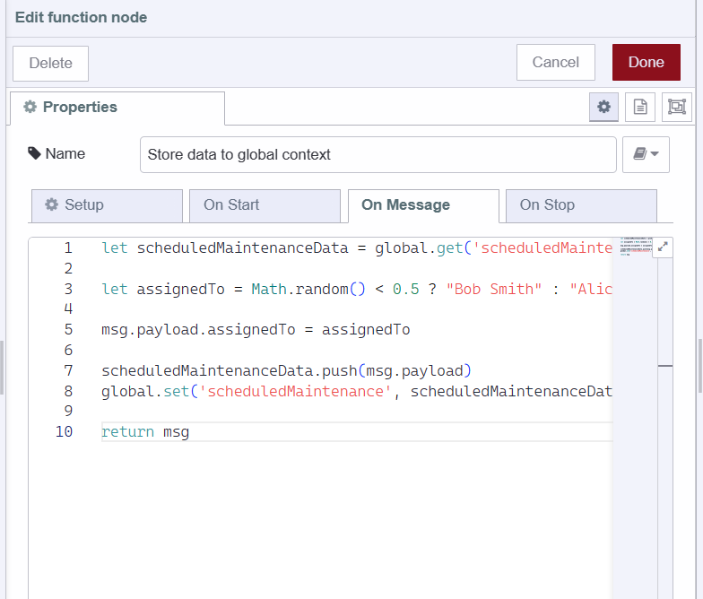

Have you found yourself needing to automate tasks based on specific events within your IoT applications? If so, utilizing webhooks presents an efficient solution for this challenge. Webhooks play an integral role in streamlining operations, facilitating real-time communication and seamless integration between disparate systems and devices. In this guide, we cover everything you need to get started with webhooks, from basics to practical implementation. We provide detailed, step-by-step instructions on integrating systems through webhooks using Node-RED.

<!--more-->

## What are the Webhooks?

Webhooks are a mechanism that allows fast communication between two different applications or services. They are essentially HTTP requests triggered by events in a source system and sent to a destination system, often with a payload of data. Webhooks are automated, meaning they are automatically sent out when their corresponding event is fired in the source system. 

In simple terms, Webhooks are "user-defined HTTP callbacks.” This callback is triggered after a specific event occurs in the source system, prompting the system to automatically send an HTTP request to the designated destination system.

## How Webhook works 

{data-zoomable}

- Event Initiator: This refers to the event specified to trigger the WebHook. Whenever this event occurs, the WebHook will be activated.
- Webhook Server: The webhook server, is responsible for managing webhook configurations and endpoints. It listens for the specified event. When the event is detected, the webhook server automatically sends an HTTP POST request containing relevant data to the designated third-party application or service.
- Data Reception by Third-Party Application: The third-party application will receive the data sent via the WebHook to the designated URL or listener provided during registration.
- Custom Action Execution: Upon receiving the POST request, specific actions can be performed.

## API Vs Webhook

It's common and understandable to get confused between APIs and webhooks, especially when you are learning about webhooks for the first time. However, comparing the two can help dispel these confusions.

## API:

- **Direction:**
  - Typically involves client-to-server communication.
- **Initiation:**
  - Requests are initiated by the client.
- **Request Method:**
  - Usually employs HTTP methods like GET, POST, etc.
- **Response:**
  - Provides an immediate response upon request.
- **Data Transfer:**
  - Utilizes a pull model where the client fetches data.
- **Polling:**
  - Requires periodic polling for updates.
- **Payload:**
  - The client specifies the payload in the request.
- **Error Handling:**
  - Typically includes error codes and messages.

## Webhook:

- **Direction:**
  - Typically involves server-to-server communication.
- **Initiation:**
  - Requests are initiated by the server.
- **Request Method:**
  - Typically uses the HTTP POST method.
- **Response:**
  - Does not provide an immediate response; asynchronous.
- **Data Transfer:**
  - Operates on a push model where the server pushes data to the client.
- **Polling:**
  - No need for polling; receives updates directly.
- **Payload:**
  - The server defines the payload in the outgoing request.
- **Error Handling:**
  - Errors are handled by retry mechanisms or manual intervention.

### Example Scenario:

Consider a manufacturing facility that utilizes temperature sensors to monitor temperature levels in critical areas. When the temperature surpasses predefined thresholds, it triggers a series of actions for maintenance and monitoring.

{data-zoomable}

- Temperature Sensor (Server 1): These physical sensors are installed in the manufacturing plant to monitor temperature. They trigger webhook requests to Server 2 whenever abnormal temperature patterns are detected.

- Server 2 (Webhook Server): This server creates and hosts the webhook endpoint. It receives HTTP requests from the temperature sensors (Server 1) when abnormal temperatures are detected. The request contains temperature data. Server 2 then processes this data and sends a POST request with relevant information to Server 3.

- Maintenance System (Server 3): This system receives POST requests from Server 2 containing event-related data on a specific endpoint provided to Server 2. It then automatically schedules maintenance tasks based on the received information.

## Practical implementation

In this section, we will construct the practical implementation of the scenario described above. However, all three components or servers will be hosted on the same Node-RED instance in our example. Furthermore, we will simulate data rather than using real sensors by utilizing random number expressions.

### Setting Up a Webhook

- Drag an http-in node onto the canvas. Configure the method as POST and set the path as "/test-webhook".

{data-zoomable}

- Drag an http request node onto the canvas. Configure the method as POST and set the URL to `https://<your-instance-name>.flowfuse.cloud/schedule-maintenance`, replace <your-instance-name> with your actual name of the instance. "/schedule-maintenance" will be the endpoint for posting requests to the maintenance monitoring system provided by Server 3. 

{data-zoomable}

- Drag an http response node onto the canvas and connect its input to the output of the http-in node. Also, connect an http request node's input to the same http in node's output.

## Setting Up a Temperature sensors (Server 1)

1. Drag an inject node onto the canvas and set `msg.payload` as below:

```
{"name": "sensor 1", "temperature": ($random() * 100)}
```
{data-zoomable}

2. Drag the another inject node onto the canvas and set `msg.payload` as below:

```
{"name": "sensor 2", "temperature": ($random() * 100)}
```
{data-zoomable}

3. Drag a switch node onto the canvas, click on it, and set up three conditions: one to check if the temperature is less than 50, the second to check if the temperature is greater than 70, and the last one for other cases.

{data-zoomable}

4. Drag an http request node onto the canvas, click on it, set the method as POST, and set the URL as `https://<your-instance-name>.flowfuse.cloud/test-webhook`

{data-zoomable}

5. Connect the http request node’s output to the first and second output of the switch node. then connect the third output of the switch node to the debug node.

## Setting Up a Server 3

Before moving further install Dashboard 2.0 as we will display the scheduled maintenance on the table for more information for more information refer to [Getting started with Dashboard 2.0](https://flowfuse.com/blog/2024/03/dashboard-getting-started/).

- Drag the http in node onto canvas, select the method as POST, and set the method as “/schedule-maintenance”.

{data-zoomable}

- Drag the function node onto Canvas and copy the below code in it.

```js
// Extract data from the incoming request
let data = msg.req.body;

// Retrieve or initialize scheduled maintenance data
let scheduledMaintenanceData = global.get('scheduledMaintenance') || [];

// Randomly assign maintenance task
let assignedTo = Math.random() < 0.5 ? "Bob Smith": "Alice Walker";

// Create a recent maintenance schedule record
let maintenanceScheduleRecentData = {
    "ocured_at": new Date().toISOString(), // Current timestamp
    ...data, // Include incoming data
    "assigned_to": assignedTo // Assign to a worker
};

// Add recent maintenance data to records
scheduledMaintenanceData.push(maintenanceScheduleRecentData);

// Update scheduled maintenance data to global context
global.set('scheduledMaintenance', scheduledMaintenanceData);

return msg;
```
{data-zoomable}

3. Drag the http response node onto the canvas.
4. Drag the change node onto the canvas and set `msg.payload` as 
`global.scheduledMaintenance`.

{data-zoomable}

5. Drag the ui-table widget onto Canvas, and create a new ui group for it in which it will render.
6. Connect the http in the node’s output to the function node’s and the change node’s input and connect the function node’s output to the http response node’s input and the change node’s output to the ui-table widget’s input.

### Deploying the flow

{data-zoomable}

- With your flow updated to include the above, click the "Deploy" button in the top-right of the Node-RED Editor.
- Locate the 'Open Dashboard' button at the top-right corner of the Dashboard 2.0 sidebar and click on it to navigate to the dashboard.

{data-zoomable}

## Conclusion 

In summary, this guide comprehensively covers using webhooks in Node-RED for automating tasks in their Node-RED applications. With clear explanations and practical demonstrations, users can seamlessly integrate webhooks to enhance communication, automate responses to events, and streamline operations.
