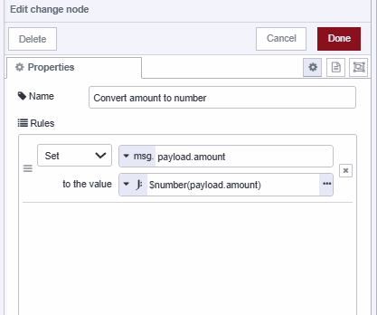
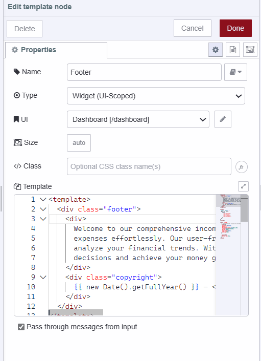

This guide delves into Node-RED Dashboard 2.0 widgets. It is a guide on how to build a Dashboard application, and will cover many of the widgets available today.

<!--more-->

If you're new to Dashboard 2.0, we recommend starting with the [Getting Started with Dashboard 2.0](/blog/2024/03/dashboard-getting-started/) guide and make sure to install it.

## What Are Widgets?

Widgets in Node-RED Dashboard 2.0 are the building blocks for creating a user interface. In Dashboard 2.0, you get a variety of widgets like forms, templates, buttons, and others to make different parts of your interface.

## Building Applications with Dashboard 2.0 Widgets

{data-zoomable}
_Income-expense tracker build with dashboard 2.0_

In this guide, we'll create a basic application to input expenses and income. This will then be displayed in a chart and table for analysis. The application will utilize a wide range of widgets available in Dashboard 2.0, helping you understand and use them confidently.

### Adding Forms

For the income and expense submission, we'll incorporate a form using the **ui-form** widget.

1. Drag the **ui-form** widget onto the canvas.
2. Double-click on it to access various widget properties and select the **ui-group** where it should render.
4. Add "date", "description", "amount", and "note" form elements by clicking the **+element** button at the bottom left.

{data-zoomable}
_Screenshot displaying Income submission ui-form's configuration_

Once you've added the income submission form, repeat the process to add an expense submission form on another **ui-page** and **ui-group**. For more information on **ui-form**, refer to the [ui-form docs](https://dashboard.flowfuse.com/nodes/widgets/ui-form.html).

{data-zoomable}
_Screenshot displaying Expense submission ui-form's configuration_

### Storing Form Data

The **ui-form** widget emits a payload object with key-value pairs of form elements upon submission. We'll store this data in a global context, If you are not familiar with Node-RED context, refer to [Understanding Node-RED varriables](/blog/2024/05/understanding-node-flow-global-environment-variables-in-node-red/).

1. Drag a **function** node onto the canvas and add the following code. This will store the submission in the `income` global context variable, and then modify `msg.payload` to pass on a notification to any further connected nodes.

```javascript
// Retrieve the existing 'income' array from the global context, or initialize it as an empty array if it doesn't exist
let income = global.get('income') || [];

// Push the incoming payload along with a 'type' property set to "income" into the 'income' array
income.push({
  ...msg.payload,
  type: "income",
});

// Store the updated 'income' array back into the global context
global.set('income', income);

// Set the message payload to a confirmation message for notification
msg.payload = "Thank you for submitting income!";

// Return the modified message
return msg;
```

Similarly, you can do this for storing expense data submitted using the expense submission form.

### Displaying Notifications

For displaying notifications on the dashboard, we'll utilize the **ui-notification** widget, which emits notifications to the user's dashboard. It accepts `msg.payload` which should be a string format or raw HTML/JavaScript for custom formatting.

1. Drag the **ui-notification** widget onto the canvas.
2. Set the position property to **center**. You can also adjust colors or notification timeout by modifying the color and timeout properties. Please take a look at the [ui-notification docs](https://dashboard.flowfuse.com/nodes/widgets/ui-notification.html#properties) for more information on **ui-notification**.

{data-zoomable}
_Screenshot displaying ui-notification widgets configuration_

### Listening for events

In Dashboard 2.0, the **ui-event** widget allows you to listen to user behavior or events. It does not render any content or components on the dashboard. Currently, this widget only listens for page views (`$pageview`) and leave (`$pageleave`) events.

With this, we can listen for page view and page leave events and trigger tasks based on those events. For instance, in our application, we will be displaying a table containing income and expense data, along with a chart. We'll update them when navigating to a new page or leaving a page.

1. Drag an **ui-event** widget onto the canvas.
2. Double-click on it and select the correct **ui-base** of your application.

For more information on ui-event refer to [ui-event docs](https://dashboard.flowfuse.com/nodes/widgets/ui-event.html).

### Retrieving Income-Expense Data

In our income-expense application, we will display the income and expenses in a single table.

1. Drag a **change** node onto the canvas.
2. Set `msg.payload` to the JSONata expression below, which merges the income and expense arrays.
   
```javascript
[$globalContext('income'), $globalContext('expense')]
```

3. Connect the output of the **ui-event** widget to the input of the **change** node.

{data-zoomable}
_Screenshot displaying the change node setting JSON expression to payload for retrieving and sorting data._

### Displaying Data on the Table

To display data on the table, we use the **ui-table** widget in Dashboard 2.0. This widget accepts an array of objects as input. The columns in the table correspond to the properties of the objects within the array, and each row represents a different object with values corresponding to those properties.

1. Drag a **ui-table** widget onto the canvas.
2. Create a new **ui-page** and **ui-group** for it.
3. Connect the output of the **change** node to the input of the **ui-table** widget.

{data-zoomable}
_Screenshot displaying the ui-table widget configuration_

For more information on ui-table refer to [ui-table docs](https://dashboard.flowfuse.com/nodes/widgets/ui-table.html)

### Calculating total category-wise 

In our application, we will display data on the chart, showing the total income and total expenses for analysis. In this section, we will calculate the total expenses and income using the function node.

1. Drag the two **change** node onto the canvas.
2. For the first **Change** node Set `msg.payload` to `global.income` and `msg.topic` to "income" and give it name "retrive income". For the second **Change** node, set `msg.payload` to `global.expense` and `msg.topic` to "expense" and give that second change node name "retrive expense".

{data-zoomable}
_Screenshot displaying the change node retrieving income data from global context_

{data-zoomable}
_Screenshot displaying the change node retrieving expense data from global context_

3. Drag a **Split** node onto the canvas.
4. Drag the **Change** node onto the canvas and set `msg.payload.amount` to the JSONata expression `$number(payload.amount)` and give it name "Convert amount to number".

{data-zoomable}
_Screenshot displaying the change node converting amount to number_

5. Drag a **Join** node onto the canvas, select mode as **reduced expression**, and set the **Reduce exp** to `$A + payload.amount`. Set Initial value to `0`, and **Fix-up exp** to `$A`. Give this **join** node the name "Calculate total". This function operates similarly to using the javascript reduce method on an array to calculate the sum of its values. `$A` stores the accumulated value, and with every incoming message payload, it adds the `payload.amount` value to it, for more details on this refer to the [core node docs on join node](/node-red/core-nodes/join/).

{data-zoomable}
_Screenshot displaying the join node calculating the total income and expense data_

7. Drag an another join node onto the canvas set mode to manual, combine each to complete message, to create to array and After a number of message parts to 2 and give it name "combine two objects into array".

{data-zoomable}
_Screenshot displaying the join node combining the income and expense object into the array_

7. Connect the output of the **ui-event** widget to the input of the **Change** node named "Retrieve Income" and "Retrieve Expense". Then, connect the outputs of the "Retrieve Income" and "Retrieve Expense" **Change** nodes to the input of the **Split** node. 

8. Next, connect the output of the **Split** node to the **Change** node named "Convert Amount to Number". Afterward, connect the output of that **Change** node to the input of the **Join** node named "Calculate Total". Finally, connect the output of the "Calculate Total" **Join** node to the input of the **Join** node named "Combine Objects into Array".

### Displaying data on the chart 

To display charts on the dashboard, we have to use the ui-chart widget which allows us to display different types of charts on a dashboard including linear, bar, scatter, etc. This accepts an array and object as input.

1. Drag a **ui-chart** widget onto the canvas.
2. Double-click on the widget and select Type as **bar**.
3. Configure the series to **category** and the y-axis to **amount**. This configuration informs the chart that the **amount** property of the input objects will be plotted on the y-axis and category to the x-axis of the chart.
4. Connect the output of the **join** node named "Combine Objects into Array" to the **ui-chart** widget's input.
   
{data-zoomable}
_Screenshot displaying the ui-chart widget's configuration_

### Adding custom footer with ui-template

With the **ui-template** widget, we can add a custom component to our app using Vue.js. It also allows adding custom CSS for the dashboard and lot of other things. For more information refer to [ui-template docs](https://dashboard.flowfuse.com/nodes/widgets/ui-template.html).

Using this widget, we will add a footer to our application.

1. Drag an **ui-template** widget onto the canvas.
2. Set the widget type (scoped UI) that will render this widget on the entire dashboard, eliminating the need to add separate footers for each page of the dashboard.
3. Insert the following vue.js code in the **ui-template** widget. 

```javascript
<template>
  <!-- Footer Component -->
  <div class="footer">
    <!-- Description of the Income-Expense Tracker -->
    <div>
      Welcome to our comprehensive income expense tracker! Take control of your finances by monitoring your income and
      expenses effortlessly. Our user-friendly interface makes it simple to record transactions, categorize expenses, and
      analyze your financial trends. With real-time insights into your spending habits, you can make smarter financial
      decisions and achieve your money goals faster.
    </div>
    <!-- Copyright Information -->
    <div class="copyright">
      <!-- Display Current Year and Copyright Information -->
      2024 — <strong>Vuetify</strong>
    </div>
  </div>
</template>
<style scoped>
  /* Make the footer occupy all available space */
  .footer {
    position:absolute;
    bottom:0;
    background-color:rgb(26,26,26);
    color:rgb(238,238,238);
    height:130px;
    text-align:center;
    padding:14px;
  }

  .copyright{
    margin-top:10px;
  }
</style>
```

{data-zoomable}

### Deploying your application flow


[{"id":"301c1fd8e29c3aae","type":"ui-template","z":"7ac3890dfa74703b","group":"","page":"","ui":"a0a85a5f4c29af50","name":"Footer","order":0,"width":0,"height":0,"head":"","format":"<template>\n  <!-- Footer Component -->\n  <div class=\"footer\">\n    <!-- Description of the Income-Expense Tracker -->\n    <div>\n      Welcome to our comprehensive income expense tracker! Take control of your finances by monitoring your income and\n      expenses effortlessly. Our user-friendly interface makes it simple to record transactions, categorize expenses,\n      and\n      analyze your financial trends. With real-time insights into your spending habits, you can make smarter financial\n      decisions and achieve your money goals faster.\n    </div>\n    <!-- Copyright Information -->\n    <div class=\"copyright\">\n      <!-- Display Current Year and Copyright Information -->\n     2024 — <strong>Vuetify</strong>\n    </div>\n  </div>\n</template>\n\n<style scoped>\n  /* Make the footer occupy all available space */\n  .footer {\n    position: absolute;\n    bottom: 0;\n    background-color: rgb(26, 26, 26);\n    color: rgb(238, 238, 238);\n    height: 130px;\n    text-align: center;\n    padding: 14px;\n  }\n\n  .copyright {\n    margin-top: 10px;\n  }\n</style>","storeOutMessages":true,"passthru":true,"resendOnRefresh":true,"templateScope":"widget:ui","className":"","x":910,"y":700,"wires":[[]]},{"id":"342f3ee215d32fdc","type":"group","z":"7ac3890dfa74703b","name":"New Icome page","style":{"label":true},"nodes":["d028c878350d19e1","43e79bb77d718c95","5ba5d8bff1a77bea"],"x":274,"y":279,"w":752,"h":82},{"id":"d028c878350d19e1","type":"ui-form","z":"7ac3890dfa74703b","g":"342f3ee215d32fdc","name":"Income Submission Form","group":"961528943e1bb698","label":"","order":1,"width":"0","height":"0","options":[{"label":"Date","key":"date","type":"date","required":true,"rows":null},{"label":"Description","key":"description","type":"text","required":true,"rows":null},{"label":"Amount","key":"amount","type":"number","required":true,"rows":null},{"label":"Note","key":"note","type":"text","required":false,"rows":null}],"formValue":{"date":"","description":"","amount":"","note":""},"payload":"","submit":"submit","cancel":"clear","resetOnSubmit":true,"topic":"topic","topicType":"msg","splitLayout":"","className":"","x":410,"y":320,"wires":[["5ba5d8bff1a77bea"]]},{"id":"43e79bb77d718c95","type":"ui-notification","z":"7ac3890dfa74703b","g":"342f3ee215d32fdc","ui":"a0a85a5f4c29af50","position":"center center","colorDefault":true,"color":"#000000","displayTime":"3","showCountdown":true,"outputs":0,"allowDismiss":true,"dismissText":"Close","raw":false,"className":"","name":"","x":910,"y":320,"wires":[]},{"id":"5ba5d8bff1a77bea","type":"function","z":"7ac3890dfa74703b","g":"342f3ee215d32fdc","name":"Store income","func":"let income = global.get('income') || [];\n\nincome.push({\n    ...msg.payload,\n    type:\"income\",\n});\n\nglobal.set('income', income);\n\nmsg.payload = \"Thank you for submitting income!\"\n\nreturn msg;","outputs":1,"timeout":0,"noerr":0,"initialize":"","finalize":"","libs":[],"x":650,"y":320,"wires":[["43e79bb77d718c95"]]},{"id":"961528943e1bb698","type":"ui-group","name":"Income Submission Form","page":"d954d73f9dcd1472","width":"12","height":"1","order":1,"showTitle":true,"className":"","visible":"true","disabled":"false"},{"id":"d954d73f9dcd1472","type":"ui-page","name":"New Income","ui":"a0a85a5f4c29af50","path":"/new-Icome","icon":"bank-transfer-in","layout":"notebook","theme":"aeeec3fc1077eb1c","order":1,"className":"","visible":"true","disabled":"false"},{"id":"aeeec3fc1077eb1c","type":"ui-theme","name":"dashboard","colors":{"surface":"#1a1a1a","primary":"#0094ce","bgPage":"#eeeeee","groupBg":"#ffffff","groupOutline":"#cccccc"},"sizes":{"pagePadding":"12px","groupGap":"12px","groupBorderRadius":"4px","widgetGap":"12px"}},{"id":"4afb4814be56a9a8","type":"group","z":"7ac3890dfa74703b","name":"New Expense page","style":{"label":true},"nodes":["e82b719d899cbf73","3457848652ad75e1","bd90a9ad612408d3"],"x":1054,"y":279,"w":752,"h":82},{"id":"e82b719d899cbf73","type":"ui-form","z":"7ac3890dfa74703b","g":"4afb4814be56a9a8","name":"Expense Submission Form","group":"854706651cd8a8f2","label":"","order":1,"width":"12","height":"1","options":[{"label":"Date","key":"date","type":"date","required":true,"rows":null},{"label":"Description","key":"description","type":"text","required":true,"rows":null},{"label":"Category","key":"category","type":"text","required":true,"rows":null},{"label":"Amount","key":"amount","type":"number","required":true,"rows":null},{"label":"Note","key":"note","type":"text","required":false,"rows":null}],"formValue":{"date":"","description":"","category":"","amount":"","note":""},"payload":"","submit":"submit","cancel":"clear","resetOnSubmit":true,"topic":"topic","topicType":"msg","splitLayout":"","className":"","x":1190,"y":320,"wires":[["bd90a9ad612408d3"]]},{"id":"3457848652ad75e1","type":"ui-notification","z":"7ac3890dfa74703b","g":"4afb4814be56a9a8","ui":"a0a85a5f4c29af50","position":"center center","colorDefault":true,"color":"#000000","displayTime":"3","showCountdown":true,"outputs":0,"allowDismiss":true,"dismissText":"Close","raw":false,"className":"","name":"","x":1690,"y":320,"wires":[]},{"id":"bd90a9ad612408d3","type":"function","z":"7ac3890dfa74703b","g":"4afb4814be56a9a8","name":"Store expense","func":"let expense = global.get('expense') || [];\n\nexpense.push({\n    ...msg.payload,\n    type: \"expense\",\n});\n\nglobal.set('expense', expense);\n\nmsg.payload = \"Thank you for submitting expense!\"\n\nreturn msg;","outputs":1,"timeout":0,"noerr":0,"initialize":"","finalize":"","libs":[],"x":1420,"y":320,"wires":[["3457848652ad75e1"]]},{"id":"854706651cd8a8f2","type":"ui-group","name":"Expense Submission Form","page":"97bf3e87f4bdddc1","width":"12","height":"1","order":2,"showTitle":true,"className":"","visible":"true","disabled":"false"},{"id":"97bf3e87f4bdddc1","type":"ui-page","name":"New Expense","ui":"a0a85a5f4c29af50","path":"/new-expense","icon":"bank-transfer-out","layout":"notebook","theme":"aeeec3fc1077eb1c","order":2,"className":"","visible":"true","disabled":"false"},{"id":"77217e256ef75328","type":"group","z":"7ac3890dfa74703b","name":"Your icome and expense table","style":{"label":true},"nodes":["452d561bf79727cb","0c64567c81dd6a8d"],"x":274,"y":399,"w":572,"h":82},{"id":"452d561bf79727cb","type":"ui-table","z":"7ac3890dfa74703b","g":"77217e256ef75328","group":"e848a5e48a6549c9","name":"","label":"text","order":2,"width":0,"height":0,"maxrows":0,"passthru":false,"autocols":true,"selectionType":"click","columns":[],"x":770,"y":440,"wires":[[]]},{"id":"0c64567c81dd6a8d","type":"change","z":"7ac3890dfa74703b","g":"77217e256ef75328","name":"Merge income and expense data","rules":[{"t":"set","p":"payload","pt":"msg","to":"[    $globalContext(\"income\"),\t   $globalContext(\"expense\")\t]","tot":"jsonata"}],"action":"","property":"","from":"","to":"","reg":false,"x":440,"y":440,"wires":[["452d561bf79727cb"]]},{"id":"e848a5e48a6549c9","type":"ui-group","name":"Your Income and Expense","page":"7abf0b3cb6f38ca3","width":"12","height":"5","order":2,"showTitle":true,"className":"","visible":"true","disabled":"false"},{"id":"7abf0b3cb6f38ca3","type":"ui-page","name":"Your Income and expense","ui":"a0a85a5f4c29af50","path":"/your-icome-expense","icon":"calendar-multiple-check","layout":"grid","theme":"aeeec3fc1077eb1c","order":3,"className":"","visible":"true","disabled":"false"},{"id":"1b78769d6d27d102","type":"group","z":"7ac3890dfa74703b","name":"Event lister","style":{"label":true},"nodes":["9ce6db04b2c9d7b2"],"x":74,"y":479,"w":152,"h":82},{"id":"9ce6db04b2c9d7b2","type":"ui-event","z":"7ac3890dfa74703b","g":"1b78769d6d27d102","ui":"a0a85a5f4c29af50","name":"","x":150,"y":520,"wires":[["0c64567c81dd6a8d","2ca552c7e56b3619","a7360e4a62bfc518"]]},{"id":"32502807f24f79b8","type":"group","z":"7ac3890dfa74703b","name":"Overview chart","style":{"label":true},"nodes":["424b35900722e740","058a77a65653d3f8","7246228e57ac1fc5","2ca552c7e56b3619","23a4a7d15b44876b","a7360e4a62bfc518","fe308581b8a5b9f1"],"x":274,"y":519,"w":1392,"h":142},{"id":"424b35900722e740","type":"ui-chart","z":"7ac3890dfa74703b","g":"32502807f24f79b8","group":"54eca83feb7c1479","name":"Overview Chart","label":"chart","order":2,"chartType":"bar","category":"topic","categoryType":"property","xAxisProperty":"","xAxisPropertyType":"msg","xAxisType":"category","yAxisProperty":"payload","ymin":"","ymax":"","action":"replace","pointShape":"circle","pointRadius":4,"showLegend":false,"removeOlder":1,"removeOlderUnit":"3600","removeOlderPoints":"","colors":["#1eb33c","#aec7e8","#ff7f0e","#5f2ed1","#98df8a","#d62728","#ff9896","#9467bd","#c5b0d5"],"width":"12","height":"6","className":"","x":1560,"y":600,"wires":[[]]},{"id":"058a77a65653d3f8","type":"join","z":"7ac3890dfa74703b","g":"32502807f24f79b8","name":"Calculate total","mode":"reduce","build":"object","property":"payload","propertyType":"msg","key":"topic","joiner":"\\n","joinerType":"str","accumulate":true,"timeout":"","count":"","reduceRight":false,"reduceExp":"$A+payload.amount","reduceInit":"0","reduceInitType":"num","reduceFixup":"$A","x":1000,"y":600,"wires":[["fe308581b8a5b9f1"]]},{"id":"7246228e57ac1fc5","type":"split","z":"7ac3890dfa74703b","g":"32502807f24f79b8","name":"","splt":"\\n","spltType":"str","arraySplt":1,"arraySpltType":"len","stream":false,"addname":"","x":550,"y":600,"wires":[["23a4a7d15b44876b"]]},{"id":"2ca552c7e56b3619","type":"change","z":"7ac3890dfa74703b","g":"32502807f24f79b8","name":"Retrieve income","rules":[{"t":"set","p":"payload","pt":"msg","to":"income","tot":"global"},{"t":"set","p":"topic","pt":"msg","to":"income","tot":"str"}],"action":"","property":"","from":"","to":"","reg":false,"x":380,"y":560,"wires":[["7246228e57ac1fc5"]]},{"id":"23a4a7d15b44876b","type":"change","z":"7ac3890dfa74703b","g":"32502807f24f79b8","name":"Convert amount to number","rules":[{"t":"set","p":"payload.amount","pt":"msg","to":"$number(payload.amount)\t","tot":"jsonata"}],"action":"","property":"","from":"","to":"","reg":false,"x":760,"y":600,"wires":[["058a77a65653d3f8"]]},{"id":"a7360e4a62bfc518","type":"change","z":"7ac3890dfa74703b","g":"32502807f24f79b8","name":"Retrieve income","rules":[{"t":"set","p":"payload","pt":"msg","to":"expense","tot":"global"},{"t":"set","p":"topic","pt":"msg","to":"expense","tot":"str"}],"action":"","property":"","from":"","to":"","reg":false,"x":380,"y":620,"wires":[["7246228e57ac1fc5"]]},{"id":"fe308581b8a5b9f1","type":"join","z":"7ac3890dfa74703b","g":"32502807f24f79b8","name":"Combine two object into one array","mode":"custom","build":"array","property":"","propertyType":"full","key":"topic","joiner":"\\n","joinerType":"str","accumulate":false,"timeout":"","count":"2","reduceRight":false,"reduceExp":"","reduceInit":"","reduceInitType":"","reduceFixup":"","x":1270,"y":600,"wires":[["424b35900722e740"]]},{"id":"54eca83feb7c1479","type":"ui-group","name":"Overview","page":"47bde79e946933d2","width":"12","height":"4","order":-1,"showTitle":true,"className":"","visible":"true","disabled":"false"},{"id":"47bde79e946933d2","type":"ui-page","name":"Overview","ui":"a0a85a5f4c29af50","path":"/overview","icon":"google-analytics","layout":"notebook","theme":"aeeec3fc1077eb1c","order":-1,"className":"","visible":"true","disabled":"false"},{"id":"a0a85a5f4c29af50","type":"ui-base","name":"Dashboard","path":"/dashboard","includeClientData":true,"acceptsClientConfig":["ui-notification","ui-control","ui-chart","ui-table"],"showPathInSidebar":false,"navigationStyle":"icon"}]


1. Deploy the flow by clicking the top right **Deploy** button.
2. Locate the ***Open Dashboard** button at the top-right corner of the Dashboard 2.0 sidebar and click on it to navigate to the dashboard.

Now that we've built an income-expense tracker application and gained a basic understanding of Dashboard 2.0 widgets for building dashboards.

### Up next

If you want to enhance this simple application by adding more features or want to make the application personalize for users, consider the following resources:

- [Webinar](/webinars/2024/node-red-dashboard-multi-user/) - This webinar provides an in-depth discussion of the Personalised Multi-User Dashboards feature and offers guidance on how to get started with it.

- [Comprehensive guide: Node-RED Dashboard 2.0 layout, sidebar, and styling](https://flowfuse.com/blog/2024/05/node-red-dashboard-2-layout-navigation-styling/) - This comprehensive guide will cover everything about Node-RED Dashboard 2.0 styling, layouts and sidebars.

- [Displaying logged-in users on Dashboard 2.0](/blog/2024/04/displaying-logged-in-users-on-dashboard/) - This detailed guide demonstrates how to display logged-in users on Dashboard 2.0 which using the FlowFuse Multiuser addon and FlowFuse.

- [How to Build an Admin Dashboard with Node-RED Dashboard 2.0](/blog/2024/04/building-an-admin-panel-in-node-red-with-dashboard-2/) - This detailed guide demonstrates how to build a secure admin page in Node-RED Dashboard 2.0.

- [How to Build An Application With Node-RED Dashboard 2.0](/blog/2024/04/how-to-build-an-application-with-node-red-dashboard-2/) - This guide, covers how you can build personalize multiuser dashboard using flow fuse multi-user addon.

- [Multi-User Dashboard for Ticket/Task Management blueprint](/blueprints/flowfuse-dashboard/multi-user-dashboard/) -  this blueprint allows you to utilize templates to develop a personalized multi-user dashboard quickly. This Task management blueprint has all features such as adding, updating, and deleting tasks, user profiles, and admin dashboard.

If you are looking to build a multi-user dashboard, deploy it in seconds, scale and manage Node-RED efficiently, and enable seamless remote access for your entire team, [sign up]() for FlowFuse and get started today!

{% include "cta.njk", cta_query: "utm_campaign=60718323-BCTA&utm_source=blog&utm_medium=cta&utm_term=high_intent&utm_content=Exploring%20Node-RED%20Dashboard%202.0%20Widgets", cta_type: "signup", cta_text: "Looking to build a multi-user dashboard, deploy it in seconds, scale and manage Node-RED efficiently, and enable seamless remote access for your entire team?" %}