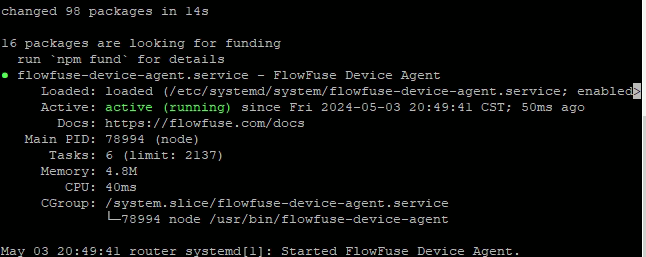

The [Robustel EG5120](https://www.robustel.com/product/eg5120-industrial-edge-computing-gateway/) is a versatile gateway that facilitates robust connectivity for industrial IoT applications. Integrating this powerful hardware with FlowFuse not only enhances its capabilities but also simplifies the management and deployment process. In this guide, we’ll walk through the steps to integrate the Robustel EG5120 with FlowFuse, making your IoT solutions more efficient and easier to manage.

<!--more-->

This blog is designed for IoT enthusiasts and professionals who are looking to enhance their industrial IoT applications. The [Robustel EG5120](https://www.robustel.com/product/eg5120-industrial-edge-computing-gateway/), equipped with Linux-based Debian 11 supporting a wide variety of programming languages including Node.js, offers robust connectivity options. When combined with FlowFuse, this gateway becomes even more powerful, enabling seamless device management and deployment. 

## Robustel

The Robustel EG5120 supports multiple connectivity options including Ethernet, Wi-Fi, and cellular networks, which are essential for flexible deployments in various industrial scenarios. Its built-in support for Bluetooth, cellular connectivity, RS232, RS485, and Modbus facilitates seamless integration with a wide array of IoT devices and services. This blog will guide you through using FlowFuse to effectively manage your Node-RED instance, enhancing both the security and scalability of your IoT applications.

## Setting Up the Environment

After spending a few weeks finding out all the convoluted ways to do something, my CEO recommended testing the Raspbian deployment script for deploying FlowFuse to a Raspberry Pi.  Both Robustel and Raspberry pi run a debian base linux operating system.  Raspberry pi's run a customized and unofficial port of Debian called Raspbian, while Robustel leverages Debian 11.  I decided to give it a shot and the script works flawlessly.  
  
An [install script is available](/docs/hardware/raspbian/#installing-the-device-agent) that will guide through installing the FlowFuse device agent on the EG5120.  

When finished you should see an out put stating **Started FlowFuse Device Agent.**

{data-zoomable}

The script does the following:

1. Detect if Node.js is already installed, it will ensure it is at least v14. If less than v14 it will stop. If nothing is found it will install the Node.js 18 LTS release
2. Install the latest version of the FlowFuse Device Agent using npm.
3. Setup the FlowFuse Device Agent to run as a service and installs it to **/opt/flowfuse-device**.

If you are interested in running the device agent as a service, we have provided a [guide](/docs/hardware/raspbian/#running-as-a-service) on just how to do that.

The last step is to link your EG5120 to FlowFuse.  These steps entail registering your device withing the FlowFuse platform.  The [guide here](/docs/device-agent/quickstart/) will help you register your EG5120 with FlowFuse.

## Practical Application
Consider a scenario where multiple similar remote facilities need to efficiently monitor and manage multiple industrial machines. By integrating the Robustel EG5120 with FlowFuse, the facilities can streamline data collection, enhance device management, and improve operational efficiencies through real-time analytics and remote management capabilities. By leveraging FlowFuse, managing your Node-RED instance becomes even easier by allow the management of all the runtimes from a central location.  

## Conclusion
Integrating the Robustel EG5120 with FlowFuse simplifies the deployment of IoT solutions and enhances the manageability and scalability of your IoT infrastructure. This setup ensures your devices are secure, backed up, and optimized for performance. We encourage you to explore this solution further and enhance your industrial IoT applications.

