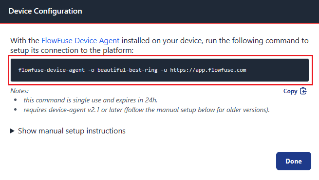
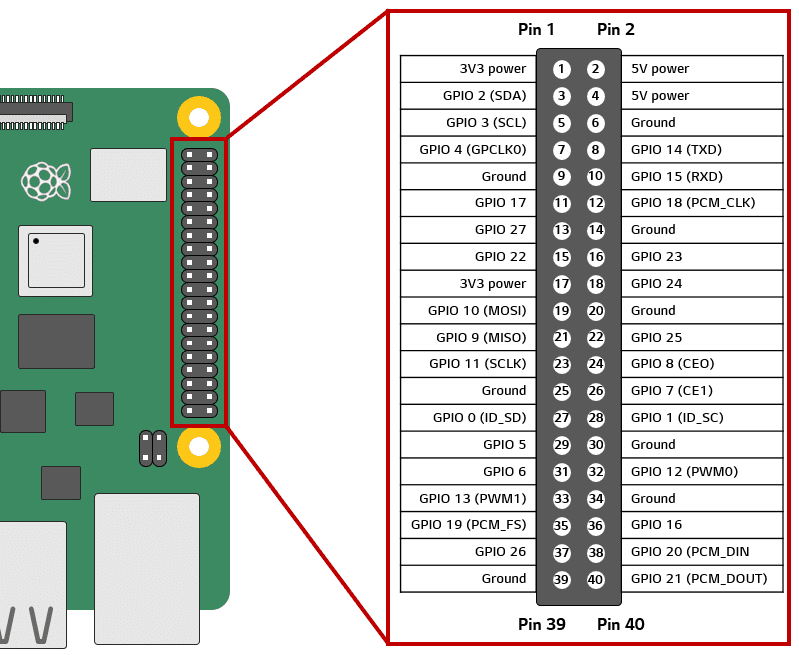

Creating applications for IoT and IIoT projects is often challenging, especially when dealing with hardware devices. However, Node-RED simplifies this process by providing an intuitive platform for interacting with hardware devices, sensors, and microcontrollers. Raspberry Pi is a widely used microcontroller in conjunction with Node-RED according to [survey conducted in 2023](https://nodered.org/about/community/survey/2023/). In this guide, we will explore how to set up Node-RED on Raspberry Pi and utilize it to interact with sensors and actuators.

<!--more-->

## What is the Raspberry Pi?

The Raspberry Pi is a small, affordable computer known for its versatility. It's widely used in projects like smart home setups and industrial monitoring. In IoT, it connects devices to the internet for tasks like environmental monitoring. In IIoT, it helps monitor and control machinery in industries. Its simplicity and affordability make it popular for a wide range of applications.

- **Affordable:** Raspberry Pi boards are cost-effective, making them accessible for individuals, educators, and hobbyists.
- **Versatility:** Raspberry Pi supports various operating systems and can be used for a wide range of projects, from basic computing tasks to advanced IoT applications.
- **GPIO Pins:** The GPIO (General Purpose Input/Output) pins allow for hardware connections, enabling users to interface with sensors, motors, and other devices.
- **Compact Size:** Raspberry Pi boards are small in size, making them convenient for embedding into projects with limited space.

## Installing Flowfuse Device Agent on Raspberry Pi

The FlowFuse Device Agent, developed by FlowFuse, simplifies the operation of Node-RED on your edge device, facilitating connections and interactions with hardware devices. Furthermore, it enables remote management, streamlining the monitoring and administration of the Node-RED application running on the device from any remote location.

### Prerequisites for Installation:

- Required Hardware:

Before proceeding further, ensure you have all the necessary hardware components ready. This includes the Raspberry Pi single-board computer (recommended models: Raspberry Pi version 1 or higher ), an SD card (8GB or larger recommended), a compatible power supply, and any required peripherals such as a keyboard, mouse, and display. It's also beneficial to have a DHT11 sensor for following the practical guide further, but it is not necessary for the installation process. 

- Software Preparation:

Ensure your Raspberry Pi is fully set up and running on the latest version of Raspbian OS. For more information on installing Raspberry Pi OS, refer to [How to Install Raspberry Pi OS on Your Pi](https://raspberrytips.com/install-raspberry-pi-os/). Additionally, ensure your Raspberry Pi is connected to a stable network, either via Ethernet or Wi-Fi.

### Installing the Device Agent

FlowFuse provides a script to install the FlowFuse Device Agent onto a Raspberry Pi in an easy way. This script will check if Node.js is installed and ensure it's at least version 14; if not found, it installs Node.js 14 LTS. Then, it installs the latest FlowFuse Device Agent using npm and sets it up to run as a service, which means it sets up the Pi to run the FlowFuse agent every time it boots up and restart it if it ever crashes.

```
bash <(curl -sL https://raw.githubusercontent.com/FlowFuse/device-agent/main/service/raspbian-install-device-agent.sh)
```

## Linking the Device Agent to Your FlowFuse Team

Now, before you begin developing applications with FlowFuse running on the device, you need the device to be configured with a token to identify itself on FlowFuse. To register and generate configuration details, visit `flowfuse.com`, log in with your ID and password, or if you don't have an account, create one, and then follow the steps below:

### Generating "Device Configuration"

1. Go to your team's **Devices** page.
2. Click the **Add Device** button.
3. You will be prompted to give the device a Name, an optional Type, and to choose which Application, if any, the device should be assigned to.
4. The Type field can be used to record additional meta information about the device.
5. If you do not wish to assign the device to an Application at this time, you can do so later.
6. Click **Add**.
7. Once the device has been registered, you will be shown the Device Configuration dialog which contains all the information needed to connect the device to the platform.

### Linking to FlowFuse Team

To link the FlowFuse Device Agent to your FlowFuse team, you have two different options. You can either utilize the command provided by FlowFuse, as explained in this section or opt for the Device Agent web UI interface. For more details on using the Device Agent web UI, refer to the [Device Agent Web UI documentation](/docs/device-agent/register/#device-agent-web-ui).

{data-zoomable}

1. Copy the command given in the dialog.
2. Paste that into your Raspberry Pi command line.

Now, your device has successfully connected to your FlowFuse team. When you restart the Raspberry Pi, the agent should start automatically with full configuration. The device will then ping back to FlowFuse, allowing you to commence application development on the FlowFuse Cloud.

## Accessing Node-RED Editor and Creating your first flow

To begin development, you need to access the Node-RED editor, which can be done in two ways: within the local network and from outside of the network anywhere in the world.

### Accessing Node-RED Editor within the same Network

1. Open your browser on the same device where the FlowFuse device agent is running.
2. Type 127.0.0.1:8080 into the URL input field and press Enter. Then, enter 'admin' as the username and 'password' as the default password for the editor login.

### Accessing Node-RED Editor Outside of the LAN Network

1. Login into your FlowFuse account.
2. Click on the Devices option in the left sidebar.
3. Click on the device and enable the developer mode option by clicking on the top right-corner switch.
4. Then click on the Device Editor option which is next to the developer mode option.

### Creating Your First Flow

Now you will see a nice editor with various options. To gain an understanding of the Node-RED editor and other basic things, refer to [Node-RED Editor Guide](https://nodered.org/docs/user-guide/editor/).

- Drag an Inject node onto the canvas from the Palette.
- Drag a Debug node onto the canvas.
- Connect the Inject node's output to the Debug node's input.
- Click on the red deploy button located at the top right corner to deploy the flow.

Now, your basic flow is set up. When you click the "Inject" button, it will trigger a message to be sent to the "Debug" node, which will display the message in the debug panel. This helps you understand how nodes can be connected to create a flow in Node-RED. 

## Securing Node-RED


## Integrating sensors and actuators

Interacting with sensors and actuators with Raspberry Pi can be complex, which often involves Python programming and managing various libraries. However, with FlowFuse running directly on your hardware device, the process becomes simpler and faster.

There are numerous custom nodes available for interacting with both sensors and actuators in Node-RED. One of the most popular nodes for controlling actuators is [node-red-node-pi-gpio](https://flows.nodered.org/node/node-red-node-pi-gpio). This node allows you to send on/off commands to actuators and perform Pulse Width Modulation (PWM), useful for controlling motor speed, LED brightness, servo motor positions and more.

For reading data from sensors, you can search for nodes by sensor names in the palette manager. You'll see several nodes as search results. There are nodes available for almost all types of sensors in Node-RED. Select the appropriate node by reviewing its descriptions and README. Alternatively, seek assistance on the [Node-RED Forums](https://discourse.nodered.org/#!). 

### Interfacing DHT11 sensor to Raspberry Pi

To demonstrate the integration of a sensor with Node-RED, we will walk you through the steps of connecting a DHT11 sensor to read temperature data with Node-RED.

1. Grab three female-to-female jumper wires.
2. Connect the wire from the signal(s or +) pin of the DHT11 sensor to the **GPIO 4** pin on the Raspberry Pi.
3. Connect the wire from the Vcc(v or out) pin of the DHT11 sensor to any **5-volt** pin on the Raspberry Pi.
4. Connect the wire from the Ground(g or -) pin of the DHT11 sensor to any **ground (GND)** pin on the Raspberry Pi.

If you are unsure about the pin configurations, you can refer to the images below:

{data-zoomable}

{data-zoomable}

### Reading sensor data with Node-RED

#### Installing bcm2835 library 

The bcm2835 library is essential for Raspberry Pi (RPi) as it provides access to GPIO and other IO functions on the Broadcom BCM 2835 chip, used in the Raspberry Pi 4. This allows control and interface with various external devices connected to the GPIO pins on the RPi 4 boards.

1. Open the command line of your Raspberry Pi.
2. Navigate to your home directory by entering the following command:

`
cd ~
`

3. Download the bcm2835 library package by executing the following command:

`
wget  http://www.airspayce.com/mikem/bcm2835/bcm2835-1.75.tar.gz
`

4. Extract the downloaded package using the following command:

`
tar xvfz bcm2835-1.75.tar.gz
`

5. Enter the extracted directory by executing:

`
cd bcm2835-1.75
`

6. Configure the installation by running:

`
./configure
`

7. Compile the library by executing:

`
make
`

8. Finally, install the library using:

`
sudo make install
`

#### Installing DHT custom node

This node only works on all versions of Raspberry Pi 4; for other versions, you can explore alternative nodes

1. Open your device's editor in the flowfuse.
2. Click on the menu icon in the top right corner.
3. Select **Manage palette** from the menu.
4. Go to the **Install** tab.
5. Search for `node-red-contrib-dht-sensor` in the search bar.
6. Click on the "Install" button next to the "node-red-contrib-dht-sensor".

#### Reading sensor data with rpi-dht-22 node

1. Drag an inject node onto the canvas and set repeat to 5 seconds of interval.
2. Drag a **rpi-dht-22** node onto the canvas.
3. Select the sensor model to **DHT11**.
4. Select pin numbering to **BCM GPIO**.
5. Select pin number to **4** as our signal pin is connected to the GPIO 4 pin.
6. Drag the **Debug** node onto the canvas and select output to **complete the msg object**.
7. Connect the **inject** node's output to the **rpi-dht-22** node's input and the **rpi-dht-22** node's output to the **debug** node's input.
8. Deploy the flow by clicking on the top-right red **deploy** button.

## Why use FlowFuse with Raspberry Pi and Node-RED?

Employing FlowFuse alongside Node-RED and Raspberry Pi offers a multitude of benefits, enhancing the development, management, and security of IoT projects. Let's explore the advantages:

- **Enhanced Security:** FlowFuse offers strong security, including TLS/SSL encryption and Single Sign-On (SSO) integration for safe access. Additionally, detailed audit logs help track all changes to Node-RED instances, ensuring accountability and easy monitoring.

- **Remote Device Management at the Edge:** FlowFuse offers seamless remote device management for Node-RED instances at the edge, enabling easy deployment, monitoring, and debugging across hundreds or thousands of devices from remote locations.

- **Scalability:** FlowFuse facilitates the scaling of infrastructure, making it easy to manage large-scale environments. With one-click deployment to thousands of devices, organizations can effortlessly scale their Node-RED projects to meet growing demands.

- **Collaboration:** FlowFuse facilitates seamless collaboration for Node-RED development teams, providing centralized administration of team and role-based access control for secure and efficient project management.

- **Cost Reduction:** FlowFuse helps organizations reduce operational costs by streamlining development processes, improving efficiency, and enabling better resource utilization. This leads to cost savings across the organization's Node-RED projects.
