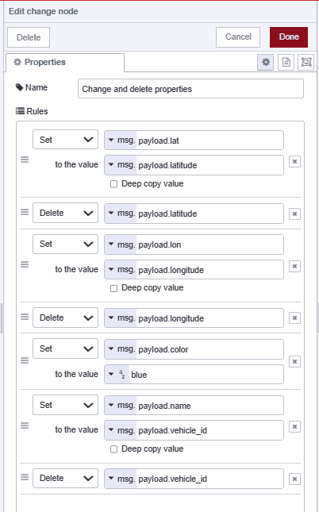
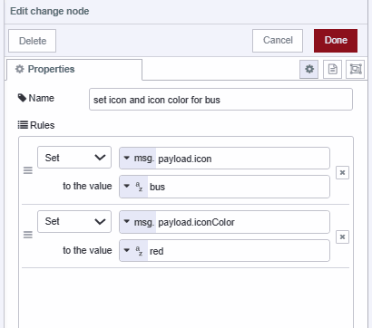

Fleet management in IoT uses sensors and software to collect real-time data on vehicles, such as location, fuel consumption, and driver behavior. This data allows companies to optimize routes, reduce costs, improve safety, and enhance overall operational efficiency of their fleet. Building an application that allows the tracking of location to support Fleet management is what this post is about.

<!--more-->

Before moving further, make sure you have installed Dashboard 2.0. If you are new to Dashboard 2.0, please refer to [Getting Started with Dashboard 2.0](/blog/2024/03/dashboard-getting-started/) for more information.

## Installing world map custom node

To render an interactive world map webpage for plotting location data, we will use a popular custom node called [node-red-contrib-web-worldmap-page](https://flows.nodered.org/node/node-red-contrib-web-worldmap). This node offers extensive features enabling us to render a world map and plot various items with different icons, colors, NATO symbologies, ranges, and more.

1. Click the Node-RED Settings (top-right).
2. Click "Manage Palette".
3. Switch to the "Install" tab.
4. Search for `node-red-contrib-web-worldmap`.
5. Click "Install".

## Retrieving location Data

Before plotting locations, we need to obtain the data first. For this purpose, we will utilize the [Edenburg Open Public Transportation API](https://tfe-opendata.readme.io/docs/getting-started). This API provides the live locations of all of Edenburg's public buses and trams, enabling us to access the necessary data for plotting on Worldmap within Dashboard 2.0.

1. Drag an **Inject** node onto the canvas and set the repeat property to a 20-second interval.
2. Drag an HTTP request node onto the canvas, Dobule-click on it and choose **GET** method, and enter `https://tfe-opendata.com/api/v1/vehicle_locations` in the URL field and select return  as **a parsed json object**. This API is public, so no need for environment variables. For private APIs, consider using [environment variables](/blog/2023/01/environment-variables-in-node-red) for security.

{data-zoomable}

3. Connect the **Inject** node's output to the **HTTP request** node's input.

## Formatting Location Data

To ensure compatibility with the Worldmap custom node, we need to format the location data appropriately. 

1. Drag the **Change** node onto the canvas, and set the `msg.payload` to `msg.payload.vehicles`, and give it name **Set payload**.

{data-zoomable}

2. Drag a **Split** node onto the canvas.
3. Add another **Change** node to the canvas. Configure it to set and delete properties as shown in the image below, and give it name **Change and delete properties**. By changing and deleting properties of the location, we ensure that only the properties acceptable by the **Worldmap** node are included in the location data.

{data-zoomable}

4. Drag a **Switch** node onto the canvas and add conditions to check if `msg.payload.vehicle_type` is equal to **tram** or not.

{data-zoomable}

5. Add another **Change** node to the canvas and give it a name **set icon and icon color for tram**. Set `msg.payload.icon` to **fa-train** and `msg.payload.iconColor` to **yellow**.

{data-zoomable}

7. Add another **Change** node to the canvas and give it a name **set icon and icon color for bus**. Set `msg.payload.icon` to **bus** and `msg.payload.iconColor` to **red**.

{data-zoomable}

8. Connect the **HTTP request** node's output to the input of the **Change** node named **Set payload**, and connect the output of that **Change** node to the input of the **Split** node.
9. Then, connect the output of the **Split** node to the input of the **Change** node named **Change and delete properties**, and connect the output of the "Change and delete properties" node to the input of the **Switch** node. Then **Switch** node's first output to the input of the **Change** node named **set icon and icon color for tram**, and its second output to the input of the **Change** node named **set icon and icon color for bus**.
 
## Plotting location data on Worldmap

1. Drag a **Worldmap** node onto the canvas. Set the path to **/worldmap** and keep the rest of the settings unchanged, although you can modify other properties according to your preferences.

{data-zoomable}

2. With the **worldmap** node configured, it will generate a world map with plotted data accessible at the specified path.
3. Connect the **Function** node's output to **Worldmap** node's input.

Now we have successfully created a page with a world map displaying plotted vehicle location data. To confirm, you can visit `https://<your-instance-name>.flowfuse.cloud/worldmap`.

## Rendering map on Dashboard 2.0

To render worlmap webpage on dashboard 2.0 we will use **iframe** custom widget which will allow us to embed an external webpage into Dashboard 2.0 applications using an iframe.

### Installing iframe custom widget

1. Click the Node-RED Settings (top-right)
2. Click **Manage Palette**
3. Switch to the **Install** tab
4. Search for `@flowfuse/node-red-dashboard-2-ui-iframe`
5. Click **Install**

### Rendering worlmap on Dashboard 2.0

1. Drag an **iframe** widget onto the canvas.
2. Select **ui-group** and **ui-base** for it, where you want to render the webpage.
3. Set height and width for it according to your preference and set URL to **/worlmap**.

{data-zoomable}

## Deploying the flow

{data-zoomable}


[{"id":"4e45e8ef870b86fb","type":"group","z":"eacc68e72f120b0e","style":{"stroke":"#b2b3bd","stroke-opacity":"1","fill":"#f2f3fb","fill-opacity":"0.5","label":true,"label-position":"nw","color":"#32333b"},"nodes":["b6917d83.d1bac","3842171.4d487e8","b4f2e2dabd5b8220","5f0d149d4dc38916","2ff7e9501ad50cd5","a08f0a836ac412a7","bc891dc2aaaedc39","726a8da3fe930e54","b3dd7814ea5270ca","0c5d6bcfd71d40da","e037ee3d1f702d25","d7ca6c3cdf176e4e"],"x":814,"y":759,"w":1872,"h":322},{"id":"b6917d83.d1bac","type":"http request","z":"eacc68e72f120b0e","g":"4e45e8ef870b86fb","name":"","method":"GET","ret":"obj","paytoqs":"ignore","url":"https://tfe-opendata.com/api/v1/vehicle_locations","tls":"","persist":false,"proxy":"","insecureHTTPParser":false,"authType":"","senderr":false,"headers":[],"x":1190,"y":900,"wires":[["a08f0a836ac412a7"]]},{"id":"3842171.4d487e8","type":"inject","z":"eacc68e72f120b0e","g":"4e45e8ef870b86fb","name":"get transporatation data","props":[{"p":"payload"}],"repeat":"5","crontab":"","once":false,"onceDelay":"","topic":"","payload":"","payloadType":"str","x":970,"y":900,"wires":[["b6917d83.d1bac"]]},{"id":"b4f2e2dabd5b8220","type":"worldmap","z":"eacc68e72f120b0e","g":"4e45e8ef870b86fb","name":"worldmap","lat":"","lon":"","zoom":"","layer":"OSMG","cluster":"","maxage":"","usermenu":"show","layers":"show","panit":"false","panlock":"false","zoomlock":"false","hiderightclick":"false","coords":"mgrs","showgrid":"false","showruler":"false","allowFileDrop":"false","path":"/worldmap","overlist":"DR,CO,RA,DN","maplist":"OSMG,OSMC,EsriC,EsriS,UKOS","mapname":"","mapurl":"","mapopt":"","mapwms":false,"x":2600,"y":900,"wires":[]},{"id":"5f0d149d4dc38916","type":"comment","z":"eacc68e72f120b0e","g":"4e45e8ef870b86fb","name":"Retrieving, formatting, and plotting location data on a world map.","info":"","x":1390,"y":800,"wires":[]},{"id":"2ff7e9501ad50cd5","type":"comment","z":"eacc68e72f120b0e","g":"4e45e8ef870b86fb","name":"Rendering a map with plotted data on Dashboard 2.0.","info":"","x":1440,"y":980,"wires":[]},{"id":"a08f0a836ac412a7","type":"change","z":"eacc68e72f120b0e","g":"4e45e8ef870b86fb","name":"Set payload","rules":[{"t":"set","p":"payload","pt":"msg","to":"payload.vehicles","tot":"msg"}],"action":"","property":"","from":"","to":"","reg":false,"x":1390,"y":900,"wires":[["726a8da3fe930e54"]]},{"id":"bc891dc2aaaedc39","type":"change","z":"eacc68e72f120b0e","g":"4e45e8ef870b86fb","name":"Change and delete properties","rules":[{"t":"set","p":"payload.lat","pt":"msg","to":"payload.latitude","tot":"msg"},{"t":"delete","p":"payload.latitude","pt":"msg"},{"t":"set","p":"payload.lon","pt":"msg","to":"payload.longitude","tot":"msg"},{"t":"delete","p":"payload.longitude","pt":"msg"},{"t":"set","p":"payload.color","pt":"msg","to":"blue","tot":"str"},{"t":"set","p":"payload.name","pt":"msg","to":"payload.vehicle_id","tot":"msg"},{"t":"delete","p":"payload.vehicle_id","pt":"msg"}],"action":"","property":"","from":"","to":"","reg":false,"x":1770,"y":900,"wires":[["b3dd7814ea5270ca"]]},{"id":"726a8da3fe930e54","type":"split","z":"eacc68e72f120b0e","g":"4e45e8ef870b86fb","name":"","splt":"\\n","spltType":"str","arraySplt":1,"arraySpltType":"len","stream":false,"addname":"","x":1550,"y":900,"wires":[["bc891dc2aaaedc39"]]},{"id":"b3dd7814ea5270ca","type":"switch","z":"eacc68e72f120b0e","g":"4e45e8ef870b86fb","name":"is vehical type is tram","property":"payload.vehicle_type","propertyType":"msg","rules":[{"t":"eq","v":"tram","vt":"str"},{"t":"else"}],"checkall":"true","repair":false,"outputs":2,"x":2040,"y":900,"wires":[["0c5d6bcfd71d40da"],["e037ee3d1f702d25"]]},{"id":"0c5d6bcfd71d40da","type":"change","z":"eacc68e72f120b0e","g":"4e45e8ef870b86fb","name":"set icon and icon color for tram","rules":[{"t":"set","p":"payload.icon","pt":"msg","to":"fa-train","tot":"str"},{"t":"set","p":"payload.iconColor","pt":"msg","to":"yellow","tot":"str"}],"action":"","property":"","from":"","to":"","reg":false,"x":2310,"y":860,"wires":[["b4f2e2dabd5b8220"]]},{"id":"e037ee3d1f702d25","type":"change","z":"eacc68e72f120b0e","g":"4e45e8ef870b86fb","name":"set icon and icon color for bus","rules":[{"t":"set","p":"payload.icon","pt":"msg","to":"bus","tot":"str"},{"t":"set","p":"payload.iconColor","pt":"msg","to":"red","tot":"str"}],"action":"","property":"","from":"","to":"","reg":false,"x":2310,"y":940,"wires":[["b4f2e2dabd5b8220"]]},{"id":"d7ca6c3cdf176e4e","type":"ui-iframe","z":"eacc68e72f120b0e","g":"4e45e8ef870b86fb","name":"","group":"15d2dfa55e99ea43","order":0,"src":"/worldmap","width":"12","height":"10","x":1370,"y":1040,"wires":[]},{"id":"15d2dfa55e99ea43","type":"ui-group","name":"U.K Transportation Live","page":"e098e3047b4a4eaa","width":"12","height":"1","order":-1,"showTitle":false,"className":"","visible":"true","disabled":"false"},{"id":"e098e3047b4a4eaa","type":"ui-page","name":"U.K Transportation Live","ui":"c2e1aa56f50f03bd","path":"/worldmap","icon":"earth","layout":"grid","theme":"129e99574def90a3","order":-1,"className":"","visible":"true","disabled":"false"},{"id":"c2e1aa56f50f03bd","type":"ui-base","name":"Dashboard","path":"/dashboard","showPathInSidebar":false,"navigationStyle":"default"},{"id":"129e99574def90a3","type":"ui-theme","name":"Another Theme","colors":{"surface":"#000000","primary":"#ff4000","bgPage":"#f0f0f0","groupBg":"#ffffff","groupOutline":"#d9d9d9"},"sizes":{"pagePadding":"9px","groupGap":"12px","groupBorderRadius":"9px","widgetGap":"6px"}}]


1. With your flow updated to include the above, click the **Deploy** button in the top-right of the Node-RED Editor.
2. Locate the **Open Dashboard** button at the top-right corner of the Dashboard 2.0 sidebar and click on it to navigate to the dashboard.

Now you can view the live location of Edinburgh public transport vehicles on the dashboard. Additionally, clicking on each vehicle reveals further details such as its name, speed, and other properties you've included. Moreover, if you wish to track the live locations of your own vehicles instead of Edinburgh's public transport vehicles, you can connect your devices and access GPS and sensor data using the [Flowfuse device agent](/platform/device-agent/).

## Conclusion 

In conclusion, this guide shows an easy way to map location data on Dashboard 2.0. By following these steps, you can make interactive dashboards that give you real-time info, useful for things like managing fleets and tracking logistics.

{% include "cta.njk", cta_url: "/get-started?utm_campaign=60718323-BCTA&utm_source=blog&utm_medium=cta&utm_term=high_intent&utm_content=Mapping%20location%20data%20within%20Node-RED%20Dashboard%202.0", cta_type:"signup", cta_text: "Looking to build a multi-user dashboard, deploy it in seconds, scale and manage Node-RED efficiently, and enable seamless remote access for your entire team?" %}
