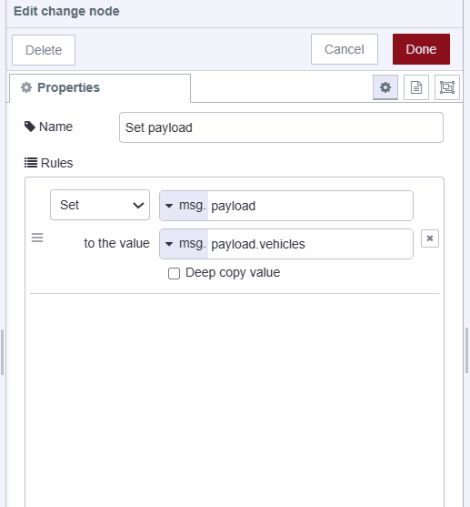

Have you ever needed to develop a fleet management system or something similar that requires a map with plotted location data on a dashboard? If so, this guide is for you. In this tutorial, we will learn how to plot location data on a world map within Dashboard 2.0.

<!--more-->

Before moving further, make sure you have installed Dashboard 2.0. If you are new to Dashboard 2.0, refer to [Getting Started with Dashboard 2.0](/blog/2024/03/dashboard-getting-started/).

## Installing world map custom node

To render an interactive world map webpage for plotting data, we will use a popular custom node called [node-red-contrib-web-worldmap page](https://flows.nodered.org/node/node-red-contrib-web-worldmap). This node offers extensive features enabling us to render a world map and plot various items with different icons, colors, NATO symbologies, ranges, and more.

1. Click the Node-RED Settings (top-right).
2. Click "Manage Palette".
3. Switch to the "Install" tab.
4. Search for "node-red-contrib-web-worldmap".
5. Click "Install".

## Retrieving location Data

Before plotting locations, we need to obtain the data first. For this purpose, we will be utilizing the [Edenburg Open Public Transportation API](https://tfe-opendata.readme.io/docs/getting-started). This API provides the live locations of all public buses and trams, enabling us to access the necessary data for plotting on our Dashboard 2.0.

1. Drag an inject node onto the canvas and set the repeat property to a 20-second interval.
2. Drag an HTTP request node onto the canvas, select the GET method, and enter `https://tfe-opendata.com/api/v1/vehicle_locations` in the URL field. Since this API is open to all, we don't need to use environment variables. However, for private APIs, it's recommended to use [environment variables](/blog/2023/01/environment-variables-in-node-red) for added security.

{data-zoomable}

3. Connect the inject node output to the http request node's input.

## Formatting Location Data

The public URL we are using returns an array of JSON in string format. We need to parse that JSON array before using it. Additionally, we need to format the data to ensure that we are passing it in the correct format, as the Worldmap custom node requires.

1. Drag a JSON node onto the canvas, and select that action to Always convert to a javascript object.

{data-zoomable}

2. Drag the change node onto the canvas, and set the `msg.payload` to `msg.payload.vehicles`.

{data-zoomable}

3. Drag a function node onto the canvas and paste the following code into it.

```javascript
// Extract the payload data from the message
let data = msg.payload;

// Iterate through each object in the data array
data.forEach(obj => {
    // Rename the 'latitude' property to 'lat' and delete 'latitude'
    obj.lat = obj.latitude; delete obj.latitude;
    
    // Rename the 'longitude' property to 'lon' and delete 'longitude'
    obj.lon = obj.longitude; delete obj.longitude;

    // Set icon based on vehicle type, if tram, use train icon
    obj.icon = obj.vehicle_type !== "tram" ? obj.vehicle_type : "fa-train";
    
    // Set icon color to yellow if the vehicle is a tram, else undefined
    obj.iconColor = obj.vehicle_type !== "tram" ? "red" : "yellow";

    // Set the color of route lines to 'blue'
    obj.color = "blue";

    // Rename 'vehicle_id' property to 'name' and delete 'vehicle_id'
    obj.name = obj.vehicle_id; delete obj.vehicle_id;
});

// Set the modified data back to the message payload
msg.payload = data;

// Return the modified message
return msg;
```

4. Connect json node's output to the change node's input and change the node's output to function node's input.

## Plotting location data on worldmap

1. Drag a worldmap node onto the canvas. Set the path to "/worldmap" and keep the rest of the settings unchanged, although you can modify other properties according to your preferences.

{data-zoomable}

2. With the worldmap node configured, it will generate a world map with plotted data accessible at the specified path.
3. Now, drag a ui-template widget onto the canvas, selecting ui-group and ui-page for it.
4. Insert the following code into the ui-template:

```javascript
<template>
    <!-- Embedding the worldmap rendered webpage at the specified path using an iframe -->
    <iframe class="worldmap" src="/worldmap"></iframe>
</template>

<style>
    /* Styling for the iframe to occupy the entire container */
    .worldmap {
        width:100%;
        height:100%;
    }
</style>
```

{data-zoomable}

5. Connect the function node's output to worldmap node's input.

## Deploying the flow

{data-zoomable}


[{"id":"0ce7f9f7fca1195d","type":"group","z":"eacc68e72f120b0e","style":{"stroke":"#b2b3bd","stroke-opacity":"1","fill":"#f2f3fb","fill-opacity":"0.5","label":true,"label-position":"nw","color":"#32333b"},"nodes":["2998e233.4ba64e","b6917d83.d1bac","3842171.4d487e8","22aa2cd075c4c57b","a08f0a836ac412a7","7408e0227bfcb677","b4f2e2dabd5b8220","5f0d149d4dc38916","2ff7e9501ad50cd5"],"x":54,"y":99,"w":1232,"h":302},{"id":"2998e233.4ba64e","type":"function","z":"eacc68e72f120b0e","g":"0ce7f9f7fca1195d","name":"format data","func":"// Extract the payload data from the message\nlet data = msg.payload;\n\n// Iterate through each object in the data array\ndata.forEach(obj => {\n    // Rename the 'latitude' property to 'lat' and delete 'latitude'\n    obj.lat = obj.latitude; delete obj.latitude;\n    \n    // Rename the 'longitude' property to 'lon' and delete 'longitude'\n    obj.lon = obj.longitude; delete obj.longitude;\n\n    // Set icon based on vehicle type, if tram, use train icon\n    obj.icon = obj.vehicle_type !== \"tram\" ? obj.vehicle_type : \"fa-train\";\n   \n    // Set icon color to yellow if the vehicle is a tram, else undefined\n    obj.iconColor = obj.vehicle_type !== \"tram\" ? \"red\" : \"yellow\";\n\n    // Set the color of route lines to 'blue'\n    obj.color = \"blue\";\n\n    // Rename 'vehicle_id' property to 'name' and delete 'vehicle_id'\n    obj.name = obj.vehicle_id; delete obj.vehicle_id;\n});\n\n// Set the modified data back to the message payload\nmsg.payload = data;\n\n// Return the modified message\nreturn msg;\n","outputs":1,"timeout":"","noerr":0,"initialize":"","finalize":"","libs":[],"x":1010,"y":220,"wires":[["b4f2e2dabd5b8220"]]},{"id":"b6917d83.d1bac","type":"http request","z":"eacc68e72f120b0e","g":"0ce7f9f7fca1195d","name":"","method":"GET","ret":"txt","paytoqs":"ignore","url":"https://tfe-opendata.com/api/v1/vehicle_locations","tls":"","persist":false,"proxy":"","insecureHTTPParser":false,"authType":"","senderr":false,"headers":[],"x":450,"y":220,"wires":[["7408e0227bfcb677"]]},{"id":"3842171.4d487e8","type":"inject","z":"eacc68e72f120b0e","g":"0ce7f9f7fca1195d","name":"get transporatation data","props":[{"p":"payload"}],"repeat":"5","crontab":"","once":false,"onceDelay":"","topic":"","payload":"","payloadType":"str","x":210,"y":220,"wires":[["b6917d83.d1bac"]]},{"id":"22aa2cd075c4c57b","type":"ui-template","z":"eacc68e72f120b0e","g":"0ce7f9f7fca1195d","group":"15d2dfa55e99ea43","page":"","ui":"","name":"Worldmap iFrame","order":0,"width":"12","height":"12","head":"","format":"<template>\n    <iframe class=\"worldmap\" src=\"/worldmap\"></iframe>\n</template>\n\n<style>\n    .worldmap {\n        width:100%;\n        height:100%;\n    }\n</style>","storeOutMessages":true,"passthru":true,"resendOnRefresh":true,"templateScope":"local","className":"","x":610,"y":360,"wires":[[]]},{"id":"a08f0a836ac412a7","type":"change","z":"eacc68e72f120b0e","g":"0ce7f9f7fca1195d","name":"Set payload","rules":[{"t":"set","p":"payload","pt":"msg","to":"payload.vehicles","tot":"msg"}],"action":"","property":"","from":"","to":"","reg":false,"x":790,"y":220,"wires":[["2998e233.4ba64e"]]},{"id":"7408e0227bfcb677","type":"json","z":"eacc68e72f120b0e","g":"0ce7f9f7fca1195d","name":"","property":"payload","action":"obj","pretty":false,"x":630,"y":220,"wires":[["a08f0a836ac412a7"]]},{"id":"b4f2e2dabd5b8220","type":"worldmap","z":"eacc68e72f120b0e","g":"0ce7f9f7fca1195d","name":"worldmap","lat":"","lon":"","zoom":"","layer":"OSMG","cluster":"","maxage":"","usermenu":"show","layers":"show","panit":"false","panlock":"false","zoomlock":"false","hiderightclick":"false","coords":"mgrs","showgrid":"false","showruler":"false","allowFileDrop":"false","path":"/worldmap","overlist":"DR,CO,RA,DN","maplist":"OSMG,OSMC,EsriC,EsriS,UKOS","mapname":"","mapurl":"","mapopt":"","mapwms":false,"x":1200,"y":220,"wires":[]},{"id":"5f0d149d4dc38916","type":"comment","z":"eacc68e72f120b0e","g":"0ce7f9f7fca1195d","name":"Retrieving, formatting, and plotting location data on a world map.","info":"","x":630,"y":140,"wires":[]},{"id":"2ff7e9501ad50cd5","type":"comment","z":"eacc68e72f120b0e","g":"0ce7f9f7fca1195d","name":"Rendering a map with plotted data on Dashboard 2.0.","info":"","x":620,"y":300,"wires":[]},{"id":"15d2dfa55e99ea43","type":"ui-group","name":"U.K Transportation Live","page":"e098e3047b4a4eaa","width":"12","height":"1","order":-1,"showTitle":false,"className":"","visible":"true","disabled":"false"},{"id":"e098e3047b4a4eaa","type":"ui-page","name":"U.K Transportation Live","ui":"c2e1aa56f50f03bd","path":"/worldmap","icon":"earth","layout":"grid","theme":"129e99574def90a3","order":-1,"className":"","visible":"true","disabled":"false"},{"id":"c2e1aa56f50f03bd","type":"ui-base","name":"Dashboard","path":"/dashboard","showPathInSidebar":false,"navigationStyle":"default"},{"id":"129e99574def90a3","type":"ui-theme","name":"Another Theme","colors":{"surface":"#000000","primary":"#ff4000","bgPage":"#f0f0f0","groupBg":"#ffffff","groupOutline":"#d9d9d9"},"sizes":{"pagePadding":"9px","groupGap":"12px","groupBorderRadius":"9px","widgetGap":"6px"}}]



1. With your flow updated to include the above, click the "Deploy" button in the top-right of the Node-RED Editor.
2. Locate the 'Open Dashboard' button at the top-right corner of the Dashboard 2.0 sidebar and click on it to navigate to the dashboard.

Now you can see the live location of the Edenburg public transport on dashboard. Moreover, if you want to have live locations of your vehicles plotted on a map instead of Edenburg public transport vehicles, you can read your vehicles GPS data with the [Flowfuse device agent](/docs/device-agent/introduction/).

## Conclusion 

In conclusion, this guide shows an easy way to map location data on Dashboard 2.0. By following these steps, you can make interactive dashboards that give you real-time info, useful for things like managing fleets and tracking logistics.
