In this comprehensive guide, we will explore different layouts and sidebar styles in Dashboard 2.0. Additionally, we will cover how you can style Dashboard 2.0 elements effortlessly.

<!--more-->

If you are new to Dashboard 2.0, refer to [Getting started with Node-RED Dashboard 2.0](/blog/2024/03/dashboard-getting-started/) and make sure you have installed it.

## Understanding Dashboard 2.0 layouts.

A layout in Node-RED Dashboard 2.0 refers to how groups of widgets are organized and arranged on a page. It controls the visual structure and placement of these widget groups to create an organized and easy-to-use interface.

### Exploring Dashboard 2.0 layouts

In Dashboard 2.0, we have three types of layouts: Grid, Notebook, and Fixed.

#### Grid layout

Choosing this layout divides your dashboard page into **12 equally-sized columns**, and you can specify how many columns your group will occupy using the `size` property. When groups within a row take up all available columns, a new row automatically starts. The height of each row is determined by the tallest widget in that row.

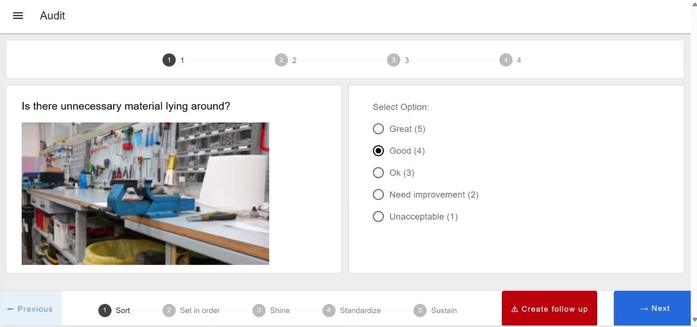{data-zoomable}

In the image above, you can see that the first and last widget groups occupy all 12 columns, while in the middle, two groups each take up six columns.

#### Notebook layout

Choosing the Notebook layout for your page in Dashboard 2.0 makes it work like a Jupyter Notebook, fixed at a width of **1024px** and **centered**. Here, a groups' "width" defines the number of columns the group contains. The group itself will always render the full width of the Notebook. It's great for dynamic Markdown, data tables, and visuals. Groups of pages are stacked vertically.

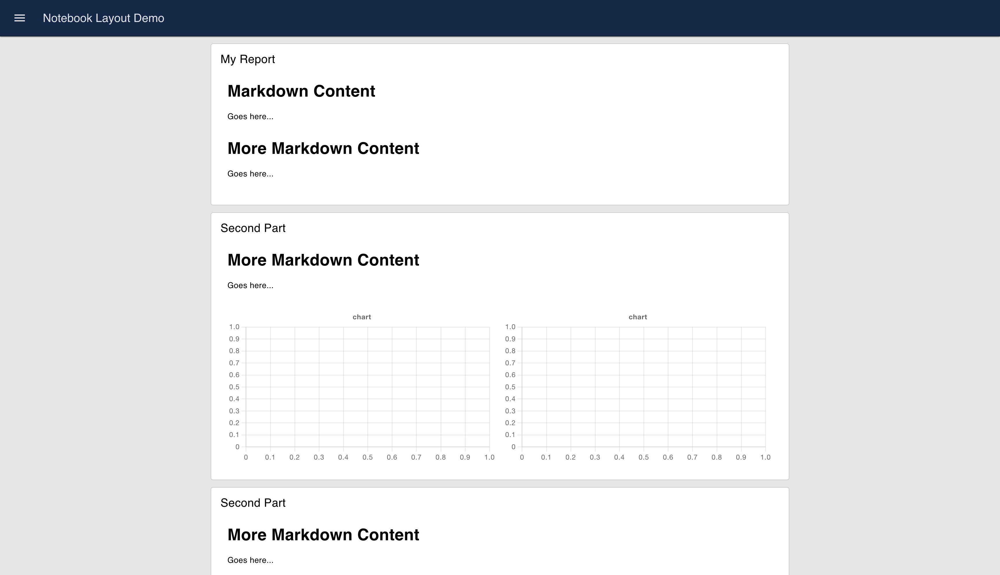{data-zoomable}

#### Fixed layout

In this layout, the width value is converted to "units", with each unit being `90px` wide. For example, if you set the group width to `3`, it will be 3 * 90 = 270px wide. Within a given group, the group size represents a column in the group's internal grid, following the same pattern as other layouts.

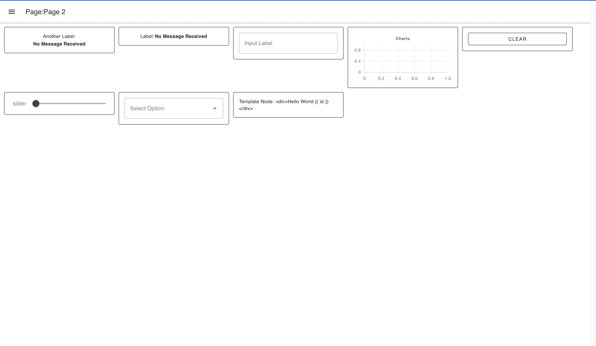{data-zoomable}

*Note: Currently this layout is not optimised, with plans to make it similar to Dashboard 1.0 in how it compresses content vertically, so it is recommended to use other layouts.*

### Setting page layout

1. Navigate to the page configuration by clicking on the **edit** button of your page in the Dashboard 2.0 sidebar.
2. In the page configuration, you can select the preferred layout for that page within the layout field.

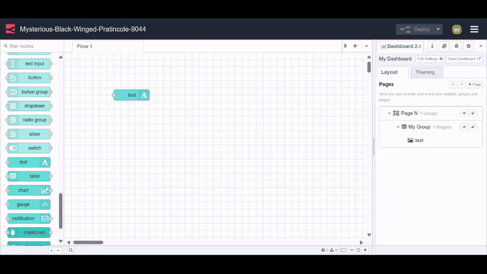{data-zoomable}

## Setting Dashboard 2.0 elements size

Setting the size for elements in Dashboard 2.0 is straightforward, but understanding the actual unit size in the size property can be a bit tricky. 

It's important to note that the size of a single horizontal unit varies depending on the layout, but the vertical size of a single row is consistently **48px**.

## Sizing Widgets within a Group

In any layout—Grid, Notebook, or Fixed—widgets within a group are sized using a unified approach. The size property assigned to widgets determines their width within the group. Each unit in the size property represents a fraction of the group's total width. This width is determined by an internal grid established by the group.

### Widget Sizing
Widgets are sized relative to the number of columns in the internal grid. For example, if a group has 4 columns and two widgets, and the first widget is set to 1 width while the second to 3 width, the first widget will occupy 25% of the group's width, and the second widget will occupy 75%.

Regardless of the layout type, the concept of sizing widgets within a group remains consistent. Whether it's the grid, notebook, or fixed layout, the same principles apply, ensuring uniformity in widget layout and design.

###  Setting element size 

To set the size of groups and widgets in Dashboard 2.0, follow these steps:

1. Go to the Dashboard 2.0 sidebar and click on the edit button next to the element you want to resize.
2. Adjust the size using the size property.

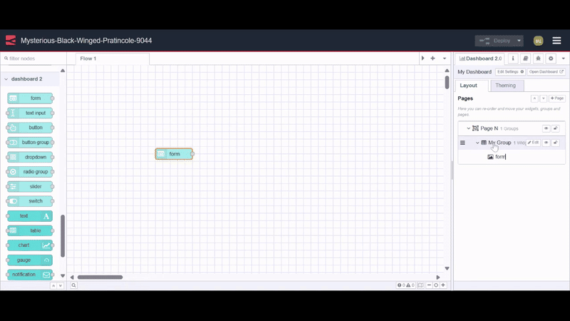{data-zoomable}

## Understanding Dashboard 2.0 Theme 

The theme is a collection of colors that control the look and feel of the widgets, groups, and other elements on the page.

In Dashboard 2.0, when adding a page ( ui-page ) we can specify which theme it will use. By default, we have one theme in Dashboard 2.0, we can add more themes using the Dashboard 2.0 side panel.

### Understanding theme properties

In the theme (`ui-theme`) configuration, there are two main sections: 

- **Colors:** Specify colors for Navigation, primary elements, page background, group backgrounds, and outlines.
- **Sizing:** Define the gaps between groups, page padding, group outline radius, and gaps between widgets, all in pixels.

For additional information on the `ui-theme` settings, please refer to the [ui-theme documentation](https://dashboard.flowfuse.com/nodes/config/ui-theme.html).

### Setting a new page theme

1. Navigate to the Dashboard 2.0 sidebar and switch to the theme tab.
2. Click on the top-right “+theme” button to add a new theme.
3. After specifying colors and sizing click on the top right update button to save the theme.
4. Now switch to the layout tab and click on the edit button next to the page for which you want to set a new theme.
5. In the page config, select the newly added theme in the Theme field.

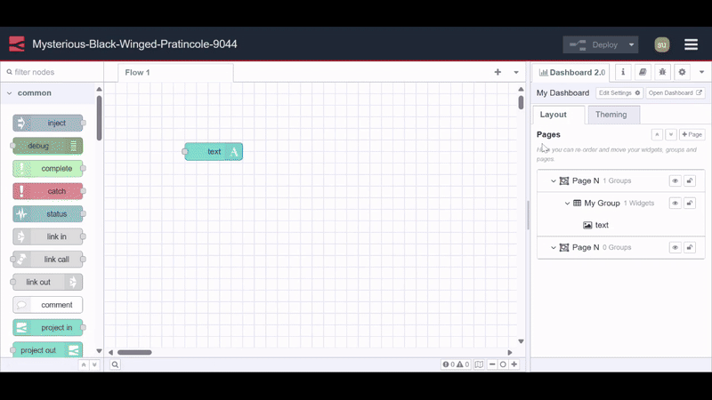{data-zoomable}

## Dashboard 2.0 Navigation

### Setting sidebar 

1. Navigate to the Dashboard 2.0 sidebar in the Node-RED editor
2. Click on the "Edit Settings" button located at the top left side of the Dashboard 2.0 sidebar.
3. Select your preferred sidebar style from the "Style" field in the sidebar options section.

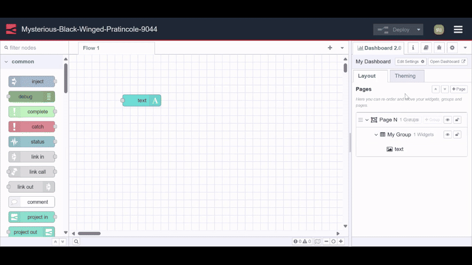{data-zoomable}

### Sidebar Navigation Options

In Dashboard 2.0, we have 5 different navigation options for your application.

#### Collapsing

This is the default sidebar, when it's opened, the page content adjusts to the width of the sidebar.

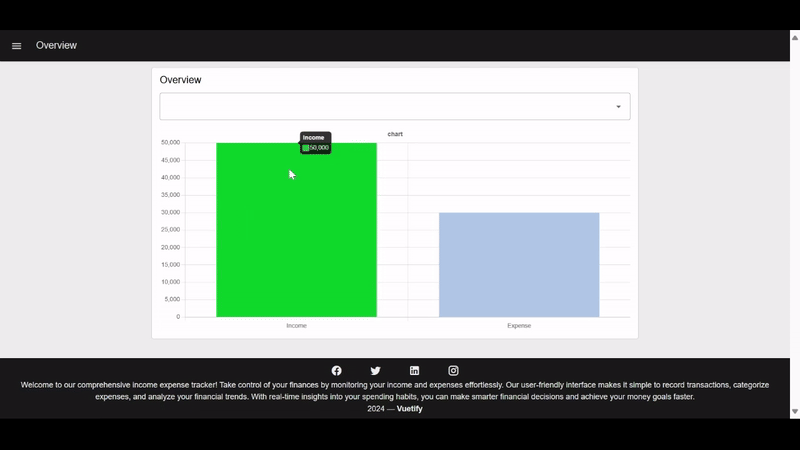{data-zoomable}

You can see in the image above how the page content automatically adjusts when the sidebar is opened.

#### Fixed

In this type, the sidebar is always visible and fixed on the left side, and the top menu icon is hidden. The page content adjusts to the width of the sidebar.

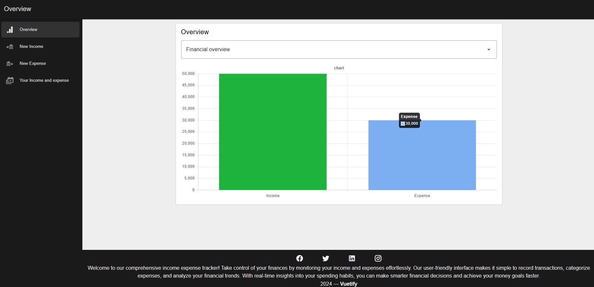{data-zoomable}

#### Collapse to icon

This type of sidebar is similar to the collapsible one, but when the sidebar is collapsed, you can still navigate through different pages as the page icons become visible.

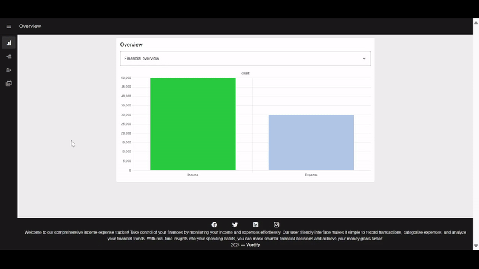{data-zoomable}

#### Apear over content 

When the sidebar is opened, the page is partially covered by a transparent layer, and the sidebar appears on top of this layer

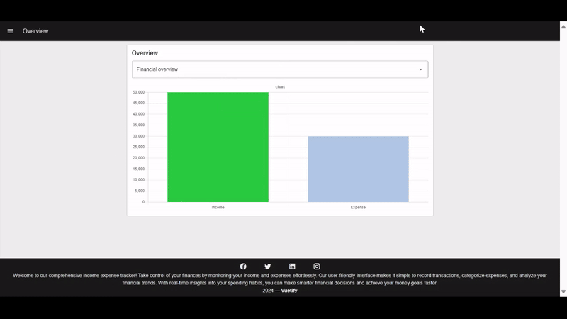{data-zoomable}

In this type of sidebar, you can notice how the sidebar opens without affecting the width of the page content

#### Always hide 

In this type, the sidebar is always hidden, and navigation between different pages can be achieved using the ui-control widget.

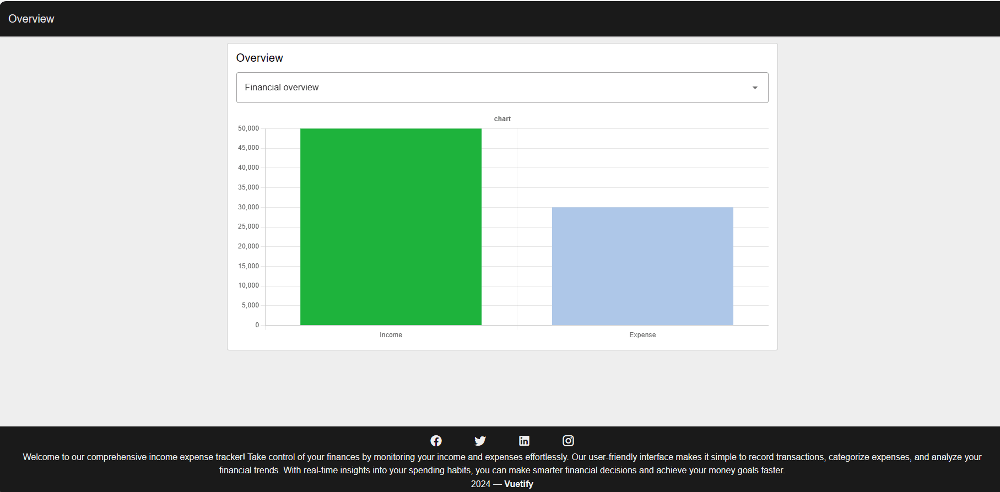{data-zoomable}

## Customising your Dashboard 2.0 further
 
In Dashboard 2.0, we can add classes to almost all widgets, pages, and groups and style them using CSS.

### Adding classes

1. To add classes to your widget, page, or group, you'll need to open its configuration
2. Find the 'Class' field and enter your class.

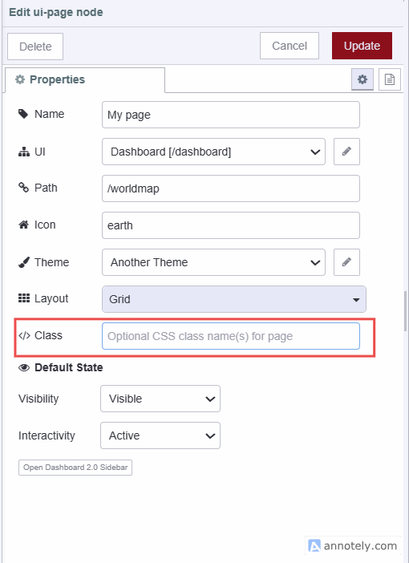{data-zoomable}

### Writing custom CSS

In Dashboard 2.0, the `ui-template` node allows you to write custom CSS for Dashboard 2.0. 

In the template node, you can add CSS for two different scopes:

- **Single Page:** Selecting this allows you to specify CSS that is constrained to a single page of your dashboard.
- **All Pages:** Selecting this allows you to define CSS that will apply across your whole dashboard.

To define your own CSS:

1. Drag an ui-template widget onto the canvas.
2. Double-click on it and select the scope within the type field.
3. If you select the "CSS (Single Page)" type, you'll then need to select the `ui-page` to which your custom class definitions will apply. If you select the "CSS (All Pages)" type, then you'll need to select the `ui-base` that includes those pages to which you want to add styling.
4. Now you can write your custom CSS within the ui-template.

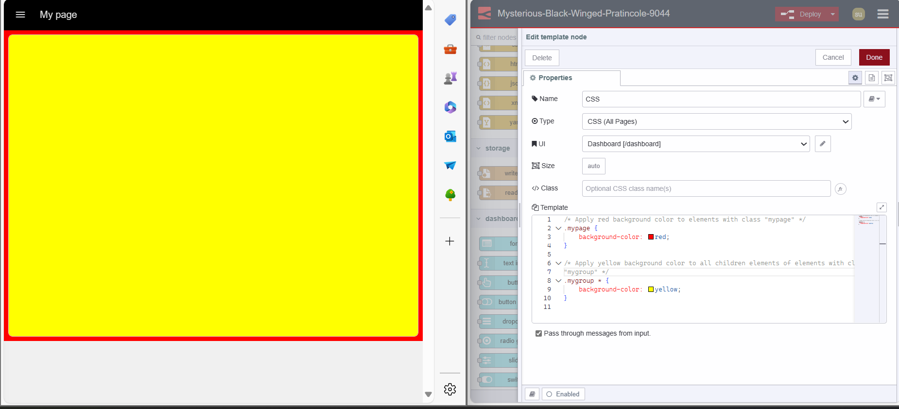{data-zoomable}

## Up Next 

To delve deeper into Node-RED Dashboard 2.0, we recommend exploring the following resources:

- [FlowFuse Dashboard Articles](/blog/dashboard/) - Collection of examples and guides written by FlowFuse.
- [Node-RED Dashboard 2.0 Documentation](https://dashboard.flowfuse.com/) - Detailed information for each of the nodes available in Dashboard 2.0, as well as useful guides on building custom nodes and widgets of your own.
- [Node-RED Forums - Dashboard 2.0](https://discourse.nodered.org/tag/dashboard-2) - The Node-RED forums are a great place to ask questions, share your projects and get help from the community.
- [Beginner Guide to a Professional Node-RED](/ebooks/beginner-guide-to-a-professional-nodered/) - A free guide to an enterprise-ready Node-RED. Learn all about Node-RED history, securing your flows, and dashboard data visualization.

{% include "cta.njk", cta_url: "/get-started?utm_campaign=60718323-BCTA&utm_source=blog&utm_medium=cta&utm_term=high_intent&utm_content=Comprehensive%20guide%3A%20Node-RED%20Dashboard%202.0%20layout%2C%20sidebar%2C%20and%20styling", cta_type:"signup", cta_text: "Looking to build a multi-user dashboard, deploy it in seconds, scale and manage Node-RED efficiently, and enable seamless remote access for your entire team?" %}
