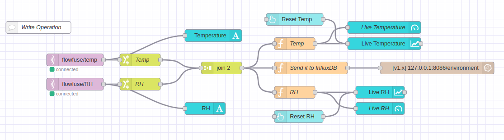

MING (MQTT, InfluxDB, Node-RED, and Grafana) is a popular choice for IoT and IIoT-based applications, but in this article, we are going to leverage Dashboards 2.0 for our visualizations, and instead of MING we are going to call it the MIND stack (MQTT, INfluxDB, Node-RED and Node-RED Dashboard 2.0 by FlowFuse). To demonstrate this, we will design a dashboard to display data collected from a Temperature Sensor that sends Relative Humidity (RH) and Temperature values to an MQTT broker. This application allows users to visualize historical data in Tabular form and view it live using various Dashboard 2.0 objects.

<!--more-->


### Setting up 

In addition to leveraging Dashboard 2.0, a secondary goal is to make this application run predominately on Linux-based platforms.  Next, we will go through the installation process.

First, we will install InfluxDB OSS (v1.8) by following these [instructions. ](https://docs.influxdata.com/influxdb/v1/introduction/install/)

Next, we will install FlowFuse [https://flowfuse.com/docs/install/](https://flowfuse.com/docs/install/local/). The FlowFuse platform is a  solution that allows users to manage Node-RED instances running on remote Devices. A Device runs a software agent that connects to FlowFuse to receive updates. For more details, you can follow the link here - [https://flowfuse.com/docs/device-agent/introduction/](https://flowfuse.com/docs/device-agent/introduction/) 

Users who want to have a quick cloud-based solution should check FlowFuse cloud - [https://app.flowfuse.com/account/create](https://app.flowfuse.com/account/create) You will need to create an account and opt for better services and facilities as your requirement. Suitable for first-time users and enterprise owners.

Mosquitto is a popular broker of choice, and we will leverage it in this article. These [instructions](https://mosquitto.org/download/) will guide you in setting it up.

Next, we must install the necessary nodes via the pallet manager within Node-RED.


1. [https://flows.nodered.org/node/node-red-contrib-influxdb](https://flows.nodered.org/node/node-red-contrib-influxdb) -  The influxdb node(v 0.7.0) is necessary in querying and retrieving data from an InfluxDB server. We will leverage InfluxQL to interact with the server.  InfluxQL is one of the querying languages supported by InfluxDB and very similar to standard SQL language. 

2. [https://dashboard.flowfuse.com/](https://dashboard.flowfuse.com/) We will be using the  Dashboard 2.0 node to enable users to visualize MQTT historical and live data online without requiring any other dashboard system. Click on Getting Started button on this page for an excellent introduction and samples of using this Dashboard.

{data-zoomable}


For simplicity of application design, we will be using default settings for all installed add-ons. In production, it is recommended to apply appropriate security practices for your application.  Please check for those instructions in the documentation from the above links. 

The MIND stack can run on a single machine, but it can also be extended to run on multiple cloud platforms, details of which can be obtained from those service providers. 

System Operation and Working details 

1. A temperature and humidity sensor that publishes Temperature in Degrees C and RH in percentage to an MQTT broker

2. Subscribe to topics flowfuse/temp and flowfuse/RH  published on the MQTT broker using the coerce “MQTT in” node provided by FlowFuse.

3. A “function node” logs collected data into InfluxDB.
 
4. We use Dashboard 2.0 gadgets to visualize live and historical data.

5. To visualize historical data, users will be able to select Start Date, Start Time, Stop Date, and Stop Time. Data obtained from this widget will be input to a function that will convert it into InfluxDB compatible Time, Date format and use it to process the query. 

6. Users will also have the option to display the Maximum, Minimum, and total Count values of RH and Temperature without requiring the user to enter queries.
The main goal of this project is to allow users to have total control over their data and also easily interact with it using minimal knowledge about database management systems and experience FlowFuse Dashboard 2.0 UI and UX. 

Our Application is divided into three parts:

1. Collect data from the MQTT broker and transform it to a format that can be logged in InfluxDB.

2. Use Node-RED functions to connect dashboard elements to InfluxDB and offer interactivity with the InfluxDB database. 

3. Use Dashboard 2.0 to visualize data as per user requirement of interacting with  historical and live data obtained from sensor 

A few key points that will be helpful in understanding the Node-RED functions and external services like MQTT broker and InfluxDB:

1. MQTT topics are generally in format - topic/subtopic - we will use node-red standard change node to modify the topics to make sure that incoming data is transformed into an InfluxDB compatible syntax.

2. InfluxDB timestamps are displayed as per RFC3339 UTC - This information will be explained in the coming section when we query InfluxDB for historical data.

### Development and Designing the application using STORE - PROCESS - RETRIEVE - TRANSFORM method

Our flow is divided into the following sections.

1. Data Storage: Ingest data from an MQTT broker, transform it into InfluxDB compatible format, and store it into the InfluxDB server. 

2. Data Processing:  In this section, we perform activities like writing an SQL query to extract data from the database, and transform it into a format that can be displayed on the dashboard using available widgets. 

3. User input: By making use of node-red functions, we process user input and retrieve the data as per user requirement

4. Data Schema: The schema of our database is very simple. It contains two user-defined fields Temperature and RH, and Timestamp - which is automatically added by InfluxDB 
To begin our application design, we first need to log into the InfluxDB server using the command ```influx``` and use the following command to create a database, as shown in the diagram below.

```create database environment```

{data-zoomable}


We will store all our data in a database named “environment,” and using Node-RED, we will define a measurement ( or table as known in conventional SQL ) containing two fields, Temperature, and RH, to store data received from the MQTT broker.

### Using  FlowFuse for creating this application.

Log into FlowFuse.

{data-zoomable}

1. Create a user account and log in. After logging in, we need to create an Instance that will be used to run our Application - Name it MIND because we are using the MQTT, InfluxDB, Node-RED and Dashboard stack 
    

{data-zoomable}

2. We need to create a Team that will handle projects. This team can contain multiple users.

{data-zoomable}

3. We can name the Team the way we want. In this case, it's the Development team, so we named it that way.


{data-zoomable}

4. Next create an application, in this case we called it MIND.


{data-zoomable}

5. After clicking on the Create Application button, a menu opens that lets us select the Node-RED version.  We are leveraging version 3.1.7.. 


{data-zoomable}

6. Once the instance is deployed, open the editor and install the required nodes.

7. First, we install the node-red-contrib-influxdb package using Palette which will allow us to read and write data from and to InfluxDB. Click on the Install button to install it on this instance


{data-zoomable}

8. Next, we install the FlowFuse Dashboard @flowfuse/node-red-dashboard  from Palette Manager


{data-zoomable}

Import the flow to the read data from MQTT broker and transform it into the format that will store data in InfluxDB as per our schema. Here is the flow link - [https://gist.github.com/hj91/aebb39fb2787afedd03d6407dfe460a2](https://gist.github.com/hj91/aebb39fb2787afedd03d6407dfe460a2) 


{data-zoomable}

This flow contains the following nodes: 

1. MQTT-in node - these nodes subscribe to topic that contains temperature and RH values published to MQTT broker. The topic flowfuse/temp topic payload data contains value of Temperature and the next topic flowfuse/RH topic payload data contains value of RH or Humidity.

2. Change node - This node changes the MQTT-in topics from flowfuse/temp to Temp and flowfuse/RH to RH.

3. Join node - This node joins two MQTT messages into a single msg.payload payload which can processed for logging data into influxDB 

4. Textbox Node - We display two textbox nodes - Temperature and RH to display the live values obtained from MQTT-in node 

5. InfluxDB node - Defines the database and IP address and port number of server, which is 127.0.0.1, 8086 in this case
Details of functions used in this flow. 


{data-zoomable}

This function with the name Temp is used to display live Temperature data on the Chart.   It converts the msg.payload obtained from Change node into numeric value and is stored in variable named temp.  This variable is then stored in msg.payload and is passed to the Chart and Gauge widget.


{data-zoomable}

This function is used to display live RH data on the Chart. This function with Name RH  is used to display live RH data on the Chart - It converts the msg.payload obtained from Change node into a numeric value and is stored in a variable named RH.  This variable is then stored in msg.payload and is passed to the Chart and Gauge widget for displaying the live values of RH obtained from the sensor.

The function that we are going to use for writing the MQTT data to InfluxDB is as follows

{data-zoomable}

In this function, we define the measurement (or table) as room1 to identify the location from where we are logging data and in it we see the variables temp and RH that take data output of join node and we use a json format to for msg.payload to log the data in InfluxDB 

We also have added two Reset buttons to clear the chart values if the values get too close for display - it contains a simple ‘[]’ as json msg.payload to clear the values on the chart.

### Reading Data from InfluxDB 

To view historic data, we define a table that will display historical values obtained  from InfluxDB query - but before that, we need to give users options to select Start Date, Start Time, Stop Date and Stop Time.

{data-zoomable}

This form defines the parameters that user will select to view historic data 

{data-zoomable}

This form enables users to define to and from Date, time for viewing historical data. Output of this form is processed by a function that implements logic for parsing time data and defining an InfluxDB query.

The function that takes output from this form and transforms it into the date time format that can be accepted by InfluxDB and then pass it to the query is as shown in the following diagram.

{data-zoomable}


The important thing to note here is that InfluxDB timestamps are displayed as per RFC3339 UTC, we need to adjust the offset as per our timezone in this function. The current offset of +5:30 is for Indian Standard Time, for users in different time zones, modify the offset value as per information from this link - [https://en.wikipedia.org/wiki/UTC_offset](https://en.wikipedia.org/wiki/UTC_offset)

By using this function, we can correctly pass the from and to date, time to the InfluxDB query and obtain the historic data as required. The output of this function is passed to the InfluxDB in node and is connected to the Table Node on the Dashboard.

We also have added a button to clear the historic data table and make it blank - which again is a dashboard button passing a simple json msg with msg.payload as []. 

Finding out the Min, Max, and Total Count of rows in the Database.

{data-zoomable}

Using this flow, we added a feature where users can select Min, Max, and Count stat options from a dropdown menu to display the Maximum, Minimum, and total count of values present in the database for RH and Temperature.

Here is the dropdown menu:


{data-zoomable}

We use the Switch Node to make the selection and accordingly pass on the msg.payload to appropriate function node that passes an InfluxQL query to InfluxDB-in node

Example:


{data-zoomable}

The output msg.payload of this node is then passed to the function node, in this case, the Min function node which contains the required InfluxQL query.


{data-zoomable}

The same function can be used for finding the minimum RH value, just by substituting the Temperature variable by RH in the next dropdown.

### The Completed Dashboard 


{data-zoomable}

### Conclusion

Thus we have successfully created a GUI for interacting with the historical and live MQTT Data using FlowFuse Dashboard 2.0 using MQTT and InfluxDB in one application. We have tried to keep everything simple and have stuck to the default settings for most part..Readers are requested to try their hand and create a more versatile dashboard using InfluxDB and Dashboard widgets.