Node-RED has four types of variables: **message variables** that travel with `msg` through your nodes, and **context variables** in three scopes—**node** (private to a single function node), **flow** (shared within one tab), and **global** (shared across the entire instance)—plus **environment variables** for configuration and secrets. You set and retrieve context variables with `global.set()`/`global.get()`, `flow.set()`/`flow.get()`, and `context.set()`/`context.get()` in function nodes, or visually through the change node. Context variables are stored in memory by default and are lost on restart, so any state that must survive a reboot needs persistent storage.

<!--more-->

That's the short version. The rest of this guide walks through each variable type in detail—showing you exactly how to set, retrieve, and delete them, when to use each scope, and how to make them persist across restarts and redeployments.

## What Are Node-RED Variables?

Variables in Node-RED serve as containers for storing and managing data throughout your application. Understanding the different types and their scopes is essential for building efficient, organized flows.

Node-RED offers three primary variable categories:

**Message variables** travel with the message object as it flows through your nodes. The most common example is `msg.payload`, which carries the primary data between nodes. For a deeper dive into message handling, see the [Understanding Node-RED Messages](/node-red/getting-started/node-red-messages/) guide.

**Context variables** store application state at different levels—node, flow, or global scope. They persist data that needs to be accessed across multiple message events, making them ideal for tracking counters, storing configuration, or maintaining state.

**Environment variables** handle configuration data and sensitive information like API keys and credentials. By storing this data separately from your flows, you maintain security and make configuration management more flexible.

## Global Variables: Instance-Wide Data Storage

Global variables provide a centralized storage mechanism accessible throughout your entire Node-RED instance. Any function, change, inject, or switch node can read or write global variables, making them perfect for sharing data across multiple flows.

**When to use global variables:** Consider using them for system-wide settings, shared configuration, or data that multiple flows need to access. For example, in a home automation system with separate flows for lighting, security, and climate control, global variables can store user preferences that all flows reference.

### Working with Global Variables

**Setting global variables** can be done through the change node or programmatically in a function node:

Using the change node:

1. Select "global" from the variable type dropdown
2. Enter your variable name
3. Set the value or expression

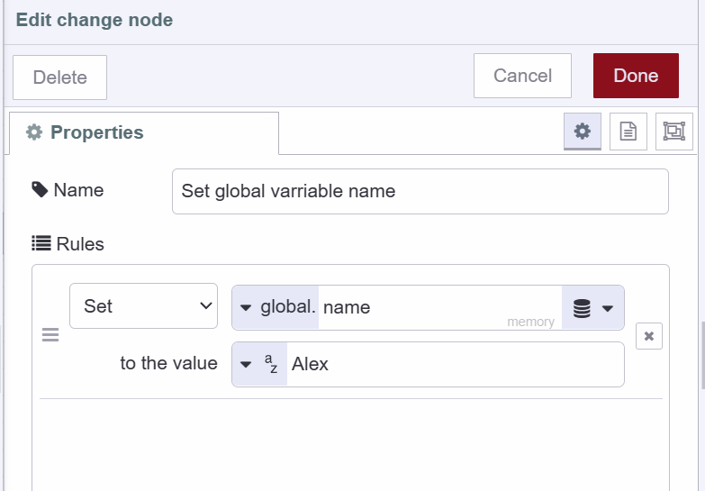{data-zoomable}

Using a function node:

```javascript
global.set('userName', 'John');
global.set('systemMode', 'active');
```

**Retrieving global variables** follows a similar pattern:

In a change, inject, or switch node, simply set the action to “set”, choose the type as “global”, and specify the variable name.

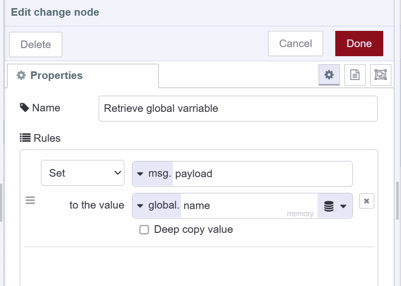{data-zoomable}

In function nodes:

```javascript
const userName = global.get('userName');
const mode = global.get('systemMode');
```

**Deleting global variables** can be accomplished through the change node by selecting "delete" from the action dropdown, or via the Context Data sidebar panel, which provides a comprehensive view of all variables.

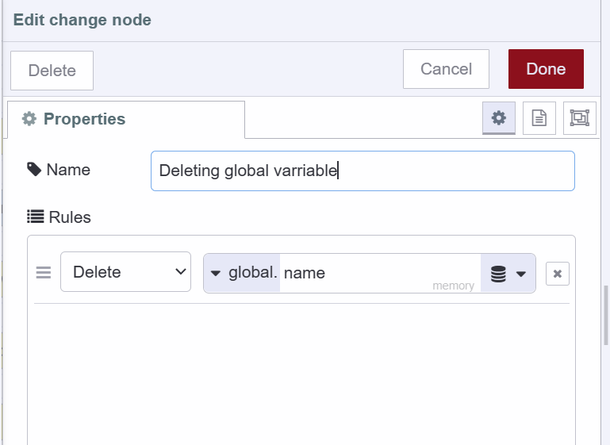{data-zoomable}

## Flow Variables: Tab-Scoped Data

Flow variables exist within a single tab or flow in your Node-RED editor. They're accessible to all nodes within that specific flow but isolated from other flows, providing logical data separation.

**When to use flow variables:** Use them for data that's relevant only to a specific workflow. For instance, in a temperature monitoring flow with multiple sensor nodes, flow variables can track the current reading, alert thresholds, or calculation results—data that doesn't need to be shared with other parts of your application.

### Working with Flow Variables

**Setting flow variables:**

Using the change node, select the action “set”, choose “flow” as the variable type, and configure your variable.

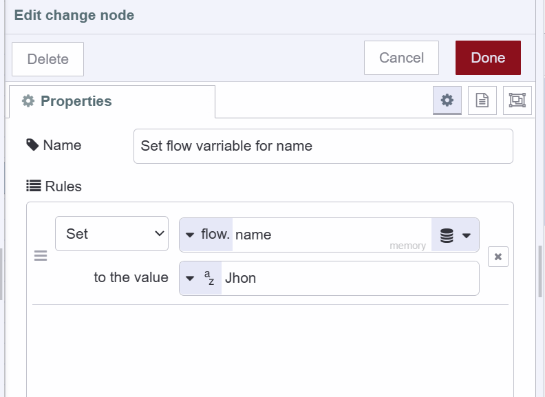{data-zoomable}

In function nodes:

```javascript
flow.set('currentTemp', 72.5);
flow.set('alertThreshold', 85);
```

**Retrieving flow variables:**

In a change, inject, or switch node, simply set the action to “set”, choose the type as “flow”, and specify the variable name.

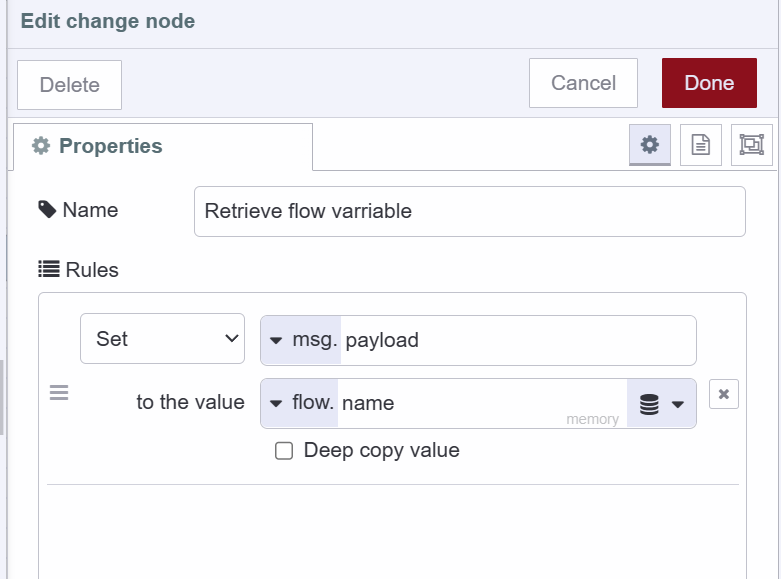{data-zoomable}

In function nodes:

```javascript
const temp = flow.get('currentTemp');
const threshold = flow.get('alertThreshold');
```

**Deleting flow variables** works the same way as global variables—use the change node's delete action or the Context Data panel.

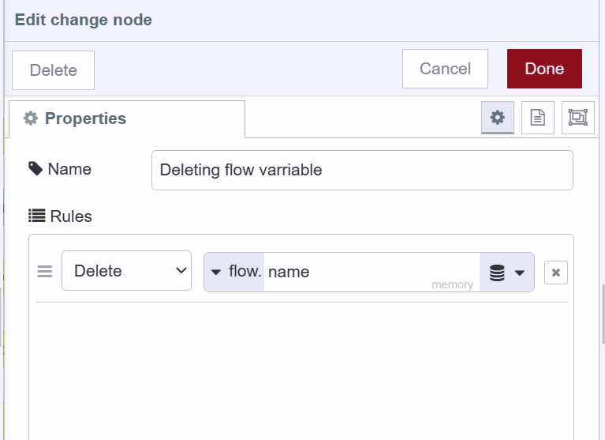{data-zoomable}

## Node Variables: Node-Level Isolation

Node variables (also called node context) are the most restrictive scope—they exist only within a single node. No other node can access or modify these variables, making them ideal for maintaining private state.

**When to use node variables:** Perfect for counters, temporary calculations, or any data that should remain private to a specific node. For example, a function node that generates unique IDs for database records can maintain a counter variable that's never exposed to other parts of your flow.

### Working with Node Variables

Node variables are local to a Function node and cannot be read or modified by other nodes.

**Setting node variables:**

```javascript
context.set('counter', 0);
context.set('lastProcessedId', 'ABC123');
```

**Retrieving node variables:**

```javascript
let counter = context.get('counter');
counter++;
context.set('counter', counter);
```

**Deleting node variables** must be done through the Context Data sidebar panel.

## Persistent Storage with FlowFuse

By default, all context variables (node, flow, and global) are stored in memory. This means they're lost whenever you restart Node-RED or redeploy your flows. For production applications, this is often unacceptable.

FlowFuse provides persistent storage that survives restarts, redeployments, and system updates. This ensures your application state remains intact across sessions.

### Using Persistent Storage

**Setting persistent variables:**

In the change node, select "persistent" from the store dropdown instead of "memory".

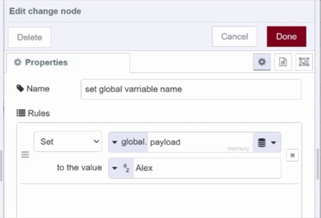{data-zoomable}

In function nodes, add "persistent" as a third parameter:

```javascript
global.set('userData', userData, 'persistent');
flow.set('sessionConfig', config, 'persistent');
context.set('processedCount', count, 'persistent');
```

**Retrieving persistent variables:**

In a change, inject, or switch node, ensure you're selecting from the "persistent" store.

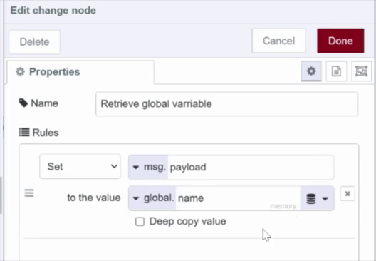{data-zoomable}

In function nodes:

```javascript
const userData = global.get('userData', 'persistent');
const config = flow.get('sessionConfig', 'persistent');
const count = context.get('processedCount', 'persistent');
```

Persistent storage allows Node-RED to retain state between restarts—crucial for historical metrics, long-running counters, dashboard application data, and any flow that must persist through a reboot without losing information.

## The Context Data Panel

Node-RED includes a dedicated Context Data panel in the sidebar that provides visibility into all your variables. This panel is invaluable for debugging and understanding your application's state.

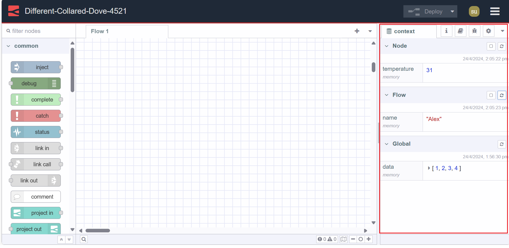{data-zoomable}

**Features of the Context Data panel:**

- View all node, flow, and global variables in organized sections
- See when each variable was last updated
- Copy variable names or values with one click
- Refresh individual variables to see current values
- Delete variables directly from the interface

To access this panel, open the sidebar and choose ‘Context Data’ from the dropdown menu. Use the refresh icon in each section to update the display with the latest values.

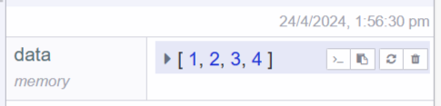{data-zoomable}

## Environment Variables: Secure Configuration

Environment variables serve a different purpose than context variables—they're designed for configuration data, especially sensitive information that shouldn't be hardcoded in your flows.

Node-RED supports environment variables at two levels:

**Flow-level environment variables** are accessible only within a specific flow. This is useful when different flows need different configurations. For example, one flow might connect to a development database while another connects to production, each using its own credentials.

**Global-level environment variables** are accessible across all flows in your instance. Use these for shared configuration like API keys that multiple flows need to reference.

### Working with Environment Variables

**Setting flow-level environment variables:**

1. Double-click on the flow tab to open the edit dialog
2. Navigate to the "Environment Variables" section
3. Add your variables as name-value pairs
4. Click Done and deploy

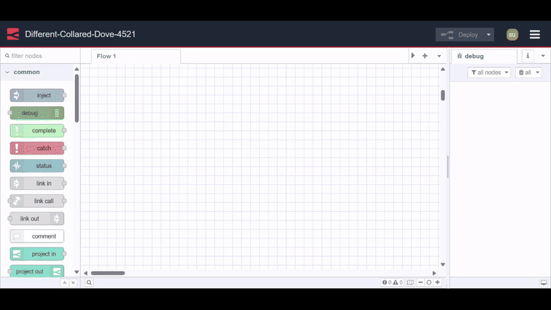{data-zoomable}

For global-level environment variables, see [Using Environment Variables in Node-RED](/blog/2023/01/environment-variables-in-node-red/) for detailed instructions.

**Accessing environment variables:**

In change, inject, or switch nodes, select "env variable" and specify the name.

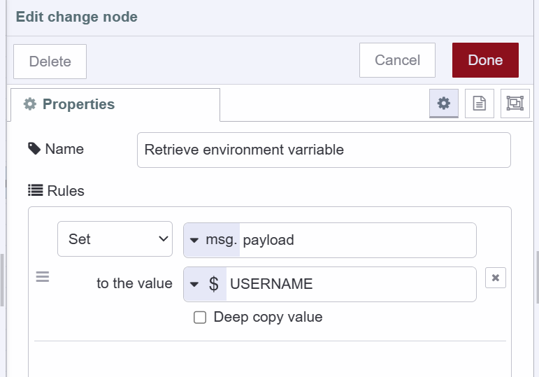{data-zoomable}

In function nodes:

```javascript
const apiKey = env.get('API_KEY');
const dbHost = env.get('DB_HOST');
```

In template nodes:

```javascript
API Endpoint: {{env.API_ENDPOINT}}
```

For configuration nodes that don't have explicit environment variable support, you can often use the syntax `${VARIABLE_NAME}` in input fields.

**Important note on precedence:** When a flow-level and global-level environment variable share the same name, Node-RED uses the flow-level value. To explicitly access the global-level variable, prefix it with `$parent.` in your reference.

**Deleting environment variables:** Return to the flow edit dialog where you added them and click the delete icon next to each variable. Remember to redeploy your flows after making changes.

## Best Practices

Here are some guidelines for effective variable usage in Node-RED:

**Choose the right scope:**
- Use node variables for node-specific data
- Use flow variables for data shared within a single workflow
- Use global variables for system-wide shared data
- Use environment variables for configuration and secrets

**Naming conventions matter:** Use clear, descriptive names. Consider prefixing variables with their purpose (e.g., `sensor_temperature`, `config_timeout`, `user_preferences`).

**Leverage persistent storage:** For production applications, identify which variables need to survive restarts and use persistent storage for those.

**Keep sensitive data in environment variables:** Never hardcode API keys, passwords, or other secrets directly in flows. Always use environment variables.

**Document your variables:** Use the description field in your nodes to explain what variables are being set or read, especially for complex flows that others might maintain.

**Monitor the Context Data panel:** Regularly check this panel during development to verify variables are being set correctly and to catch potential issues early.

## Conclusion

Node-RED's four variable types give you a clear toolkit for managing data and state. Use **node context** for private, node-specific values, **flow variables** for data shared within a single tab, and **global variables** for anything multiple flows need to reach. Reach for **environment variables** when you're handling configuration and secrets that shouldn't be hardcoded. Matching the scope to the job keeps your flows organized, predictable, and easy for others to maintain.

The one thing to keep front of mind: context variables live in memory by default, so they reset on every restart or redeploy. For anything your application genuinely depends on—counters, cached configuration, dashboard history—plan for persistent storage from the start rather than discovering the gap in production.

Get the scopes right and lean on persistence where it matters, and Node-RED will handle everything from quick prototypes to applications you can run with confidence.
