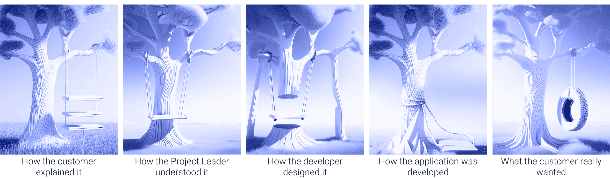

Digital transformation is a series of technological advancements that aim to simplify complex tasks. From calculators and graphical user interfaces (GUIs) to new programming languages, these advancements have enabled individuals to create value that was once beyond their reach. The key is to understand that these tools are not meant to replace expertise but to enhance it, making complex tasks more manageable, speeding up development time, and empowering more people.

<!--more-->

## What Does It Mean to Empower Someone?

Often, people perceive "empowerment" as a derogatory term, but it shouldn't be. Empowerment should mean enabling a domain expert to further grow their expertise. They are adding one more tool (and hopefully replacing some) to their toolbox to bring value to what they **know**. And what they know is often hard to explain. It has taken years to master their role, which people usually take for granted because they don't understand the complex dance they do to make their section of the world operate flawlessly.

## What Do They Do, and Why Is It Hard to Explain?

Imagine a simple project like building a tire swing. The humorous illustration below shows how different interpretations and outcomes can arise throughout a project lifecycle:

{data-zoomable}

This analogy highlights the potential misunderstandings and miscommunications that occur between various stakeholders in a project. From the initial customer explanation to the final product, each stage can introduce variations that stray from the original intent. This leads to a final outcome that often doesn't meet the customer's needs or expectations.

In a perfect world, with clear instructions and years of prep work to define the problem statement, there's a chance the project will be completed close to 95% of what the domain expert wanted, if you're lucky. But how do you close the last 5%? Developers might move on to new projects, or worse, leave the company. The remaining tasks become difficult to complete and often go undone.

## Put the Domain Expert in the Driver’s Seat

Calculators were not created to be used only by mathematicians. GUIs weren't created to be used only by programmers. They were created to make people's lives easier. No longer was there a **need** to use the command line to start an application; simply click the icon for the desired application. These simple iterations open the opportunity for a larger range of people to leverage tools.

With low-code applications, the process is the same. Put the domain expert in the driver’s seat. Make them their own developer. They understand the process better than anyone else. Pair them with a low-code domain expert and have them co-develop the application.

With the domain expert in the driver’s seat of their own low-code project, the days of the last 5% undone become less common. There is always a path forward.

## Which Low-Code Solution Should You Go With?

With over 10 years of development emerging from [IBM’s Emerging Technology Group](/blog/2024/02/history-of-nodered/), Node-RED is a clear leader.  Dare I say the de facto solution. It is open-source and easy to spin up. It is currently being leveraged in many industries; ranging from pharmaceuticals, to agriculture, and to telecom.

But you might think Node-RED is just a proof-of-concept tool. You’re wrong. Has it been used as [Shadow-IT](https://www.cloudflare.com/learning/access-management/what-is-shadow-it/)? Yes, and that is beautiful and awesome. Innovation is at the heart of Shadow-IT. No one ever said, “There is a tool supported by my IT company that would be perfect for the job, but I think I would rather deploy an unsanctioned tool.” The flaw in this statement is believing there is a choice in tools. Node-RED has often been the only tool available in the domain expert's toolbox.

## Increased Development Speed

Domain experts often find themselves needing to develop solutions but learning a new programming language can be time-consuming. With the open-source community behind Node-RED, many common integrations and transformations have already been created. This community sharing of knowledge accelerates development because often a needed programming task has already been developed and shared. This allows domain experts to repurpose existing code as [**nodes, flows, or collections**](https://flows.nodered.org/), significantly speeding up the development process.

## FlowFuse

FlowFuse is your solution to solving Shadow-IT and paving the way for your [Citizen Development](/blog/2024/02/why-citizen-development-platforms/) journey. All the reasons why Node-RED hasn’t been sanctioned within organizations have nothing to do with its ability to execute but more with its lack of scalability, easy-to-use security, and manageability. Enter FlowFuse, developed by the same people who developed your go-to low-code solution. FlowFuse addresses exactly the problems that put it in the Shadow-IT realm.

With security and scalability top of mind, FlowFuse allows IT teams to manage their Node-RED deployments with features like Role-Based Access Control (RBAC), remote management of Node-RED runtimes, and backup and recovery of Node-RED deployments called Snapshots. These are just a few of the features that elevate an already widely used solution, making it ready for enterprise networks.

### Low-code platform success in the real world

Low-code platforms are industry-agnostic, with applications varying from industrial manufacturing to news agencies. Here are some customer success stories of how the FlowFuse low-code platform has helped:

- [**Abrasive Technology:**](/customer-stories/leveraging-node-red-and-flowfuse-to-automate-precision-manufacturing/) Leveraged Node-RED and FlowFuse to optimize automation and improve operational efficiency. The transition to FlowFuse Cloud has enhanced their ability to manage Node-RED instances effectively, supporting innovation and agility in their manufacturing processes.

- [**Power Workplace:**](/customer-stories/node-red-building-management/) Utilized FlowFuse and Node-RED to automate building management, significantly reducing development time and enhancing scalability and reliability. This has helped them meet security and compliance requirements more easily, improving service delivery across multiple regions.

- [**Large US Manufacturing Company:**](/customer-stories/manufacturing-digital-transformation/) Employed Node-RED and FlowFuse to drive digital transformation across numerous manufacturing sites. By decentralizing innovation, they have improved data visibility, real-time decision-making, and overall process efficiency, using FlowFuse to manage extensive Node-RED deployments and version control.

## The Low-Code Future

In conclusion, low-code platforms like Node-RED and FlowFuse empower domain experts to take control of their own digital transformation journeys. By putting the domain expert in the driver’s seat, low-code applications enable them to create solutions tailored to their specific needs and requirements. This approach not only reduces the risk of the last 5% of a project going undone but also fosters a culture of innovation and collaboration within organizations.
