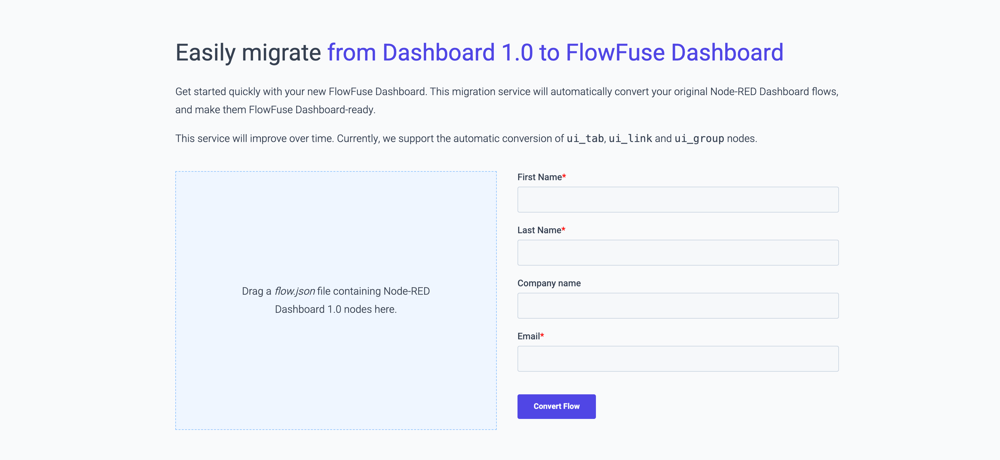

Dave Conway-Jones, the lead maintainer of Node-RED Dashboard, has [just announced](https://discourse.nodered.org/t/node-red-dashboard-v1-deprecation-notice/89006) that Node-RED Dashboard has been formally deprecated, meaning there will be no further development activity on the project.

[FlowFuse Dashboard](https://dashboard.flowfuse.com/) (also known as Node-RED Dashboard 2.0) is a natural successor to Node-RED Dashboard, and in this article, we detail what FlowFuse Dashboard offers, and how you can get started.

<!--more-->

## What's new in Dashboard 2.0?

Not only have we made significant efforts to ensure that FlowFuse Dashboard has as much feature parity with Node-RED Dashboard as possible, but we've also introduced a number of new features that we think you'll love, some highlights include:

- **Multi Tenancy:** A big change from Node-RED Dashboard is the introduction of multi-tenancy features. This allows you to build Dashboards that are unique to each user that interacts with your flows.
- **Responsive Layouts:** FlowFuse Dashboard is built with a responsive layout in mind, meaning that your Dashboards will automatically adjust to the screen size of the device they are being viewed on.
- **New Nodes:** We've introduced a five new nodes; [Button Group](https://dashboard.flowfuse.com/nodes/widgets/ui-button-group.html), [Radio Group](https://dashboard.flowfuse.com/nodes/widgets/ui-radio-group.html), [File Upload](https://dashboard.flowfuse.com/nodes/widgets/ui-file-input.html), [Event](https://dashboard.flowfuse.com/nodes/widgets/ui-event.html) and [Table](https://dashboard.flowfuse.com/nodes/widgets/ui-table.html) to help you build your Dashboards, without needing to write custom code, or depend on third-party libraries.
- **Directly Install on Mobile:** FlowFuse Dashboard is built as a Progressive Web App (PWA), this means that you're able to install it directly onto your mobile device as if it were a native mobile application.
- **Vuetify Framework:** FlowFuse Dashboard is built on VueJS, and with that, we made the decision to integrate in [Vuetify](https://vuetifyjs.com/en/components/all/#containment), a very rich collection of functional UI widgets. All of these widgets are available, by default when you want to build your own custom widgets in a `ui-template` node.

## What we have planned

We are actively investing into the development of FlowFuse Dashboard, and releasing new features and updates on a regular basis. We have a public [Project Management Board](https://github.com/orgs/FlowFuse/projects/15/views/1) that show exactly what we're working on, and what we have planned in the near future. Some particular highlights include:

- **Visual Layout Editor:** This would be the biggest improvement to building dashboards in Node-RED. We're aiming for a fully interactive front-end to help you design your Dashboard layouts. This would live in your Dashboard itself, no more needing to switch between the Node-RED Editor and your Dashboard to sanity check changes. You can see more details [here](https://github.com/FlowFuse/node-red-dashboard/issues/30).
- **Diversity of Data Visualisation:** We are planning to provide a richer ecosystem of data visualisations. We're also likely to be switching to [Apache eCharts](https://github.com/FlowFuse/node-red-dashboard/issues/782) (subject to further investigation), and are considering a `ui-template`-type node that can be used to build [custom charts](https://github.com/FlowFuse/node-red-dashboard/issues/58) too.
- **Feature Parity:** Whilst we've covered there vast majority of Dashboard 1.0 features, we've still got a little bit to go, in particular, the most requested features we have are  [programmatic (mustache) title and labels](https://github.com/FlowFuse/node-red-dashboard/issues/555).

If there are any other features you'd like to see, please do open a [Feature Request](https://github.com/FlowFuse/node-red-dashboard/issues/new/choose), and we'll do our best to accommodate.

## Getting Started with FlowFuse Dashboard

If you're ready to get started with FlowFuse Dashboard, you can install it directly from the Node-RED Palette Manager. Simply search for `@flowfuse/node-red-dashboard` and install the latest version.

{data-zoomable}
_A short recording to show how easy it is to setup your first dashboard_

Getting started is as easy as dropping on your first node. FlowFuse Dashboard will automatically set you up with a default group, page, theme and underlying Dashboard configuration.

### Resources

We have a comprehensive [Getting Started Guide](https://dashboard.flowfuse.com/getting-started.html) that will walk you through the process of setting up your first Dashboard. You can download our ["Ultimate Guide" eBook](https://dashboard.flowfuse.com/#download-our-e-book) too.

### Dashboard Workshop

We'll running a [Workshop](/webinars/2024/workshop-dashboard) on July 2nd, where we will be covering a collection of useful tips and design patterns to help you get the most out of Dashboard.

The recording will also be available on the [FlowFuse YouTube channel](https://www.youtube.com/@FlowFuseInc) after the event.

## Migrating to FlowFuse Dashboard

If you're looking to migrate your existing Node-RED Dashboard flows to FlowFuse Dashboard, we have a [Migration Guide](/platform/dashboard/#migration-service) that details all of the features and properties that have, and haven't, been migrated into FlowFuse Dashboard.

It's worth noting that FlowFuse Dashboard _will_ run side-by-side with the original Node-RED Dashboard, so you can take your time to migrate your flows over, and do so, piece-by-piece.

This week, we also made available the first iteration of the [Dashboard Migration Service](https://flowfuse.com/platform/dashboard/#migration-service):

{data-zoomable}
_Screenshot showing the Dashboard Migration Service available on FlowFuse's website_

Currently, it'll convert your `ui_tab`, `ui_group` nodes, and setup your new `ui-theme` and `ui-base` nodes for you. We'll be extending this over time, and eventually hope to auto-convert most of your existing Dashboard 1.0 flows.

## Final Thoughts

We're really excited to see what you can build with FlowFuse Dashboard, and we're here to help you every step of the way. If you have any questions, please do reach out to us on the [Node-RED Community Forum](https://discourse.nodered.org/tag/dashboard-2).

If you're interested in contributing and extending FlowFuse Dashboard, we're very open to Pull Requests, and have a detailed contributing guide you can take a look at [here](https://dashboard.flowfuse.com/contributing/).
