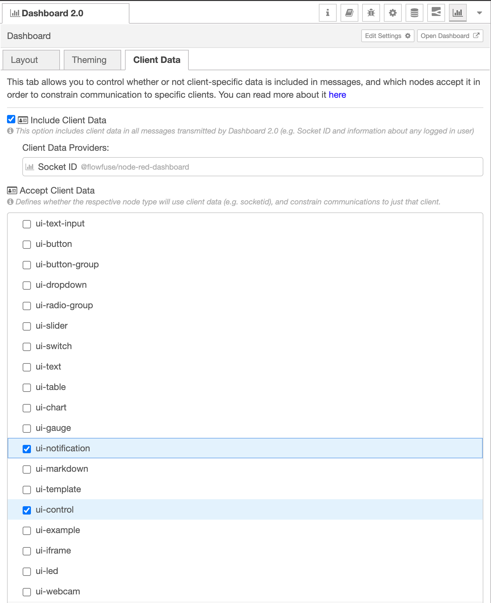
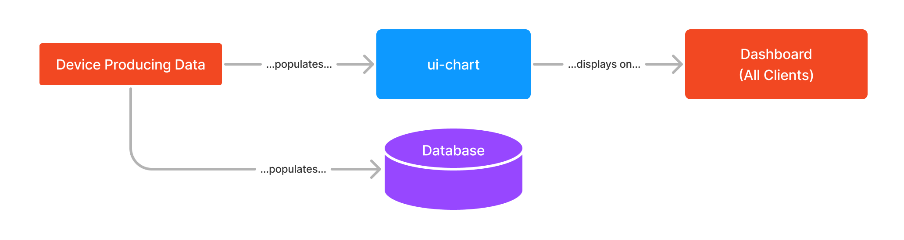
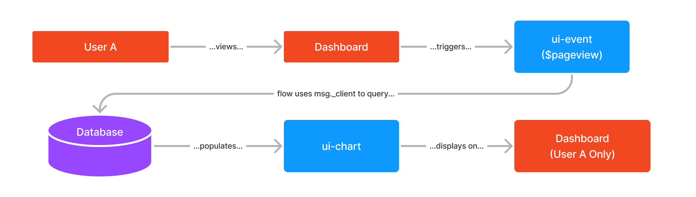
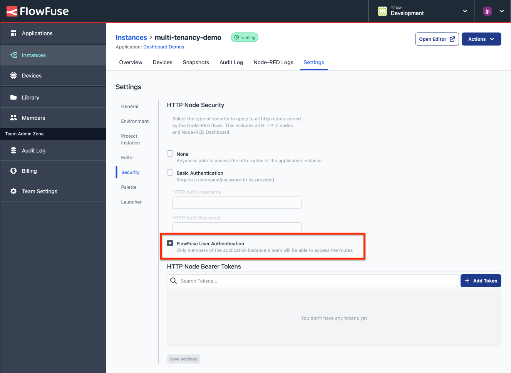

FlowFuse Dashboard has featured multi-tenancy features through the FlowFuse User Addon. This made user based applications available only to specific FlowFuse team tiers and customers. However, the Node-RED community wanted to use the same feature set in cases FlowFuse didn't consider initially. Taking this feedback on board, today we announce some significant changes to how you can build Dashboards with multi-tenancy in mind.

Having taken that feedback on board, we've made some significant changes to how you can build Dashboards with multi-tenancy in mind.

<!--more-->

A quick summary of the changes are as follows:

- **Socket constraints moved to core Dashboard:** The ability to constrain communications to a specific client (using the `msg._client.socketId`) has been moved to the core of Dashboard 2.0, and is no longer a feature of the FlowFuse User Addon. As such, it's available to _all_ users, for _all_ node types.
- **FlowFuse User Addon now Source Available:** The addon is available to install in _any_ instances of Node-RED running on FlowFuse, so that's all team tiers on FlowFuse Cloud, and any self-hosted instances of FlowFuse too. It is available to install from Node-RED's Palette Manager.
- **Cloudflare Auth Plugin:** Release of the first community-created Auth Plugin for Dashboard for adding a `user` object when authenticating with Cloudflare. (See more details and install the plugin [here](https://flows.nodered.org/node/@fullmetal-fred/node-red-dashboard-2-cloudflare-auth))

## Using Client Data

Available since our `1.10.0` release of Dashboard, we have a new sidebar tab - "Client Data". 

This new tab acts as a portal to control whether data about the connected clients is included in any events emitted in the Node-RED editor (appended into `msg._client`). You can then use the "Accept CLient Data" options to define which nodes accept that data as a constraint for communication.

{data-zoomable}
_Screenshot showing the new "Client Data" sidebar available with Dashboard_

In this case, if we send a `msg` to any `ui-notification` or `ui-control` which a specified `msg._client.socketId`, then that `msg` will _only_ be sent to the relevant socket connection.

## Building Multi-Tenant Dashboards

We have introduced a new section to our documentation on [Design Patterns](https://dashboard.flowfuse.com/getting-started.html#design-patterns).

To summarise briefly, we now consider there to be two primary design patterns when building with Dashboard:

- **Single Source of Truth**: All users of your Dashboard will see the same data. This is useful for industrial IoT or Home Automation applications.
- **Multi-Tenancy**: Data shown in a particular widget is unique to a given client/session/user. This represents a more traditional web application, where each user has their own session and associated data.

Note that these patterns can be intertwined, some widgets on a screen may be driven by "Single Source of Truth", and others by "Multi-Tenancy".

#### Building a Single Source of Truth Dashboard

{data-zoomable}
_Example flow diagram to show the flow of data in a "Single Source of Truth" architecture_

Data can be sent to these widgets at any time, when a user connects to the Dashboard, the respective widget will load the relevant data from the centralised data source in Node-RED and show it to the user.

#### Building a Multi-Tenancy Dashboard

{data-zoomable}
_Example flow diagram to show the flow of data in a "Multi-Tenancy" architecture_

In this pattern, a very useful node is the `ui-event` node which fires a `msg` when a user views a page. This `msg` will contain a `msg._client` object, detailing the client's connection.

This `_client` object contains the `socketId` of the user (and potentially more depending on any [Authentication plugins](#authentication-plugins) used). This `msg` can then be passed through to any other widget, and if configured to "Accept Client Constraints" that `msg` will only be sent to the specified client.

## Authentication Plugins

In this release we've also added a special category of plugins, "Authentication Plugins". 

These plugins register themselves with Dashboard, and are permitted to add to the `msg._client` object. This can be useful for adding additional information about end users, such as their user ID, e-mail address or username.

This data can be used to constrain communications from Node-RED to a specific _user_ rather than just a _socket connection_, which is far more reliable and secure.

{data-zoomable}
_Screenshot showing "FlowFuse User" being appended to `_client` by the FlowFuse User Addon_

Any active plugins you have installed, will also be detailed in the new "Client Data" sidebar (detailed above) so you can see which plugins are active and what data they are adding to the `msg._client` object.

### FlowFuse User Addon

Whilst the plugin was first published a few months back, after hearing community feedback, we've made changes and are now publishing the plugin to the Node_RED Palette Manager. As such, it's available to all users running FlowFuse.

The addon appends a `user` object to the `msg._client` object, populated with the details of the FlowFuse user performing the relevant actions in Dashboard. You can use this information to build multi-tenant Dashboards.

You can [install the FlowFuse User Addon](https://flows.nodered.org/node/@flowfuse/node-red-dashboard-2-user-addon) from the Palette Manager in the Node-RED editor.

{data-zoomable}
_Screenshot of the Instance settings in FlowFuse to enable "FlowFuse User Authentication"_

It's worth noting that instances must have ["FlowFuse User Authentication"](https://flowfuse.com/blog/2024/04/displaying-logged-in-users-on-dashboard/#enabling-flowfuse-user-authentication) switched on in the instance's settings.

### Cloudfare User Addon (Community Contribution)

We're also thrilled to announce that the first community-contributed plugin has been [published](https://flows.nodered.org/node/@fullmetal-fred/node-red-dashboard-2-cloudflare-auth) which will append a `user` object to the `msg._client` object when authenticating with Cloudflare.

A huge thanks to Fred Loucks ([@fullmetal-fred](https://github.com/fullmetal-fred) on GitHub) for his great contribution!

## Build Multi Tenant Dashboards with FlowFuse Cloud

Start by following our [Getting Started Guide](https://dashboard.flowfuse.com/user/multi-tenancy.html#building-multi-tenant-dashboards).

{% include "cta.njk", cta_query: "utm_campaign=60718323-BCTA&utm_source=blog&utm_medium=cta&utm_term=high_intent&utm_content=Multi-Tenancy%20available%20for%20everyone%20with%20FlowFuse%27s%20Dashboard%202.0", cta_type: "signup", cta_text: "Looking to build a multi-user dashboard, deploy it in seconds, scale and manage Node-RED efficiently, and enable seamless remote access for your entire team?" %}