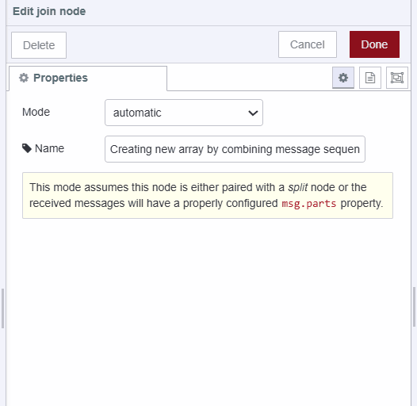
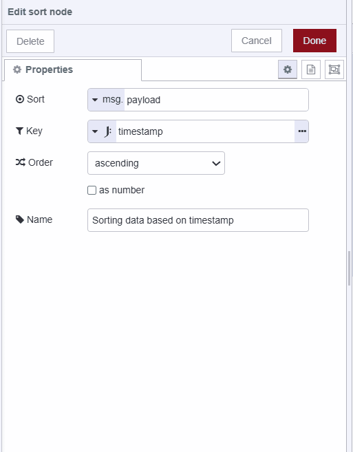

## What is Low-Code

Low-code is a software development approach that requires little to no coding to build applications and processes. Instead of using complex programming languages, you use visual interfaces with basic logic and drag-and-drop capabilities.

> "Low-code is not just about accelerating development; it’s about democratizing it. It’s about giving more people the ability to create solutions to business problems."
>
> *— Dion Hinchcliffe, VP and Principal Analyst at Constellation Research*

For more details refer to the following guides:

- [Why Low-Code is Better](/blog/2024/03/low-code-is-better/).
- [Why you need a low-code platform](/blog/2024/05/why-you-need-a-low-code-platform/).


## Why do you need to learn to filter, map, sort, and reduce the data?

Learning to filter, map, sort, and reduce data is crucial for effective data processing and transformation. For example, consider the scenario where you have an array of sensor data retrieved from an InfluxDB database. The data looks something like this:

```json
[
    {
        "timestamp": "2024-06-17T10:00:00Z",
        "emperature": 25
    },
    {
        "timestamp": "2024-06-17T11:00:00Z",
        "emperature": 26
    },
    {
        "timestamp": "2024-06-17T10:30:00Z",
        "emperature": 27
    },
    {
        "timestamp": "2024-06-17T10:15:00Z",
        "emperature": 28
    },
    {
        "timestamp": "2024-06-17T10:45:00Z",
        "emperature": 30
    },
    {
        "timestamp": "2024-06-18T09:00:00Z",
        "emperature": 24
    },
    {
        "timestamp": "2024-06-18T10:00:00Z",
        "emperature": 27
    },
    {
        "timestamp": "2024-06-18T11:00:00Z",
        "emperature": 28
    },
    {
        "timestamp": "2024-06-18T12:00:00Z",
        "emperature": 29
    },
    {
        "timestamp": "2024-06-19T10:00:00Z",
        "emperature": 25
    },
    {
        "timestamp": "2024-06-19T11:00:00Z",
        "emperature": 26
    }
]
```

However, you noticed that the property 'emperature' is missing the 't'; it should be 'temperature'. Additionally, the data is not correctly ordered based on the timestamp, and you only need the data from June 17th. Finally, you want to calculate the average temperature for that day. Users who are not familiar with Node-RED basics will do it using a JavaScript function node, as shown below. While it may seem simple to you, it will require good enough JavaScript knowledge for all other members involved in your project, and Most Node-RED users are creative innovators who prefer to develop quick and easy solutions, and they don't focus on wasting time learning programming languages:


[{"id":"306d455509a3747e","type":"inject","z":"cc28dc90c5cbc3a7","name":"Inject the sample data","props":[{"p":"payload"}],"repeat":"","crontab":"","once":false,"onceDelay":0.1,"topic":"","payload":"[{\"timestamp\":\"2024-06-17T10:00:00Z\",\"emperature\":25},{\"timestamp\":\"2024-06-17T11:00:00Z\",\"emperature\":26},{\"timestamp\":\"2024-06-17T10:30:00Z\",\"emperature\":27},{\"timestamp\":\"2024-06-17T10:15:00Z\",\"emperature\":28},{\"timestamp\":\"2024-06-17T10:45:00Z\",\"emperature\":30},{\"timestamp\":\"2024-06-18T09:00:00Z\",\"emperature\":24},{\"timestamp\":\"2024-06-18T10:00:00Z\",\"emperature\":27},{\"timestamp\":\"2024-06-18T11:00:00Z\",\"emperature\":28},{\"timestamp\":\"2024-06-18T12:00:00Z\",\"emperature\":29},{\"timestamp\":\"2024-06-19T10:00:00Z\",\"emperature\":25},{\"timestamp\":\"2024-06-19T11:00:00Z\",\"emperature\":26}]","payloadType":"json","x":500,"y":640,"wires":[["c58e1653fe5511eb"]]},{"id":"c58e1653fe5511eb","type":"function","z":"cc28dc90c5cbc3a7","name":"Filtering, mapping, reducing and sorting data with traditional coding","func":"let sensorData = msg.payload;\n\nconst filteredData = sensorData\n    .filter(item => item.timestamp.startsWith(\"2024-06-17\"))\n    .map(item => ({\n        timestamp: item.timestamp,\n        temperature: item.emperature\n    }));\n\nfilteredData.sort((a, b) => (a.timestamp > b.timestamp) ? 1 : ((b.timestamp > a.timestamp) ? -1 : 0));\n\nconst totalTemperature = filteredData.reduce((acc, entry) => acc + entry.temperature, 0);\nconst averageTemperature = totalTemperature / filteredData.length\n\nmsg.payload = {\n    sensorData: filteredData,\n    averageTemperature: averageTemperature\n};\n\nreturn msg;\n","outputs":1,"timeout":0,"noerr":0,"initialize":"","finalize":"","libs":[],"x":940,"y":640,"wires":[["827c7d2009eeb046"]]},{"id":"827c7d2009eeb046","type":"debug","z":"cc28dc90c5cbc3a7","name":"debug 3","active":true,"tosidebar":true,"console":false,"tostatus":false,"complete":"false","statusVal":"","statusType":"auto","x":1300,"y":640,"wires":[]}]


## Using Low-Code No-Code approach

Now let's do it with the standard Node-RED low-code approach:

## Mapping

Mapping often refers to the process of applying a function to each item in a list, array, or other collection to produce a new collection of transformed items. here in our context, we need to modify the property of each object. To perform mapping we will use the Split, Change, and Join nodes. 

1. Drag a Split node onto the canvas, the split node will Split a message into a sequence of messages which will allow us to operate on each message.
2. Drag a Change node onto the canvas, set the `msg.payload.temperature` to `msg.payload.emperature` and then delete the `msg.payload.emperature` property.\

{data-zoomable}

3. Now Drag the Join node onto the canvas and select the Mode to "manual" and to create "an array" and set the After a number of message parts to 0, this will join all of the messages originating from the split node into an array.

{data-zoomable}


[{"id":"306d455509a3747e","type":"inject","z":"cc28dc90c5cbc3a7","name":"Inject the sample data","props":[{"p":"payload"}],"repeat":"","crontab":"","once":false,"onceDelay":0.1,"topic":"","payload":"[{\"timestamp\":\"2024-06-17T10:00:00Z\",\"emperature\":25},{\"timestamp\":\"2024-06-17T11:00:00Z\",\"emperature\":26},{\"timestamp\":\"2024-06-17T10:30:00Z\",\"emperature\":27},{\"timestamp\":\"2024-06-17T10:15:00Z\",\"emperature\":28},{\"timestamp\":\"2024-06-17T10:45:00Z\",\"emperature\":30},{\"timestamp\":\"2024-06-18T09:00:00Z\",\"emperature\":24},{\"timestamp\":\"2024-06-18T10:00:00Z\",\"emperature\":27},{\"timestamp\":\"2024-06-18T11:00:00Z\",\"emperature\":28},{\"timestamp\":\"2024-06-18T12:00:00Z\",\"emperature\":29},{\"timestamp\":\"2024-06-19T10:00:00Z\",\"emperature\":25},{\"timestamp\":\"2024-06-19T11:00:00Z\",\"emperature\":26}]","payloadType":"json","x":540,"y":1040,"wires":[["9d9c0688468e1aae"]]},{"id":"9d9c0688468e1aae","type":"split","z":"cc28dc90c5cbc3a7","name":"Splits a message into a sequence of messages.","splt":"\\n","spltType":"str","arraySplt":1,"arraySpltType":"len","stream":false,"addname":"","x":900,"y":1040,"wires":[["785125a70fbdc554"]]},{"id":"785125a70fbdc554","type":"change","z":"cc28dc90c5cbc3a7","name":"Correcting the temperature property","rules":[{"t":"set","p":"payload.temperature","pt":"msg","to":"payload.emperature","tot":"msg"},{"t":"delete","p":"payload.emperature","pt":"msg"}],"action":"","property":"","from":"","to":"","reg":false,"x":1320,"y":1040,"wires":[["9cd6e05b88ec26fd"]]},{"id":"9cd6e05b88ec26fd","type":"join","z":"cc28dc90c5cbc3a7","name":"Creating new array by combining message sequence","mode":"custom","build":"array","property":"payload","propertyType":"msg","key":"topic","joiner":"\\n","joinerType":"str","accumulate":false,"timeout":"","count":"0","reduceRight":false,"reduceExp":"","reduceInit":"","reduceInitType":"","reduceFixup":"","x":1740,"y":1040,"wires":[["244660d81bf5e5b2"]]},{"id":"244660d81bf5e5b2","type":"debug","z":"cc28dc90c5cbc3a7","name":"debug 3","active":true,"tosidebar":true,"console":false,"tostatus":false,"complete":"false","statusVal":"","statusType":"auto","x":2080,"y":1040,"wires":[]}]


## Filtering

Filtering is the process of selecting specific items from an array to create a new array. In Node-RED, filtering is achieved using mapping and condition-based routing. Now we are familiar with mapping and have done it above so we need to use only one more extra node which is the switch node for condition-based routing.

1. Drag a switch node and place it after the change node and before the join node.
2. Set the condition to check whether `msg.payload.timestamp` includes '2024-06-17'. it checks this for all the messages and only sends the message further which matches the condition.

{data-zoomable}


[{"id":"4e76a2328451b4c3","type":"inject","z":"cc28dc90c5cbc3a7","name":"Inject the sample data","props":[{"p":"payload"}],"repeat":"","crontab":"","once":false,"onceDelay":0.1,"topic":"","payload":"[{\"timestamp\":\"2024-06-17T10:00:00Z\",\"emperature\":25},{\"timestamp\":\"2024-06-17T11:00:00Z\",\"emperature\":26},{\"timestamp\":\"2024-06-17T10:30:00Z\",\"emperature\":27},{\"timestamp\":\"2024-06-17T10:15:00Z\",\"emperature\":28},{\"timestamp\":\"2024-06-17T10:45:00Z\",\"emperature\":30},{\"timestamp\":\"2024-06-18T09:00:00Z\",\"emperature\":24},{\"timestamp\":\"2024-06-18T10:00:00Z\",\"emperature\":27},{\"timestamp\":\"2024-06-18T11:00:00Z\",\"emperature\":28},{\"timestamp\":\"2024-06-18T12:00:00Z\",\"emperature\":29},{\"timestamp\":\"2024-06-19T10:00:00Z\",\"emperature\":25},{\"timestamp\":\"2024-06-19T11:00:00Z\",\"emperature\":26}]","payloadType":"json","x":460,"y":660,"wires":[["f4e07a31f505a50c"]]},{"id":"f4e07a31f505a50c","type":"split","z":"cc28dc90c5cbc3a7","name":"Splits a message into a sequence of messages.","splt":"\\n","spltType":"str","arraySplt":1,"arraySpltType":"len","stream":false,"addname":"","x":780,"y":660,"wires":[["e2c72742c94d2e88"]]},{"id":"e2c72742c94d2e88","type":"change","z":"cc28dc90c5cbc3a7","name":"Correcting the temperature property","rules":[{"t":"set","p":"payload.temperature","pt":"msg","to":"payload.emperature","tot":"msg"},{"t":"delete","p":"payload.emperature","pt":"msg"}],"action":"","property":"","from":"","to":"","reg":false,"x":1180,"y":660,"wires":[["7797594a508cfb46"]]},{"id":"bed1a7d861fa9e3d","type":"join","z":"cc28dc90c5cbc3a7","name":"Creating new array by combining message sequence","mode":"custom","build":"array","property":"payload","propertyType":"msg","key":"topic","joiner":"\\n","joinerType":"str","accumulate":false,"timeout":"","count":"0","reduceRight":false,"reduceExp":"","reduceInit":"","reduceInitType":"num","reduceFixup":"","x":1980,"y":660,"wires":[["2449811ec79bc220"]]},{"id":"2449811ec79bc220","type":"debug","z":"cc28dc90c5cbc3a7","name":"debug 3","active":true,"tosidebar":true,"console":false,"tostatus":false,"complete":"true","targetType":"full","statusVal":"","statusType":"auto","x":2300,"y":660,"wires":[]},{"id":"7797594a508cfb46","type":"switch","z":"cc28dc90c5cbc3a7","name":"Routing message sequence based on condition","property":"payload.timestamp","propertyType":"msg","rules":[{"t":"cont","v":"2024-06-17","vt":"str"}],"checkall":"true","repair":false,"outputs":1,"x":1540,"y":660,"wires":[["bed1a7d861fa9e3d"]]}]


## Sorting 

Sorting, as the name suggests, means arranging items in a specific order. This order can be ascending (smallest to largest), descending (largest to smallest), or based on any defined criteria. In the Node-RED you can sort the numbers, alphabets, arrays, strings, and more.
To perform sorting,  we have to use the Node-RED Sort Node.

1. Drag the Sort node on the canvas.
2. Set the key to timestamp as the JsonAta expression and then the order "ascending". we set the key to a timestamp because we want to sort the data based on the timestamp you can set its temperature if you want to sort based on it.

{data-zoomable}


[{"id":"cce98271b60bee29","type":"inject","z":"cc28dc90c5cbc3a7","name":"Inject the sample data","props":[{"p":"payload"}],"repeat":"","crontab":"","once":false,"onceDelay":0.1,"topic":"","payload":"[{\"timestamp\":\"2024-06-17T10:00:00Z\",\"emperature\":25},{\"timestamp\":\"2024-06-17T11:00:00Z\",\"emperature\":26},{\"timestamp\":\"2024-06-17T10:30:00Z\",\"emperature\":27},{\"timestamp\":\"2024-06-17T10:15:00Z\",\"emperature\":28},{\"timestamp\":\"2024-06-17T10:45:00Z\",\"emperature\":30},{\"timestamp\":\"2024-06-18T09:00:00Z\",\"emperature\":24},{\"timestamp\":\"2024-06-18T10:00:00Z\",\"emperature\":27},{\"timestamp\":\"2024-06-18T11:00:00Z\",\"emperature\":28},{\"timestamp\":\"2024-06-18T12:00:00Z\",\"emperature\":29},{\"timestamp\":\"2024-06-19T10:00:00Z\",\"emperature\":25},{\"timestamp\":\"2024-06-19T11:00:00Z\",\"emperature\":26}]","payloadType":"json","x":460,"y":880,"wires":[["178c7ba914da7da8"]]},{"id":"178c7ba914da7da8","type":"split","z":"cc28dc90c5cbc3a7","name":"Splits a message into a sequence of messages.","splt":"\\n","spltType":"str","arraySplt":1,"arraySpltType":"len","stream":false,"addname":"","x":780,"y":880,"wires":[["f9e054f098428bf2"]]},{"id":"f9e054f098428bf2","type":"change","z":"cc28dc90c5cbc3a7","name":"Correcting the temperature property","rules":[{"t":"set","p":"payload.temperature","pt":"msg","to":"payload.emperature","tot":"msg"},{"t":"delete","p":"payload.emperature","pt":"msg"}],"action":"","property":"","from":"","to":"","reg":false,"x":1160,"y":880,"wires":[["1ddad5c39bbea168"]]},{"id":"0017b54c2c035cb3","type":"join","z":"cc28dc90c5cbc3a7","name":"Creating new array by combining message sequence","mode":"custom","build":"array","property":"payload","propertyType":"msg","key":"topic","joiner":"\\n","joinerType":"str","accumulate":false,"timeout":"","count":"0","reduceRight":false,"reduceExp":"","reduceInit":"","reduceInitType":"num","reduceFixup":"","x":1940,"y":880,"wires":[["b6e92b89bafc0f8c"]]},{"id":"483ad6e061619d79","type":"debug","z":"cc28dc90c5cbc3a7","name":"debug 3","active":true,"tosidebar":true,"console":false,"tostatus":false,"complete":"true","targetType":"full","statusVal":"","statusType":"auto","x":2560,"y":880,"wires":[]},{"id":"1ddad5c39bbea168","type":"switch","z":"cc28dc90c5cbc3a7","name":"Routing message sequence based on condition","property":"payload.timestamp","propertyType":"msg","rules":[{"t":"cont","v":"2024-06-17","vt":"str"}],"checkall":"true","repair":false,"outputs":1,"x":1520,"y":880,"wires":[["0017b54c2c035cb3"]]},{"id":"b6e92b89bafc0f8c","type":"sort","z":"cc28dc90c5cbc3a7","name":"Sorting data based on timestamp","order":"ascending","as_num":true,"target":"payload","targetType":"msg","msgKey":"timestamp","msgKeyType":"jsonata","seqKey":"payload.timestamp","seqKeyType":"jsonata","x":2320,"y":880,"wires":[["483ad6e061619d79"]]}]


## Reducing 

Reducing refers to the process of combining elements of a data structure (such as an array) into a single value. It involves iterating over the elements of the data structure and applying a combining function repeatedly until all elements have been processed. For example.

1. Drag another Split node onto the canvas 
2. Drag Join another node onto the canvas.
2. Select the mode to "reduce sequence", set Reduce exp to `$A+ payload.temperature`, initial value to 0 and the Fix-up exp to `$A/$N`

{data-zoomable}

In this configuration, the Join node is set to reduce sequence mode. The initial value of the accumulator ($A) is initialized to 0. As each message is processed, the current temperature (payload.temperature) is added to $A. Once all messages have been processed, the accumulated sum $A is divided by the total number of messages ($N) to compute the average temperature.


[{"id":"cce98271b60bee29","type":"inject","z":"cc28dc90c5cbc3a7","name":"Inject the sample data","props":[{"p":"payload"}],"repeat":"","crontab":"","once":false,"onceDelay":0.1,"topic":"","payload":"[{\"timestamp\":\"2024-06-17T10:00:00Z\",\"emperature\":25},{\"timestamp\":\"2024-06-17T11:00:00Z\",\"emperature\":26},{\"timestamp\":\"2024-06-17T10:30:00Z\",\"emperature\":27},{\"timestamp\":\"2024-06-17T10:15:00Z\",\"emperature\":28},{\"timestamp\":\"2024-06-17T10:45:00Z\",\"emperature\":30},{\"timestamp\":\"2024-06-18T09:00:00Z\",\"emperature\":24},{\"timestamp\":\"2024-06-18T10:00:00Z\",\"emperature\":27},{\"timestamp\":\"2024-06-18T11:00:00Z\",\"emperature\":28},{\"timestamp\":\"2024-06-18T12:00:00Z\",\"emperature\":29},{\"timestamp\":\"2024-06-19T10:00:00Z\",\"emperature\":25},{\"timestamp\":\"2024-06-19T11:00:00Z\",\"emperature\":26}]","payloadType":"json","x":460,"y":880,"wires":[["178c7ba914da7da8"]]},{"id":"178c7ba914da7da8","type":"split","z":"cc28dc90c5cbc3a7","name":"Splits a message into a sequence of messages.","splt":"\\n","spltType":"str","arraySplt":1,"arraySpltType":"len","stream":false,"addname":"","x":780,"y":880,"wires":[["f9e054f098428bf2"]]},{"id":"f9e054f098428bf2","type":"change","z":"cc28dc90c5cbc3a7","name":"Correcting the temperature property","rules":[{"t":"set","p":"payload.temperature","pt":"msg","to":"payload.emperature","tot":"msg"},{"t":"delete","p":"payload.emperature","pt":"msg"}],"action":"","property":"","from":"","to":"","reg":false,"x":1160,"y":880,"wires":[["1ddad5c39bbea168"]]},{"id":"0017b54c2c035cb3","type":"join","z":"cc28dc90c5cbc3a7","name":"Creating new array by combining message sequence","mode":"custom","build":"array","property":"payload","propertyType":"msg","key":"topic","joiner":"\\n","joinerType":"str","accumulate":false,"timeout":"","count":"0","reduceRight":false,"reduceExp":"","reduceInit":"","reduceInitType":"num","reduceFixup":"","x":1940,"y":880,"wires":[["b6e92b89bafc0f8c","a0c3a175355655ed"]]},{"id":"1ddad5c39bbea168","type":"switch","z":"cc28dc90c5cbc3a7","name":"Routing message sequence based on condition","property":"payload.timestamp","propertyType":"msg","rules":[{"t":"cont","v":"2024-06-17","vt":"str"}],"checkall":"true","repair":false,"outputs":1,"x":1520,"y":880,"wires":[["0017b54c2c035cb3"]]},{"id":"b6e92b89bafc0f8c","type":"sort","z":"cc28dc90c5cbc3a7","name":"Sorting data based on timestamp","order":"ascending","as_num":true,"target":"payload","targetType":"msg","msgKey":"timestamp","msgKeyType":"jsonata","seqKey":"payload.timestamp","seqKeyType":"jsonata","x":2320,"y":880,"wires":[["483ad6e061619d79"]]},{"id":"f38c6ae46c09ec28","type":"debug","z":"cc28dc90c5cbc3a7","name":"debug 4","active":true,"tosidebar":true,"console":false,"tostatus":false,"complete":"payload","targetType":"msg","statusVal":"","statusType":"auto","x":3020,"y":1000,"wires":[]},{"id":"1681d89d8c11ce6e","type":"join","z":"cc28dc90c5cbc3a7","name":"Calculating the  the average of temperature","mode":"reduce","build":"object","property":"payload","propertyType":"msg","key":"topic","joiner":"\\n","joinerType":"str","accumulate":true,"timeout":"","count":"","reduceRight":false,"reduceExp":"$A+ payload.temperature","reduceInit":"0","reduceInitType":"num","reduceFixup":"$A/$N","x":2770,"y":1000,"wires":[["f38c6ae46c09ec28"]]},{"id":"483ad6e061619d79","type":"debug","z":"cc28dc90c5cbc3a7","name":"debug 3","active":true,"tosidebar":true,"console":false,"tostatus":false,"complete":"true","targetType":"full","statusVal":"","statusType":"auto","x":2600,"y":880,"wires":[]},{"id":"a0c3a175355655ed","type":"split","z":"cc28dc90c5cbc3a7","name":"Splits a message into a sequence of messages.","splt":"\\n","spltType":"str","arraySplt":1,"arraySpltType":"len","stream":false,"addname":"","x":2340,"y":1000,"wires":[["1681d89d8c11ce6e"]]}]


## Conclusion 

Using Node-RED’s low-code approach for filtering, mapping, sorting, and reducing data allows you to process and transform data effectively without relying on complex programming languages. This approach helps maintain flows that are easy to understand and modify which contributes to efficient application development.
