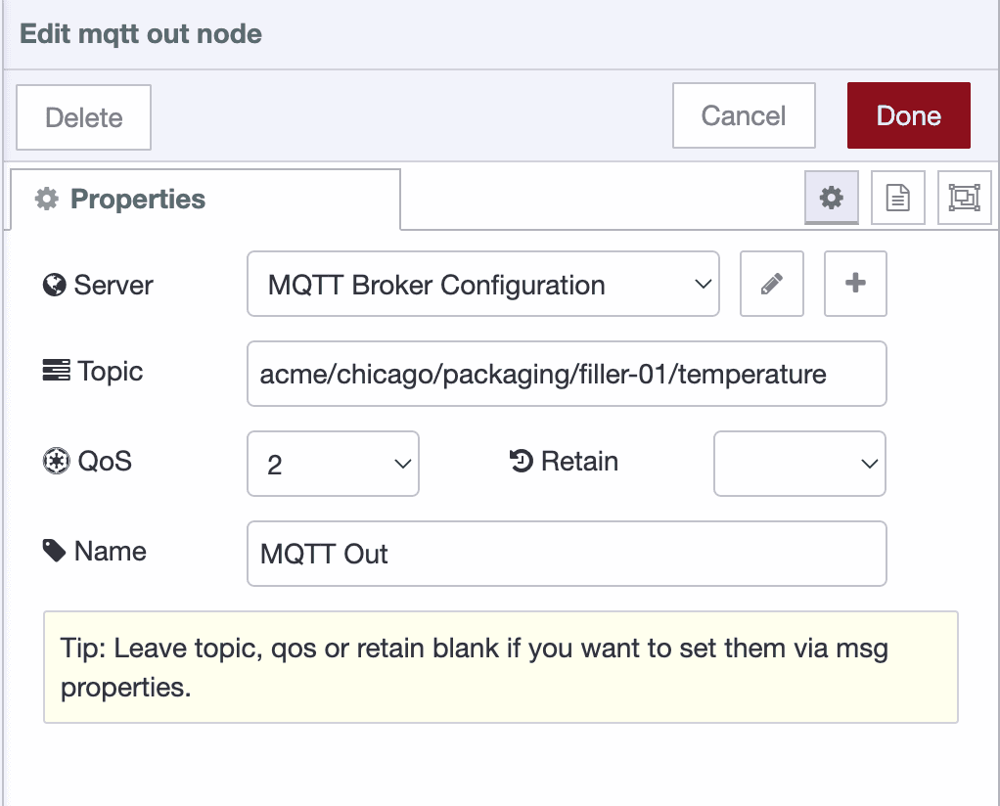
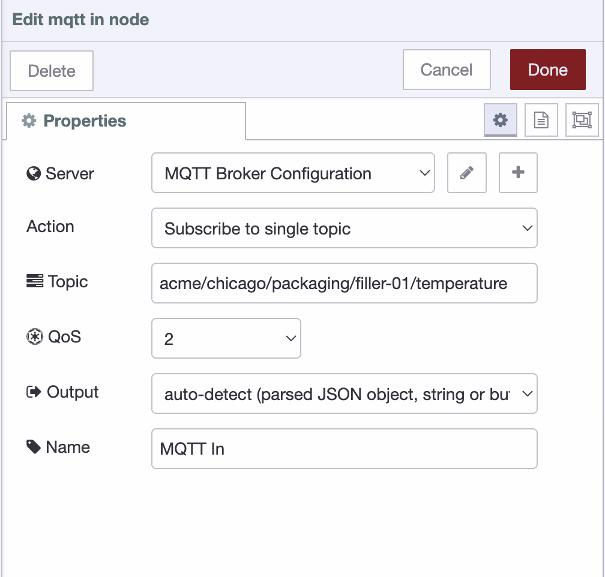
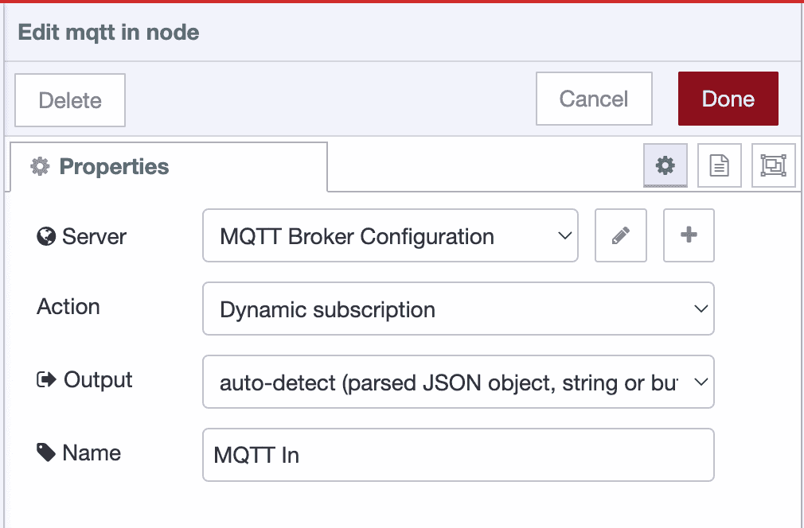
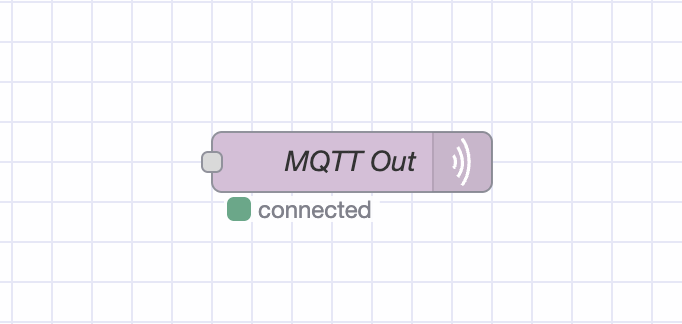

MQTT handles the messaging layer for most IoT deployments. Node-RED provides built-in nodes that connect to MQTT brokers, subscribe to topics, and publish messages—all through a visual interface.

<!--more-->

This guide walks through the configuration steps and common patterns you'll need for working implementations.

## What You'll Need

Before you start, make sure you have:

- **Node-RED Instance**: You need Node-RED running somewhere. Easiest option is FlowFuse, grab a [free trial](https://app.flowfuse.com/) and you get a cloud-hosted instance ready to go. No server setup, no port forwarding hassles.
- **MQTT Broker**: You'll need an MQTT broker to handle message routing. If you're on FlowFuse Pro tier, you get a built-in MQTT broker service—no separate setup needed.

## Getting Connected

Node-RED ships with MQTT nodes already installed. Open your Node-RED editor and look in the palette—you'll find **mqtt-in** and **mqtt-out** under the network section.

> If you're using FlowFuse's managed MQTT broker, this is straightforward. Use the [ff-mqtt-in](/node-red/flowfuse/mqtt/mqtt-in/) and [ff-mqtt-out](/node-red/flowfuse/mqtt/mqtt-out/) nodes instead of the standard MQTT nodes. Simply drag one onto the canvas, and the connection to FlowFuse's broker will be configured automatically.

For any other broker, drag an **mqtt-in** or **mqtt-out** node onto your workspace. Double-click it to open the configuration panel.

Click the pencil icon next to **Server**. You'll see two tabs: Connection and Security.

**Connection Tab**

{data-zoomable}

1. **Server**: Enter your broker address (`broker.hivemq.com` for testing, or your broker's hostname)
2. **Port**: Use `8883` for encrypted connections, `1883` for unencrypted
3. **Enable TLS**: Check this if you're using port 8883
4. **Protocol**: Leave it at MQTT 3.1.1 unless you specifically need MQTT 5 features

**Security Tab**

{data-zoomable}

Enter your username and password. For anything beyond local testing, use environment variables:

- Put `${MQTT_USER}` in the username field
- Put `${MQTT_PASSWORD}` in the password field

Set these in your Node-RED settings or FlowFuse environment config

> See [Using Environment Variables in Node-RED](/blog/2023/01/environment-variables-in-node-red/) for setup details.

Click **Add**, then **Done**. Deploy your flow. If the node shows "connected" under it, you're in.

## Publishing Data to a Topic on MQTT Broker

The mqtt-out node sends data from Node-RED to your MQTT broker. Configure the topic, quality of service level, and retention settings to control how your messages are delivered.

1. Drag an **mqtt-out** node onto the canvas.
2. Double-click the **mqtt-out** node and select your broker from the **Server** dropdown.
3. Enter your topic name in the **Topic** field. Use forward slashes for hierarchy like `factory/line1/temp`.
4. Set **QoS** to **2** for guaranteed delivery. Use **1** if you can tolerate occasional duplicates, or **0** for high-frequency data where missing readings don't matter.
5. Enable **Retain** if new subscribers should immediately receive the last published value.
6. Connect your data source to the mqtt-out node's input. The node expects `msg.payload` to contain your data.

{data-zoomable}

## Subscribing to a Topic on MQTT Broker

The mqtt-in node receives messages from topics you specify. You can subscribe to specific topics or use wildcards to monitor multiple topics at once.

1. Drag an **mqtt-in** node onto the canvas.
2. Double-click the **mqtt-in** node and select your broker from the **Server** dropdown.
3. Set **Action** to **subscribe to a single topic** and enter the topic name in the **Topic** field. You can use:
   - Specific topics: `factory/line1/temp`
   - Single-level wildcard: `factory/+/temp` (matches any value where + appears)
   - Multi-level wildcard: `factory/#` (matches everything under factory/)
4. Set **QoS** to **2**.
5. Set **Output** to **auto-detect** (it parses JSON automatically and passes through other formats as strings).
6. Connect the mqtt-in node's output to wherever you need the data.

{data-zoomable}

**For Dynamic Subscriptions:**

If you need to change subscriptions at runtime based on user input or system conditions, set **Action** to **dynamic** instead. You'll control subscriptions by sending messages with `msg.topic` and `msg.action` to the node's input.

{data-zoomable}

To subscribe dynamically, send a message like:

```javascript
msg.topic = "factory/line1/temperature";
msg.action = "subscribe";
```

To unsubscribe:

```javascript
msg.topic = "factory/line1/temperature";
msg.action = "unsubscribe";
```

This is useful when users select which equipment to monitor from a dashboard, when topics depend on database queries or API responses, or when you need to add and remove subscriptions without redeploying your flow.

## Deploying the Flow

Deploy your flow to activate the MQTT connection and start sending or receiving messages.

1. Click the **Deploy** button at the top-right corner.

*Tip: Check the node status below each MQTT node. It will display 'connected' if the connection is successful.*

{data-zoomable}

## Best Practices

Production MQTT deployments need more than basic configuration. These practices separate hobby projects from industrial-grade systems that run 24/7 without issues.

### Security First

**Always use TLS encryption.** Unencrypted MQTT sends credentials and data in plain text across your network. Enable port 8883 with TLS on your broker, then check the **Enable TLS** box in your Node-RED broker configuration. No exceptions for production systems.

**Never hardcode credentials.** Putting usernames and passwords directly in nodes means anyone with access to your flows can see them. Use environment variables instead:

```
Username: ${MQTT_USER}
Password: ${MQTT_PASS}
```

Set these in your Node-RED settings file or FlowFuse environment configuration. See [Using Environment Variables in Node-RED](/blog/2023/01/environment-variables-in-node-red/) for the complete setup.

**Implement access control on your broker.** Not every device needs to publish and subscribe to every topic. Configure your MQTT broker's ACL (Access Control List) to restrict clients based on their role. Sensors should only publish to their specific topics. Dashboard applications should only subscribe to what they display. This limits damage if credentials get compromised.

### Choose the Right QoS

QoS isn't a "set it and forget it" decision. Each level trades reliability against network overhead and latency.

**QoS 0:** Fire and forget. Use for high-frequency sensor data where missing one reading doesn't matter.

**QoS 1:** Guaranteed delivery, possible duplicates. Good for status updates and notifications.

**QoS 2:** Exactly once delivery with higher latency. Use for commands that trigger actions or critical transactions.

Match QoS to your use case. Don't default everything to QoS 2 just to be safe—you'll waste bandwidth and add latency where it doesn't help.

### Design Your Topic Hierarchy Properly

Your topic structure determines how easy it is to filter, subscribe, and scale your system. A hierarchical approach mirrors your physical setup and makes wildcards useful.

**Structure topics from general to specific:**

```
company/location/area/equipment/measurement
```

**Good hierarchy:**

```
acme/chicago/packaging/filler-01/temperature
acme/chicago/packaging/filler-01/pressure
acme/denver/assembly/robot-03/temperature
acme/denver/assembly/conveyor-02/speed
```

**Poor hierarchy:**

```
temp-sensor-1
temp-sensor-2
pressure-sensor-1
line1-data
```

The difference: with a proper hierarchy, you can subscribe at any level. Need all data from Chicago? Subscribe to `acme/chicago/#`. Want temperature readings across all sites? Use `acme/+/+/+/temperature`. 

Flat topics force you to subscribe to dozens of individual topics and manage them manually. Hierarchical topics let the broker do the filtering.

**Keep it simple:** Use lowercase, separate levels with forward slashes, use hyphens within names. Topics are paths, not sentences.

## Conclusion

You now know how to connect Node-RED to MQTT brokers, publish data to topics, subscribe to incoming messages, and secure your deployment with TLS and proper credentials. That's the foundation.

Go build something. Connect a sensor, route the data, display it somewhere useful. The patterns you've learned here scale from a single device to entire factory floors.

When you hit the limits of managing individual instances—tracking deployments, coordinating updates, maintaining uptime across sites—that's when tools like [FlowFuse](https://app.flowfuse.com/account/create) become relevant. Until then, you have everything you need.