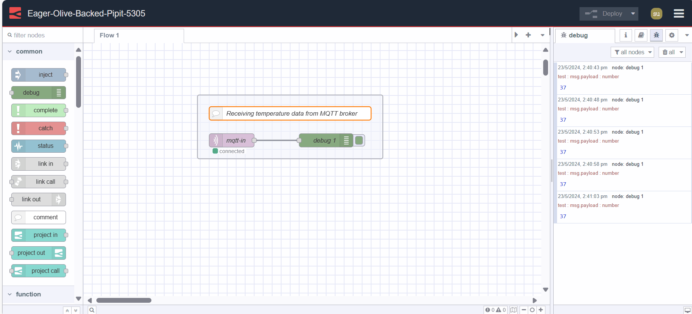

Every day, factories generate terabytes of data from sensors, PLCs, and production equipment. Yet most of this data remains locked in silos, making it difficult to spot trends, prevent failures, or optimize operations. Manufacturers need a practical way to connect their equipment and get data flowing where it is needed most.

<!--more-->

MQTT has become the industry standard for machine-to-machine communication because it is lightweight, reliable, and works even over limited bandwidth. When combined with Node-RED's drag-and-drop interface, engineers can create powerful data flows without writing complex code.

This guide walks through how to set up MQTT with Node-RED for industrial use cases—enabling real-time monitoring, alerting, and more.

## Setting up your MQTT and Node-RED Environment

### Setting up your MQTT Environment

In this guide, we will utilize the [HiveMQ Cloud MQTT broker](https://www.hivemq.com/mqtt-cloud-broker/). We will use their free trial as we are learning, but if you want to use it for your project, make sure to use their correct cluster according to your needs. If you prefer to use another cloud platform, such as Mosquitto or EMqX, feel free to do so.

FlowFuse has also launched an MQTT broker service that is integrated directly into the platform, making it easy to use MQTT with Node-RED. For more information, check out [FlowFuse's MQTT Broker Announcement](/blog/2024/10/announcement-mqtt-broker/).

1. Create your account with HiveMQ and log in.
2. After logging in, you will be asked to select a cluster. Choose the **Starter** cluster, then select the **AWS Cloud** provider and set the tier to **Production S**. Make sure to choose the correct region and proceed to create the cluster.
3. Now, click on **Manage Cluster**, then click on the **Access Management** option located at the top. Create credentials in the **Authentication** tab with the correct permissions.

### Setting up your Node-RED Environment

For Node-RED, we will be using FlowFuse, which enhances Node-RED usage with managed instances, automated deployments, and real-time collaboration features, making it ideal for enterprise teams. It simplifies the configuration, monitoring, and operation of Node-RED applications. 

1. Head to the [FlowFuse sign-up](https://app.flowfuse.com/account/create?utm_campaign=60718323-BCTA&utm_source=blog&utm_medium=cta&utm_term=high_intent&utm_content=How%20to%20Use%20MQTT%20in%20Node-RED) page to create your new account and the [FlowFuse login](https://app.flowfuse.com/) page to log in.
2. After successful login, you will see the Application and instance, which is added by default.
3. Click on that instance and then click on the editor URL to open the Node-RED editor.

## Configuring MQTT Node in Node-RED

When you open the Node-RED editor, you'll see the MQTT nodes already installed as they are part of Node-RED core nodes. When you drag an **mqtt-in** or **mqtt-out** node onto the workspace, you need to configure the MQTT broker node. You can do this by Double-clicking the mqtt node, clicking on the edit icon next to the Server field, and entering the following details of your MQTT broker into the MQTT broker config node; for more information about mqtt nodes, refer to the [MQTT core node docs](/node-red/core-nodes/mqtt-in/).

## Connection Tab

{data-zoomable}

1. Enter the **Server address** from your HiveMQ cluster. For example: `yourclustername.a02.usw2.aws.hivemq.cloud`.

2. Set the **Port** to `8883` for secure connections in production. Use `1883` only for unencrypted testing.

3. Check the **“Connect Automatically”** option to allow Node-RED to reconnect if the connection drops.

4. Enable the **“Use TLS”** option to ensure the connection is encrypted. This is strongly recommended for production use.

5. Select **MQTT Version 3.1.1** from the protocol version dropdown.

6. Leave the Client ID field blank to auto-generate one, or enter a specific ID if your broker requires it.

7. Keep the **Keep Alive** interval at the default value of 60 seconds unless your Application requires a different interval.

8. Uncheck **“Clean Session”** if you want Node-RED to receive messages that were sent while it was offline.

### Security Tab

{data-zoomable}

1. Enter the **Username** that you created in the HiveMQ Access Management tab. If you're using a different broker, use the appropriate username for that broker.

2. Enter the **Password** associated with that username.

3. Use **environment variables** for the username and password to avoid exposing sensitive information directly in the flow.

> For more information, refer to [Using Environment Variables in Node-RED](/blog/2023/01/environment-variables-in-node-red/).

## Publishing Data to a Topic on MQTT Broker

1. Drag an **mqtt-out** node onto the canvas.
2. Double-click on the **mqtt-out** node and select the added broker configuration to which you want to send data in the server field.
3. In the topic field, enter the desired topic name.
4. Set the **QoS** to **2** for accurate and guaranteed data delivery.
5. Set **retain** to true if you want to retain the data.
6. Connect the node's output, which is emitting the payload data you want to send to the MQTT broker, to the input of the **mqtt-out** node.

{data-zoomable}

## Subscribing to a Topic on MQTT Broker

1. Drag an **MQTT-in** node onto the canvas.
2. Double-click on the **MQTT-in** node and select the appropriate added broker configuration from which you want to receive data in the server field.
3. Set **action** to **subscribe to a single topic** and  enter the topic name to which you want to subscribe for receiving data in the topic field.
4. Set the **QoS** to **2**.
5. Set the output to the desired format.
6. Connect the output of the **mqtt-in** node to the input of the node to whom you want to pass the data for further processing or analysis.

{data-zoomable}

## Deploying the Flow

1. To deploy the flow, click on the **deploy** button located at the top-right corner.

*Tip: To ensure that your MQTT node is connected to the broker, check the node status. It will display 'connected' if the connection is successful.*

{data-zoomable}

## Creating a Simple Project

Let’s build a practical temperature monitoring system to demonstrate how MQTT works in action. In this setup, one Node-RED instance will publish temperature data, and another will subscribe to and display it.

While MQTT is a reliable choice for communication across distributed systems, **FlowFuse** simplifies this even further with [Project Link](https://flowfuse.com/docs/user/projectnodes/) nodes. These nodes enable direct data sharing between Node-RED instances—no need to configure external MQTT brokers or manage topics. Just link your instances and start exchanging messages. Behind the scenes, Project Link still uses MQTT but abstracts away the setup. This makes it especially useful when prototyping or when fast, instance-to-instance communication is needed.

For this example, we will use MQTT directly to illustrate how it fits into production environments where standard, interoperable protocols are essential. If you are running Node-RED on edge devices, refer to our [Raspberry Pi 4 guide](/node-red/hardware/raspberry-pi-4/) for setup instructions.

### Publishing Temperature Data to a Topic on the MQTT Broker

1. Drag an **mqtt-out** node onto the canvas and configure it with the MQTT broker to which you want to send data.
2. Enter "temp" in the topic field and set **QoS** to **2**.
3. Connect the output of the node that is reading your temperature data to the input of the **mqtt-out** node.
4. Deploy the flow by clicking on the **deploy** button located at the top-right corner.

 using the FlowFuse device agent, where we are reading temperature data from the sensor and sending it to an MQTT broker."){data-zoomable}

### Subscribing to the Topic on the MQTT Broker to Receive Temperature Data

Now, create a new instance in which we will receive the temperature data by subscribing to the Topic. Refer to this guide, which shows how you can [create a new instance in FlowFuse](/docs/user/introduction/#creating-a-node-red-instance).

1. Drag an **mqtt-in** node onto the canvas, and configure it with the broker to which you are sending temperature data.
2. Enter "temp" in the topic field and set **QoS** to **2**.
3. Drag a **Debug** node onto the canvas.
4. Connect the **mqtt-in** node's output to the **Debug** node's input.
5. Deploy the flow by clicking on the **deploy** button located at the top-right corner.

{data-zoomable}

Now, you will see the temperature data printed in the debug tab in the sidebar. Additionally, you can display this data on a chart using FlowFuse Dashboard or store it in a database. For more details, refer to the following guides:

- [Sending data to influxDB](/node-red/database/influxdb/)
- [Charting Data in on Dashboard 2.0](/node-red/integration-technologies/rest/)

## Best Practices

Ensuring the security and efficiency of your MQTT and Node-RED deployments is crucial for successful IoT projects. Explore these best practices to enhance your system's performance and protect your data.

- **SSL/TLS Encryption:** Secure your MQTT communication by enabling SSL/TLS encryption. This ensures that data transmitted between devices and the broker is encrypted.

- **Authentication and Authorization:** Implement strong authentication mechanisms to verify the identity of clients connecting to the broker. Additionally, enforce access control policies to restrict clients' actions based on their roles and permissions. For instance, you can allow specific clients to only publish or subscribe to data as needed.

- **Environment Variables:** Utilize environment variables to prevent exposing your sensitive configuration data within the flow.

- **Quality of Service (QoS) Levels:** Choose the appropriate QoS level for your MQTT messages based on the reliability requirements of your Application. Higher QoS levels ensure message delivery but may incur increased network overhead.

- **Payload Size Optimization:** Optimize the size of MQTT message payloads to minimize bandwidth usage and improve network efficiency. Transmit only essential data and consider compressing payloads when applicable to reduce transmission times.

## Conclusion

This guide showed how MQTT and Node-RED enable reliable industrial data communication. By following these patterns, manufacturers can connect diverse equipment and build real-time monitoring systems without complex custom code.

Start with one production line, prove the value, then scale across your facility using the same proven approach.

As you grow, you may face common challenges: managing multiple Node-RED instances, coordinating team changes, ensuring uptime, and handling backups. That’s where **FlowFuse** helps.

It adds:

- Centralized instance management
- Easy scaling and deployment
- Remote device management
- Automatic backups and version control
- Seamless team collaboration without conflicts
- Enterprise-grade security (SSO, audit logs, RBAC)
- High availability for 24/7 operations
- Expert support when needed
- And much more

Your Node-RED flows work the same—FlowFuse just makes them easier to manage and production-ready.

[Start your free trial](https://app.flowfuse.com/account/create?utm_campaign=60718323-BCTA&utm_source=blog&utm_medium=cta&utm_term=high_intent&utm_content=How%20to%20Use%20MQTT%20in%20Node-RED) and see why manufacturers choose us for scaling with confidence.
