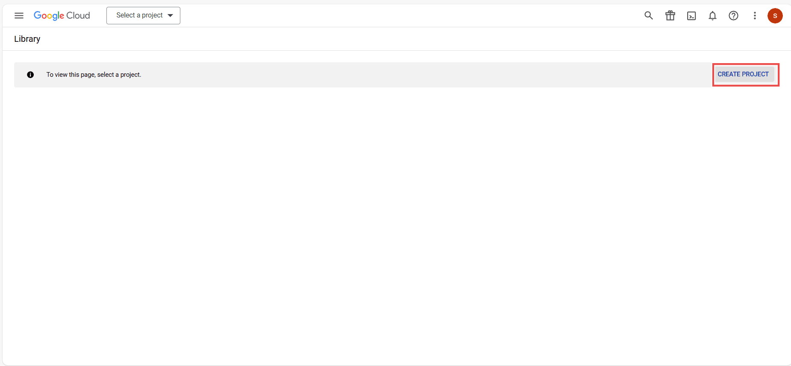
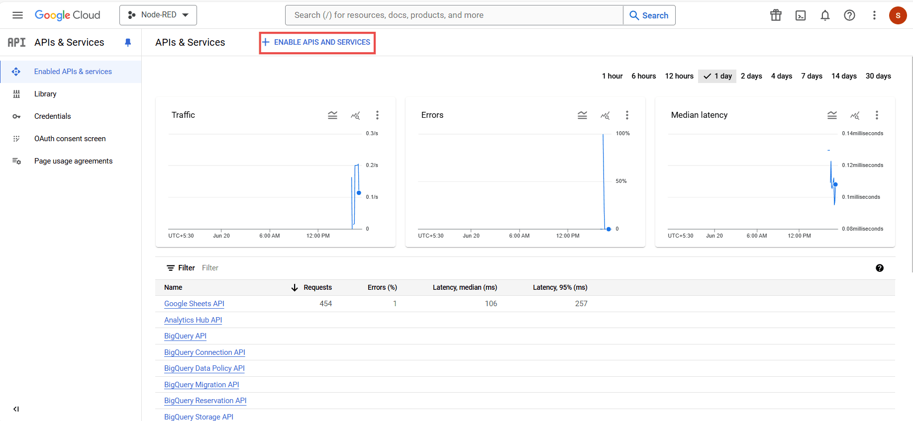
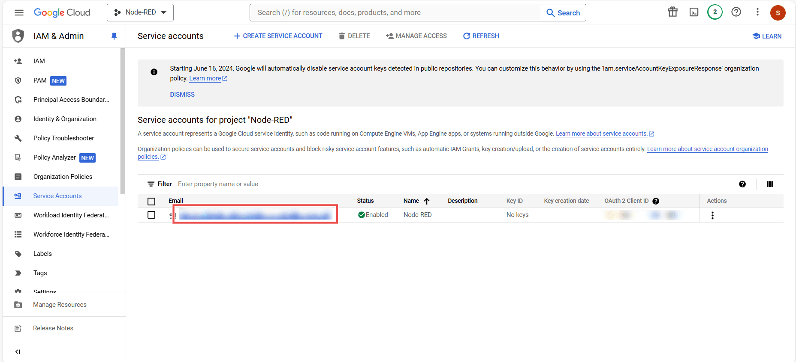
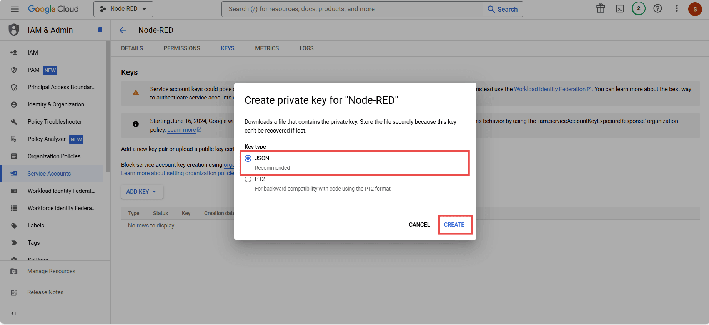

Have you ever needed to integrate Google Sheets with your Node-RED application to track and manage data seamlessly? This guide will walk you through the process of integrating Google Sheets with Node-RED, enabling you to write, read, update, and delete data effortlessly.

<!--more-->

## What is the Google Sheet?

[Google Sheets](https://www.google.com/sheets/about/) is a cloud-based spreadsheet application developed by Google. It allows users to create, edit, and collaborate on spreadsheets in real-time over the Internet. This makes it an ideal option for easily and securely collaborating on data that is not large in size. In businesses, Google Sheets is commonly used for tasks such as analyzing daily profits, tracking expenses, and managing collaborative projects. However, for products or services with large user bases, businesses often prefer using databases, which are recommended for efficiently managing and scaling data operations.

## Prequisite

Before proceeding, make sure you have installed the following node from the pallet manager.

- [node-red-contrib-google-sheets](https://flows.nodered.org/node/node-red-contrib-google-sheets)

## Interacting with Google Sheets with Node-RED

To integrate Google Sheets with our application we must first enable the Google Sheets API, and create the service account in the Google Cloud, before proceeding, make sure you have the Google Cloud account created.

1. Open your browser and go to [Service accounts](https://console.cloud.google.com/projectselector2/apis/library/sheets?supportedpurview=project&authuser=0).
2. Create a new project by clicking the "CREATE PROJECT" button in the top right corner. Enter the project details such as project name and organization.

{data-zoomable}

{data-zoomable}

3. Go to the main menu by clicking the menu icon in the top left, then select "APIs & Services."

{data-zoomable}

4. Click on "Enable APIs and Services" in the header.

{data-zoomable}

5. In the search bar, type "Google Sheets" and select it from the results.

{data-zoomable}

6. Click the "Enable" button to enable the Google Sheets API.

{data-zoomable}

7. Go back to the main menu and click on "IAM & Admin," then select "Service Accounts" from the left sidebar.

{data-zoomable}

8. Click on "Create Service Account" in the header. Enter the necessary details and click "Create" to proceed.

{data-zoomable}

{data-zoomable}

9. Select the Role from the "Owner" and click on the "Continue" button.

{data-zoomable}

10. Click "Done." Make sure to copy the generated service account email and save it for later use.

{data-zoomable}

{data-zoomable}

11. To generate a private key, click on the three dots icon on the right of the newly created service account and select "Manage keys."

{data-zoomable}

12. Click on "Add key," choose "Create new key," select "JSON" as the key type, and click "Create." Your private key will be generated and downloaded. 

{data-zoomable}

{data-zoomable}

### Configuring the Google Sheet Node

Before proceeding, ensure you have added the [environment variable](/blog/2023/01/environment-variables-in-node-red/) for the private key that was generated. Additionally, grant the editor access to the sheet you want to interact with for that service account email we created in the above section.

1. Drag a GSheet node onto the canvas.
2. Double-click on the node and click on the pencil icon next to "creds."
3. Enter the environment variable added for the private key in the "creds" field and click "Add."
4. Go to the Google Sheet you want to interact with and copy its ID from the URL. The URL will be in this format: `https://docs.google.com/spreadsheets/d/<id_of_sheet>/`
5. Return to your Node-RED instance, double-click on the GSheet node again, and paste the spreadsheet ID into the "SpreadsheetID" field.
6. Enter the range of cells you want to work with using the syntax `<sheetname!first-cell-name:last-cell-name>`. For example, use `Sheet1!A1:C3` to specify that you are working with the "Sheet1" tab, starting from cell "A1" to cell "C3". This syntax allows you to define specific ranges such as a row (`A1:A5`), a column (`A1:E1`), or a block (`A1:C3`) within the spreadsheet.

### Writing Data to Cells

For demonstration purposes, I will write simulated sensor data which includes a timestamp and sensor data.

1. Drag the Inject node onto the canvas, and set `msg.payload` to `[$moment().format(), $random() * 100]` as a JSONata expression, and set it to repeat every 3 seconds of interval.
2. Double-click on the GSheet node, select the method to "Append Row" set the range to `<sheetname>!A2`, and replace `sheetname` with the name of your sheet. I have defined cell A2 because I want to start writing data from cell A2.
3. Drag the Debug node onto the canvas, which will help in debugging in case of any error.
4. Connect the output of the Inject node to the input of the GSheet node, and the output of the GSheet node to the input of the Debug node.

{data-zoomable}

This flow generates a timestamp and a random number. The data is formatted as an array because I want the timestamp (the first item of the array) to be placed in column A and the random number (the second item of the array) to be placed in column B. If you want to insert data into additional columns, you can add more items to the array. For example, if you add a third item to the array, it will be placed in column C, a fourth item will be placed in column D, and so on.

### Reading Data from Cells

1. Drag an Inject node onto the canvas.
2. Drag another GSheet node onto the canvas, and set the method to "Get Cells" and the range to `<sheetname>!A2:C1000`, as I wanted to read data from cell A2 to the next 1000 cells.
3. Drag a Debug node onto the canvas.
4. Connect the output of the Inject node to the input of the GSheet node, and the output of the GSheet node to the input of the Debug node.

{data-zoomable}

### Updating Data of Cells

1. Drag an Inject node onto the canvas, and set the updated value as the `msg.payload`.
2. Drag another GSheet node onto the canvas, and set the method to "Update Cells" and the range to `<sheetname>!A2`, as I wanted to update the value of cell A2.
3. Drag a Debug node onto the canvas.
4. Connect the output of the Inject node to the input of the GSheet node, and the output of the GSheet node to the input of the Debug node.

{data-zoomable}

### Deleting Data from Cells

1. Drag an Inject node onto the canvas.
2. Drag another GSheet node onto the canvas, and set the method to "Clear Cells" and the range to `<sheetname>!A2:C50`, as I wanted to clear the first 50 records.
3. Drag a Debug node onto the canvas.
4. Connect the output of the Inject node to the input of the GSheet node, and the output of the GSheet node to the input of the Debug node.

{data-zoomable}

Below I have provided the complete flow that we have built through the guide, make sure to replace the environment variable with your environment variable added for the private key.


[{"id":"7d0282761979574c","type":"inject","z":"baa50b8a4762ec1f","name":"Wrting data to the cells","props":[{"p":"payload"}],"repeat":"","crontab":"","once":false,"onceDelay":0.1,"topic":"","payload":"[\t    $moment(),\t    $random()*100\t    \t]","payloadType":"jsonata","x":240,"y":140,"wires":[["eda23377d98e1a51"]]},{"id":"eda23377d98e1a51","type":"GSheet","z":"baa50b8a4762ec1f","creds":"d38cb80ae8574ea6","method":"append","action":"","sheet":"1TEEShkuxxrb3WH4NTFyk1COeDyWpgX1w6HN08ZezC7s","cells":"Sheet1!A2:C1000","flatten":false,"name":"","x":510,"y":140,"wires":[["3e670f575b8227d0"]]},{"id":"3e670f575b8227d0","type":"debug","z":"baa50b8a4762ec1f","name":"debug 1","active":true,"tosidebar":true,"console":false,"tostatus":false,"complete":"false","statusVal":"","statusType":"auto","x":760,"y":140,"wires":[]},{"id":"2c916b1d5c10dffe","type":"inject","z":"baa50b8a4762ec1f","name":"Read the cells data","props":[],"repeat":"","crontab":"","once":false,"onceDelay":0.1,"topic":"","x":210,"y":260,"wires":[["941c7fe7c7dbcbcd"]]},{"id":"941c7fe7c7dbcbcd","type":"GSheet","z":"baa50b8a4762ec1f","creds":"d38cb80ae8574ea6","method":"get","action":"","sheet":"1TEEShkuxxrb3WH4NTFyk1COeDyWpgX1w6HN08ZezC7s","cells":"Sheet1!A2:C3","flatten":false,"name":"","x":490,"y":260,"wires":[["f910d7637788361a"]]},{"id":"f910d7637788361a","type":"debug","z":"baa50b8a4762ec1f","name":"debug 2","active":true,"tosidebar":true,"console":false,"tostatus":false,"complete":"false","statusVal":"","statusType":"auto","x":760,"y":260,"wires":[]},{"id":"c20997333f9d4bda","type":"inject","z":"baa50b8a4762ec1f","name":"Updating the cells data","props":[{"p":"payload"}],"repeat":"","crontab":"","once":false,"onceDelay":0.1,"topic":"","payload":"[\t   \"none\",\t   \"none\"\t    \t]","payloadType":"jsonata","x":220,"y":360,"wires":[["d9ca2a1e0614f764"]]},{"id":"d9ca2a1e0614f764","type":"GSheet","z":"baa50b8a4762ec1f","creds":"d38cb80ae8574ea6","method":"update","action":"","sheet":"1TEEShkuxxrb3WH4NTFyk1COeDyWpgX1w6HN08ZezC7s","cells":"Sheet1!A35","flatten":false,"name":"","x":510,"y":360,"wires":[["9febe629870b7a54"]]},{"id":"9febe629870b7a54","type":"debug","z":"baa50b8a4762ec1f","name":"debug 3","active":true,"tosidebar":true,"console":false,"tostatus":false,"complete":"false","statusVal":"","statusType":"auto","x":760,"y":360,"wires":[]},{"id":"c9ceec9844fa74a9","type":"inject","z":"baa50b8a4762ec1f","name":"Deleting the cells data","props":[],"repeat":"","crontab":"","once":false,"onceDelay":0.1,"topic":"","x":220,"y":460,"wires":[["b9cef9c376d1bea3"]]},{"id":"b9cef9c376d1bea3","type":"GSheet","z":"baa50b8a4762ec1f","creds":"d38cb80ae8574ea6","method":"clear","action":"","sheet":"1TEEShkuxxrb3WH4NTFyk1COeDyWpgX1w6HN08ZezC7s","cells":"Sheet1!A2:C20","flatten":false,"name":"","x":500,"y":460,"wires":[["a1766b498efb50f4"]]},{"id":"a1766b498efb50f4","type":"debug","z":"baa50b8a4762ec1f","name":"debug 4","active":true,"tosidebar":true,"console":false,"tostatus":false,"complete":"false","statusVal":"","statusType":"auto","x":780,"y":460,"wires":[]},{"id":"d38cb80ae8574ea6","type":"gauth","name":"Unknown"}]


## Conclusion

This guide demonstrated how to integrate Google Sheets with Node-RED for streamlined data management. We covered setting up the Google Sheets API, configuring Node-RED to interact with sheets, and performing actions like writing, reading, updating, and deleting data.

{% include "cta.njk", cta_query: "utm_campaign=60718323-BCTA&utm_source=blog&utm_medium=cta&utm_term=high_intent&utm_content=Interacting%20with%20Google%20Sheets%20from%20Node-RED", cta_type: "signup", cta_text: "" %}
