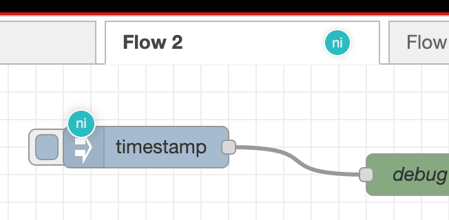
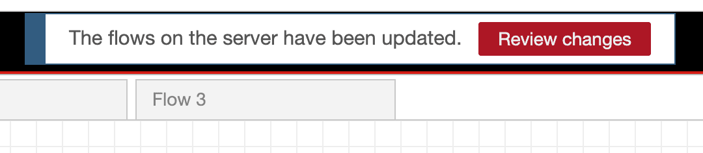

Node-RED 4.0 is the new major release of the project, which is at the heart of all we do at FlowFuse. It brings a range of new features that continue to make Node-RED the first choice for low-code development.

<!--more-->

As [we wrote recently](/blog/2024/05/product-strategy-updates/), our product mission statement is to provide the best way to build, manage and deploy Node-RED applications at scale, in reliable and secure production environments. This drives the work we do both within the FlowFuse platform and our contributions back into the Node-RED project. 

The [Node-RED 4.0 release](https://nodered.org/blog/2024/06/20/version-4-0-released) includes some of our recent contributions to improve the Build part of that mission - more specifically around the Collaborative Development part.

Within FlowFuse we already have features such as the [Team Library](/docs/user/shared-library/) that help team members share their flows with each other. That works well when working across separate Node-RED instances, but we wanted to improve the experience when working with the *same* Node-RED instance.

There has been a common complaint from users in the community on how Node-RED handles multiple users editing flows at the same time. Our goal is to make collaboration as simple and natural as possible and Node-RED 4.0 brings us a big step forward.

## Multiplayer Mode

A key problem has been not knowing what other users were doing in the editor; not knowing that someone else was making changes until they deploy them, causing you to be interrupted in your own work to figure out how to pull their changes into your editor.

The new Node-RED Multiplayer Mode helps to address this by showing you who else has the editor open and 'where' they are in the editor - such as which tab they have open, or if they are currently editing a node.

This is just the first step to our eventual goal of being able to see the changes others are making in real-time.

## Concurrent Deploy Handling

A second thread to this work has been to improve the workflow when someone deploys changes whilst you're busy working on your own flows.

With previous versions of Node-RED, each time someone deployed changes, you would receive a notification you couldn't ignore - having to deal it before you could continue what you were doing. Getting one notification wasn't so bad, but if your team mate was being particularly productive, they might be hitting the deploy button regularly - each time interrupting your own flow.

With Node-RED 4.0, we've made some small adjustments that should have a big impact. The notification that someone has deployed changes in the background is now much more discrete - and can be ignored entirely. Only when you want to deploy your changes will you need to merge in their changes first. This lets you stay in the zone whilst working, keeping the interruptions to a minimum.

## Other Updates

There are of course many other great reasons to start using Node-RED 4.0. The [community blog post](https://nodered.org/blog/2024/06/20/version-4-0-released) describes all the other great features in this release.

## Try it out on FlowFuse Cloud

Node-RED 4.0 is available on FlowFuse Cloud right now. You can spin up a new instance, or upgrade any of your existing instances via the options under the Instance Settings page.

{% include "cta.njk", cta_url: "/get-started?utm_campaign=60718323-BCTA&utm_source=blog&utm_medium=cta&utm_term=high_intent&utm_content=Node-RED%204%3A%20Bringing%20better%20collaboration%20to%20FlowFuse%20Cloud", cta_type: "signup", cta_text: "" %}

