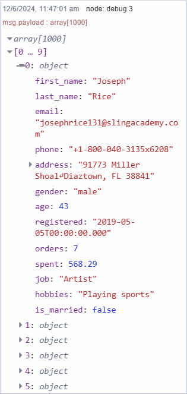
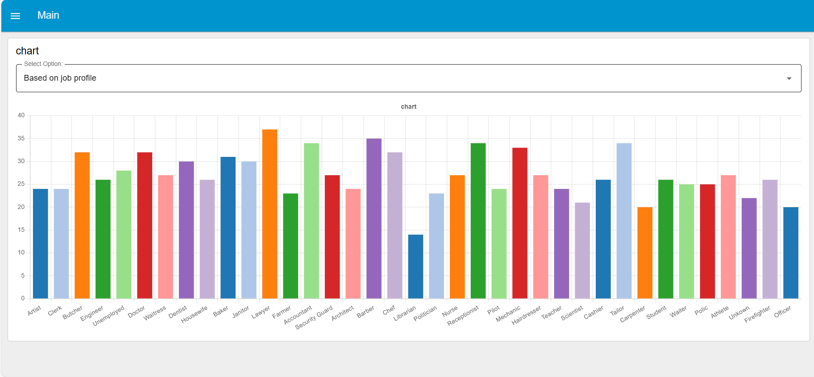
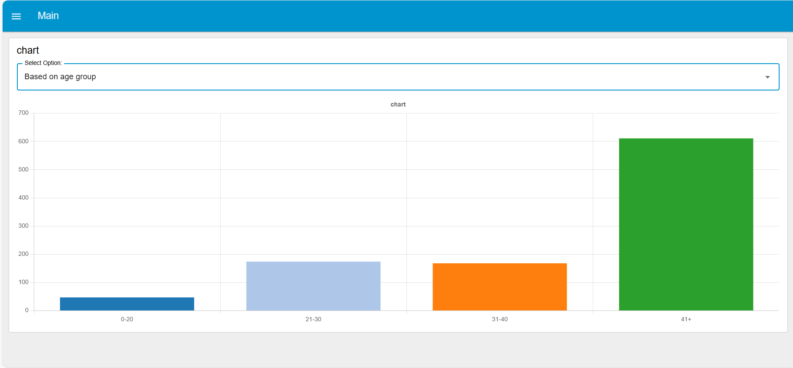

ETL is the process data-driven organizations use to gather data from diverse sources and merge it to support discovery, reporting, analysis, and decision-making. While Node-RED is widely known as a low-code visual programming tool for building IoT applications, it also has significant potential for ETL tasks. This potential was highlighted when IBM published a blog about using Node-RED for ETL that sparked interest and discussion in the community.

<!--more-->

In this guide, we'll walk you through how to use Node-RED as an ETL tool for your data industrial data ops, its strengths and weaknesses along the way.

## What is ETL

[ETL](https://en.wikipedia.org/wiki/Extract,_transform,_load) (Extract, Transform, Load) is a fundamental process in managing data efficiently. It consists of three main stages: extraction, transformation, and loading. In the extraction phase, data is gathered from various sources such as SCADA systems, IoT devices, industrial sensors, APIs and more. In the transformation stage, the data is converted into a format that is suitable for analysis by cleaning, filtering, and structuring it. For example, this may involve converting raw sensor data into operational metrics. Aggregating time-series data over intervals (e.g., hourly, daily) to analyze trends and patterns in process performance. Filtering and analyzing event logs are for monitoring system performance and identifying potential issues. Finally, in the loading stage, the transformed data is stored in a target database or data warehouse for further analysis and decision-making. ETL plays a significant role in ensuring that data is organized, consistent, and readily available for generating insights and making informed decisions in businesses and organizations.

## Node-RED as an ETL tool

Node-RED is specifically used for building various types of IoT applications. Data ops workload are part of these use-cases, and are often deployed without thinking of them as DataOps. For instance, when monitoring sensors across a facility, the process involves extracting data from sensors, transforming (cleaning and formatting) sensor data, and loading it into a database. There are thousands of other such examples.

*Note: We have mentioned only a few nodes that can be used in the ETL process, but there are thousands of other nodes that you can explore yourself by visiting the [Node-RED Nodes Library](https://flows.nodered.org/search?type=node)*

### Extracting

Node-RED can extract data from various sources, including APIs, databases, local filesystems, and IoT devices using built-in nodes and community-contributed nodes. For example, the HTTP request node can be used to pull data from web services, while nodes for MySQL, MongoDB, and PostgreSQL can extract data from databases. Nodes for MQTT and Kafka can fetch data from message brokers. File nodes enable extraction of data from local filesystems, while different cloud nodes for platforms like AWS, GCP, and IBM Watson allow extraction of data from cloud storage services. Nodes for OPC-UA, Modbus, EtherNet/IP can be used to extract data from SCADA systems, PLCs, RTUs, and more. Moreover, Node-RED running on edge devices can extract directly extract data from devices.

### Transforming

Transforming data involves cleaning, structuring, and applying business rules. This can be done using various nodes in Node-RED, including function nodes with custom JavaScript, along with nodes like JSON for parsing or stringifying JSON data, CSV for parsing CSV data into JSON or stringifying JSON into CSV, Split for breaking data into parts, Join for combining data and calculating total of data, Switch for conditional routing, Change for mapping and filtering data, Sort for ordering data, and XML for parsing and formatting.

For example, imagine you have extracted sensor data objects from factory floor devices. Using Node-RED, you can convert that object into JSON using JSON nodes, route it based on device IDs with Switch nodes, filter out irrelevant sensor readings with Change nodes, apply custom business rules with Function nodes, sort it chronologically with Sort nodes and format it into XML with XML nodes for analysis and reporting.

### Loading

The final step in the ETL process is loading the transformed data into a target system, such as a database or data warehouse. Node-RED supports various output nodes to send data to different destinations. For instance, you can use the MySQL node to insert data into a MySQL database, or the HTTP request node to send data to a web service endpoint or cloud nodes to send data to cloud storage services.

### Visualizing and Analyzing

In addition to the core ETL process, visualizing and analyzing data is a crucial step for gaining insights. While visualization isn't part of the ETL acronym itself, it plays a significant role in understanding and interpreting transformed data. In Node-RED, you can easily visualize data using Node-RED Dashboard 2.0 charts.

Node-RED Dashboard 2.0 provides several chart options, and more are expected in the future. For more information and to explore available chart types, refer to the [Node-RED Dashboard 2.0 charts documentation](https://dashboard.flowfuse.com/nodes/widgets/ui-chart.html).

## Benefits of using Node-RED as an ETL tool.

1. **Ease of Use:** Its visual programming interface makes it accessible to non-developers.
2. **Flexibility:** A wide range of nodes and the ability to write custom JavaScript allow for flexible data processing.
3. **Integration:** Node-RED excels in integrating IoT devices and handling real-time data, making it well-suited for combining diverse data sources into unified workflows.
4. **Cost-Effective:** Being open-source, Node-RED can be a cost-effective alternative to expensive ETL tools.
5. **Community Support:** A large community provides a wealth of nodes, examples, and support.

## Building a Simple ETL Project Using Node-RED

Let's walk through a simple project where we will use Node-RED as an ETL tool to extract sample customer data from an API, transform it, and then load cleaned data into a MongoDB database and process data into a local file.

*Note: The goal of this project is to understand how to utilize Node-RED as an ETL tool. We assume that the reader has a basic knowledge of Node-RED.*

## Prerequisite 

Before proceeding further make sure you have installed the following nodes:

1. [node-red-contrib-mongodb4](https://flows.nodered.org/node/node-red-contrib-mongodb4)
2. [@flowfuse/node-red-dashboard](https://dashboard.flowfuse.com/)

## Extracting Data

1. Drag an Inject node onto the canvas.
2. Drag an HTTP Request node onto the canvas, double-click on it, and set the URL to `https://api.slingacademy.com/v1/sample-data/files/customers.json`.
3. Drag a Link-out node onto the canvas, I am using Link nodes to separate flow groups for different ETL phases to enhance organization, although you can directly connect nodes or maintain a single flow group.
4. Connect the Inject node's output to the input of the HTTP Request node and the HTTP Request node's output to the input of the Link-out node.

Now, if you add a Debug node after the HTTP Request node, you will see an array of objects containing customer data in the Debug panel. Each object has properties such as `first_name`, `last_name`, `email`, and others.

{data-zoomable}

In next section, we'll perform a transformation to replace the existing properties `first_name` and `last_name` with a single property `full_name` that concatenates them.

## Transforming Data

### Data Cleaning

1. Drag a Link-in node onto the canvas, double-click on it, and select the name of the Link-out node added in the above section.
2. Drag a Split node onto the canvas.
3. Drag a Change node onto the canvas and Set `msg.payload.full_name` to `payload.first_name & " " & payload.last_name` as the JSONata expression, this JSONata expression will concat the firstname and lastname properties, then delete unnecessary properties like `first_name` and `last_name`.
4. Drag a Join node onto the canvas.
5. Connect the output of the Link-in node to the input of the Split node, then the Split node output to the input of the Join node.

Up to this point, we've established a flow that creates a new property in customer data objects called 'full_name' and subsequently removes any unnecessary properties. In summary, we've cleaned the data according to our needs.

### Customer Data Deduplication

1. Drag a Change node onto the canvas, and set `msg.data` to `msg.payload` and `msg.payload` to `[]`.
2. Drag a MongoDB4 node onto the canvas, and configure it with your correct details. If you haven't used MongoDB with Node-RED, please refer to the [Using MongoDB with Node-RED](/blog/2024/04/using-mongodb-with-node-red/). Enter `find` into the Operation field.
3. Drag a Function node onto the canvas and insert the following code into it and give it the name "Data deduplication":

```javascript
// Check if previously stored customer data is present, and ensure it's an array
let previously_stored_customer_data = Array.isArray(msg.payload) ? msg.payload : (msg.payload ? [msg.payload] : []);

// Ensure latest customer data is an array
let latest_customer_data = Array.isArray(msg.data) ? Array.from(msg.data) : (msg.data ? [msg.data] : []);

// Check if both previously stored and latest customer data are not empty
if (latest_customer_data.length !== 0 && previously_stored_customer_data.length !== 0) {
    // Extract emails from previously stored customer data
    let emailArray1 = previously_stored_customer_data.map(customer => customer.email);

    // Filter out customers that are already in previously stored data
    let filtered_customer_data = latest_customer_data.filter(customer => !emailArray1.includes(customer.email));

 msg.payload = filtered_customer_data; 
    return msg;
} else {
    // Case where there's no previously stored data (first ETL cycle after deploying flow)
 msg.payload = latest_customer_data;
    return msg;
}
```

4. Drag a Link-out node onto the canvas.
5. Connect the output of the Join node to the input of change node and the output of the Change node to the input of the MongoDB4 node and then MongoDB4 output to the input of the function node named "Data deplication" and output of that function node to the input of Link-out node.

Now, we have added additional nodes that perform data deduplication. This means we will create a new array containing unique data that is not already stored in the database to avoid data duplications. For filtering that data, we are using JavaScript with a function node.

## Data Processing

1. Drag a Function node onto the canvas insert the following code into it and name this node "Data processing":

```javascript
let data = msg.payload;

// Initialize counters
let ageRanges = {
    "0-20": 0,
    "21-30": 0,
    "31-40": 0,
    "41+": 0
};

let genderTotals = {
    male: 0,
    female: 0,
    other: 0  // Default to 'other' if gender is not specified
};

let jobStatusTotals = {};

// Process each document in the data array
data.forEach(doc => {
    // Calculate age range
    let age = parseInt(doc.age);
    let ageRange;
    if (age <= 20) {
        ageRange = "0-20";
 } else if (age <= 30) {
        ageRange = "21-30";
 } else if (age <= 40) {
        ageRange = "31-40";
 } else {
        ageRange = "41+";
 }
 ageRanges[ageRange]++; // Increment age range count

    // Count gender
    let gender = doc.gender || 'other'; // Default to 'other' if gender is not specified
 genderTotals[gender]++;

    // Count job status
    let job = doc.job || 'Unknown'; // Default to 'Unknown' if job is not specified
    if (jobStatusTotals[job]) {
 jobStatusTotals[job]++;
 } else {
 jobStatusTotals[job] = 1;
 }
});

// Prepare output payload
msg.payload = {
    "Age Ranges": ageRanges,
    "genderTotals": genderTotals,
    "JobStatus Totals": jobStatusTotals
}; 

return msg;
```
2. Drag another Link-out node onto the canvas.
3. Connect the Join node's output to the input of function node named "Data processing", and output of that function node to the input of Link-out node.

In this phase of transformation, we are tallying the total number of users based on age, gender, and job title. This allows us to quickly analyze and understand our user demographics based on these details so that later we can visualize this data easily.

## Loading data

1. Drag a Link-in node onto the canvas, double-click on it, and select the name of the Link-out node connected to the "Data deduplication" function. Then, drag another Link-in node and connect it to the Link-out node which is connected to the "Data processing" function node.
2. Drag a MongoDB4 node onto the canvas and configure it correctly. Select the correct collection and enter `insertMany` into the Operation field.
3. Drag a File Write node onto the canvas, set the path, and select the action to "override".
4. Connect the first Link-in node's output to the input of MongoDB4 node and then second Link-in node's output to the input of File write node.

Now, finally, in this loading phase, we are storing the cleaned, formatted, and unique customer data into the database. The processed data, such as total users by age, gender, and job profiles, is stored in the local file

## Deploying the flow

Below is the complete flow of the project, including dashboard visualization. For database configuration, I have utilized environment variables. Please ensure to set the variables with your database configuration before deploying the flow.


[{"id":"e85cb581eb249115","type":"group","z":"977143edb097b685","style":{"stroke":"#b2b3bd","stroke-opacity":"1","fill":"#f2f3fb","fill-opacity":"0.5","label":true,"label-position":"nw","color":"#32333b"},"nodes":["218b698ddba2210b","638eddcd2b5f645e","9773152e6a0f2287","fd68d5c864a0e7c9"],"x":254,"y":119,"w":532,"h":182},{"id":"218b698ddba2210b","type":"http request","z":"977143edb097b685","g":"e85cb581eb249115","name":"","method":"GET","ret":"obj","paytoqs":"ignore","url":"https://api.slingacademy.com/v1/sample-data/files/customers.json","tls":"","persist":false,"proxy":"","insecureHTTPParser":false,"authType":"","senderr":false,"headers":[],"x":570,"y":260,"wires":[["fd68d5c864a0e7c9"]]},{"id":"638eddcd2b5f645e","type":"inject","z":"977143edb097b685","g":"e85cb581eb249115","name":"Extract Data","props":[{"p":"payload"},{"p":"topic","vt":"str"}],"repeat":"","crontab":"","once":false,"onceDelay":0.1,"topic":"","payload":"","payloadType":"date","x":370,"y":260,"wires":[["218b698ddba2210b"]]},{"id":"9773152e6a0f2287","type":"comment","z":"977143edb097b685","g":"e85cb581eb249115","name":"Extracting customer data from api","info":"","x":470,"y":160,"wires":[]},{"id":"fd68d5c864a0e7c9","type":"link out","z":"977143edb097b685","g":"e85cb581eb249115","name":"link out 1","mode":"link","links":["0e0129a95e24355c"],"x":745,"y":260,"wires":[]},{"id":"e0adf6e180ec1a7c","type":"group","z":"977143edb097b685","style":{"stroke":"#b2b3bd","stroke-opacity":"1","fill":"#f2f3fb","fill-opacity":"0.5","label":true,"label-position":"nw","color":"#32333b"},"nodes":["ace58c34d1566f51","d2a48c9825b224b4","9cd9d88bb507cc49","ef5e8501b76cfec8","d3a842120a526a7f","6f472c26ef54f974","a88a07f39e0e941d","0e0129a95e24355c","c7150b3b68fc34a0","3f3ad8e528f5800b","dd3fb62233d5477e"],"x":244,"y":339,"w":1342,"h":202},{"id":"ace58c34d1566f51","type":"split","z":"977143edb097b685","g":"e0adf6e180ec1a7c","name":"","splt":"\\n","spltType":"str","arraySplt":1,"arraySpltType":"len","stream":false,"addname":"","x":390,"y":460,"wires":[["d2a48c9825b224b4"]]},{"id":"d2a48c9825b224b4","type":"change","z":"977143edb097b685","g":"e0adf6e180ec1a7c","name":"","rules":[{"t":"set","p":"payload.full_name","pt":"msg","to":"payload.first_name & \" \" & payload.last_name","tot":"jsonata"},{"t":"delete","p":"payload.first_name","pt":"msg"},{"t":"delete","p":"payload.last_name","pt":"msg"}],"action":"","property":"","from":"","to":"","reg":false,"x":600,"y":460,"wires":[["ef5e8501b76cfec8"]]},{"id":"9cd9d88bb507cc49","type":"function","z":"977143edb097b685","g":"e0adf6e180ec1a7c","name":"data processing","func":"let data = msg.payload\n\nlet ageRanges = {\n    \"0-20\": 0,\n    \"21-30\": 0,\n    \"31-40\": 0,\n    \"41+\": 0\n};\n\nlet genderTotals = {\n    male: 0,\n    female: 0,\n    other: 0  // Add other genders as needed\n};\n\nlet jobStatusTotals = {};\n\n// Iterate through each document to calculate counts\ndata.forEach(doc => {\n    // Calculate age range\n    let age = parseInt(doc.age);\n    let ageRange;\n    if (age <= 20) {\n        ageRange = \"0-20\";\n    } else if (age <= 30) {\n        ageRange = \"21-30\";\n    } else if (age <= 40) {\n        ageRange = \"31-40\";\n    } else {\n        ageRange = \"41+\";\n    }\n    // Increment age range count\n    ageRanges[ageRange]++;\n\n    // Increment gender count\n    if (doc.gender === 'male') {\n        genderTotals.male++;\n    } else if (doc.gender === 'female') {\n        genderTotals.female++;\n    } else {\n        genderTotals.other++;\n    }\n\n    // Increment job status count\n    if (jobStatusTotals[doc.job]) {\n        jobStatusTotals[doc.job]++;\n    } else {\n        jobStatusTotals[doc.job] = 1;\n    }\n});\n\n\nmsg.payload = {\n    \"ageRanges\": ageRanges,\n    \"genderTotals\": genderTotals,\n    \"jobStatusTotals\": jobStatusTotals\n}; \n\n// Return the aggregated counts object\nreturn msg","outputs":1,"timeout":0,"noerr":0,"initialize":"","finalize":"","libs":[],"x":1120,"y":500,"wires":[["3f3ad8e528f5800b"]]},{"id":"ef5e8501b76cfec8","type":"join","z":"977143edb097b685","g":"e0adf6e180ec1a7c","name":"","mode":"custom","build":"array","property":"payload","propertyType":"msg","key":"topic","joiner":"\\n","joinerType":"str","accumulate":false,"timeout":"","count":"","reduceRight":false,"reduceExp":"","reduceInit":"","reduceInitType":"","reduceFixup":"","x":830,"y":460,"wires":[["9cd9d88bb507cc49","6f472c26ef54f974"]]},{"id":"d3a842120a526a7f","type":"comment","z":"977143edb097b685","g":"e0adf6e180ec1a7c","name":"Tranforming customer data","info":"","x":470,"y":380,"wires":[]},{"id":"6f472c26ef54f974","type":"change","z":"977143edb097b685","g":"e0adf6e180ec1a7c","name":"set payload","rules":[{"t":"set","p":"data","pt":"msg","to":"payload","tot":"msg"},{"t":"set","p":"payload","pt":"msg","to":"[]","tot":"json"}],"action":"","property":"","from":"","to":"","reg":false,"x":1110,"y":380,"wires":[["a88a07f39e0e941d"]]},{"id":"a88a07f39e0e941d","type":"mongodb4","z":"977143edb097b685","g":"e0adf6e180ec1a7c","clientNode":"a0c7c3410ffb0e89","mode":"collection","collection":"customer_data","operation":"find","output":"toArray","maxTimeMS":"0","handleDocId":false,"name":"","x":1270,"y":380,"wires":[["dd3fb62233d5477e"]]},{"id":"0e0129a95e24355c","type":"link in","z":"977143edb097b685","g":"e0adf6e180ec1a7c","name":"link in 1","links":["fd68d5c864a0e7c9"],"x":285,"y":460,"wires":[["ace58c34d1566f51"]]},{"id":"c7150b3b68fc34a0","type":"link out","z":"977143edb097b685","g":"e0adf6e180ec1a7c","name":"link out 2","mode":"link","links":["78176aee11393705"],"x":1545,"y":380,"wires":[]},{"id":"3f3ad8e528f5800b","type":"link out","z":"977143edb097b685","g":"e0adf6e180ec1a7c","name":"link out 3","mode":"link","links":["ecfa23782d33d813"],"x":1255,"y":500,"wires":[]},{"id":"dd3fb62233d5477e","type":"function","z":"977143edb097b685","g":"e0adf6e180ec1a7c","name":"set payload","func":"let previously_stored_customer_data = Array.isArray(msg.payload) ? msg.payload : (msg.payload ? [msg.payload] : []);\nlet latest_customer_data = Array.isArray(msg.data) ? Array.from(msg.data) : (msg.data ? [msg.data] : []);\n\nif (latest_customer_data.length !== 0 && previously_stored_customer_data.length !== 0) {\n    let fullNameArray1 = previously_stored_customer_data.map(customer => customer.full_name);\n    let filtered_customer_data = latest_customer_data.filter(customer => !fullNameArray1.includes(customer.full_name));\n    msg.payload = [filtered_customer_data];\n    return msg\n} else {\n    // Case where there's no previously stored data\n    msg.payload = [latest_customer_data];\n    return msg\n}","outputs":1,"timeout":"","noerr":0,"initialize":"","finalize":"","libs":[],"x":1430,"y":380,"wires":[["c7150b3b68fc34a0"]]},{"id":"a0c7c3410ffb0e89","type":"mongodb4-client","name":"MongoDB Config","protocol":"mongodb+srv","hostname":"","port":"","dbName":"${DATABASE}","appName":"","authSource":"","authMechanism":"DEFAULT","tls":false,"tlsCAFile":"","tlsCertificateKeyFile":"","tlsInsecure":false,"connectTimeoutMS":"30000","socketTimeoutMS":"0","minPoolSize":"0","maxPoolSize":"100","maxIdleTimeMS":"0","uri":"${URI}","advanced":"{}","uriTabActive":"tab-uri-advanced"},{"id":"ac5e2cabb6251314","type":"group","z":"977143edb097b685","name":"","style":{"label":true},"nodes":["d6a4a19c23a0f42b","78176aee11393705","ecfa23782d33d813","dab90d6302b1c885","bc4afbc715e3b64d","d781431fed20d650","f19a1157e25b47df"],"x":254,"y":579,"w":592,"h":222},{"id":"d6a4a19c23a0f42b","type":"mongodb4","z":"977143edb097b685","g":"ac5e2cabb6251314","clientNode":"a0c7c3410ffb0e89","mode":"collection","collection":"customer_data","operation":"insertMany","output":"toArray","maxTimeMS":"0","handleDocId":false,"name":"","x":510,"y":680,"wires":[["bc4afbc715e3b64d"]]},{"id":"78176aee11393705","type":"link in","z":"977143edb097b685","g":"ac5e2cabb6251314","name":"link in 2","links":["c7150b3b68fc34a0"],"x":295,"y":680,"wires":[["d6a4a19c23a0f42b"]]},{"id":"ecfa23782d33d813","type":"link in","z":"977143edb097b685","g":"ac5e2cabb6251314","name":"link in 3","links":["3f3ad8e528f5800b"],"x":295,"y":760,"wires":[["dab90d6302b1c885"]]},{"id":"dab90d6302b1c885","type":"file","z":"977143edb097b685","g":"ac5e2cabb6251314","name":"","filename":"./customer_data_analytics","filenameType":"str","appendNewline":true,"createDir":false,"overwriteFile":"true","encoding":"none","x":530,"y":760,"wires":[["d781431fed20d650"]]},{"id":"bc4afbc715e3b64d","type":"debug","z":"977143edb097b685","g":"ac5e2cabb6251314","name":"debug 1","active":true,"tosidebar":true,"console":false,"tostatus":false,"complete":"false","statusVal":"","statusType":"auto","x":720,"y":680,"wires":[]},{"id":"d781431fed20d650","type":"debug","z":"977143edb097b685","g":"ac5e2cabb6251314","name":"debug 2","active":true,"tosidebar":true,"console":false,"tostatus":false,"complete":"false","statusVal":"","statusType":"auto","x":740,"y":760,"wires":[]},{"id":"f19a1157e25b47df","type":"comment","z":"977143edb097b685","g":"ac5e2cabb6251314","name":"Loading data into file and database","info":"","x":520,"y":620,"wires":[]},{"id":"520f961e35d10da4","type":"group","z":"977143edb097b685","style":{"stroke":"#b2b3bd","stroke-opacity":"1","fill":"#f2f3fb","fill-opacity":"0.5","label":true,"label-position":"nw","color":"#32333b"},"nodes":["9b534cdc46dfc52a","52c6d1c11c84571c","ed6fc24b155aef33","af4bc1c2a6e6d020","572c04ca900af9d5","b64ddca6aab82cb2","a135a8ed2c447561"],"x":254,"y":839,"w":1372,"h":142},{"id":"9b534cdc46dfc52a","type":"ui-chart","z":"977143edb097b685","g":"520f961e35d10da4","group":"1859e113313a5279","name":"","label":"chart","order":2,"chartType":"bar","category":"category","categoryType":"property","xAxisProperty":"","xAxisPropertyType":"msg","xAxisType":"category","yAxisProperty":"value","ymin":"","ymax":"","action":"replace","pointShape":"circle","pointRadius":4,"showLegend":false,"removeOlder":1,"removeOlderUnit":"3600","removeOlderPoints":"","colors":["#1f77b4","#aec7e8","#ff7f0e","#2ca02c","#98df8a","#d62728","#ff9896","#9467bd","#c5b0d5"],"width":"13","height":8,"className":"","x":1550,"y":940,"wires":[[]]},{"id":"52c6d1c11c84571c","type":"function","z":"977143edb097b685","g":"520f961e35d10da4","name":"function 1","func":"let selectedDataForChart = global.get(\"selectedDataForChart\")\n// Assuming msg.payload is an object\nlet data = msg.payload[selectedDataForChart]\nlet result = [];\n\n// Loop through each key in the payload object\nObject.keys(data).forEach(key => {\n    result.push({ category: key, value: data[key] });\n});\n\nmsg.payload = result\nreturn msg;","outputs":1,"timeout":0,"noerr":0,"initialize":"","finalize":"","libs":[],"x":1380,"y":940,"wires":[["9b534cdc46dfc52a"]]},{"id":"ed6fc24b155aef33","type":"ui-dropdown","z":"977143edb097b685","g":"520f961e35d10da4","group":"1859e113313a5279","name":"","label":"Select Option:","tooltip":"","order":1,"width":0,"height":0,"passthru":false,"multiple":false,"options":[{"label":"Based on age group","value":"ageRanges","type":"str"},{"label":"Based on gender group","value":"genderTotals","type":"str"},{"label":"Based on job profile","value":"jobStatusTotals","type":"str"}],"payload":"","topic":"topic","topicType":"msg","className":"","x":360,"y":940,"wires":[["b64ddca6aab82cb2"]]},{"id":"af4bc1c2a6e6d020","type":"file in","z":"977143edb097b685","g":"520f961e35d10da4","name":"","filename":"./customer_data_analytics","filenameType":"str","format":"lines","chunk":false,"sendError":false,"encoding":"none","allProps":false,"x":950,"y":940,"wires":[["572c04ca900af9d5"]]},{"id":"572c04ca900af9d5","type":"json","z":"977143edb097b685","g":"520f961e35d10da4","name":"","property":"payload","action":"","pretty":false,"x":1190,"y":940,"wires":[["52c6d1c11c84571c"]]},{"id":"b64ddca6aab82cb2","type":"change","z":"977143edb097b685","g":"520f961e35d10da4","name":"store selected data in global context","rules":[{"t":"set","p":"selectedDataForChart","pt":"global","to":"payload","tot":"msg"}],"action":"","property":"","from":"","to":"","reg":false,"x":640,"y":940,"wires":[["af4bc1c2a6e6d020"]]},{"id":"a135a8ed2c447561","type":"comment","z":"977143edb097b685","g":"520f961e35d10da4","name":"Visualizing data on charts","info":"","x":490,"y":880,"wires":[]},{"id":"1859e113313a5279","type":"ui-group","name":"chart","page":"f10b4d0259e43aeb","width":"13","height":"1","order":-1,"showTitle":true,"className":"","visible":"true","disabled":"false"},{"id":"f10b4d0259e43aeb","type":"ui-page","name":"home","ui":"cb79bc4520925e32","path":"/","icon":"","layout":"grid","theme":"2c5d702b11de7dd1","order":1,"className":"","visible":true,"disabled":"false"},{"id":"cb79bc4520925e32","type":"ui-base","name":"My UI","path":"/dashboard","includeClientData":true,"acceptsClientConfig":["ui-notification","ui-control"],"showPathInSidebar":false},{"id":"2c5d702b11de7dd1","type":"ui-theme","name":"Theme Name","colors":{"surface":"#ffffff","primary":"#0094ce","bgPage":"#eeeeee","groupBg":"#ffffff","groupOutline":"#cccccc"}}]


1. To Deploy the flow, click on the top-right Deploy button
2. To visit the dashboard, Go to the Dashboard 2.0 sidebar and click on the top-right "Open dashboard" button.

{data-zoomable}

{data-zoomable}

## What are the limitations of using Node-RED as an ETL tool

While Node-RED is versatile, there are some limitations to consider while using it as an ETL tool:

- Advanced Features: Some advanced ETL features, like automated schema detection and sophisticated error handling, might require additional customization or external modules.
- Data Governance: Node-RED does not inherently provide robust data governance and lineage tracking, which are often essential in enterprise ETL tools.
- Scalability: While Node-RED can handle many heavy tasks, but it may not offer the same level of optimization for processing extremely large datasets compared to dedicated ETL tools.

## Additional resources

- [Implementing ETL flows with Node-RED](https://developer.ibm.com/articles/implementing-etl-flows-with-node-red/): Read this IBM blog where a team member explains how they replaced a dedicated ETL tool with Node-RED.
- [Node-RED Forum Thread](https://discourse.nodered.org/t/etl-pipelines-with-node-red/): Explore this Node-RED forum thread where community members discussed how to utilize Node-RED as an ETL tool, including solutions for handling large datasets.
