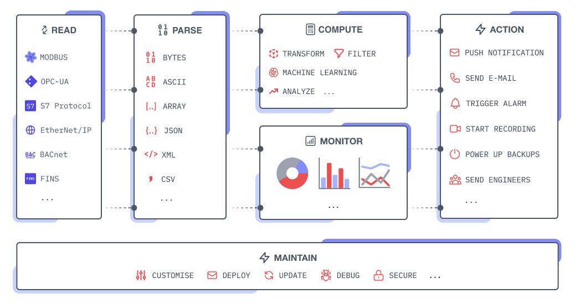
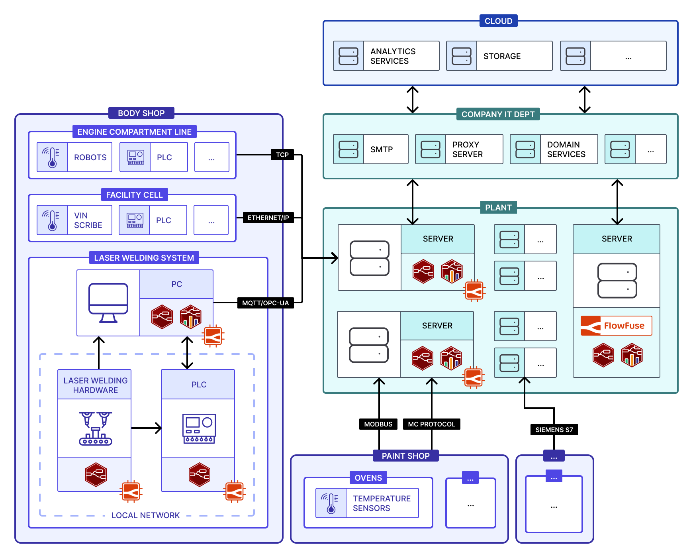
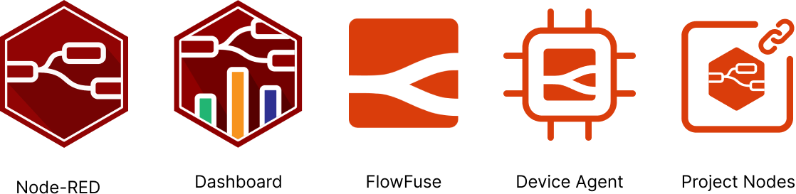

FlowFuse has established a rich ecosystem of products to help you build bespoke, powerful, low-code applications.

We've seen customers utilizing these to [revolutionise precision manufacturing](https://flowfuse.com/customer-stories/leveraging-node-red-and-flowfuse-to-automate-precision-manufacturing/), [automate building management](https://flowfuse.com/customer-stories/node-red-building-management/) and [modernize the distribution of global weather data](https://flowfuse.com/customer-stories/un-wmo-nr-data-sharing/), just to name a few examples. 

In this series of articles, we'll be taking a look at the common architectures and design patterns we are seeing used across our customer base, and how you can use these to build your own applications. To kick things off, this article will focus on **"Remote Device Monitoring"**.

<!--more-->

## Use Case

You have hundreds, if not, thousands of devices deployed remotely. These could be anything from sensors, to actuators, to entire machines. You need to monitor these devices, and potentially control them. It's important to know when they are online, that they're running optimally and if something is about to, or already has, gone wrong.

{data-zoomable}
_Diagram showing the breakdown of each component that makes up a "Device Monitoring" use case._

Breaking it down we have the following fundamental requirements:

- **Read:** Reading data from the devices using the relevant protocol
- **Parse:** Process the data into a computational format
- **Compute/Monitor:** Analysis & monitoring of the data from all devices
- **Action:** Taking action based on the data from the devices

Then, we have to consider that this functionality needs to be deployed out to thousands of devices. So, our final requirement is:

- **Maintain:** If we update functionality on one device, we may need to be able to easily roll those updates out to other devices. We need to sure it's easy to update and deploy to our devices, and if anything goes wrong, we should be able to easily find out what the problem is, and get easy access to fix it.

## Architecture

Let's consider an example architecture set in an automotive plant:

{data-zoomable}
_Diagram showing an example architecture of a "Device Monitoring" use case in an automotive plant._

- **Laser Welding Machine:** Here we have a small system built around a single piece of laser welding hardware. The hardware is connected to a PLC via local network, and the PLC is connected to a local server. Each component here can have Node-RED installed, managed by FlowFuse and accessible via the Device Agent. Node-RED would enable extraction of data from the hardware, and provide a local, bespoke, Dashboard on a nearby PC for monitoring the hardware.
- **Body Shop:** Here we have several piece of machinery, each with the "FlowFuse Device Agent" installed. This allows us to manage the Node-RED deployments on these machines remotely from FlowFuse, and easily extract data from the machines for analysis.
- **Plant:** We have multiple servers running at the Planet-level, generally one for each "Shop", each with their own Device Agent installed, again for easy remote management and deployment of Node-RED, e.g. Dashboards that provide a single HMI for monitoring hardware across a full shop. Here, we also have our instance of FlowFuse. This is the central point for managing all of our Node-RED deployments across the factory floor.
- **Company IT Dept:** The general IT department of the company would provide multiple servers and services, accessible to a range of departments and the plant. Node-RED could act as a bridge between the Plant and the Company IT Dept, allowing us to easily extract data from the Plant and send it to the Company IT Dept, and vice-versa.
- **Cloud:** Here we demonstrate how a company may have external Cloud-based services they're dependent upon. For example, image analytics services. Node-RED can be used to parse machine imagery, and integrate straight with these external services from the FlowFuse server.

This diagram also demonstrates a sample of the rich ecosystem of communication protocols that Node-RED can support:

- **TCP:** Read and process data from from bespoke and custom devices
- **EtherNet/IP:** Collect data from Allen Bradley and other EtherNet/IP devices
- **MQTT:**  Modern devices and factory generated IIoT data
- **OPC-UA:**  Communicate with newer PLCs and OPC Servers 
- **Modbus:**  Data collection from existing Modbus enabled devices like Temperature Probes, Invertors, Encoders
- **MC Protocol:**  Gather data from Mitsubishi PLCs
- **FINS:**  Gather data from OMRON PLCs
- **Siemens S7:**   Gather data from Siemens PLCs using the S7 Protocol

### FlowFuse Technology Stack

Given the above architecture, let's take a look at the relevant FlowFuse offerings and see what they're contributing:

{data-zoomable}

- **Node-RED:** Low-code, drag-and-drop integration platform. Here we'd be using it in multiple places to read and parse data from the hardware, define the application logic, conduct analysis and provide alerting.
- **FlowFuse Dashboard:** An add-on to Node-RED for building interactive user interfaces and dashboards. We use this here to provide visual feedback on local Dashboards for some devices, as well as at the Planet-level to provide an at-a-glance view of our plant.
- **FlowFuse:** Centralized platform that provides a single entry point to manage all of your Node-RED applications and deployments, from your device inetrgators, through to your dashboards. FlowFuse provides role-based access control out of the box, so we can easily control who has access to flows, Dashboards and other configurations.
- **FlowFuse Device Agent:** Installed onto the relevant servers and hardware, this links you directly, and securely to FlowFuse. Here, we're deploying it to multiple pieces of machinery, as well as local servers, such that we can easily manage (deploy, upgrade, debug) all of those Node-RED deployments remotely from FlowFuse.
- **FlowFuse Project Nodes:** A small collection of nodes for Node-RED, running on FlowFuse, that provide communication over a secure (MQTT-based) connection between devices (our Node-RED deployments on our hardware in this case) and our hosted instances of Node-RED on FlowFuse. Extremely useful for reporting live sensor data back to FlowFuse for analysis, and for reporting information back to our devices.

## What Next?

### Deploy to FlowFuse

If you're interested in discussing how your company could benefit from this design pattern, please do [get in touch](/contact-us/?utm_campaign=60718323-BCTA&utm_source=blog&utm_medium=cta%20contact%20us&utm_term=high_intent&utm_content=Building%20on%20FlowFuse%3A%20Remote%20Device%20Monitoring).

### Customer Stories

If you want to deep dive further into how this design pattern has been used by our customers, we have some customer stories that you might find interesting:

<ul class="grid grid-cols-1 sm:grid-cols-2 gap-4 px-0 list-none">
    <li class="customer-story-tile w-full my-2 border px-0 rounded-lg hover:drop-shadow-lg hover:border-blue-600 transition ease-in-out duration-300 bg-white">
        <a href="/customer-stories/leveraging-node-red-and-flowfuse-to-automate-precision-manufacturing" class="w-full flex flex-col group hover:no-underline h-full m-0">
            

                

                    

                        <picture>
                            
                        </picture>
                    

                

                

                    <label class="font-bold">Abrasive Technology</label>
                    <h3 class="group-hover:text-blue-600 font-medium m-0 mt-0 mb-2" style="line-height: 1.6rem">Revolutionizing Precision Manufacturing with Node-RED</h3>
                

            

        </a>
    </li>
    <li class="customer-story-tile w-full my-2 border px-0 rounded-lg hover:drop-shadow-lg hover:border-blue-600 transition ease-in-out duration-300 bg-white">
        <a href="/customer-stories/leveraging-node-red-and-flowfuse-to-revolutionize-irrigation" class="w-full flex flex-col group hover:no-underline h-full m-0">
            

                

                    

                        <picture>
                            
                        </picture>
                    

                

                

                    <label class="font-bold">Paloma Irrigation and Drainage District</label>
                    <h3 class="group-hover:text-blue-600 font-medium m-0 mt-0 mb-2" style="line-height: 1.6rem">Leveraging Node-RED and FlowFuse to Revolutionize Irrigation</h3>
                

            

        </a>
    </li>
</ul>