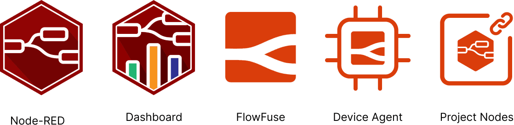



FlowFuse has established a rich ecosystem of products to help you build bespoke, powerful, low-code applications. We've seen customers utilizing these to [revolutionise precision manufacturing](https://flowfuse.com/customer-stories/leveraging-node-red-and-flowfuse-to-automate-precision-manufacturing/), [automate building management](https://flowfuse.com/customer-stories/node-red-building-management/) and [modernize the distribution of global weather data](https://flowfuse.com/customer-stories/un-wmo-nr-data-sharing/), just to name a few examples. 

In this series of articles, we'll be taking a look at the common architectures and design patterns we are seeing used across our customer base, and how you can use these to build your own applications. To kick things off, this article will focus on "Remote Device Monitoring".

<!--more-->

## Use Case

You have hundreds, if not, thousands of devices deployed remotely. These could be anything from sensors, to actuators, to entire machines. You need to monitor these devices, and potentially control them. It's important to know when they are online, that they're running optimally and if something is about to, or already has, gone wrong.

{data-zoomable}
_Diagram showing the breakdown of each component that makes up a "Device Monitoring" use case._

Breaking it down we have the following fundamental requirements:

- **Read:** Reading data from the devices using the relevant protocol
- **Parse:** Process the data into a computational format
- **Compute/Monitor:** Analysis & monitoring of the data from all devices
- **Action:** Taking action based on the data from the devices

Then, we have to consider that this functionality needs to be deployed out to thousands of devices. So, our final requirement is:

- **Maintain:** If we update functionality on one device, we may need to be able to easily roll those updates out to other devices. We need to sure it's easy to update and deploy to our devices, and if anything goes wrong, we should be able to easily find out what the problem is, and get easy access to fix it.

## Architecture

Let's consider an example architecture set in an automotive plant:

### FlowFuse Technology Stack

Given the above architecture, let's take a look at the relevant FlowFuse offerings and see what they're contributing:

{data-zoomable}

- **Node-RED:** Low-code, drag-and-drop integration platform. Here we'd be using it in multiple places to read and parse data from the hardware, define the application logic, conduct analysis and provide alerting.
- **FlowFuse Dashboard:** An add-on to Node-RED for building interactive user interfaces and dashboards. We use this here to provide visual feedback on device performance and behaviors, making it easy for our workers to get an at-a-glance view of our plant.
- **FlowFuse:** Centralized platform that provides a single entry point to manage all of your Node-RED applications and deployments. Provides role-based access control out of the box, so we can easily control who has access to flows, Dashboards and other configurations.
- **FlowFuse Device Agent:** Installed onto the relevant hardware, this links your hardware to FlowFuse. Here, we're deploying it to multiple pieces of machinery, as well as local servers, such that we can easily manage (deploy, upgrade, debug) all of those Node-RED deployments centrally (and remotely) from FlowFuse.
- **FlowFuse Project Nodes:** A small collection of nodes for Node-RED that provide communication over a secure (MQTT-based) connection between devices (our Node-RED deployments on our hardware in this case) and our hosted instances of Node-RED on FlowFuse.

## What Next?

### Deploy to FlowFuse

If you're interested in discussing how your company could benefit from this design pattern, please do [get in touch](/contact/).

### Customer Stories

If you want to deep dive further into how this design pattern has been used by our customers, we have some customer stories that you might find interesting:

<ul class="grid grid-cols-1 sm:grid-cols-2 gap-4 px-0 list-none">
    
    {{ storyTile(title=story.title, url=story.url, brand=story.brand, logo=story.logo, image=story.image) }}
    
</ul>