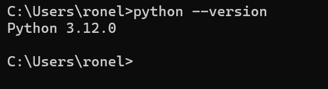
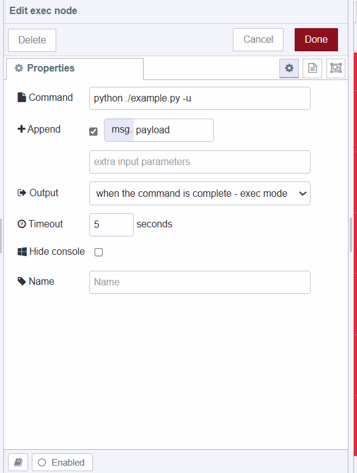
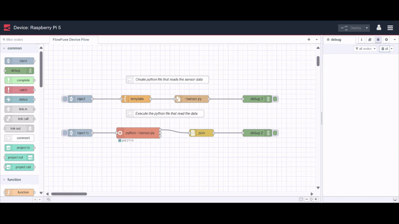

Python's robust data processing capabilities and extensive libraries are well-known in programming. When combined with Node-RED, these technologies can synergize to elevate data analytics and automation. This guide walks you through integrating Python scripts with Node-RED. You'll gain practical insights, troubleshooting tips, and effective techniques for executing scripts, enabling you to leverage this powerful combination for your IoT projects.

<!--more-->

## Why use python with Node-RED

Integrating Python and Node-RED can significantly enhance your IoT and automation initiatives by leveraging their distinct strengths. Node-RED excels in creating easy workflows, efficiently processing data streams, and integrating hardware, APIs, and. Meanwhile, Python offers a rich set of libraries for advanced tasks such as machine learning and AI, pivotal in realizing Industry 4.0 concepts.

This combination allows developers to build robust and flexible solutions. For instance, while Node-RED manages data flow and device communication, Python can perform complex analytics, and predictive modeling, or integrate with AI frameworks. This integration bridges the gap between data collection and actionable insights, enabling systems to make informed decisions autonomously.

## Installing Python

When executing Python scripts, it's essential to have the Python runtime installed on your system. Before proceeding, make sure you have it installed. You can follow the [official guide](https://wiki.python.org/moin/BeginnersGuide/Download) for instructions.

To verify if Python is installed, open your terminal and execute:

```bash
python --version
```

{data-zoomable}

The above command displays the version of Python installed on your system as shown in the above image. If the above command doesn't work, try:

```bash
python3 --version
```

The specific command to use depends on how Python was installed and configured on your system. However, make sure to use `python <filename>.py` if the first command works, or `python3 <filename>.py` if the second command works, while executing Python scripts.

## Executing Python Script from Node-RED

Let's now see how to call a Python script from Node-RED. First, we'll create a basic script file that contains a function to print text in the console based on input. Currently, the function uses hardcoded input. To create this file using Node-RED, import the following flow, deploy it, and press the inject button:


[{"id":"b9d7d6aff0016631","type":"inject","z":"FFF0000000000001","name":"","props":[{"p":"payload"},{"p":"topic","vt":"str"}],"repeat":"","crontab":"","once":false,"onceDelay":0.1,"topic":"","payload":"","payloadType":"date","x":240,"y":100,"wires":[["2e1daccf2a7b3d0f"]]},{"id":"d2d1450deaa588f4","type":"file","z":"FFF0000000000001","name":"","filename":".\\example.py","filenameType":"str","appendNewline":true,"createDir":false,"overwriteFile":"true","encoding":"none","x":570,"y":100,"wires":[["e140a8508fb10d96"]]},{"id":"e140a8508fb10d96","type":"debug","z":"FFF0000000000001","name":"debug 1","active":true,"tosidebar":true,"console":false,"tostatus":false,"complete":"false","statusVal":"","statusType":"auto","x":760,"y":100,"wires":[]},{"id":"2e1daccf2a7b3d0f","type":"template","z":"FFF0000000000001","name":"","field":"payload","fieldType":"msg","format":"handlebars","syntax":"mustache","template":"def main():\n    # Hardcoded value\n    user_input = 20  \n    \n    # Check if the input is numeric\n    if isinstance(user_input, int) or (isinstance(user_input, str) and user_input.isdigit()):\n        number = int(user_input) if isinstance(user_input, str) else user_input\n        \n        # Conditionally render based on the input value\n        if number < 0:\n            print(\"Negative number entered\")\n        elif number == 0:\n            print(\"Zero entered\")\n        else:\n            print(\"Positive number entered\")\n    else:\n        print(\"Invalid input. Please enter a valid number.\")\n\nif __name__ == \"__main__\":\n    main()\n","output":"str","x":400,"y":100,"wires":[["d2d1450deaa588f4"]]}]


Now, let's execute this Python script from Node-RED. To do that, we will use Node-RED's [Exec](/node-red/core-nodes/exec/) node, which allows running commands on your system.

1. Drag an Inject node onto the canvas.
2. Drag an Exec node onto the canvas and Configure the command to `python ./example.py -u`. The -u flag prevents potential output buffering issues when executing Python scripts via exec.

{data-zoomable}

3. Drag a Debug node onto the canvas.
4. Connect the output of the Inject node to the input of the Exec node, and the output of the Exec node to the input of Debug node.


[{"id":"2e26b84c0ce17312","type":"exec","z":"FFF0000000000001","command":"python ./example.py -u","addpay":"","append":"","useSpawn":"false","timer":"","winHide":false,"oldrc":false,"name":"","x":460,"y":300,"wires":[["89589c56117004e0"],["7fdb901b144749c2"],["3f49b49308941782"]]},{"id":"739e08c1ec77c2a1","type":"inject","z":"FFF0000000000001","name":"","props":[{"p":"payload"},{"p":"topic","vt":"str"}],"repeat":"","crontab":"","once":false,"onceDelay":0.1,"topic":"","payload":"","payloadType":"date","x":240,"y":300,"wires":[["2e26b84c0ce17312"]]},{"id":"89589c56117004e0","type":"debug","z":"FFF0000000000001","name":"Output","active":true,"tosidebar":true,"console":false,"tostatus":false,"complete":"payload","targetType":"msg","statusVal":"","statusType":"auto","x":690,"y":260,"wires":[]},{"id":"7fdb901b144749c2","type":"debug","z":"FFF0000000000001","name":"Error","active":true,"tosidebar":true,"console":false,"tostatus":false,"complete":"payload","targetType":"msg","statusVal":"","statusType":"auto","x":690,"y":300,"wires":[]},{"id":"3f49b49308941782","type":"debug","z":"FFF0000000000001","name":"Return code","active":true,"tosidebar":true,"console":false,"tostatus":false,"complete":"payload","targetType":"msg","statusVal":"","statusType":"auto","x":710,"y":340,"wires":[]}]


Now, when you deploy this flow and click on the inject node to execute the file, you should see the text 'Positive number entered' and `{ code: 0 }`, which indicates your script has been successfully executed.

## Reading Temperature Sensor using Python script

Having explored how to run a Python script within Node-RED with the basic practical example, let's move to a real-world scenario. We'll demonstrate how to read sensor data using Python, despite Node-RED providing numerous community-built nodes for this purpose. This approach provides deeper insights into integrating external scripts, showcasing the flexibility of Node-RED for custom solutions.

Before proceeding, ensure that Node-RED is running on a device connected to a temperature sensor. For detailed instructions, refer to [Setting Up Node-RED on Different Hardware](/node-red/hardware/), In this case, we are running Node-RED on a Raspberry Pi 5 with a DHT11 sensor connected to it.

1. Drag an Inject node onto the canvas, and set repeat to 1 seconds of interval.
2. Drag an Exec node and set the path to `python <filename>.py`, replace the filename with the name of the file which reads the sensor data, and make sure the python file doesn't contain the loop.
3. Drag the JSON node onto the canvas and set the action to "Always convert to JSON object".
4. Drag the Debug node onto the canvas.
5. Connect the output of the Inject node to the input of the Exec node and output of the Exec node to the input of the JSON node, and finally the JSON node's output to the input of the Debug node.

Below is the complete flow which creates the Python file to read the DHT11 sensor and executes that file after 1 second of interval. After deploying the flow you should able to see the sensor data on the debug sidebar as shown in the below image.

{data-zoomable}

Note: The Python script uses the [adafruit-circuitpython](https://docs.circuitpython.org/projects/dht/en/latest/index.html) to read the sensor data so make sure to install it. Additionally, the code contained in the template node in the following flow considers that your sensor's signal pin is connected to GPIO 4.


[{"id":"94bc6fa766c4b397","type":"file","z":"FFF0000000000001","name":"","filename":"~/sensor.py","filenameType":"str","appendNewline":false,"createDir":false,"overwriteFile":"true","encoding":"none","x":610,"y":520,"wires":[["9b08eee57f666de5"]]},{"id":"37453becdf842bd7","type":"template","z":"FFF0000000000001","name":"","field":"payload","fieldType":"msg","format":"handlebars","syntax":"mustache","template":"import time\nimport board\nimport adafruit_dht\nimport json\n\ndef publish():\n    dhtDevice = adafruit_dht.DHT11(board.D4)\n    try:\n        temperature_c = dhtDevice.temperature\n        humidity = dhtDevice.humidity\n\n        # Create JSON object\n        data = {\n            \"temperature_c\": temperature_c,\n            \"humidity\": humidity\n        }\n\n        # Convert JSON object to string and print\n        print(json.dumps(data))\n\n    except RuntimeError as error:\n        print(error.args[0])\n    except Exception as error:\n        dhtDevice.exit()\n        raise error\n    finally:\n        dhtDevice.exit()\n\ndef run():\n    publish()\n\nif __name__ == '__main__':\n    run()\n","output":"str","x":380,"y":520,"wires":[["94bc6fa766c4b397"]]},{"id":"5b3642d39c122576","type":"debug","z":"FFF0000000000001","name":"debug 2","active":true,"tosidebar":true,"console":false,"tostatus":false,"complete":"payload","targetType":"msg","statusVal":"","statusType":"auto","x":880,"y":660,"wires":[]},{"id":"88144cbc887aada9","type":"inject","z":"FFF0000000000001","name":"","props":[],"repeat":"1","crontab":"","once":false,"onceDelay":0.1,"topic":"","x":150,"y":660,"wires":[["c896267214914641"]]},{"id":"1b1d792011ffac2c","type":"inject","z":"FFF0000000000001","name":"","props":[{"p":"kill","v":"g","vt":"str"}],"repeat":"","crontab":"","once":false,"onceDelay":0.1,"topic":"","x":150,"y":520,"wires":[["37453becdf842bd7"]]},{"id":"c896267214914641","type":"exec","z":"FFF0000000000001","command":"python ~/sensor.py -u","addpay":"payload","append":"","useSpawn":"false","timer":"5","winHide":false,"oldrc":false,"name":"","x":400,"y":660,"wires":[["1d02a33a018f0f8d"],[],[]]},{"id":"1d02a33a018f0f8d","type":"json","z":"FFF0000000000001","name":"","property":"payload","action":"","pretty":false,"x":650,"y":660,"wires":[["5b3642d39c122576"]]},{"id":"9b08eee57f666de5","type":"debug","z":"FFF0000000000001","name":"debug 3","active":true,"tosidebar":true,"console":false,"tostatus":false,"complete":"payload","targetType":"msg","statusVal":"","statusType":"auto","x":880,"y":520,"wires":[]},{"id":"343a9f704951f3ed","type":"comment","z":"FFF0000000000001","name":"Create python file that reads the sensor data","info":"","x":510,"y":440,"wires":[]},{"id":"216eb1333b2c264c","type":"comment","z":"FFF0000000000001","name":"Execute the python file that read the data","info":"","x":500,"y":580,"wires":[]}]


## Executing Python Script with Arguments from Node-RED

Now, let's revisit our first example. In that example, we executed a simple Python file with a hardcoded value. Now, we'll learn how to pass arguments or inputs to the Python script when executing from Node-RED. For this, we'll need to update the file. Import the following flow, deploy it, and click on the inject button to create the file.


[{"id":"b9d7d6aff0016631","type":"inject","z":"FFF0000000000001","name":"","props":[{"p":"payload"},{"p":"topic","vt":"str"}],"repeat":"","crontab":"","once":false,"onceDelay":0.1,"topic":"","payload":"","payloadType":"date","x":300,"y":440,"wires":[["2e1daccf2a7b3d0f"]]},{"id":"d2d1450deaa588f4","type":"file","z":"FFF0000000000001","name":"","filename":"./example.py","filenameType":"str","appendNewline":true,"createDir":false,"overwriteFile":"true","encoding":"none","x":630,"y":440,"wires":[["e140a8508fb10d96"]]},{"id":"e140a8508fb10d96","type":"debug","z":"FFF0000000000001","name":"debug 1","active":true,"tosidebar":true,"console":false,"tostatus":false,"complete":"false","statusVal":"","statusType":"auto","x":820,"y":440,"wires":[]},{"id":"2e1daccf2a7b3d0f","type":"template","z":"FFF0000000000001","name":"","field":"payload","fieldType":"msg","format":"handlebars","syntax":"mustache","template":"import sys\n\ndef main():\n    if len(sys.argv) != 2:\n        print(\"Usage: python your_script.py <number>\")\n        return\n    \n    user_input = sys.argv[1]\n    \n    # Check if the input is numeric\n    if user_input.isdigit() or (user_input[0] == '-' and user_input[1:].isdigit()):\n        number = int(user_input)\n        \n        # Conditionally render based on the input value\n        if number < 0:\n            print(\"Negative number entered\")\n        elif number == 0:\n            print(\"Zero entered\")\n        else:\n            print(\"Positive number entered\")\n    else:\n        print(\"Invalid input. Please enter a valid number.\")\n\nif __name__ == \"__main__\":\n    main()\n","output":"str","x":460,"y":440,"wires":[["d2d1450deaa588f4"]]}]


1. Drag the Inject node onto the canvas.
2. Drag the Exec node onto the canvas, set the command to `python -u ./example.py <arg>`, and replace the `<arg>` with your argument.
3. Now Drag the Debug node onto the canvas.
4. Connect the output of the Inject node to the input of the Exec node, and the output of the Exec node to the input of the Debug node.

If you examine the Python file we've created, you'll notice the use of the 'sys' module, which allows us to read command-line arguments. In our context, we execute the command `python ./example.py -30`. By accessing `sys.argv[1]`, we retrieve the argument -30. The index 1 is used because `sys.argv[0]` provides the filename of the script being executed. Additionally, Python supports passing multiple arguments, so that you can pass as many arguments as you want.


[{"id":"2e26b84c0ce17312","type":"exec","z":"FFF0000000000001","command":"python -u ./example.py  -30","addpay":"","append":"","useSpawn":"false","timer":"","winHide":false,"oldrc":false,"name":"","x":520,"y":580,"wires":[["89589c56117004e0"],["7fdb901b144749c2"],["3f49b49308941782"]]},{"id":"739e08c1ec77c2a1","type":"inject","z":"FFF0000000000001","name":"","props":[{"p":"payload"}],"repeat":"","crontab":"","once":false,"onceDelay":0.1,"topic":"","payload":"","payloadType":"date","x":280,"y":580,"wires":[["2e26b84c0ce17312"]]},{"id":"89589c56117004e0","type":"debug","z":"FFF0000000000001","name":"Output","active":true,"tosidebar":true,"console":false,"tostatus":false,"complete":"payload","targetType":"msg","statusVal":"","statusType":"auto","x":730,"y":540,"wires":[]},{"id":"7fdb901b144749c2","type":"debug","z":"FFF0000000000001","name":"Error","active":true,"tosidebar":true,"console":false,"tostatus":false,"complete":"payload","targetType":"msg","statusVal":"","statusType":"auto","x":730,"y":580,"wires":[]},{"id":"3f49b49308941782","type":"debug","z":"FFF0000000000001","name":"Return code","active":true,"tosidebar":true,"console":false,"tostatus":false,"complete":"payload","targetType":"msg","statusVal":"","statusType":"auto","x":750,"y":620,"wires":[]}]


## Conclusion

In this guide, we've demonstrated how to seamlessly execute Python scripts from Node-RED, along with troubleshooting tips and instructions on passing arguments to scripts. By leveraging Python's extensive libraries for data processing, machine learning, and other tasks in conjunction with Node-RED, developers can build powerful IoT solutions with ease.

{% include "cta.njk", cta_url: "/get-started?utm_campaign=60718323-BCTA&utm_source=blog&utm_medium=cta&utm_term=high_intent&utm_content=Calling%20a%20Python%20script%20from%20Node-RED", cta_type: "signup", cta_text: "Simplify Node-RED management and deployment with FlowFuse. Optimize, scale, secure, collaborate effortlessly, and access your instance remotely." %}
