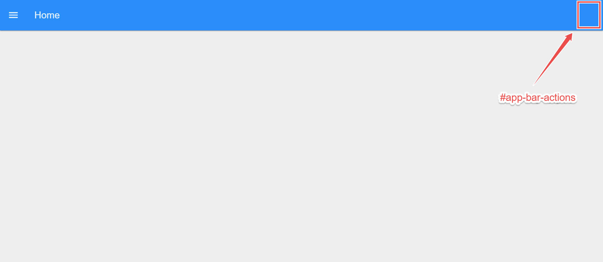

The latest release of Node-RED Dashboard 2.0 has taken customization to the next level. Previously, users enjoyed the flexibility of tweaking navigation sidebars, themes, and group and page padding. However, the header section remained static and non-customizable—until now. With the new update, you can fully personalize the header, adding unique elements to enhance your dashboard experience. In this article, we'll delve into these exciting new features, including theme adjustments, custom styling, and layout modifications, that empower you to tailor your Node-RED Dashboard like never before.

<!--more-->

## Adding Elements in the Header

To add elements to the header, we utilize Vue's Teleport feature with ui-template widget, which allows elements to be seamlessly rendered in specific areas of the dashboard using CSS selectors such as IDs or classes. This method simplifies the process compared to manually positioning items with CSS, which can be complex, time-consuming, and potentially disruptive to other dashboard elements.

### Left Side of the Header

To render elements on the left side of the header, you can utilize the div element having the `#app-bar-title` ID, in which our page name is displayed.

{data-zoomable}

The `#app-bar-title` currently spans the full width of the header. When adding elements, they will occupy this area and align from left to right. However, if you add multiple elements in succession (using the default `display: flex`), they may extend beyond the width of the page view.

#### Example: Adding Buttons

1. Drag the ui-template widget onto the canvas.
2. Double-click on it and select the scope to either `ui-scope` or `page-scope`. Selecting `ui-scope` will eliminate the need for multiple template widgets for the same purpose. For example, where you want the same buttons on all pages of your dashboard.
3. Choose the page on which you want to render the buttons if you selected `page-scope`, or choose correct ui if `ui-scope` is selected.
4. Paste the following Vue snippet into the template widget. In this snippet, note how we specify the "to" attribute targeting the `#app-bar-actions` ID in the teleport tag:

```js
<template>
    <!-- Teleport the button to the #app-bar-actions area when mounted -->
    <Teleport v-if="mounted" to="#app-bar-actions">
        <v-btn>Button 1</v-btn>
        <v-btn>Button 2</v-btn>
        <v-btn>Button 3</v-btn>
    </Teleport>
</template>

<script>
    export default {
        data() {
            return {
                mounted: false
            }
        },
        mounted() {
            // Set mounted to true when the component is mounted
            this.mounted = true
        }
    }
</script>
```

5. Next, you can customize further by adding more buttons or different elements inside the `<Teleport>` element.

{data-zoomable}

#### Example: Adding Logo

If you want to add your brand's logo, you can replace the element inside <teleport> with an  tag. You can do this in the same ui-template widget or in a different ui-template widget:

1. Drag the ui-template widget onto the canvas.
2. Select the correct scope for that widget to render.
3. Select the correct page or UI in which you want to render the element.
3. Paste the same Vue snippet given in the above section into the `ui-template` widget and replace the code inside <teleport> with the following element:

```html
</img>
```

You can replace the URL with your logo's URL or set it using the `msg.payload` as shown in examples given [documentation](https://dashboard.flowfuse.com/nodes/widgets/ui-template.html#page-name-app-bar-title).

{data-zoomable}

#### Hiding the Page Name in the Header

After seeing the provided output images, you might wonder why your output looks different. It's because the page name is still visible, taking up extra space and not looking good with the added elements. No worries, we have added a feature that allows you to hide the page name from the header.

To hide the page name:

1. Go to the Dashboard 2.0 sidebar
2. Click on to the "Edit settings" option located at the top of the Dashboard 2.0 sidebar.
{data-zoomable}
3. Untick the option "Show page name in the navigation bar".
{data-zoomable}

### Right Side of the Header

To render elements on the right side of the header, you can use the empty div element having the `#app-bar-actions` ID, in which we can add elements.

{data-zoomable}

The `#app-bar-actions` currently has a width of 0px. As elements are added, this container will dynamically adjust its width based on the width of its children. Items will align from right to left. Similar to the left side, adding many elements in succession (using `display: flex`) may cause them to extend beyond the width of the page view.

#### Example: Adding logged in user profile

In this section, we will add the user profile of the currently logged-in user to the right side of the header. Make sure you have installed "@flowfuse/node-red-dashboard-2-user-addon" via the palette manager and enabled [FlowFuse User Authentication](/docs/user/instance-settings/#flowfuse-user-authentication). Each message emitted by the Dashboard 2.0 widget will include the logged-in user information under `msg._client.user`. Additionally the [setup object](https://dashboard.flowfuse.com/contributing/guides/state-management.html#setup-store) will also contain this information under `setup.socketio.auth.user`.

1. Drag the ui-template widget onto the canvas.
2. Select the correct scope for that widget to render.
3. Select the correct page or UI in which you want to render the element.
3. Paste the same Vue snippet given below into the `ui-template` widget:

```js
<template>
    <!-- Teleporting user info to #app-bar-actions, which is the ID of the action bars' right corners area -->
    <Teleport v-if="loaded" to="#app-bar-actions">
        <div class="user-info">
            <!-- Displaying user image -->
            
            <!-- Greeting the user -->
            <span>Hi, {{ setup.socketio.auth.user.name }}</span>
        </div>
    </Teleport>
</template>

<script>
export default {
    data() {
        return {
            // Flag to indicate if the component is loaded
            loaded: false
        };
    },
    mounted() {
        // This function is called when the component is inserted into the DOM.
        // Setting loaded to true here ensures the component is ready to access #app-bar-actions,
        // as it's now part of the same DOM structure.
        // Accessing it before mounted() would cause an error because the component wouldn't be initialized in the DOM yet.
        this.loaded = true; // Setting loaded to true to indicate that the component has been mounted successfully
    }
}
</script>

<style>
/* Styling for user info display */
.user-info {
    display: flex;
    align-items: center;
    gap: 8px;
}
/* Styling for user avatar image*/
.user-info img {
    width: 24px;
    height: 24px;
}
</style>
```

{data-zoomable}

For detailed guide on this section, refer to the guide on [Displaying logged in user on Node-RED Dashboard 2.0](/blog/2024/04/displaying-logged-in-users-on-dashboard/). Furthermore, if you want to add logos or buttons on the right side similar to the left side of the header, you just need to replace the to attribute with the `#app-bar-actions`.

## Styling Header

One of the significant customization features we've added in the latest release is the ability to style the header in different ways.

To style the header:

1. 1. Go to the Dashboard 2.0 sidebar
2. Click on to the "Edit settings" option located at the top of the Dashboard 2.0 sidebar.

{data-zoomable}

3. Select the desired option from the "Header Options" dropdown.

{data-zoomable}

The following options are available for header styling:

### Default

This option as it name suggest it is the default option set for header. In which the header will get hidden if we scrolled down.

{data-zoomable}

### Hidden

Selecting this option completely hides the header, allowing you to use that space for other purposes.

{data-zoomable}

### Fixed

Selecting this option keeps the header fixed at the top. This means that when you scroll the page down, the header will remain visible.

{data-zoomable}

## Changing Dashboard Theme

In this section of the guide, you will learn how to change the Dashboard theme, where you can adjust the colors of the header, navigation sidebar, group and page backgrounds, the border color of groups, and the padding, sizing, and gaps between pages, groups, and widgets.

To edit the existing theme:

1. Go to the Dashboard 2.0 sidebar.
2. Switch to the "Theme" tab.

{data-zoomable}

3. Click on the edit button next to the theme.
4. You can adjust the header color and the primary color (which applies to the navigation sidebar and elements like buttons and dropdowns) under the "Primary" section. In the "Pages" section, set the background color for pages, and in the "Groups" section, adjust the background color and border color of groups.
5. Under "Sizing," adjust the page padding (the space between dashboard groups), the page border, group gap, group border radius (the thickness of the group border), and widget gap.

For more information on  theme, how to add new themes, and set themes for pages, refer to the [Comprehensive guide: Node-RED Dashboard 2.0 layout, sidebar, and styling](/blog/2024/05/node-red-dashboard-2-layout-navigation-styling/#understanding-dashboard-2.0-theme). Additionally, this guide covers Node-RED Dashboard 2.0 layouts, themes, and custom styling in detail.

## Conclusion

In this article, we explored Node-RED Dashboard 2.0's new customization features. We focused on adding elements like buttons and logos to the header, and discussed styling options such as default, hidden, and fixed for headers. We also covered how to adjust dashboard themes to personalize colors and layout. These insights empower users to create more personalized and functional Node-RED dashboards.
