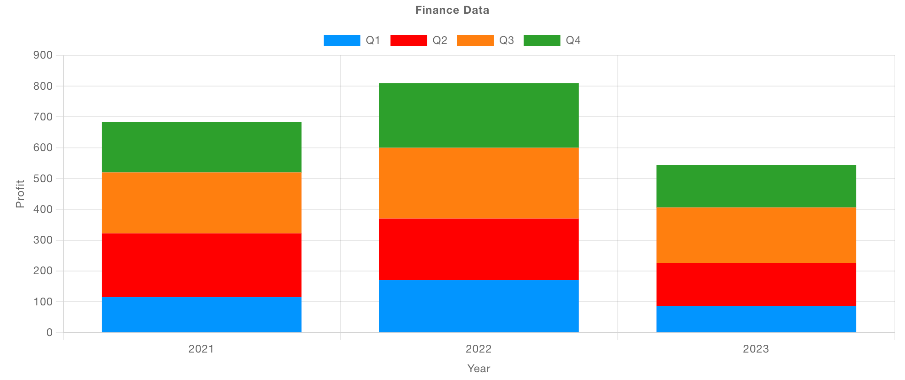
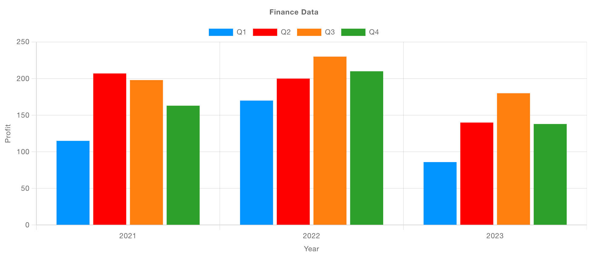
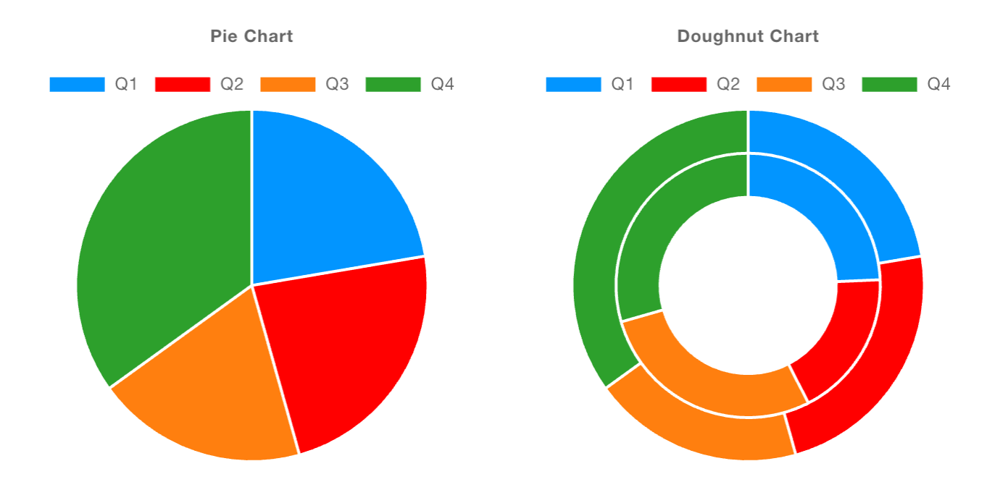
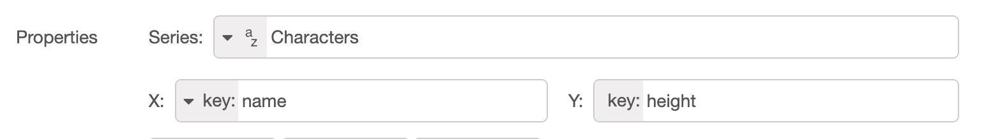
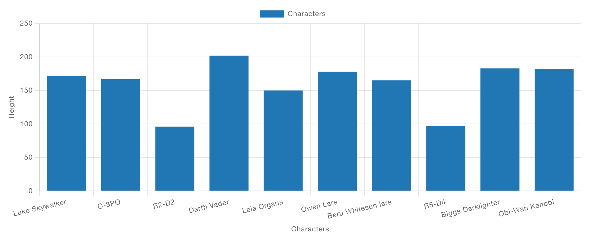
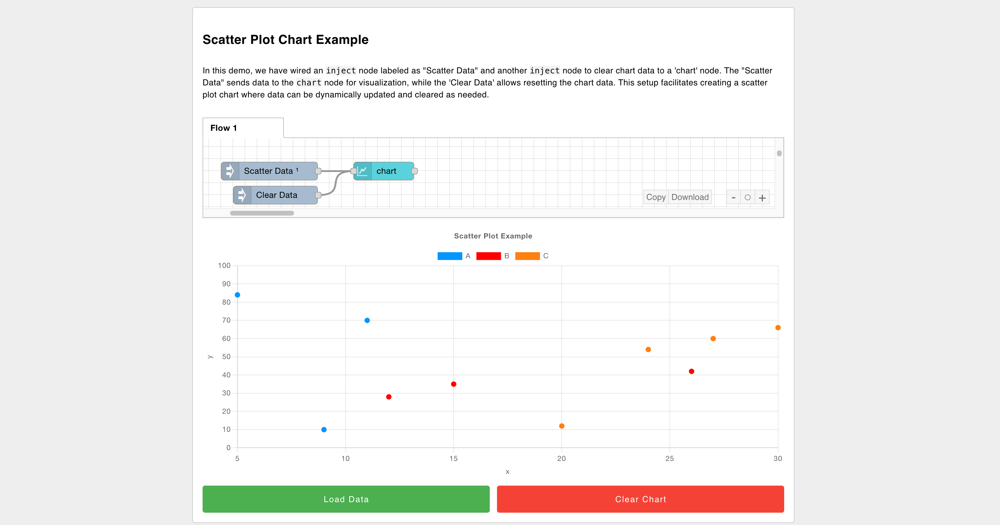

It's been a while coming, but we've finally introduced a new set of chart types to FlowFuse Dashboard. We've added Pie, Donut and Grouped (Stacks and Side-by-Side) Bar charts to the UI Chart node. We've also shipped plenty of other improvements and fixes in this release, so let's dive in.

<!--more-->

## Grouped Bar Charts

We now have the option "Group By" available when building Bar Charts, with the options "Stacks" and "Side-by-Side". This allows you to group data in a more meaningful way, and is particularly useful when comparing multiple data sets.

### Stacks

{data-zoomable}
_Screenshot showing a stacked bar chart with Dashboard_

### Side-by-Side

{data-zoomable}
_Screenshot showing a side-by-side grouped bar chart with Dashboard_

## Pie & Donut Charts

Radial charts are now available in Dashboard, with the introduction of Pie and Donut charts. These are particularly useful when you want to show the proportion of a single data set.

If you're using multiple "Series" here, then you'll get multiple nested radial charts, which can be particularly useful when comparing multiple data sets.

{data-zoomable}
_Screenshot showing the new Pie and Donut charts available with Dashboard_

## General Chart Changes & Improvements

### Breaking Changes - Bar Charts

With the introduction of the new chart types, we've generalised the key mapping features for charts. Previously, Bar Charts were using the "Series" property to define how data is rendered onto the x-axis. In hindsight, this didn't really make any sense, it should be the "X" property that defines the data used on the x-axis, so we've corrected that going forward, but it did mean introducing a breaking change. We don't do this lightly, but in this case, it was necessary to ensure the charting experience is consistent across all chart types.

It does however mean that Bar Charts created in `1.13.0` or below will need to be updated to reflect this. You just need to set "X" to whatever you have in the "Series" property, and then set "Series" to "None".

### Mapping Your Data

#### Series

This property is now, consistently, how you want to group your data. If a new `msg` is coming in, and a property on that `msg` defines its group, then you can set "Series" to something like `msg.myCategory`.

If a single data point needs to plot multiple points/bars onto a chart, then you can use the "JSON" type here, and list the different properties you want to plot, one for each category.

For Radial charts (Pie & Donut), having multiple series would provide multiple, nested radial charts.

#### X

With this, we define which property (or _properties_ if a single piece of data needs to plot multiple points/bars) we want to plot on the x-axis.

Note that on Radial charts (Pie & Donut), this is the value that defines the label of the segment.

#### Y

Which property should be used to define the y-axis value, i.e. height of the bar or the y-coordinate of a point on a scatter chart. 

Note that on Radial charts (Pie & Donut), this is the value that defines the size of the segment.

#### Example: Plotting Star Wars Character Heights

The [Star Wars API](https://swapi.dev/) is a free, open API that provides data on the Star Wars universe, an example API call can return details about particular characters, and the response is as follows:

```json
[{
    "name":"Luke Skywalker",
    "height":"172",
    "mass":"77",
    "hair_color":"blond",
    "skin_color":"fair",
    "eye_color":"blue",
    "birth_year":"19BBY",
    "gender":"male",
    ...
}, {
    ...
}]
```

We can configure a chart with the following "Mapping" options:

{data-zoomable}
_Example mapping of data to a UI Chart for data coming from the Star Wars API_

and this would then be the resulting chart:

{data-zoomable}
_Example bar chart showing heights of Star Wars characters_

Note, the chart takes in all of the data sent to it, uses the `name` field to define where on the x-axis the data should be plotted, and the `height` field to define the height of the bar (the y-axis). 

You can read more about this example, and access the flow itself in our documentation [here](https://dashboard.flowfuse.com/nodes/widgets/ui-chart.html#bar-charts)

## Live Dashboard Demo

{data-zoomable}
_Screenshot of our new interactive Dashboard to demonstrate how charts render in FlowFuse Dashboard_

With the new release also comes a new [Public Demo Dashboard](https://dashboard-demos.flowfuse.cloud/dashboard/charts-example) that we've made available for all to use and play with.

You can try it out, and interact with a range of different chart types, including the new Pie, Donut and Grouped Bar charts. We'll also be extending this soon to cover the full range of widgets available in FlowFuse Dashboard.

If you want more technical detail, you can also check out our online documentation [here](https://dashboard.flowfuse.com/nodes/widgets/ui-chart.html).

## What else is new?

You can find the full 1.14.0 Release Notes [here](https://github.com/FlowFuse/node-red-dashboard/releases/tag/v1.14.0).

Just to highlight a few, particularly valuable, updates and fixes:

 - UI Button Group - Now supports `msg.enabled` to enable/disable the widget.
 - UI Form - Now supports `msg.enabled` to enable/disable the widget.
 - UI Button - Color customisation now available, without needing to write overriding CSS.
 - UI Switch - Fix missing `msg.topic` when setting the topic to a static string.

 ## What's Next?

 Work has already begun on the next release, `1.15.0`, you can see what items we have queued up [here](https://github.com/orgs/FlowFuse/projects/15/views/1), if you've got any feedback or suggestions, please do let us know, and feel free to open new issues on our [GitHub](https://github.com/FlowFuse/node-red-dashboard/issues)