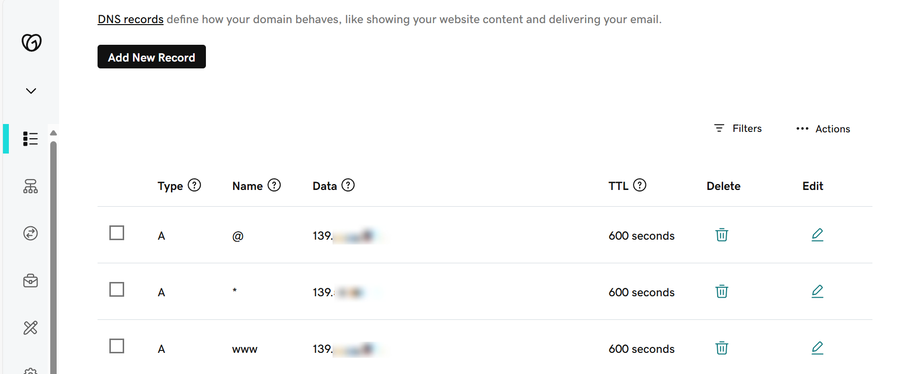
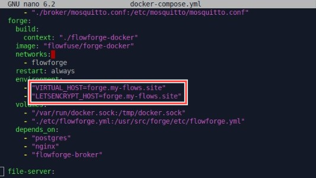
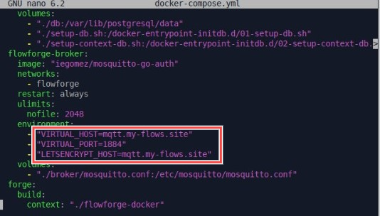
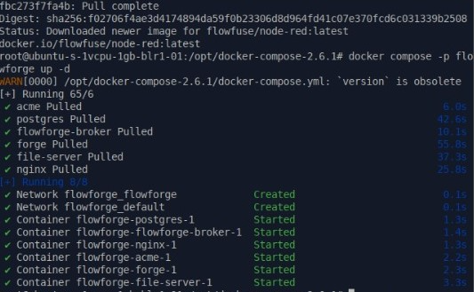
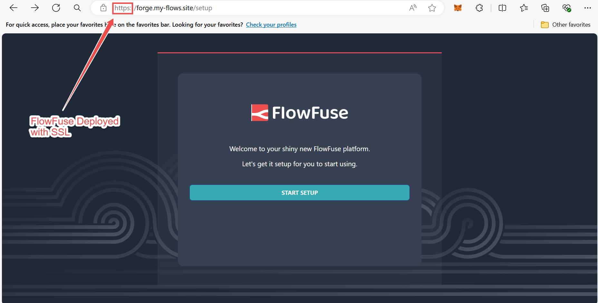

With Node-RED's increasing role in IoT, FlowFuse Cloud has become a favored platform for deploying production Node-RED applications. It offers [extensive features](/platform/features/) at a low cost, reducing operational overhead. However, the cloud is not the only option we provide; we also offer a self-hosted option for users who prefer to deploy FlowFuse on their servers. This guide demonstrates how to deploy FlowFuse on your Ubuntu server using Docker, covering key aspects such as domain setup, email, SSL, and more for real-world production scenarios

<!--more-->

*Note: While the approach provided in this article is an older method for deploying FlowFuse and still works, I recommend following the newer, simpler, and quicker approach. For more details, refer to the official [Docker documentation](/docs/install/docker/).*

## What is Docker?

[Docker](https://docs.docker.com/guides/docker-concepts/the-basics/what-is-an-image/) is an open-source platform that simplifies how applications are deployed, scaled, and managed through containerization. It enables you to package all components required by your project such as code, libraries, and dependencies into a single, portable unit known as a [Docker container](https://docs.docker.com/guides/docker-concepts/the-basics/what-is-a-container/). These containers ensure consistency in application environments and ease deployment by ensuring that applications run predictably across different computing environments, whether on a developer's laptop, a server, or a cloud platform.

## Deploying FlowFuse on Ubuntu server with Docker

Before proceeding, ensure you have your domain and a server with Ubuntu installed, and Docker is installed on it. For more information, refer to [Docker Compose Installation](https://docs.docker.com/compose/install/). Furthermore, If your server has Ubuntu installed without a GUI, you can connect to it from your computer using [SSH](https://itsfoss.com/set-up-ssh-ubuntu/), allowing you to run commands from your local computer on the server.

### Adding DNS records for your domain

To make your application accessible on the internet via your domain name, adding DNS records is crucial. These records serve as a vital link between your domain name (like example.com) and your server's IP address. They ensure that when users type your domain into their browsers, they're directed to the correct location where your application is hosted.



1. Log in to your Domain Provider's Panel and access the DNS settings of the domain you want to use for the FlowFuse platform.

2. Add entry first entry type: "A", enter "@" into the name field (it points to the domain name itself), and the public IP of your Ubuntu server into the data field.

3. Add entry second entry type: "A", enter "*" into the name field (adding * serves as the [wildcard domain entry](https://docs.digitalocean.com/glossary/wildcard-record/) to the IP address of the host running Docker, we are doing this because the FlowFuse application will be hosted on the `forge.your-domain-name.com` and when creating instances for each, our FlowFuse application will use unique subdomain ) and public IP of your Ubuntu server into the data field.

4. Add the last entry type: "A", and enter "www" into the name field (we are adding this because previously domain names used to have the www prefix) and the public IP of your Ubuntu server into the data field.

### Installing and configuring FlowFuse

FlowFuse uses Docker Compose to install and manage the required components. We have built and maintaining that Docker Compose project.

1. Download the latest release `tar.gz` from our [Docker Compose project](https://github.com/FlowFuse/docker-compose/releases/latest).

```bash
cd /opt
```

```bash
wget <link of the latest tar.gz release>
```

2. Unpack this release with the following command. Make sure to replace the release name with the actual release name that you downloaded:

 ```bash
    tar -xvzf vx.x.x.tar.gz
 ```

3. Enter the folder with the following command. Again, don't forget to replace the release name with the actual release name that you downloaded:

 ```bash
    cd docker-compose-x.x.x
 ```

4. Now, update the FlowFuse configuration file `flowforge.yml` with your domain name. Currently, it is configured with `example.com`. To update it quickly, use the following command:

 ```bash
    sed -i 's/example.com/<replace-with-your-domain-name>/g' ./etc/flowforge.yml
 ```

5. Next, update the Docker Compose configuration file `docker-compose.yml` with your domain:

 ```bash
    sed -i 's/example.com/<replace-with-your-domain-name>/g' ./docker-compose.yml
 ```





The `flowforge.yml` file was updated to include our domain in key fields: `domain`, `base_url`, and `broker.public_url`. These adjustments ensure that instance names on Docker platforms incorporate your domain, provide accurate URLs for accessing the platform, and specify the correct URL for devices to connect to the broker if different from `broker.url`. Additionally, in the `docker-compose.yml` file, we configured `VIRTUAL_HOST` and `LETSENCRYPT_HOST` to reflect our domain.

For more details on these configuration changes, refer to the [documentation](/docs/install/configuration/#configuring-flowfuse).

### Securing Communication with SSL

Securing communication with [SSL (Secure Sockets Layer)](https://www.youtube.com/watch?v=SJJmoDZ3il8) is crucial for protecting data transmitted between your users and the server. Adding SSL requires obtaining a certificate from a trusted certificate authority (CA) and configuring your server to use this certificate. Configuring SSL manually can be a headache, so we have provided a setup you need to enable.

1. Open the Docker Compose file in your editor:

 ```bash
    nano docker-compose.yml
 ```

2. Uncomment the following lines by removing the `#` symbol:

 ```yaml
    # - "./certs:/etc/nginx/certs"
 ```

 ```yaml
    # - "443:443"
    # environment:
      # - "HTTPS_METHOD=redirect"
 ```

 ```yaml
    # acme:
    #   image: nginxproxy/acme-companion
    #   restart: always
    #   volumes:
    #     - "/var/run/docker.sock:/var/run/docker.sock:ro"
    #     - "./acme:/etc/acme.sh"
    #   volumes_from:
    #     - nginx:rw
    #   environment:
    #     - "DEFAULT_EMAIL=mail@example.com"
    #   depends_on:
    #     - "nginx"
 ```

3. Update the lines with your domain and email associated with the domain, then save the file:

 ```yaml
    - "DEFAULT_EMAIL=your-email@example.com"

    - "LETSENCRYPT_HOST=mqtt.yourdomain.com"

    - "LETSENCRYPT_HOST=forge.yourdomain.com"
 ```


4. Open the `flowforge.yml` file in your editor:

 ```bash
    nano /etc/flowforge.yml
 ```

5. Update the `base_url` to start with `https://` instead of `http://` and the `broker.public_url` entry to start with `wss://` instead of `ws://`, then save the file.

 ```yaml
    base_url: https://yourdomain.com

    broker:
      public_url: wss://mqtt.yourdomain.com
 ```


Now, when we start our application the acme container will also start and will generate the certificates with let's encrypt on demand for the forge app and then for each of the instances as they are started.

### Configuring FlowFuse to Enable and Use the Email Feature

FlowFuse platform allows you to send invitations to other users within the platform and via email. It also supports receiving critical alerts and resetting passwords through email. To use these features, you need to enable and configure email in FlowFuse with your email address. Before you begin, make sure you have an email ID with an app password. FlowFuse supports Gmail and Outlook emails.

#### Creating an App Password for Your Email

If you're unfamiliar with generating an app password, watch these helpful videos:

- [Creating a Gmail app password](https://www.youtube.com/watch?v=hXiPshHn9Pw)
- [Creating an Outlook app password](https://www.youtube.com/watch?v=5ukSRLRDQIw)

#### Enabling and Configuring Email in FlowFuse

1. Open the `flowforge.yml` config file in your editor:

 ```bash
    nano /etc/flowforge.yml
 ```

2. Update the email configuration section with your email details:

**For Gmail:**

```yaml
email:
  enabled: true
  debug: false
  smtp:
    host: smtp.gmail.com
    port: 465
    secure: true
    auth:
      user: your-email@gmail.com
      pass: your-app-password
```

**For Outlook:**

```yml
email:
  enabled: true
  debug: false
  smtp:
    host: smtp.office365.com
    port: 587
    secure: false
    tls:
      ciphers: "SSLv3"
      rejectUnauthorized: false
    auth:
      user: your-email@outlook.com
      pass: your-app-password
```

### Running FlowFuse Application

We have completed the basic production-level configuration for running the FlowFuse application. Before running it, we need to ensure that we have the `flowfuse/node-red` container downloaded, which will be used as the default Node-RED stack.

1. To download the Node-RED container, run the following command:

 ```bash
    docker pull flowfuse/node-red
 ```

2. Now, to run the FlowFuse application, execute the following command:

 ```bash
    docker compose -p flowforge up -d
 ```

If you see an output similar to the following image, it indicates that all containers that are required for the flowfuse application to run correctly are running.



You can now access your self-hosted FlowFuse platform on the internet using the URL `forge.<yourdomain>.com`, and if your website shows the `https` as following that means the SSL configurations are also correct.



### Setting up the FlowFuse Platform

When you open the platform in your browser for the first time, you'll need to create an administrator account and perform initial configurations:

1. Open the platform in your browser.
   
2. Click on the "START SETUP" button.

3. Enter the username, full name, email, and password, and confirm the password to the administrator user account. This first user will have full access to the platform, allowing them to configure settings, and manage users and teams.

4. Next, If you intend to use the FlowFuse Enterprise Edition, enter your license details.

5. Alternatively, you can continue with the FlowFuse Community Edition (CE), which is free, by clicking "Continue with FlowFuse CE".

## Additional resources

- [Deploying FlowFuse with Docker Documentation](/docs/install/docker/): This documentation covers everything in detail on how to install FlowFuse using Docker.
- [Deploying FlowFuse with Docker on Ubuntu youtube video](https://www.youtube.com/watch?v=qQwAPuz9bEk): This YouTube video demonstrates how to deploy FlowFuse using Docker on an Ubuntu server for your server's local network.
- [Form for requesting Installation Service](/docs/install/introduction/#do-you-need-help%3F-installation-service): Fill this form if you need assistance with the installation process.

{% include "cta.njk", cta_url: "/contact-us/?utm_campaign=60718323-BCTA&utm_source=blog&utm_medium=cta%20contact%20us&utm_term=high_intent&utm_content=Deploying%20FlowFuse%20with%20Docker%20on%20an%20Ubuntu%20server", cta_type: "contact", cta_text: "Got questions or need help deploying FlowFuse (Node-RED) on your Ubuntu server?" %}
