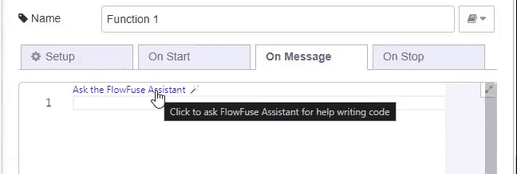
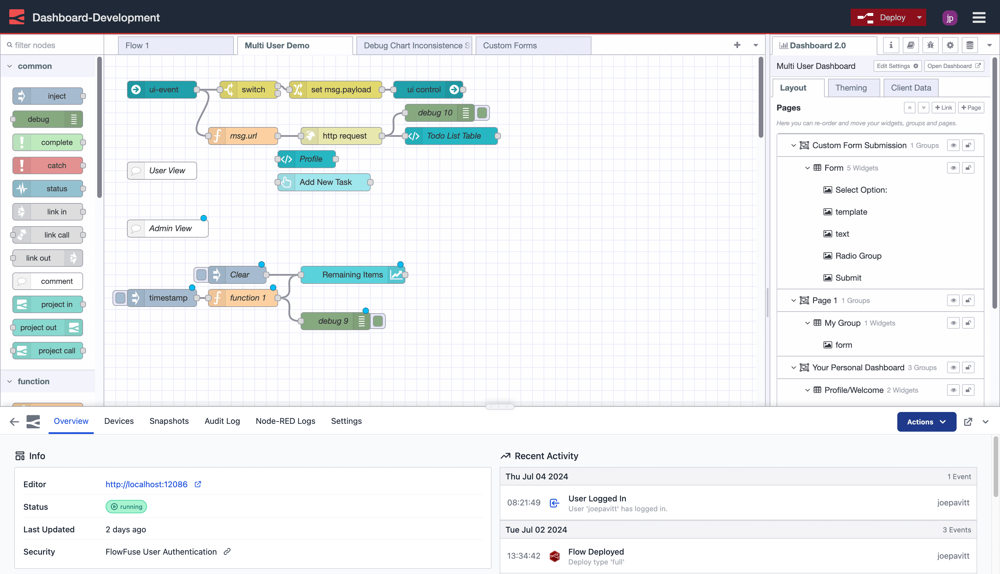
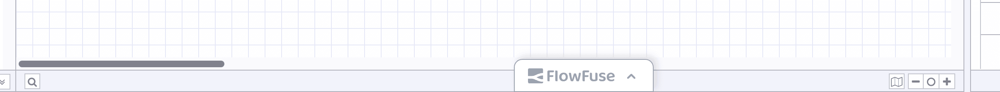

FlowFuse 2.6 is packed with great new features, and in this release we've had a heavy focus on improving the development experience of Node-RED, lowering the barrier to entry for new users and aligning to our [Simplified Hosting](https://flowfuse.com/handbook/engineering/product/strategy/#simplified-hosting) and [Low-Code](https://flowfuse.com/handbook/engineering/product/strategy/#low-code) plans from our [Product Strategy](https://flowfuse.com/handbook/engineering/product/strategy/).

<!--more-->

## Improving the Node-RED Experience

Whilst a big part of FlowFuse is the ability to run Node-RED, we're also focussing on how to improve the experience of _building_ with Node-RED on FlowFuse too.

### AI-Infused Node-RED

{data-zoomable}
_Screenshot of an example instruction sent to FlowFuse Expert._

One of the joys of Node-RED is how it empowers users not experienced with development to create bespoke applications. A popular and very powerful node in Node-RED is the "function" node. This node allows users to write JavaScript code to manipulate messages. However, this can be daunting for users who are not familiar with JavaScript, it's a steep learning curve. As such, when you run Node-RED in FlowFuse, you'll be able to use the **Node-RED Assistant** in both the Editor toolbar, and the function nodes:

{data-zoomable}
_Screenshot showing the "FlowFuse Expert" button available in the Editor Toolbar_

{data-zoomable}
_Screenshot showing the "Ask the FlowFuse Expert" button available in the function node_

The Node-RED Assistant is an AI-powered tool that can help you write JavaScript code in the function node. It can suggest code snippets, help you debug your code, and even write code for you. This is a game-changer for users who are inexperienced with JavaScript, as it lowers the barrier to entry and makes it easier to create applications.

### Immersive Editor Experience

During our investigation on how FlowFuse and Node-RED are used together, we found out that many users have to frequently switch between the Node-RED Editor and FlowFuse UI. This back-and-forth movement was often necessary to view logs, save snapshots, restart the Editor after updates, and perform other tasks.

We're always seeking to reduce friction in the FlowFuse user experience, and as such, we've introduced a large overhaul of the developer experience for Node-RED when running in FlowFuse, in what we're calling the "Immersive Editor".

{data-zoomable}
_Screenshot showing the "Immersive Editor" view, where the FlowFuse navigation is available as a floating bar._

Now, the instances tabs are all available in the _same_ view as the Editor.

{data-zoomable}
_Screenshot showing the "FlowFuse" button at the bottom of the Node-RED Editor._

Don't worry though, if you want the full editor experience again, you can just collapse the FlowFuse menus down to a little "FlowFuse" button at the bottom.

The new Immersive Editor is available for instances running Node-RED 4.0.2 or later - older versions of Node-RED will still use the separate views.

## Persistent File Storage

Since the early days of FlowFuse, we have provided custom File nodes that can be used to read and write individual files from a flow. This was necessary because the local file system was not considered persistent; restarting an instance would reset the file system back to how it was when the instance first started. 

Whilst this solved the immediate problem for the File nodes, we know there were 3rd party nodes that would want to use the file system as well - and we couldn't expect them to update to work with our custom solution.

With the 2.6 release, each instance now gets a piece of persistent file system they can read and write to normally, from any node - with full confidence those files will be persisted between restarts.

This unlocks lots of new capabilities using nodes from the community. For example, the [SQLite](https://flows.nodered.org/node/node-red-node-sqlite) nodes can be used to quickly add a locally managed database to store your data in.

All newly created instances of FlowFuse Cloud from today will have this storage enabled. If you have an existing instance you'd like to move over, then do get [in touch](https://flowfuse.com/contact-us/) and we can help move you over.

## Other Highlights

### Compact Applications View

This is a great example of collaboration with our customers. Three weeks ago, a customer reached out to us with a design proposal for the main "Applications" view. Within three weeks it's not only been implemented, but is now live, running in FlowFuse Cloud, and available in FlowFuse 2.6.

{data-zoomable}
_Screenshot of new "Applications" view for a given Team in FlowFuse._

The improvement here is that we've moved instances and devices to be shown as a maximum of three per row (rather than the one perviously) meaning you can see far more content at a glance, and hopefully, get to where you need to go in fewer clicks.

### Import/Export Blueprints

{data-zoomable}
_Screenshot showing the admin page for "Flow Blueprints" with the new "Import"/"Export" buttons_

Administrators of FlowFuse instances can now import and export Blueprints. This is the first stage of a larger feature set for Blueprints that will make it easier to share common flows and patterns across FlowFuse instances, and see many extensions to our [Blueprint Library](https://flowfuse.com/blueprints/).

### Multi-line Environment Variables

{data-zoomable}
_Screenshot showing the "Environment Variables" table in an Instance's Settings_

We now support the use of multi-line environment variables for your Node-RED instances running on FlowFuse. This unlocks the ability to store certs or multi-line values like JSON as environment variables.

We've also improved the `.env` importing to support the use of multi-line values too.

### And Much More...

For a full list of everything that went into our 2.6 release, you can check out the [release notes](https://github.com/FlowFuse/flowfuse/releases/tag/v2.6.0).

We're always working to enhance your experience with FlowFuse. We're always interested in your thoughts about FlowFuse too. Your feedback is crucial to us, and we'd love to hear about your experiences with the new features and improvements. Please share your thoughts, suggestions, or report any [issues on GitHub](https://github.com/FlowFuse/flowfuse/issues/new/choose). 

Together, we can make FlowFuse better with each release!

## Try it out

### Self-Hosted

We're confident you can have self managed FlowFuse running locally in under 30 minutes. You can install FlowFuse yourself via a variety of install options. You can find out more details [here](/docs/install/introduction/).

### FlowFuse Cloud

The quickest and easiest way to get started with FlowFuse is on our own hosted instance, FlowFuse Cloud: [Get started for free]({{ site.onboardingURL }}) now, and you'll have your own Node-RED instances running in the Cloud within minutes.

## Upgrading FlowFuse

If you're using [FlowFuse Cloud]({{ site.appURL }}), then there is nothing you need to do - it's already running 2.6, and you may have already been playing with the new features.

If you installed a previous version of FlowFuse and want to upgrade, our documentation provides a
guide for [upgrading your FlowFuse instance](/docs/upgrade/).

## Getting help

Please check FlowFuse's [documentation](/docs/) as the answers to many questions are covered there. Additionally you can go to the [community forum](https://discourse.nodered.org/c/vendors/flowfuse/24) if you have
any feedback or feature requests.
