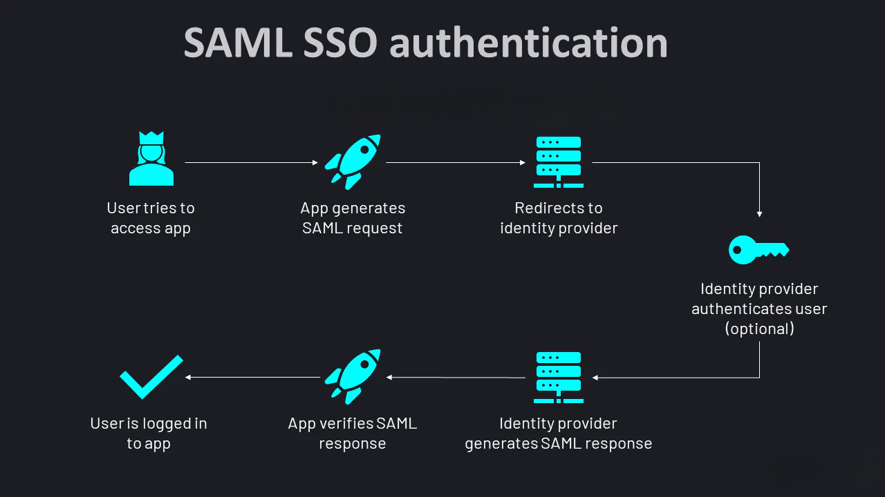

SSO plays a crucial role in modern enterprise environments by simplifying user authentication across multiple applications. At FlowFuse, we recognize the significance of SSO and offer robust support for integrating it with your self-hosted platform. In this comprehensive guide, we will focus on configuring SSO SAML specifically using Google as the Identity Provider (IdP). We also support SSO with LDAP. For more information, refer to [Setting up LDAP SSO for your Self-Hosted FlowFuse](/docs/admin/sso/ldap/).

<!--more-->

## What is SSO?

Single Sign-On (SSO) is a technology that allows users to access multiple applications or services with one set of login credentials. When a user logs in to one central system, known as the Identity Provider (IdP) such as Google, Microsoft Azure AD, or Okta, it authenticates the user and creates a session token. This token is then used to access other connected applications without requiring the user to log in again. The IdP verifies the token and shares the authentication information with other applications, ensuring secure and seamless access across multiple platforms. This reduces the need to remember multiple passwords and enhances security by centralizing authentication.

## Understanding SAML

SAML (Security Assertion Markup Language) is a protocol used in SSO scenarios to exchange authentication and authorization data between an Identity Provider (IdP) and a Service Provider (SP). Here’s how it works step-by-step:

{data-zoomable}

1. **User Request**: A user attempts to access a service or application that is protected by SAML-based SSO.
   
2. **Redirect to IdP**: The Service Provider (SP), recognizing that the user needs authentication, redirects them to the Identity Provider (IdP).

3. **User Authentication**: The IdP prompts the user to authenticate themselves. This authentication can involve various methods, such as username/password, multi-factor authentication (MFA), or other authentication mechanisms supported by the IdP.

4. **Generating SAML Assertion**: Upon successful authentication, the IdP generates a SAML assertion. This assertion contains information about the user's identity (like username, email) and any attributes or roles associated with the user.

5. **Sending SAML Assertion**: The IdP sends this SAML assertion back to the Service Provider (SP), typically through the user's browser. The assertion is digitally signed by the IdP to ensure its authenticity and integrity.

6. **Assertion Validation**: The Service Provider (SP) receives the SAML assertion. It validates the assertion to ensure it comes from a trusted IdP and that the assertions' contents are accurate and have not been tampered with.

7. **Granting Access**: If the assertion is valid, the SP grants access to the user based on the information in the SAML assertion. This allows the user to access the protected application or service without needing to provide separate credentials to the SP.

## Benefits of Using SSO in the Workspace

1. **Improved User Experience**: Users only need to remember one set of credentials, making the login process simpler and reducing password fatigue. For instance, In a manufacturing environment, employees often need to access multiple systems, such as Node-RED, ERP systems, and quality control applications. With SSO, they only need to remember one set of credentials, simplifying the login process and reducing password fatigue.

2. **Simplified Management**: Administrators can manage user access and permissions from a single platform, making it easier to onboard new employees and revoke access when someone leaves. This centralized management ensures that only authorized personnel can access the application flows.

3. **Increased Security**: Centralized authentication via SSO reduces the risk of weak or reused passwords, allowing for the implementation of stronger security policies. This is critical in a workspace where sensitive data and operational systems must be protected against unauthorized access.

4. **Enhanced Productivity**: SSO allows employees to log in once and gain access to all necessary applications, saving time and reducing interruptions.

## Setting up SSO For Your Self-Hosted FlowFuse Platform

Before proceeding, ensure you have deployed FlowFuse on your server with an Enterprise license and configured it with email. Without email configuration, the SSO setup option won't appear in your FlowFuse.Furthermore, Make sure you have a [Google Workspace account created](https://www.youtube.com/watch?v=Rc7BT7PDqFs) and [verified your domain](https://www.youtube.com/watch?v=JIOaLKsz2R0) within Google Workspace. FlowFuse supports other providers for SAML SSO as well; check our [documentation on supported providers](/docs/admin/sso/saml/#providers) for details.

If you haven't deployed FlowFuse yet, refer to our [documentation on installing FlowFuse](/docs/install/introduction/) or our blog on [deploying FlowFuse on Ubuntu with Docker](/blog/2024/07/deploying-flowfuse-with-docker/).

### Configuring SSO in your Self-Hosted FlowFuse

1. To configure FlowFuse with SSO, make sure you are logged in as an administrator.
2. Go to Admin settings by clicking on the profile icon in the top-right corner and then selecting "Admin settings".
3. Click on "Settings" from the left sidebar and switch to the SSO section.
4. Click on the top-right "Create SSO configuration".
5. In the next tab, you'll find the ACS URL and Entity ID. Copy and save them.
6. Tick "Manage roles using group assertions" if needed. If enabled, keep the Group Assertion Name to its default value and select the team scope:
   - "Apply to selected teams" restricts management to the provided list, suitable for shared-tenancy platforms like FlowFuse Cloud.
   - "Apply to all teams" allows SAML groups to manage all teams, suitable for a self-hosted installation with a single SSO configuration.
7. Click on "Update configuration".

### Creating the SAML APP in Google Workspace.

1. Open the main menu from the top-right corner by clicking on menu icon.
2. Click onto the "Apps" option, and then the additional otion open click on to the "Web and mobile apps"
3. Then the new tab opens, click on to the "Add app" from the top.
4. The options open select the "Add custom SAML apps"
5. Enter the app name description and upload the icon of the app.
6. Now copy your Copy the SSO URL, entity ID and certificate or you can simply download it in the one file by clicking on the Download metadata button.
7. Click onto the continue.
8. In the next tab, enter the ACS URL and entity id provided by your self hosted flowfuse platform.
9. Enter the start URL as `forge.<your-domain>.com`, we are specify that after successfull sign in the user should be redirected to this url.
10. Next, click onto "Continue" button.

### Updating the FlowFuse SSO configuration and enabling it

Now that we have created the SAML app in the workspace, to enable SSO we need to update the FlowFuse configuration and connect it to the app created in the workspace.

1. Go to the SSO section of the admin settings in your self-hosted FlowFuse platform. Click on the three dots icon located at the right corner of the added configuration and select "Edit".
2. Add the copied values for the fields: Identity Provider Single Sign-On URL, Identity Provider Issuer ID / URL, and X.509 Certificate Public Key provided by the provider. I instructed you in the above section to copy or download them.
3. Click on the "Active" option to enable the SSO.
4. Click on "Update configuration".

### Signing in Using SSO

To sign in using SSO, users of your self-hosted FlowFuse must have a FlowFuse account created with an email ID associated with the domain configured with SSO. For more information, refer to [creating users in FlowFuse](/docs/admin/user_management/#creating-new-users). Additionally, the user must already be logged in with that email in Google.

1. Enter email address on the username/email feild.
2. Click on "Login".
3. A Google tab will open, displaying the email addresses you are signed in with. Select the email address you entered to into the username/email feild.

## Conclusion

In this guide, we've covered setting up SSO SAML for your self-hosted FlowFuse platform, exploring how SSO and SAML enhance user experience, improve security, and simplify management. You've learned to create an SSO configuration in FlowFuse, set up a SAML app in Google Workspace, and enable seamless authentication.
