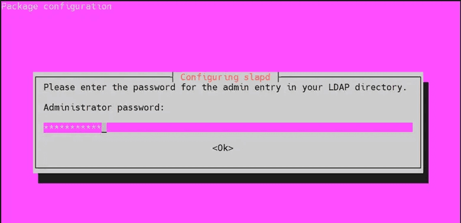
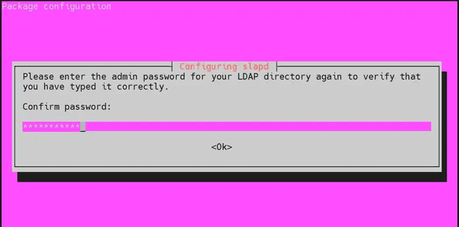
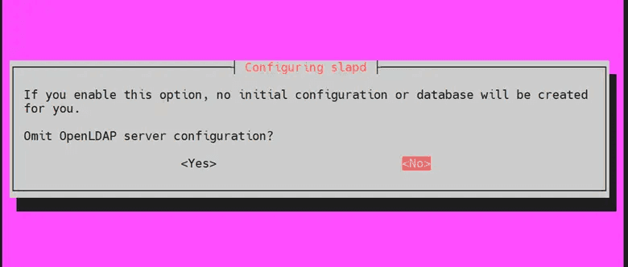
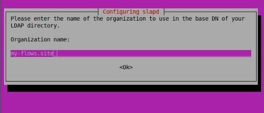
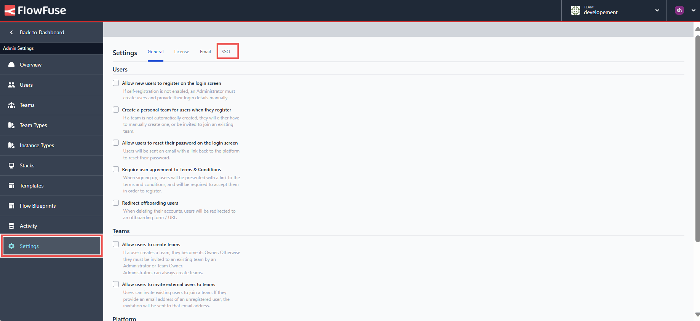
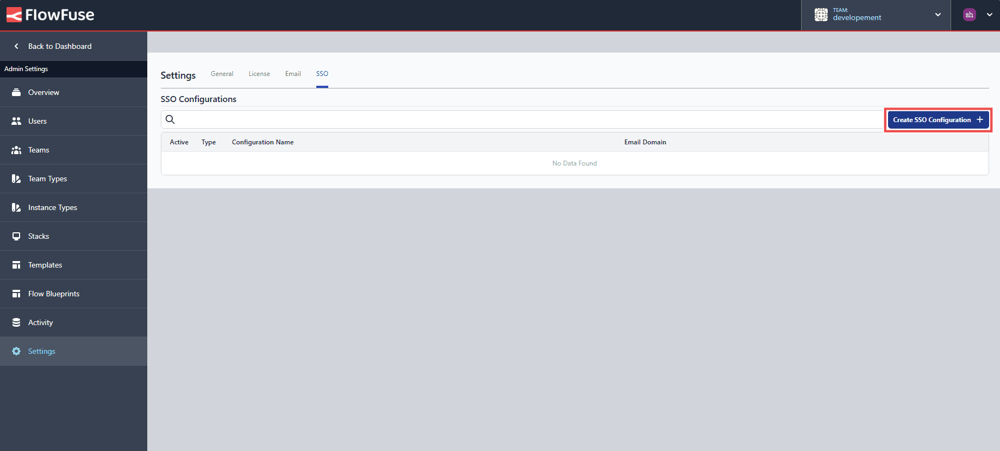

A few days ago, we published a [blog](/blog/2024/07/how-to-setup-sso-saml-for-the-node-red/) explaining SSO and how to set up SAML for your self-hosted FlowFuse. Now, in this guide, we will walk you through the process of setting up SSO with LDAP for your self-hosted FlowFuse. We will use OpenLDAP as the provider and cover everything from introducing LDAP, how it works, installing and configuring OpenLDAP, managing users (create, delete, update), and finally setting up FlowFuse for SSO with LDAP.

<!--more-->

## Understanding LDAP SSO?

### What is LDAP

LDAP (Lightweight Directory Access Protocol) is a protocol used to access and manage directory information. In the context of network administration, a directory service acts as a specialized database that stores and organizes information about users, devices, and other resources. Think of it as a digital phonebook for your network, allowing centralized management and efficient access to information.

LDAP enables applications and services to query, add, update, and delete directory entries stored on LDAP servers. It simplifies identity management by enabling easy authentication, authorization, and quick access to information across distributed systems.

### How LDAP SSO works

1. **User Authentication Request:** A user attempts to access a service or application that requires authentication.
   
2. **SSO Initiation:** The application forwards the authentication request to the Identity Provider (IdP) configured with LDAP, such as OpenLDAP.
   
3. **LDAP Authentication:** The IdP (LDAP server) verifies the user's credentials against its directory.
   
4. **Authentication Response:** If the credentials are valid, the LDAP server sends an authentication response (usually a token or assertion) back to the application.
   
5. **Access Granted:** The application grants access to the user based on the authentication response received from the LDAP server.

## Setting up SSO LDAP for FlowFuse

Before we proceed, ensure that FlowFuse is deployed on your server with an Enterprise license and you have ssh connection with it so that you can run commands on the server. If you haven't installed it yet, please check out our [documentation on installing FlowFuse](/docs/install/introduction/) or our blog on [deploying FlowFuse on Ubuntu with Docker](/blog/2024/07/deploying-flowfuse-with-docker/).

### Installing and Configuring OpenLDAP

Throughout this section, we will install and configure OpenLDAP on your Ubuntu server. Make sure to replace the commands and configs with your details. If you are using a different distribution, you can follow other resources available on the internet for installation and configuration, as well as managing of users.

1. Set the hostname for your LDAP server:

   ```bash
   hostnamectl set-hostname ldap.<your-domain>.com
   ```

2. Add the server IP to `/etc/hosts`:

   ```bash
   echo '<your_server_ip> ldap.<your-domain>.com' >> /etc/hosts
   ```

3. Install OpenLDAP and related utilities:

   ```bash
   apt install slapd ldap-utils
   ```

4. Set an administrator password for LDAP during installation and confirm it in the next prompt.





5. Reconfigure the slapd package:

   ```bash
   dpkg-reconfigure slapd
   ``` 

6. When asked to omit server configuration, select ‘NO’



7. Configure the base DN (Distinguished Name) for your LDAP directory:

   - Use your domain name to construct the base DN. For example, if your domain is `my-flows.site`, the base DN would be `dc=my-flows,dc=site` and press 'ENTER' to confirm.


   - Provide a name for your organization, which will also be part of the base DN and press 'Enter.'



9. Enter the Administrator password for your LDAP directory.


10. Confirm the password.


11. When asked to remove the database when slapd is purged, select ‘NO’.


12. Select ‘Yes’ to remove the old database to create room for a new database.


13. Edit the main OpenLDAP configuration file:

   ```bash
   sudo nano /etc/ldap/ldap.conf
   ```

14. Uncomment the lines beginning with “BASE” and “URI”, for example, my domain is `my-flows.site`, we have updated the file as below, but you have to update it according to your domain:

```
BASE `dc=my-flows,dc=site.`
URI `ldap://ldap.my-flows.site.`
```

### Adding, Updating, and Deleting Groups and Users

#### Adding Groups and Users

1. Create a file for the base groups and open the editor:

   ```bash
   nano groups.ldif
   ```

2. Add the following content to `groups.ldif`, which will create the `users` group, make sure when you create a new group the gidNumber and ou is unique:

   ```
   dn: ou=users,dc=my-flows,dc=site
   objectClass: organizationalUnit
   ou: users
   gidNumber: 7000
   ```

3. Add the groups to the LDAP directory:

   ```bash
   ldapadd -x -D cn=admin,dc=my-flows,dc=site -W -f groups.ldif
   ```

4. Create  a password for the user and store the encrypted password:

```bash
Slappasswd -g
```

4. Create a file for the user:

   ```bash
   nano user.ldif
   ```

5. Add the following content to user.ldif. Replace the placeholders with actual values for `uid`, `sn`, `givenName`,`displayName`,`cn` ,`gecos` , `homeDirectory`, and set userPassword to the password generated earlier. Ensure each user has a unique `uidNumber`, and you can keep the gidNumber the same if users belong to the same primary group

   ```
   dn: uid=sumit,ou=users,dc=my-flows,dc=site
   objectClass: inetOrgPerson
   objectClass: posixAccount
   objectClass: shadowAccount
   uid: sumit
   sn: shinde
   givenName: sumit
   cn: sumit shinde
   displayName: sumit shinde
   uidNumber: 1000
   gidNumber: 7000
   userPassword: {SSHA}uQVjd8MLaJ7AXEd/grqViuKnk9tNojdy
   gecos: sumit shinde
   loginShell: /bin/bash
   homeDirectory: /home/sumit
   ```

6. Save and exit the configuration file.

7. Add the user to the LDAP directory:

   ```bash 
   ldapadd -x -D cn=admin,dc=my-flows,dc=site -W -f user.ldif
   ```

#### Updating Groups and Users

1. Create a file for the user update:

   ```bash
   nano user_update.ldif
   ```

2. Add the following content to `user_update.ldif` to update the user's details (e.g., changing the display name):

   ```
   dn: uid=sumit,ou=users,dc=my-flows,dc=site
   changetype: modify
   replace: displayName
   displayName: Sumit Rupesh Shinde
   ```

3. Save and exit the configuration file.

4. Apply the update to the LDAP directory:

   ```bash
   ldapmodify -x -D cn=admin,dc=my-flows,dc=site -W -f user_update.ldif
   ```

5. Create a file for the group update:

   ```bash
   nano group_update.ldif
   ```

6. Add the following content to `group_update.ldif` to update the group's details (e.g., changing the organizational unit name):

   ```
   dn: ou=users,dc=my-flows,dc=site
   changetype: modify
   replace: ou
   ou: staff
   ```

7. Save and exit the configuration file.

8. Apply the update to the LDAP directory:

   ```bash
   ldapmodify -x -D cn=admin,dc=my-flows,dc=site -W -f group_update.ldif
   ```

#### Deleting Groups and Users

1. Delete a user from the LDAP directory:

   ```bash
   ldapdelete -x -D cn=admin,dc=my-flows,dc=site -W "uid=sumit,ou=users,dc=my-flows,dc=site"
   ```

2. Delete a group from the LDAP directory:

   ```bash
   ldapdelete -x -D cn=admin,dc=my-flows,dc=site -W "ou=users,dc=my-flows,dc=site"
   ```
### Configuring and Enabling SSO in FlowFuse

1. To configure FlowFuse with SSO, make sure you are logged in as an administrator.
2. Go to Admin settings by clicking on the profile icon in the top-right corner and then selecting "Admin settings".


3. Click on "Settings" from the left sidebar and switch to the SSO section.



4. Click on the top-right "Create SSO configuration".



5. Enter the name for your configuration, then enter the domain with `@` prefix and select the "LDAP" option. Click on the "Create configuration" button.


6. In the next form, in the server field enter `your-server-ip:389`. 389 is the default port for LDAP but make sure to check it. If you are going to enable TLS, replace the port with 636.


7. Enter the the bind DN into the username field.
8. Enter the password for the LDAP administrator in the password field.
9. Enter the Base DN. For example, if your domain is `my-flows.site`, the Base DN will be `dc=my-flows,dc=site`.
10. Click on the "Update configuration" button.

### Signing in Using SSO

To sign in using SSO, users of your self-hosted FlowFuse must have a FlowFuse account created with an email ID associated with the domain configured with SSO. For more information, refer to [creating users in FlowFuse](/docs/admin/user_management/#creating-new-users).

1. Open your platform in the browser. Enter the username in the username/email field.
2. Click on "Login".
3. Then enter the password set in the LDAP directory for that user.

*Note: Admin users will still be able to log in with their original FlowFuse username/password - this ensures they don't get locked out of the platform if there is a problem with the SSO configuration*

## Conclusion

In this guide, we covered how to set up SSO with LDAP for your self-hosted FlowFuse platform using OpenLDAP. We installed and configured OpenLDAP, learned to managed groups and users, and configured SSO within FlowFuse. This setup enhances security by centralizing user authentication and simplifies access across applications, ensuring efficient user management in your FlowFuse deployment.

Got questions or need help setting up SSO LDAP for FlowFuse (Node-RED)? [Get in touch](/contact-us/?utm_campaign=60718323-BCTA&utm_source=blog&utm_medium=cta%20contact%20us&utm_term=high_intent&utm_content=How%20to%20Set%20Up%20SSO%20LDAP%20for%20Node-RED) with us!