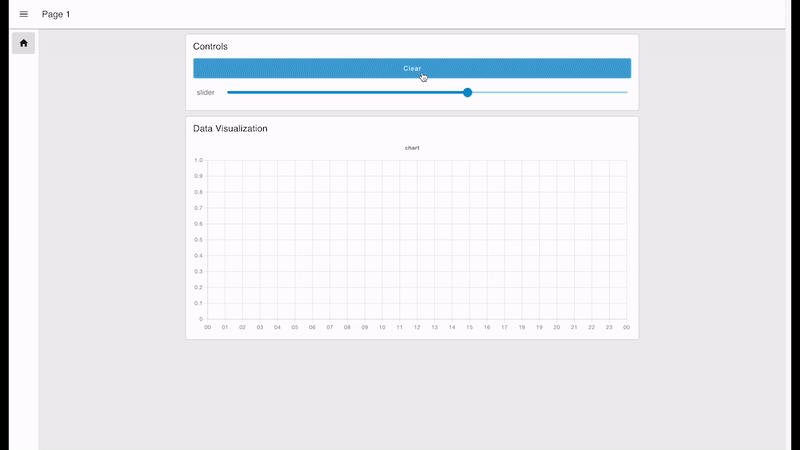
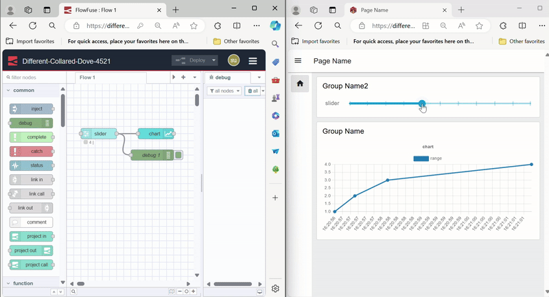
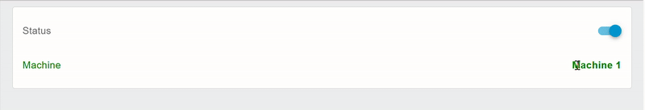
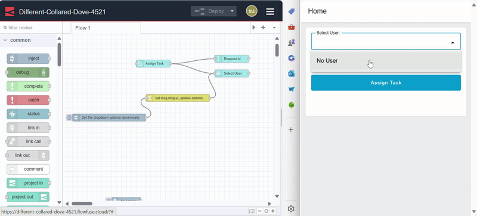
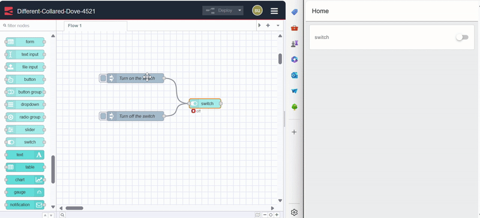
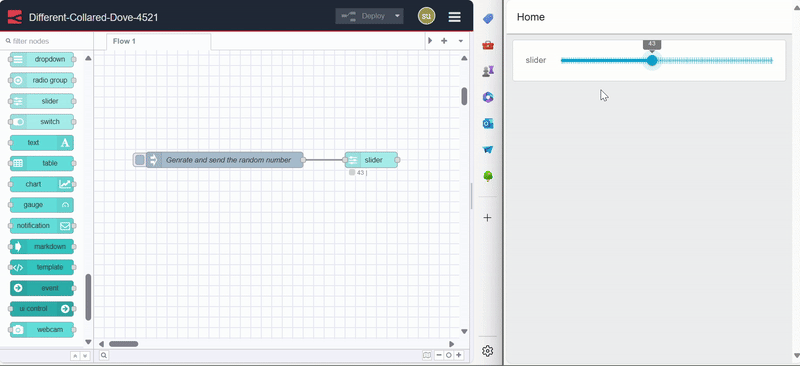
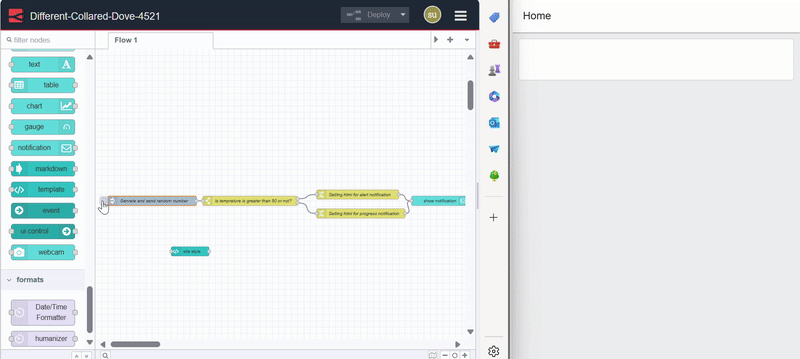

Creating interactive and dynamic user interfaces became crucial with the introduction of JavaScript in browsers, which sparked the rise of dynamic websites and transformed the internet. However, when it comes to Node-RED dashboard solutions, many users encounter challenges in achieving dynamic functionality. These difficulties often arise from the limitations of Node-RED dashboard solutions or the technical expertise required to implement complex interactions.

<!--more-->

In this guide, I will explain what is meant by a dynamic website and its defining aspects, demonstrate how Node-RED Dashboard 2.0 fits into those aspects, and discuss how we can update Dashboard 2.0 UI dynamically.

## What Does a Dynamic Dashboard Mean?

A dynamic dashboard refers to a user interface that adapts and responds to changing data and user interactions in real-time. Unlike static dashboards, which display fixed data and require manual updates, dynamic dashboards provide up-to-date information and interactive experiences automatically.

Key aspects of a dynamic UI include:

1. **Real-time Interaction**: The UI must respond instantly to user actions (e.g., clicks, hovers) and provide immediate feedback.

2. **Asynchronous Data Handling**: The dashboard should be capable of fetching and updating data asynchronously (e.g., using AJAX or WebSockets) without requiring a full page refresh.

3. **Responsive Design**: The interface should adapt to various screen sizes and orientations, maintaining usability and appearance across devices.

4. **Dynamic Content Updates**: Content should update automatically to reflect the latest information or user interactions (e.g., live notifications, chat messages).

## Does Node-RED Dashboard 2.0 Support Dynamic UI?

In this section, we will evaluate Node-RED Dashboard 2.0 against key criteria for dynamic user interfaces. We’ll explore how it performs in real-time interactions, asynchronous data handling, responsive design, and dynamic content updates. By examining these aspects, you’ll gain a clear understanding of how Node-RED Dashboard 2.0 not only meets but excels in providing powerful, dynamic experiences for your projects.

### Does Node-RED Dashboard 2.0 Respond and Update in Real-Time?

Node-RED Dashboard 2.0 brings dynamic UI updates to life with Vue.js and WebSocket technology. Vue.js helps create responsive user interfaces that update in real-time, so you don't need to refresh the page. Furthermore, WebSockets enable live data updates to be displayed instantly on the dashboard. This combination ensures a smooth, real-time experience for users.

In the following image of the dashboard build with Node-RED Dashboard 2.0, you can see how the interface responds in real-time to user actions:

{data-zoomable}

Also, in the following image, observe the real-time communication between the dashboard (client-side) and the Node-RED instance (server-side). As you adjust the slider on the dashboard, the corresponding input data is simultaneously displayed on the debug panel of the Node-RED instance.

{data-zoomable}

As you explore Node-RED Dashboard 2.0, you'll find that real-time updates and interactions are present across all widgets and components, meeting the first two criteria of a dynamic UI: real-time interaction and asynchronous data handling.

### Is Node-RED Dashboard 2.0 Responsive?

Node-RED Dashboard 2.0 has been crafted with responsiveness and customization as core features, ensuring that your dashboards seamlessly adapt to any screen size. We are continuously working to enhance these capabilities to provide an even better user experience.

{data-zoomable}

- **Flexible Layouts**: You can control the layout of your dashboard by adjusting the width of groups and the layout style (e.g., grid, notebook), allowing for finer control over how widgets are displayed.
- **Adaptive Widgets and Groups**: Widgets and groups within the dashboard can be configured to resize and rearrange automatically based on the available screen space.
- **Sidebar and Header**: The sidebar and navigation bar can be customized with different options to improve user experience across all screen sizes.

These features ensure your dashboard remains user-friendly and accessible across various devices. For more information on Dashboard 2.0’s layout, sidebar options, and styling, refer to our [Comprehensive Guide: Node-RED Dashboard 2.0 Layout, Sidebar, and Styling](https://flowfuse.com/blog/2024/05/node-red-dashboard-2-layout-navigation-styling/).

### Does Node-RED Dashboard 2.0 Provide the Ability to Dynamically Update Content?

Node-RED Dashboard 2.0 indeed provides robust capabilities for dynamically updating the UI, primarily through the use of the msg object to send updates.

In this section, we will explore how Node-RED Dashboard 2.0 manages dynamic UI updates. We will provide a high-level overview of how to update the styles of Dashboard 2.0 components and widgets.

#### Updating Node-RED Dashboard 2.0 Styles Dynamically

Dynamic style updates in Node-RED Dashboard 2.0 provide a robust way to customize the appearance of components based on conditions or data. Most widgets support dynamic class assignments via the `msg.class` property, although this does not apply to `ui_control` and `ui_event` widgets, as they do not directly render UI elements.

For instance, to visually indicate the status of machine names in text widgets—using red for "down" and green for "up" or "running"—you can use custom CSS within a `ui_template` widget. For details on adding custom CSS, refer to [Adding Custom Styling in `ui-template`](https://dashboard.flowfuse.com/user/template-examples.html#custom-styling). Here’s an example of the CSS you might use:

```CSS
.stop {
   color: red;
}

.running {
   color: green;
}
```

You would then send a msg that sets the `msg.class` to either `"stop"` or `"running"`, depending on the machine's status. This message updates the text widget's appearance according to the machine's status.

{data-zoomable}

#### Updating Node-RED Dashboard 2.0 Widget Elements Dynamically

Dynamic updates in Node-RED Dashboard 2.0 allow for flexible changes to widget elements. Each widget supports diffrent `msg` properties to facilitate these updates.

##### Updating Node-RED Dashboard 2.0 Forms Dynamically

To dynamically update elements within a `ui-form` widget, utilize the `msg.ui_update.options` property. You can add or modify input elements in the form by sending an array of objects in the following format:

```json
[
{
    "type": "text",
    "label": "Name",
    "key": "name",
    "required": true
}
]
```

For instance, consider a product feedback form that adjusts based on the selected feedback type (e.g., "Quality" or "Delivery"). You can use a dropdown menu to select the feedback type and then dynamically update the `ui-form` widget to reflect the relevant fields for the chosen type. This approach allows for a customizable and responsive form experience based on user interactions.

{data-zoomable}


[{"id":"d2dfcfdbbb67fbaf","type":"ui-form","z":"a9e5683585deb91e","name":"","group":"bbd788a3450c1e88","label":"","order":2,"width":0,"height":0,"options":[{"label":"Product Quality Rating","key":"quality_rating","type":"text","required":true,"rows":null},{"label":"Product Quality Comments","key":"quality_comment","type":"text","required":true,"rows":null}],"formValue":{"quality_rating":"","quality_comment":""},"payload":"","submit":"submit","cancel":"clear","resetOnSubmit":true,"topic":"topic","topicType":"msg","splitLayout":"","className":"","x":1090,"y":380,"wires":[[]]},{"id":"e6f264759c5089b4","type":"ui-dropdown","z":"a9e5683585deb91e","group":"bbd788a3450c1e88","name":"Select Feedback type","label":"Select Option:","tooltip":"","order":1,"width":0,"height":0,"passthru":false,"multiple":false,"chips":false,"clearable":false,"options":[{"label":"Quality","value":"quality","type":"str"},{"label":"Delivery","value":"delivery","type":"str"}],"payload":"","topic":"topic","topicType":"msg","className":"","x":220,"y":380,"wires":[["fdba90bc876a79c6"]]},{"id":"fdba90bc876a79c6","type":"switch","z":"a9e5683585deb91e","name":"Is the type is delivery or quality?","property":"payload","propertyType":"msg","rules":[{"t":"eq","v":"delivery","vt":"str"},{"t":"eq","v":"quality","vt":"str"}],"checkall":"true","repair":false,"outputs":2,"x":490,"y":380,"wires":[["25b34e213e1d4c4c"],["3737eafb78116bbb"]]},{"id":"25b34e213e1d4c4c","type":"change","z":"a9e5683585deb91e","name":"Set the form elements dynamically","rules":[{"t":"set","p":"ui_update.options","pt":"msg","to":"[{\"type\":\"text\",\"label\":\"Shown Date\",\"key\":\"shown_date\",\"required\":true},{\"type\":\"text\",\"label\":\"Delivered Date\",\"key\":\"delivered_date\",\"required\":true},{\"type\":\"multiline\",\"label\":\"Comments\",\"key\":\"delivery_comments\",\"required\":false,\"rows\":4},{\"type\":\"number\",\"label\":\"Rating (1-5)\",\"key\":\"delivery_rating\",\"required\":true}]","tot":"json"}],"action":"","property":"","from":"","to":"","reg":false,"x":820,"y":340,"wires":[["d2dfcfdbbb67fbaf"]]},{"id":"3737eafb78116bbb","type":"change","z":"a9e5683585deb91e","name":"Set the form elements dynamically","rules":[{"t":"set","p":"ui_update.options","pt":"msg","to":"[     {         \"type\": \"text\",         \"label\": \"Product Quality Rating\",         \"key\": \"quality_rating\",         \"required\": true     },     {         \"type\": \"multiline\",         \"label\": \"Quality Comments\",         \"key\": \"quality_comments\",         \"required\": false,         \"rows\": 4     } ]","tot":"json"}],"action":"","property":"","from":"","to":"","reg":false,"x":820,"y":400,"wires":[["d2dfcfdbbb67fbaf"]]},{"id":"bbd788a3450c1e88","type":"ui-group","name":"Machine","page":"fe45c5f81cfd992a","width":"6","height":"1","order":1,"showTitle":false,"className":"","visible":"true","disabled":"false"},{"id":"fe45c5f81cfd992a","type":"ui-page","name":"Home","ui":"e3bee830779d0e63","path":"/page1","icon":"home","layout":"notebook","theme":"e3e81e50a184eb0d","order":1,"className":"","visible":"true","disabled":"false"},{"id":"e3bee830779d0e63","type":"ui-base","name":"Dashboard","path":"/dashboard","includeClientData":true,"acceptsClientConfig":["ui-notification","ui-control"],"showPathInSidebar":false,"showPageTitle":true,"navigationStyle":"icon","titleBarStyle":"default"},{"id":"e3e81e50a184eb0d","type":"ui-theme","name":"Default Theme","colors":{"surface":"#ffffff","primary":"#0094ce","bgPage":"#eeeeee","groupBg":"#ffffff","groupOutline":"#cccccc"},"sizes":{"pagePadding":"12px","groupGap":"12px","groupBorderRadius":"4px","widgetGap":"12px"}}]


##### Updating Node-RED Dashboard 2.0 Dropdown, Radio, and Button Groups Dynamically

To dynamically update dropdowns, radio buttons, and button groups in Node-RED Dashboard 2.0, use the `msg.ui_update.options` property. The value should be an array of objects, each containing `label` and `value` fields. Here's an example:

```json
[
    {
        "label": "Bob Walker",
        "value": "bobwalker123"
    },
    {
        "label": "Alice Smith",
        "value": "alicesmith456"
    },
    {
        "label": "John Doe",
        "value": "johndoe789"
    },
    {
        "label": "Jane Doe",
        "value": "janedoe101"
    },
    {
        "label": "Charlie Brown",
        "value": "charliebrown202"
    }
]
```

{data-zoomable}

For instance, if you need to dynamically populate a dropdown menu with a list of users for task assignment, you can set the options to reflect the current user list.

In a similar manner, you can update radio and button groups dynamically. But when updating button groups, you have additional options to define such as labels, icons, and colors (if the "use theme color" option is disabled in the ui-button-group widget) using the following format:

```json
[
    {
        "label": "Start",
        "value": "start",
        "icon": "mdi-play-circle",
        "color": "green"
    },
    {
        "label": "Pause",
        "value": "pause",
        "icon": "mdi-pause-circle",
        "color": "yellow"
    },
    {
        "label": "Stop",
        "value": "stop",
        "icon": "mdi-stop-circle",
        "color": "red"
    },
    {
        "label": "Restart",
        "value": "restart",
        "icon": "mdi-replay",
        "color": "blue"
    },
    {
        "label": "Settings",
        "value": "settings",
        "icon": "mdi-cog",
        "color": "grey"
    }
]
```


[{"id":"31122c7f8d69555e","type":"group","z":"a9e5683585deb91e","style":{"stroke":"#b2b3bd","stroke-opacity":"1","fill":"#f2f3fb","fill-opacity":"0.5","label":true,"label-position":"nw","color":"#32333b"},"nodes":["60dc61614ec96d9e","6f9dd23c70052888","9d06781891b4127e","5942830b485f28ba","d890d52434b5f78d"],"x":114,"y":439,"w":812,"h":142},{"id":"60dc61614ec96d9e","type":"ui-button-group","z":"a9e5683585deb91e","g":"31122c7f8d69555e","name":"","group":"bbd788a3450c1e88","order":4,"width":"1","height":1,"label":"","rounded":false,"useThemeColors":false,"passthru":false,"options":[{"label":"button1","icon":"lock","value":"white","valueType":"str","color":"#009933"},{"label":"button2","icon":"lock","value":"red","valueType":"str","color":"#999999"}],"topic":"topic","topicType":"msg","x":830,"y":500,"wires":[[]]},{"id":"6f9dd23c70052888","type":"inject","z":"a9e5683585deb91e","g":"31122c7f8d69555e","name":"","props":[{"p":"payload"},{"p":"topic","vt":"str"}],"repeat":"","crontab":"","once":false,"onceDelay":0.1,"topic":"","payload":"","payloadType":"date","x":220,"y":480,"wires":[["9d06781891b4127e"]]},{"id":"9d06781891b4127e","type":"change","z":"a9e5683585deb91e","g":"31122c7f8d69555e","name":"Setting the button group elements dynamically list 1","rules":[{"t":"set","p":"ui_update.options","pt":"msg","to":"[     {         \"label\": \"Start\",         \"value\": \"start\",         \"icon\": \"mdi-play-circle\",         \"color\": \"green\"     },     {         \"label\": \"Pause\",         \"value\": \"pause\",         \"icon\": \"mdi-pause-circle\",         \"color\": \"yellow\"     },     {         \"label\": \"Stop\",         \"value\": \"stop\",         \"icon\": \"mdi-stop-circle\",         \"color\": \"red\"     },     {         \"label\": \"Restart\",         \"value\": \"restart\",         \"icon\": \"mdi-replay\",         \"color\": \"blue\"     },     {         \"label\": \"Settings\",         \"value\": \"settings\",         \"icon\": \"mdi-cog\",         \"color\": \"grey\"     } ]","tot":"json"}],"action":"","property":"","from":"","to":"","reg":false,"x":510,"y":480,"wires":[["60dc61614ec96d9e"]]},{"id":"5942830b485f28ba","type":"change","z":"a9e5683585deb91e","g":"31122c7f8d69555e","name":"Setting the button group elements dynamically with list 2","rules":[{"t":"set","p":"ui_update.options","pt":"msg","to":"[     {         \"label\": \"Play\",         \"value\": \"play\",         \"icon\": \"mdi-play-circle\",         \"color\": \"green\"     },     {         \"label\": \"Pause\",         \"value\": \"pause\",         \"icon\": \"mdi-pause-circle\",         \"color\": \"orange\"     },     {         \"label\": \"Stop\",         \"value\": \"stop\",         \"icon\": \"mdi-stop-circle\",         \"color\": \"red\"     },     {         \"label\": \"Next\",         \"value\": \"next\",         \"icon\": \"mdi-skip-next\",         \"color\": \"blue\"     },     {         \"label\": \"Previous\",         \"value\": \"previous\",         \"icon\": \"mdi-skip-previous\",         \"color\": \"purple\"     } ]","tot":"json"}],"action":"","property":"","from":"","to":"","reg":false,"x":530,"y":540,"wires":[["60dc61614ec96d9e"]]},{"id":"d890d52434b5f78d","type":"inject","z":"a9e5683585deb91e","g":"31122c7f8d69555e","name":"","props":[{"p":"payload"},{"p":"topic","vt":"str"}],"repeat":"","crontab":"","once":false,"onceDelay":0.1,"topic":"","payload":"","payloadType":"date","x":220,"y":540,"wires":[["5942830b485f28ba"]]},{"id":"bbd788a3450c1e88","type":"ui-group","name":"Machine","page":"fe45c5f81cfd992a","width":"1","height":"1","order":1,"showTitle":false,"className":"","visible":"true","disabled":"false"},{"id":"fe45c5f81cfd992a","type":"ui-page","name":"Home","ui":"e3bee830779d0e63","path":"/page1","icon":"home","layout":"grid","theme":"e3e81e50a184eb0d","order":1,"className":"home","visible":true,"disabled":false},{"id":"e3bee830779d0e63","type":"ui-base","name":"Dashboard","path":"/dashboard","includeClientData":true,"acceptsClientConfig":["ui-notification","ui-control"],"showPathInSidebar":false,"showPageTitle":true,"navigationStyle":"none","titleBarStyle":"default"},{"id":"e3e81e50a184eb0d","type":"ui-theme","name":"Default Theme","colors":{"surface":"#ffffff","primary":"#0094ce","bgPage":"#eeeeee","groupBg":"#ffffff","groupOutline":"#cccccc"},"sizes":{"pagePadding":"12px","groupGap":"12px","groupBorderRadius":"4px","widgetGap":"12px"}}]



To update the current selection for dropdowns, radio and button groups, set `msg.payload` to the value string of the option you want to select. For dropdowns with multiple selections enabled, send an array of strings representing the selected values.

##### Updating Node-RED Dashboard 2.0 Text, Slider, Switch Dynamically

Updating the `ui-text`, `ui-slider`, and `ui-switch` widgets in Node-RED Dashboard 2.0 is straightforward. To dynamically update these widgets, you simply need to send the `msg.payload` with the appropriate value. For the ui-switch, you can update its state by sending true or false as `msg.payload`. By default, the `ui-switch` reflects its state according to these values, but you can configure default settings in the widget's property dialog if needed.

{data-zoomable}


[{"id":"4e2d266a1a8f8448","type":"inject","z":"a9e5683585deb91e","name":"Set name to bob","props":[{"p":"payload"}],"repeat":"","crontab":"","once":false,"onceDelay":0.1,"topic":"","payload":"Bob","payloadType":"str","x":240,"y":840,"wires":[["6d2f6611b11ef6d5"]]},{"id":"6d2f6611b11ef6d5","type":"ui-text","z":"a9e5683585deb91e","group":"bbd788a3450c1e88","order":1,"width":0,"height":0,"name":"","label":"Name: ","format":"{{msg.payload}}","layout":"row-center","style":false,"font":"","fontSize":16,"color":"#717171","className":"","x":470,"y":880,"wires":[]},{"id":"509ca190723f3306","type":"inject","z":"a9e5683585deb91e","name":"Set name to Alice","props":[{"p":"payload"}],"repeat":"","crontab":"","once":false,"onceDelay":0.1,"topic":"","payload":"Alice","payloadType":"str","x":240,"y":940,"wires":[["6d2f6611b11ef6d5"]]},{"id":"bbd788a3450c1e88","type":"ui-group","name":"Task","page":"fe45c5f81cfd992a","width":"3","height":"1","order":1,"showTitle":false,"className":"","visible":"true","disabled":"false"},{"id":"fe45c5f81cfd992a","type":"ui-page","name":"Home","ui":"e3bee830779d0e63","path":"/page1","icon":"home","layout":"notebook","theme":"e3e81e50a184eb0d","order":1,"className":"home","visible":"true","disabled":"false"},{"id":"e3bee830779d0e63","type":"ui-base","name":"Dashboard","path":"/dashboard","includeClientData":true,"acceptsClientConfig":["ui-notification","ui-control"],"showPathInSidebar":false,"showPageTitle":true,"navigationStyle":"none","titleBarStyle":"default"},{"id":"e3e81e50a184eb0d","type":"ui-theme","name":"Default Theme","colors":{"surface":"#ffffff","primary":"#0094ce","bgPage":"#eeeeee","groupBg":"#ffffff","groupOutline":"#cccccc"},"sizes":{"pagePadding":"12px","groupGap":"12px","groupBorderRadius":"4px","widgetGap":"12px"}}]



For the ui-switch, you can update its state by sending true or false as `msg.payload`. By default, the `ui-switch` reflects its state according to these values, but you can configure default settings in the widget's property dialog if needed.

{data-zoomable}


[{"id":"4e2d266a1a8f8448","type":"inject","z":"a9e5683585deb91e","name":"Turn on the switch","props":[{"p":"payload"}],"repeat":"","crontab":"","once":false,"onceDelay":0.1,"topic":"","payload":"true","payloadType":"bool","x":250,"y":840,"wires":[["f4f622a4b5437123"]]},{"id":"498a34342e779983","type":"inject","z":"a9e5683585deb91e","name":"Turn off the switch","props":[{"p":"payload"}],"repeat":"","crontab":"","once":false,"onceDelay":0.1,"topic":"","payload":"false","payloadType":"bool","x":250,"y":960,"wires":[["f4f622a4b5437123"]]},{"id":"f4f622a4b5437123","type":"ui-switch","z":"a9e5683585deb91e","name":"","label":"switch","group":"bbd788a3450c1e88","order":1,"width":0,"height":0,"passthru":false,"topic":"topic","topicType":"msg","style":"","className":"","onvalue":"true","onvalueType":"bool","onicon":"","oncolor":"","offvalue":"false","offvalueType":"bool","officon":"","offcolor":"","x":470,"y":920,"wires":[[]]},{"id":"bbd788a3450c1e88","type":"ui-group","name":"Task","page":"fe45c5f81cfd992a","width":"3","height":"1","order":1,"showTitle":false,"className":"","visible":"true","disabled":"false"},{"id":"fe45c5f81cfd992a","type":"ui-page","name":"Home","ui":"e3bee830779d0e63","path":"/page1","icon":"home","layout":"notebook","theme":"e3e81e50a184eb0d","order":1,"className":"home","visible":"true","disabled":"false"},{"id":"e3bee830779d0e63","type":"ui-base","name":"Dashboard","path":"/dashboard","includeClientData":true,"acceptsClientConfig":["ui-notification","ui-control"],"showPathInSidebar":false,"showPageTitle":true,"navigationStyle":"none","titleBarStyle":"default"},{"id":"e3e81e50a184eb0d","type":"ui-theme","name":"Default Theme","colors":{"surface":"#ffffff","primary":"#0094ce","bgPage":"#eeeeee","groupBg":"#ffffff","groupOutline":"#cccccc"},"sizes":{"pagePadding":"12px","groupGap":"12px","groupBorderRadius":"4px","widgetGap":"12px"}}]



{data-zoomable}


[{"id":"4e2d266a1a8f8448","type":"inject","z":"a9e5683585deb91e","name":"Genrate and send the random number","props":[{"p":"payload"}],"repeat":"","crontab":"","once":false,"onceDelay":0.1,"topic":"","payload":"$floor($random() * 100)\t","payloadType":"jsonata","x":250,"y":900,"wires":[["bb62bddeeb720a94"]]},{"id":"bb62bddeeb720a94","type":"ui-slider","z":"a9e5683585deb91e","group":"bbd788a3450c1e88","name":"","label":"slider","tooltip":"","order":1,"width":0,"height":0,"passthru":false,"outs":"all","topic":"topic","topicType":"msg","thumbLabel":"true","showTicks":"always","min":0,"max":"100","step":1,"className":"","iconPrepend":"","iconAppend":"","color":"","colorTrack":"","colorThumb":"","x":530,"y":900,"wires":[[]]},{"id":"bbd788a3450c1e88","type":"ui-group","name":"Task","page":"fe45c5f81cfd992a","width":"3","height":"1","order":1,"showTitle":false,"className":"","visible":"true","disabled":"false"},{"id":"fe45c5f81cfd992a","type":"ui-page","name":"Home","ui":"e3bee830779d0e63","path":"/page1","icon":"home","layout":"notebook","theme":"e3e81e50a184eb0d","order":1,"className":"home","visible":"true","disabled":"false"},{"id":"e3bee830779d0e63","type":"ui-base","name":"Dashboard","path":"/dashboard","includeClientData":true,"acceptsClientConfig":["ui-notification","ui-control"],"showPathInSidebar":false,"showPageTitle":true,"navigationStyle":"none","titleBarStyle":"default"},{"id":"e3e81e50a184eb0d","type":"ui-theme","name":"Default Theme","colors":{"surface":"#ffffff","primary":"#0094ce","bgPage":"#eeeeee","groupBg":"#ffffff","groupOutline":"#cccccc"},"sizes":{"pagePadding":"12px","groupGap":"12px","groupBorderRadius":"4px","widgetGap":"12px"}}]


##### Updating the Node-RED Dashboard 2.0 Notification Dynamically

When it comes to updating notifications in Node-RED Dashboard 2.0, it provides full customization capabilities through HTML and JavaScript. To modify notifications dynamically, send a `msg.payload` containing a string with the desired HTML and JavaScript.

{data-zoomable}

For example, if you have a dashboard that monitors temperature sensor data, you might want to set up different notifications for progress updates, alerts when the temperature drops, and notifications when the temperature increases. To achieve this, you can send HTML and JavaScript in the `msg.payload` to dynamically customize the notifications.


[{"id":"47544a562f5e3cdd","type":"ui-notification","z":"a9e5683585deb91e","ui":"e3bee830779d0e63","position":"center center","colorDefault":false,"color":"#000000","displayTime":"3","showCountdown":true,"outputs":1,"allowDismiss":true,"dismissText":"Close","raw":true,"className":"","name":"","x":1090,"y":980,"wires":[[]]},{"id":"9c79e35ba5cfad20","type":"inject","z":"a9e5683585deb91e","name":"Genrate and send random number","props":[{"p":"payload"}],"repeat":"","crontab":"","once":false,"onceDelay":0.1,"topic":"","payload":"$random()*70","payloadType":"jsonata","x":180,"y":980,"wires":[["b05b9cb5c2458e40"]]},{"id":"0624044ba71fd826","type":"change","z":"a9e5683585deb91e","name":"Setting html for progress notification","rules":[{"t":"set","p":"payload","pt":"msg","to":"<div class=\"notification progress\">     <div class=\"icon-wrapper\">         <i class=\"mdi mdi-progress-check icon\"></i>     </div>     <div class=\"text\">         Progress: This task is currently in progress.     </div>","tot":"str"}],"action":"","property":"","from":"","to":"","reg":false,"x":840,"y":1020,"wires":[["47544a562f5e3cdd"]]},{"id":"99bca635e7d369bb","type":"change","z":"a9e5683585deb91e","name":"Setting html for alert notification","rules":[{"t":"set","p":"payload","pt":"msg","to":"<div class=\"notification alert\">     <div class=\"icon-wrapper\">         <i class=\"mdi mdi-alert icon\"></i>     </div>     <div class=\"text\">         Alert: This is an important alert notification.     </div> </div>","tot":"str"}],"action":"","property":"","from":"","to":"","reg":false,"x":830,"y":960,"wires":[["47544a562f5e3cdd"]]},{"id":"b05b9cb5c2458e40","type":"switch","z":"a9e5683585deb91e","name":"Is temprature is greater than 50 or not?","property":"payload","propertyType":"msg","rules":[{"t":"gt","v":"50","vt":"str"},{"t":"lt","v":"50","vt":"str"}],"checkall":"true","repair":false,"outputs":2,"x":490,"y":980,"wires":[["99bca635e7d369bb"],["0624044ba71fd826"]]},{"id":"89cf99789e82da41","type":"ui-template","z":"a9e5683585deb91e","ui":"e3bee830779d0e63","name":"","order":0,"width":0,"height":0,"head":"","format":" .notification {\n        padding: 20px;\n        border-radius: 8px;\n        color: #fff;\n        display: flex;\n        flex-direction: column;\n        align-items: center;\n        text-align: center;\n        margin-bottom: 15px;\n    }\n    .icon-wrapper {\n        font-size: 24px;\n        margin-bottom: 10px;\n    }\n    .alert {\n        background-color: #f44336; /* Red */\n    }\n    .progress {\n        background-color: #2196F3; /* Blue */\n    }\n    .text {\n        font-size: 16px;\n    }","storeOutMessages":true,"passthru":true,"resendOnRefresh":true,"templateScope":"site:style","className":"","x":380,"y":1140,"wires":[[]]},{"id":"e3bee830779d0e63","type":"ui-base","name":"Dashboard","path":"/dashboard","includeClientData":true,"acceptsClientConfig":["ui-notification","ui-control"],"showPathInSidebar":false,"showPageTitle":true,"navigationStyle":"none","titleBarStyle":"default"}]


#### Talking about charts, tables and gauges 

## Advance Customization.

## Final Thought

