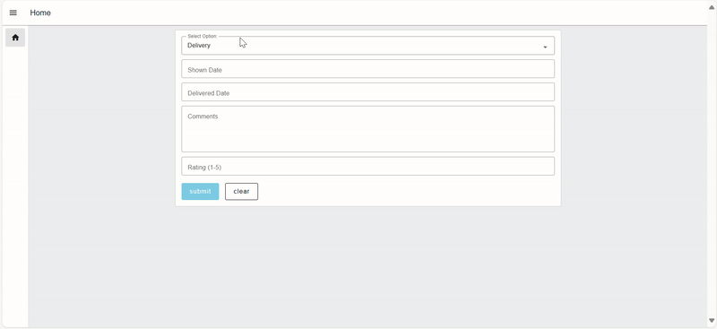

Creating interactive and dynamic user interfaces became crucial with the introduction of JavaScript in browsers, which sparked the rise of dynamic websites and transformed the internet. However, when it comes to Node-RED dashboard solutions, many users encounter challenges in achieving dynamic functionality. These difficulties often arise from the limitations of Node-RED dashboard solutions or the technical expertise required to implement complex interactions.

<!--more-->

In this guide, I will explain what is meant by a dynamic website and its defining aspects, demonstrate how Node-RED Dashboard 2.0 fits into those aspects, and discuss how we can update Dashboard 2.0 UI dynamically.

## What Does a Dynamic Dashboard Mean?

A dynamic dashboard refers to a user interface that adapts and responds to changing data and user interactions in real-time. Unlike static dashboards, which display fixed data and require manual updates, dynamic dashboards provide up-to-date information and interactive experiences automatically.

Key aspects of a dynamic UI include:

1. **Real-time Interaction**: The UI must respond instantly to user actions (e.g., clicks, hovers) and provide immediate feedback.

2. **Asynchronous Data Handling**: The dashboard should be capable of fetching and updating data asynchronously (e.g., using AJAX or WebSockets) without requiring a full page refresh.

3. **Responsive Design**: The interface should adapt to various screen sizes and orientations, maintaining usability and appearance across devices.

4. **Dynamic Content Updates**: Content should update automatically to reflect the latest information or user interactions (e.g., live notifications, chat messages).

## Does Node-RED Dashboard 2.0 Support Dynamic UI?

In this section, we will evaluate Node-RED Dashboard 2.0 against key criteria for dynamic user interfaces. We’ll explore how it performs in real-time interactions, asynchronous data handling, responsive design, and dynamic content updates. By examining these aspects, you’ll gain a clear understanding of how Node-RED Dashboard 2.0 not only meets but excels in providing powerful, dynamic experiences for your projects.

### Does Node-RED Dashboard 2.0 Respond and Update in Real-Time?

Node-RED Dashboard 2.0 supports dynamic UI updates through its use of Vue.js and WebSocket technology. Vue.js, a widely-used JavaScript framework, facilitates the creation of reactive and interactive user interfaces, allowing the dashboard to update in real-time without needing to refresh the page. Additionally, Dashboard 2.0 utilizes WebSockets for real-time communication, enabling the dashboard to receive and display live data updates immediately.

For example, you can see how the dashboard responds in real-time to user actions:

{data-zoomable}

Also, observe how communication occurs in real-time between the dashboard (client-side) and the Node-RED instance (server-side). As the slider is updated, it simultaneously prints input data on the debug panel in the Node-RED instance.

{data-zoomable}

As you explore Node-RED Dashboard 2.0, you'll find that real-time updates and interactions are present across all widgets and components, meeting the first two criteria of a dynamic UI: real-time interaction and asynchronous data handling.

### Is Node-RED Dashboard 2.0 Responsive?

From the outset, FlowFuse Dashboard has been designed with responsive layouts in mind, meaning your dashboards automatically adjust to the screen size of the device they are viewed on.

{data-zoomable}

- **Flexible Layouts**: You can control the layout of your dashboard by adjusting the width of groups and the layout style (e.g., grid, notebook), allowing for finer control over how widgets are displayed.
- **Adaptive Widgets**: Widgets within the dashboard can be configured to resize and rearrange themselves based on the available screen space.
- **Sidebar and Header**: The sidebar and navigation bar can be customized with different options to improve user experience across all screen sizes.

These features ensure your dashboard remains user-friendly and accessible across various devices. For more information, refer to the blog on [Comprehensive Guide: Node-RED Dashboard 2.0 Layout, Sidebar, and Styling](https://flowfuse.com/blog/2024/05/node-red-dashboard-2-layout-navigation-styling/).

### Does Node-RED Dashboard 2.0 Provide the Ability to Dynamically Update Content?

Node-RED Dashboard 2.0 indeed offers robust capabilities for dynamically updating the UI. This flexibility is primarily achieved through sending updates via the `msg` object.

In this section, we will examine how Node-RED Dashboard 2.0 handles dynamic UI updates. We’ll provide a high-level overview of both updating the style of Dashboard 2.0 components/widgets and dynamically modifying widget elements. 

#### Updating Node-RED Dashboard 2.0 Styles Dynamically

Dynamic style updates in Node-RED Dashboard 2.0 are useful for changing the appearance of specific components based on conditions or data. Most widgets allow dynamic class assignment using the `msg.class` property, except for the `ui_control` and `ui_event` widgets.

For instance, if you have text widgets displaying machine names and want to indicate their status with colors—red for "down" and green for "up" or "running"—you can define custom CSS in a `ui_template` widget. To add custom CSS, refer to [Adding Custom Styling in `ui-template`](https://dashboard.flowfuse.com/user/template-examples.html#custom-styling). An example of the CSS might be:

```css
.stop {
   color: red;
}

.running {
   color: green;
}
```

You would then send a message payload that sets the `msg.class` to either `"stop"` or `"running"`, depending on the machine's status. This message updates the text widget's appearance according to the machine's status.

{data-zoomable}

#### Updating Node-RED Dashboard 2.0 Widget Elements Dynamically

To update Node-RED Dashboard 2.0 widget elements dynamically, each widget supports different `msg` properties for updates.

##### Updating Node-RED Dashboard 2.0 Forms Dynamically

To update the `ui-form` widget elements dynamically, use the `msg.ui_update.options` property. Set the array of objects in the following format to add or set a text element:

```json
{
    "type": "text",
    "label": "Name",
    "key": "name",
    "required": true
}
```

For example, if you have a product feedback form that changes based on the feedback type (e.g., "Quality" or "Delivery"), you can use a dropdown to select the feedback type and update the `ui-form` widget accordingly.

{data-zoomable}

##### Updating Node-RED Dashboard 2.0 Dropdown, Radio, and Button Groups Dynamically

To update dropdowns, radio buttons, and button groups dynamically, use `msg.ui_update.options`. The value should be an array of objects containing the value and label fields, as shown below:

```json
[
    {
        "label": "Bob Walker",
        "value": "bobwalker123"
    },
    {
        "label": "Alice Smith",
        "value": "alicesmith456"
    },
    {
        "label": "John Doe",
        "value": "johndoe789"
    },
    {
        "label": "Jane Doe",
        "value": "janedoe101"
    },
    {
        "label": "Charlie Brown",
        "value": "charliebrown202"
    }
]
```

{data-zoomable}

For example, if you want a dropdown to assign tasks to users dynamically, you could set the options with the existing list of users.

Similarly, you can dynamically update radio groups and button groups. For button groups, you can set labels, icons, and colors (if the "use theme color" option is disabled). The following array format can be used for dynamic updates:

```json
[
    {
        "label": "Start",
        "value": "start",
        "icon": "mdi-play-circle",
        "color": "green"
    },
    {
        "label": "Pause",
        "value": "pause",
        "icon": "mdi-pause-circle",
        "color": "yellow"
    },
    {
        "label": "Stop",
        "value": "stop",
        "icon": "mdi-stop-circle",
        "color": "red"
    },
    {
        "label": "Restart",
        "value": "restart",
        "icon": "mdi-replay",
        "color": "blue"
    },
    {
        "label": "Settings",
        "value": "settings",
        "icon": "mdi-cog",
        "color": "grey"
    }
]
```

You can also update the current selection by setting `msg.payload` to the value string of the specific option.

##### Updating Node-RED Dashboard 2.0 Text, Slider, Switch Dynamically

Updating the `ui-text`, `ui-slider`, and `ui-switch` widgets in Node-RED Dashboard 2.0 is straightforward. To dynamically update these widgets, you simply need to send the `msg.payload` with the appropriate value. For the ui-switch, you can update its state by sending true or false as `msg.payload`. By default, the `ui-switch` reflects its state according to these values, but you can configure default settings in the widget's property dialog if needed.

{data-zoomable}



[{"id":"4e2d266a1a8f8448","type":"inject","z":"a9e5683585deb91e","name":"Set name to bob","props":[{"p":"payload"}],"repeat":"","crontab":"","once":false,"onceDelay":0.1,"topic":"","payload":"Bob","payloadType":"str","x":240,"y":840,"wires":[["6d2f6611b11ef6d5"]]},{"id":"6d2f6611b11ef6d5","type":"ui-text","z":"a9e5683585deb91e","group":"bbd788a3450c1e88","order":1,"width":0,"height":0,"name":"","label":"Name: ","format":"{{msg.payload}}","layout":"row-center","style":false,"font":"","fontSize":16,"color":"#717171","className":"","x":470,"y":880,"wires":[]},{"id":"509ca190723f3306","type":"inject","z":"a9e5683585deb91e","name":"Set name to Alice","props":[{"p":"payload"}],"repeat":"","crontab":"","once":false,"onceDelay":0.1,"topic":"","payload":"Alice","payloadType":"str","x":240,"y":940,"wires":[["6d2f6611b11ef6d5"]]},{"id":"bbd788a3450c1e88","type":"ui-group","name":"Task","page":"fe45c5f81cfd992a","width":"3","height":"1","order":1,"showTitle":false,"className":"","visible":"true","disabled":"false"},{"id":"fe45c5f81cfd992a","type":"ui-page","name":"Home","ui":"e3bee830779d0e63","path":"/page1","icon":"home","layout":"notebook","theme":"e3e81e50a184eb0d","order":1,"className":"home","visible":"true","disabled":"false"},{"id":"e3bee830779d0e63","type":"ui-base","name":"Dashboard","path":"/dashboard","includeClientData":true,"acceptsClientConfig":["ui-notification","ui-control"],"showPathInSidebar":false,"showPageTitle":true,"navigationStyle":"none","titleBarStyle":"default"},{"id":"e3e81e50a184eb0d","type":"ui-theme","name":"Default Theme","colors":{"surface":"#ffffff","primary":"#0094ce","bgPage":"#eeeeee","groupBg":"#ffffff","groupOutline":"#cccccc"},"sizes":{"pagePadding":"12px","groupGap":"12px","groupBorderRadius":"4px","widgetGap":"12px"}}]


{data-zoomable}


[{"id":"4e2d266a1a8f8448","type":"inject","z":"a9e5683585deb91e","name":"Turn on the switch","props":[{"p":"payload"}],"repeat":"","crontab":"","once":false,"onceDelay":0.1,"topic":"","payload":"true","payloadType":"bool","x":250,"y":840,"wires":[["f4f622a4b5437123"]]},{"id":"498a34342e779983","type":"inject","z":"a9e5683585deb91e","name":"Turn off the switch","props":[{"p":"payload"}],"repeat":"","crontab":"","once":false,"onceDelay":0.1,"topic":"","payload":"false","payloadType":"bool","x":250,"y":960,"wires":[["f4f622a4b5437123"]]},{"id":"f4f622a4b5437123","type":"ui-switch","z":"a9e5683585deb91e","name":"","label":"switch","group":"bbd788a3450c1e88","order":1,"width":0,"height":0,"passthru":false,"topic":"topic","topicType":"msg","style":"","className":"","onvalue":"true","onvalueType":"bool","onicon":"","oncolor":"","offvalue":"false","offvalueType":"bool","officon":"","offcolor":"","x":470,"y":920,"wires":[[]]},{"id":"bbd788a3450c1e88","type":"ui-group","name":"Task","page":"fe45c5f81cfd992a","width":"3","height":"1","order":1,"showTitle":false,"className":"","visible":"true","disabled":"false"},{"id":"fe45c5f81cfd992a","type":"ui-page","name":"Home","ui":"e3bee830779d0e63","path":"/page1","icon":"home","layout":"notebook","theme":"e3e81e50a184eb0d","order":1,"className":"home","visible":"true","disabled":"false"},{"id":"e3bee830779d0e63","type":"ui-base","name":"Dashboard","path":"/dashboard","includeClientData":true,"acceptsClientConfig":["ui-notification","ui-control"],"showPathInSidebar":false,"showPageTitle":true,"navigationStyle":"none","titleBarStyle":"default"},{"id":"e3e81e50a184eb0d","type":"ui-theme","name":"Default Theme","colors":{"surface":"#ffffff","primary":"#0094ce","bgPage":"#eeeeee","groupBg":"#ffffff","groupOutline":"#cccccc"},"sizes":{"pagePadding":"12px","groupGap":"12px","groupBorderRadius":"4px","widgetGap":"12px"}}]


{data-zoomable}


[{"id":"4e2d266a1a8f8448","type":"inject","z":"a9e5683585deb91e","name":"Genrate and send the random number","props":[{"p":"payload"}],"repeat":"","crontab":"","once":false,"onceDelay":0.1,"topic":"","payload":"$floor($random() * 100)\t","payloadType":"jsonata","x":250,"y":900,"wires":[["bb62bddeeb720a94"]]},{"id":"bb62bddeeb720a94","type":"ui-slider","z":"a9e5683585deb91e","group":"bbd788a3450c1e88","name":"","label":"slider","tooltip":"","order":1,"width":0,"height":0,"passthru":false,"outs":"all","topic":"topic","topicType":"msg","thumbLabel":"true","showTicks":"always","min":0,"max":"100","step":1,"className":"","iconPrepend":"","iconAppend":"","color":"","colorTrack":"","colorThumb":"","x":530,"y":900,"wires":[[]]},{"id":"bbd788a3450c1e88","type":"ui-group","name":"Task","page":"fe45c5f81cfd992a","width":"3","height":"1","order":1,"showTitle":false,"className":"","visible":"true","disabled":"false"},{"id":"fe45c5f81cfd992a","type":"ui-page","name":"Home","ui":"e3bee830779d0e63","path":"/page1","icon":"home","layout":"notebook","theme":"e3e81e50a184eb0d","order":1,"className":"home","visible":"true","disabled":"false"},{"id":"e3bee830779d0e63","type":"ui-base","name":"Dashboard","path":"/dashboard","includeClientData":true,"acceptsClientConfig":["ui-notification","ui-control"],"showPathInSidebar":false,"showPageTitle":true,"navigationStyle":"none","titleBarStyle":"default"},{"id":"e3e81e50a184eb0d","type":"ui-theme","name":"Default Theme","colors":{"surface":"#ffffff","primary":"#0094ce","bgPage":"#eeeeee","groupBg":"#ffffff","groupOutline":"#cccccc"},"sizes":{"pagePadding":"12px","groupGap":"12px","groupBorderRadius":"4px","widgetGap":"12px"}}]


##### Updating the Node-RED Dashboard 2.0 Notification Dynamically

Updating notifications in the Node-RED Dashboard 2.0 allows for full customization, as it accepts HTML and JavaScript. To set the notification ui, you need to send the `msg.payload` with a string containing the desired HTML and JavaScript. 

{data-zoomable}

For example, if you have a dashboard that monitors temperature sensor data, you might want different notifications for progress updates, alerts when the temperature drops, and when the temperature increases.


[{"id":"47544a562f5e3cdd","type":"ui-notification","z":"a9e5683585deb91e","ui":"e3bee830779d0e63","position":"center center","colorDefault":false,"color":"#000000","displayTime":"3","showCountdown":true,"outputs":1,"allowDismiss":true,"dismissText":"Close","raw":true,"className":"","name":"","x":1090,"y":980,"wires":[[]]},{"id":"9c79e35ba5cfad20","type":"inject","z":"a9e5683585deb91e","name":"Genrate and send random number","props":[{"p":"payload"}],"repeat":"","crontab":"","once":false,"onceDelay":0.1,"topic":"","payload":"$random()*70","payloadType":"jsonata","x":180,"y":980,"wires":[["b05b9cb5c2458e40"]]},{"id":"0624044ba71fd826","type":"change","z":"a9e5683585deb91e","name":"Setting html for progress notification","rules":[{"t":"set","p":"payload","pt":"msg","to":"<div class=\"notification progress\">     <div class=\"icon-wrapper\">         <i class=\"mdi mdi-progress-check icon\"></i>     </div>     <div class=\"text\">         Progress: This task is currently in progress.     </div>","tot":"str"}],"action":"","property":"","from":"","to":"","reg":false,"x":840,"y":1020,"wires":[["47544a562f5e3cdd"]]},{"id":"99bca635e7d369bb","type":"change","z":"a9e5683585deb91e","name":"Setting html for alert notification","rules":[{"t":"set","p":"payload","pt":"msg","to":"<div class=\"notification alert\">     <div class=\"icon-wrapper\">         <i class=\"mdi mdi-alert icon\"></i>     </div>     <div class=\"text\">         Alert: This is an important alert notification.     </div> </div>","tot":"str"}],"action":"","property":"","from":"","to":"","reg":false,"x":830,"y":960,"wires":[["47544a562f5e3cdd"]]},{"id":"b05b9cb5c2458e40","type":"switch","z":"a9e5683585deb91e","name":"Is temprature is greater than 50 or not?","property":"payload","propertyType":"msg","rules":[{"t":"gt","v":"50","vt":"str"},{"t":"lt","v":"50","vt":"str"}],"checkall":"true","repair":false,"outputs":2,"x":490,"y":980,"wires":[["99bca635e7d369bb"],["0624044ba71fd826"]]},{"id":"89cf99789e82da41","type":"ui-template","z":"a9e5683585deb91e","ui":"e3bee830779d0e63","name":"","order":0,"width":0,"height":0,"head":"","format":" .notification {\n        padding: 20px;\n        border-radius: 8px;\n        color: #fff;\n        display: flex;\n        flex-direction: column;\n        align-items: center;\n        text-align: center;\n        margin-bottom: 15px;\n    }\n    .icon-wrapper {\n        font-size: 24px;\n        margin-bottom: 10px;\n    }\n    .alert {\n        background-color: #f44336; /* Red */\n    }\n    .progress {\n        background-color: #2196F3; /* Blue */\n    }\n    .text {\n        font-size: 16px;\n    }","storeOutMessages":true,"passthru":true,"resendOnRefresh":true,"templateScope":"site:style","className":"","x":380,"y":1140,"wires":[[]]},{"id":"e3bee830779d0e63","type":"ui-base","name":"Dashboard","path":"/dashboard","includeClientData":true,"acceptsClientConfig":["ui-notification","ui-control"],"showPathInSidebar":false,"showPageTitle":true,"navigationStyle":"none","titleBarStyle":"default"}]


#### Talking about charts, tables and gauges 

## Advance Customization.

## Final Thought

