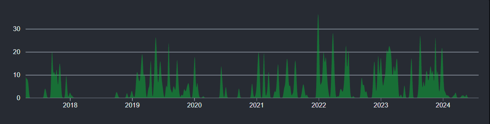
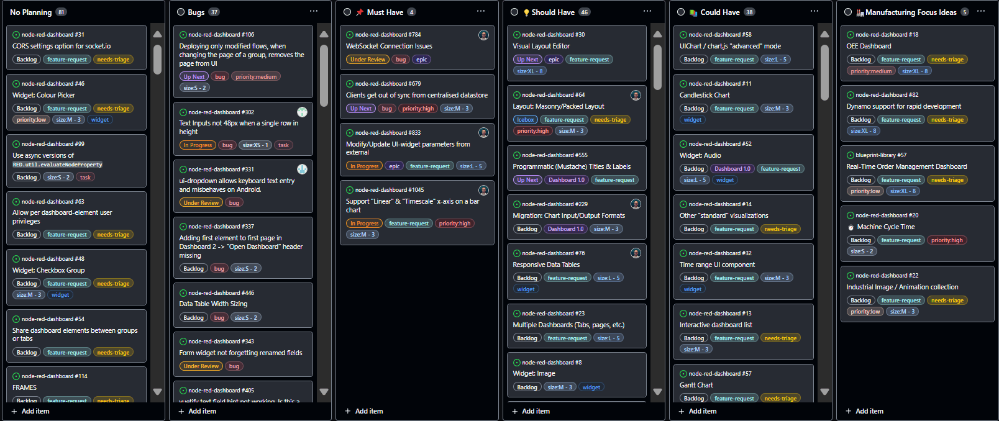

When choosing a dashboard solution for Node-RED, two popular options are FlowFuse Dashboard (also known as Dashboard 2.0) and UI-Builder. This article compares these tools across several key areas, including installation, ease of use, development activity, and customizability, to help you decide which one best suits your needs.

<!--more-->

## How Easy is it to Install?

### FlowFuse Dashboard

When searching for `flowfuse/node-red-dashboard` on Google, the first result we get to the documentation, which is useful. However, in the Node-RED Palette Manager, finding the correct package can be confusing because there are many community third-party nodes and plugins that work with FlowFuse Dashboard. This can make it bit confusing for new users to locate the right package.

### UI-Builder

Finding UI-Builder is straightforward, as its package name `node-red-contrib-uibuilder` is distinct and easily identifiable both on Google and in the Node-RED Palette Manager. This clear naming helps users quickly locate the correct package.

## How Easy is it to Get Started?

### FlowFuse Dashboard

Getting started with FlowFuse Dashboard is relatively easy due to its low-code approach. It features a sidebar for managing UI widgets, themes, configurations, and settings, with intuitive navigation to the dashboard page. This makes it accessible for users with varying levels of technical expertise.

### UI-Builder

UI-Builder can be more challenging to start with, as it does not follow a low-code approach and lacks a separate sidebar for managing UI elements. Navigating dashboards built with UI-Builder can be less straightforward, and it requires users to have a deeper understanding of coding and UI design principles.

## Migrating from Node-RED Dashboard (Dashboard 1.0)

[Node-RED Dashboard](https://flows.nodered.org/node/node-red-dashboard) is a module that provides a set of nodes in Node-RED to quickly create user interfaces or live data dashboards. It was developed by one of the creators of Node-RED and is the most used and downloaded package in the Node-RED ecosystem. However, it is now deprecated. For more information, refer to [Node-RED Dashboard Formally Deprecated](/blog/2024/06/dashboard-1-deprecated/).

### FlowFuse Dashboard

FlowFuse Dashboard is developed to replace the the deprecated standard Node-RED Dashboard. It retains the core concepts and UI elements but introduces more advanced options and configurations.

To facilitate the transition, FlowFuse, the creator of FlowFuse Dashboard, provides a [migration service](/platform/dashboard/#migration-service) that simplifies migration of flows or projects from the Node-RED Dashboard to FlowFuse Dashboard. This service helps ensure a smoother migration process with minimal disruption.

### UI-Builder

Migrating from Node-RED Dashboard 1 to UI-Builder is significantly more complex. UI-Builder does not follow the same concepts or provide the same UI elements as the Node-RED Dashboard.

Users will need to recreate their dashboards from scratch, as UI-Builder relies on custom coding and frontend frameworks rather than the predefined, low-code widgets of Node-RED Dashboard. This process can be overwhelming and requires a solid understanding of HTML, CSS and the frontend frameworks if you wanted use.

## How Active is the Project's Development?

### FlowFuse Dashboard

[FlowFuse Dashboard](https://github.com/FlowFuse/node-red-dashboard/graphs/contributors), which replaced Node-RED Dashboard 1.0 in 2023, has shown consistent and high development activity. The project benefits from a dedicated team that regularly updates and improves it, ensuring it remains current with user needs and technological advancements.

  
_Screenshot of the FlowFuse Dashboard GitHub commit chart._

### UI-Builder

[UI-Builder](https://github.com/TotallyInformation/node-red-contrib-uibuilder/graphs/contributors) has been an active project for a long time and remains active. However, there has been a noticeable decline in development activity starting in early 2024. While the project continues to be maintained, it does not have a dedicated, full-time team.

  
_Screenshot of the UI-Builder GitHub commit chart._

## Pre-Built UI Elements

### FlowFuse Dashboard

FlowFuse Dashboard offers an extensive set of UI elements, including forms, dropdowns, tables, charts, and gauges that are super easy to use. These widgets are built with complex Vue.js components, but users are completely shielded from this complexity, allowing them to focus on ease of use. Additionally, if you want to create your own custom widget, you can do so with the ui-template node that accepts complete Vue components. By default, FlowFuse Dashboard supports the Vuetify library, which provides an extensive set of UI components.

### UI-Builder

UI-Builder also offers a number of widgets, but these are not as user-friendly as those in FlowFuse Dashboard. Users must send a JSON config object, which can be complex for new users who lack knowledge of HTML/CSS. Additionally, handling widget data requires using UI-Builder's methods, which can further increase complexity. However, UI-Builder's strength lies in its flexibility, allowing any HTML element to be used as a component, and it also supports the W3C standard web components. Despite this, users need to perform a lot of additional tasks to get everything set up and will have the hassle of writing things.

## Changing the UI at Runtime

### FlowFuse Dashboard

FlowFuse Dashboard supports dynamic control of the UI via the msg object. Each UI widget supports the `msg.ui_update` property, which allows you to control and update UI components dynamically. For example, you can update form fields based on user input, dynamically insert or update options in a dropdown, or change the appearance of the UI by sending CSS classes or selecting options in dropdowns or radio buttons through msg.

### UI-Builder

UI-Builder also supports dynamic UI updates and control. Similar to FlowFuse Dashboard, you can use messages to control the state and content of UI elements.

## Data Visualization

### FlowFuse Dashboard

Monitoring devices is one of the core use cases for Node-RED, and FlowFuse Dashboard makes it easy to monitor device metrics with its built-in [chart](https://dashboard.flowfuse.com/nodes/widgets/ui-chart.html) and [gauge widgets](https://dashboard.flowfuse.com/nodes/widgets/ui-gauge.html). The chart widgets support various types, including line, bar, scatter, pie, and donut charts, while the gauge widgets offer options like tile, 3/4 gauge, and half gauge. This range of built-in options simplifies the creation of visualizations for monitoring device metrics. Additionally, you can use Vuetify or other third-party libraries in the ui-template node if you need different types of charts.

### UI-Builder

UI-Builder does not provide built-in charting options. However, you can add charts using third-party JavaScript libraries. This approach requires additional effort to integrate and configure the libraries, as well as writing the relevant JavaScript to render the charts. While this increases the complexity of creating visualizations, it offers more control and customization.

## Building Layout

### FlowFuse Dashboard

FlowFuse Dashboard offers a collection of pre-defined layouts to make it easy for users to get started quickly. These are available as a configuration for each "Page" of your application.

These predefined layouts provide a solid foundation for most applications. If you need a different layout, FlowFuse Dashboard is limited in it's customization in terms of positioning of elements.

### UI-Builder

UI-Builder does not come with predefined layouts, which can make it more complex for users to get started. it does however, provides the flexibility to completely define your own layout using CSS. This approach allows for complete customization, but it requires users to have a good understanding of HTML and CSS. The lack of predefined layouts means users have to create their own from scratch, which can be time-consuming.

## Responsiveness on Mobile

### FlowFuse Dashboard

FlowFuse Dashboard is designed with [responsiveness](https://dashboard.flowfuse.com/layouts/) in mind. It ensures that dashboards automatically adapt to different screen sizes and devices, providing a consistent user experience across desktops, tablets, and mobile devices. The dashboard elements are automatically adjusted to fit various resolutions, making it user-friendly for a wide audience.

### UI-Builder

UI-Builder's support for different devices depends on the user's implementation. While it offers the potential for responsive designs, achieving this requires a good understanding of responsive design principles and CSS.

## How Much Customization is Available?

### FlowFuse Dashboard

FlowFuse Dashboard, built on Vue.js, offers a range of customization options through its widget configurations and settings. 

While it provides predefined UI elements, users can override CSS and theming using the [ui_template](/blog/2023/12/dashboard-0-10-0/) widget to enhance the dashboard's appearance. 

This same widget also provides functionality to develop custom components or widgets for your Dashboard. These must be built with a VueJS core, but do support the integration of third-party JavaScript libraries.

### UI-Builder

UI-Builder provides extensive customization capabilities, enabling users to build and style UI elements from scratch. This flexibility is advantageous for those with a strong background in frontend development, as it supports any frontend framework or custom design approach. However, achieving the desired results requires significant time and expertise, as users need to handle the coding and styling for each UI element they create.

## Can it be Installed on Mobile?

### FlowFuse Dashboard

FlowFuse Dashboard is built and deployed as a Progressive Web App. This means whilst it's built as a web application, it can be [installed on your mobile device](https://dashboard.flowfuse.com/user/pwa.html#installing-dashboards-on-mobile) and run as a standalone application, behaving as if it was a native app.

### Ui-Builder

Dashboards built with UI-Builder, on the other hand, cannot be installed as an app. It is designed as a web-based tool for building custom UIs and does not support installation as a standalone application.

## How About Performance and Speed?

### FlowFuse Dashboard

FlowFuse Dashboard provides reliable performance with efficient real-time updates. Initial page load times might be slower, particularly on mobile, but the overall performance is consistent and effective for dynamic dashboards.

### UI-Builder

UI-Builder provides faster initial load times and smooth performance across customizations, ensuring high-speed interactions.

## How is the Overall User Experience?

### FlowFuse Dashboard

FlowFuse Dashboard offers a user-friendly experience with its low-code approach, intuitive UI, and extensive documentation. Users can quickly create and customize dashboards without needing advanced coding skills, making it accessible to a wide range of users, from beginners to experienced developers. This allows users to focus on solving business problems and IoT tasks rather than getting bogged down by complex coding requirements.

###  UI-Builder

UI-Builder provides a more flexible but complex user experience. While it allows for greater customization and the use of any frontend framework, it requires a solid understanding of coding and design principles. This can be daunting for users without a background in web development, but it offers powerful capabilities for those who are comfortable with custom coding.

## How Active is the User Community?

### FlowFuse Dashboard

FlowFuse Dashboard boasts a large and active user community. Users frequently participate in forums, contribute to discussions, and share custom solutions. The number of weekly downloads is growing rapidly, reflecting its high activity and popularity.

 
_Screenshot of the FlowFuse Dashboard package's weekly download chart from npm_

### UI-Builder

UI-Builder has a smaller but still active user community. While not as large as FlowFuse Dashboard's, it includes dedicated users who also engage in forums, contribute to discussions, and share their use cases and solutions.

_Screenshot of the Ui-Builder package's weekly download chart from npm_

## How Good is the Support and Documentation?

### FlowFuse Dashboard

Support for FlowFuse Dashboard is robust, with assistance from both the FlowFuse team and the active Node-RED community. The documentation is comprehensive, easy to understand, and regularly updated. The team is also working on an interactive dashboard solution for previewing examples.

### UI-Builder

UI-Builder also has good support, with active contributions from the author and the Node-RED community. The documentation is detailed but can be complex due to extensive use of technical language.

## What are the future development plans?

### FlowFuse Dashboard

FlowFuse Dashboard is actively working on enhancing its feature set. With extensive functionality already in place, the project also has ambitious plans to introduce more advanced features to better serve its users. You can track these developments on the [FlowFuse Dashboard GitHub project board](https://github.com/orgs/FlowFuse/projects/15/views/4), where ongoing and upcoming features are documented.

_Screenshot of the FlowFuse Dashboard GitHub project board_

Additionally, updates about new features and enhancements are also provided through social media, blogs, and the Node-RED forums, ensuring that users stay informed about the latest developments.

### UI-Builder

UI-Builder does not have a publicly accessible project roadmap or a dedicated planning board for future updates. While development continues, details about forthcoming features and enhancements are regularly updated on the Node-RED Discourse forums by its author. 

## Summary Table

| Feature                                  | FlowFuse Dashboard                          | UI-Builder                                       |
|------------------------------------------|--------------------------------------------------|--------------------------------------------------|
| **Ease of Installation**                 | **Moderately easy**: Search for `flowfuse/node-red-dashboard` can be confusing due to multiple nodes; useful documentation available | **Easy**: Clear package name `node-red-ui-builder` makes it straightforward to find |
| **Ease of Getting Started**              | **Easy**: Low-code interface with a sidebar for managing UI elements; intuitive for users of varying technical skills | **Challenging**: Requires understanding of coding and UI design; lacks a low-code approach |
| **Migration from Node-RED Dashboard**    | **Smooth**: Migration service provided to transition from Node-RED Dashboard 1 to FlowFuse Dashboard | **Complex**: Requires rebuilding dashboards from scratch; significant effort needed for migration |
| **Development Activity**                 | **High**: Regular updates and improvements; actively maintained by a dedicated team | **Moderate**: Active but shows a decline in updates; less frequent enhancements |
| **UI Elements Collection**                | **Extensive**: Includes a wide range of widgets like forms, charts, and gauges; built on Vue.js with Vuetify support | **Flexible but complex**: Allows any HTML element; requires custom coding and handling of UI elements |
| **Visualization**                        | **Easy**: Built-in charting options for various types; additional options with third-party libraries | **Complex**: No built-in charts; requires integration of third-party libraries for visualization |
| **Dynamic UI Control**          | **Supported**: Can dynamically control and update UI components using `msg.ui_update` property | **Supported**: Dynamic updates possible, but can be more complex to implement |
|
| **Web Layout Support**                   | **Predefined**: Offers three main layouts with some options for custom styling | **Customizable**: No predefined layouts; users must create their own using CSS |
| **Device and Screen Size Support**       | **Excellent**: Responsive design adapts well to various devices and screen sizes | **Variable**: Responsiveness depends on user's implementation and knowledge of CSS |
| **Customization**                       | **Good**: Offers customization through widget settings and custom CSS and ui-template; supports Vue components and third-party libraries | **High**: Full control over UI design and layout with custom coding; requires expertise in frontend development |
| **App Installation**                     | **Available**: Can be installed as a Progressive Web App (PWA) for use as a standalone application | **Not available**: Designed as a web-based tool; cannot be installed as an app |
| **Performance and Speed**                | **Reliable**: Good performance with consistent updates; may have slower initial load times on mobile | **Good**: Generally good performance on both desktop and mobile |
| **Support and Documentation**            | **Robust**: Comprehensive, regularly updated documentation and active community support | **Good**: Detailed but may be complex; documentation includes technical jargon |
| **Overall User Experience**              | **User-friendly**: Accessible and easy to use with low-code approach; suitable for a wide range of users | **Flexible but complex**: Offers greater customization but requires coding expertise; can be daunting for non-developers |
| **User Community Activity**              | **Large and active**: High engagement in forums and discussions; growing number of downloads | **Smaller but dedicated**: Active users, but less engagement compared to FlowFuse Dashboard |
| **Future Development Plans**             | **Active**: Continuous enhancements and new features planned; updates tracked on GitHub project board | **Less transparent**: No detailed roadmap; future features are less clearly communicated |

## Conclusion

FlowFuse Dashboard is well-suited for users seeking a user-friendly, low-code solution with a wide range of pre-built elements and strong community support. Its ease of use and active development make it ideal for quick deployment and minimal technical overhead.

UI-Builder, however, offers nice performance and customization, benefiting users with coding expertise who need highly tailored UIs. Despite its flexibility and faster load times, it requires more complex setup and migration.

{% include "cta.njk", cta_query: "utm_campaign=60718323-BCTA&utm_source=blog&utm_medium=cta&utm_term=high_intent&utm_content=FlowFuse%20Dashboard%20vs%20UI-Builder%3A%20A%20Comprehensive%20Comparison", cta_type: "signup", cta_text: "Looking to build a multi-user dashboard, deploy it in seconds, scale and manage Node-RED efficiently, and enable seamless remote access for your entire team?" %}