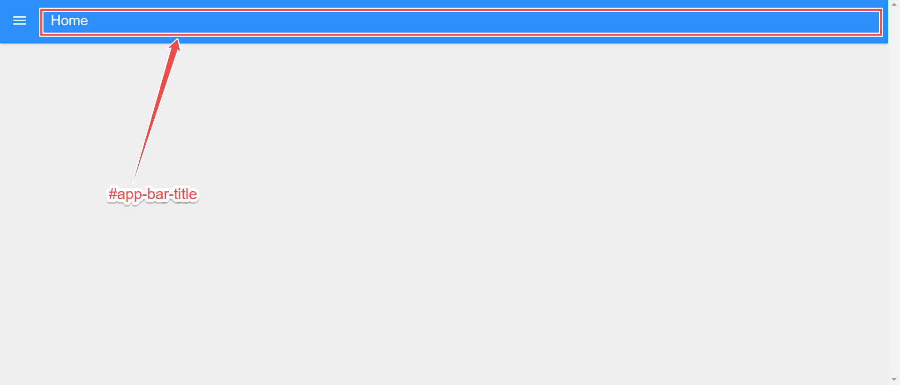
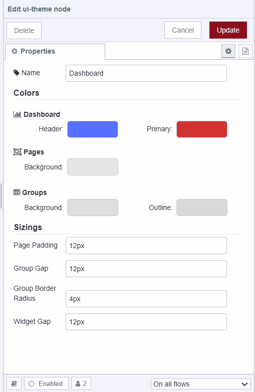

A recent release of FlowFuse Dashboard (Dashboard 2.0) has taken customization to the next level.

<!--more-->

Previously, users enjoyed the flexibility of tweaking navigation sidebars, themes, and group and page padding. With the new update, you can fully personalize the header too, adding unique elements to enhance your dashboard experience and customize your application to your own branding.

In this article, we'll delve into these exciting new features, including theme adjustments, custom styling, and layout modifications, that empower you to tailor your Node-RED Dashboard like never before.

## Adding Elements in the Header

To add elements to the header, we can use [Teleports](https://dashboard.flowfuse.com/nodes/widgets/ui-template.html#teleports) within the `ui-template` node. This allows elements to be seamlessly rendered in specific areas of the dashboard. This method simplifies the process compared to manually positioning items with CSS, which can be complex, time-consuming, and potentially disruptive to other dashboard elements.

### Left Side of the Header

To render content on the left side of the header, we can teleport content into the `#app-bar-title` element, where our page name is displayed.

{data-zoomable}
_Image of Dashboard showing the #app-bar-title container_

#### Hiding the Page Name in the Header

Before proceeding, you should hide the page name on the left side of the header by default. This will ensure that when you add elements to the header, they do not clash with the page name.

To hide the page name:

1. Go to the FlowFuse Dashboard sidebar
2. Click on to the "Edit settings" option located at the top of the FlowFuse Dashboard sidebar.

{data-zoomable}
_Screenshot showing the 'edit setting' option in the dashboard sidebar_

3. Untick the option "Show page name in the header bar".
{data-zoomable}
_Screenshot showing the 'Show page name in the header bar' option in the dashboard settings_

#### Example: Adding Buttons

1. Drag a `ui-template` node onto the Node-RED Editor canvas.
2. Double-click on it and select the scope to either `ui-scope` or `page-scope`. Selecting `ui-scope` will render this content on _all_ pages. `page-scope` will just render to a specified page. 
3. Choose the page on which you want to render the buttons if you selected `page-scope`, or choose correct ui if `ui-scope` is selected.
4. Paste the following Vue snippet into the template widget. In this snippet, note how we specify the "to" attribute targeting the `#app-bar-title` ID in the teleport tag:

```html
<template>
    <!-- Teleport the button to the #app-bar-actions area when mounted -->
    <Teleport v-if="mounted" to="#app-bar-title">
        <v-btn>Button 1</v-btn>
        <v-btn>Button 2</v-btn>
        <v-btn>Button 3</v-btn>
    </Teleport>
</template>

<script>
    export default {
        data() {
            return {
                mounted: false
            }
        },
        mounted() {
            // Set mounted to true when the component is mounted
            this.mounted = true
        }
    }
</script>
```

5. Next, you can customize further by adding more buttons or different elements inside the `<Teleport>` element.

{data-zoomable}
_Screenshot of Dashboard showing the added buttons in the header_

#### Example: Adding Logo

If you want to add your brand's logo, you can replace the element inside <teleport> with an  tag. You can do this in the same ui-template widget or in a different ui-template widget:

1. Drag the `ui-template` node onto the canvas.
2. Select the correct scope for that widget to render.
3. Select the correct page or UI in which you want to render the element.
3. Paste the same Vue snippet given in the above section into the `ui-template` widget and replace the code inside <teleport> with the following element:

```html
</img>
```

You can replace the URL with your logo's URL or set it using the `msg.payload` as shown in examples given [documentation](https://dashboard.flowfuse.com/nodes/widgets/ui-template.html#page-name-app-bar-title).

{data-zoomable}
_Screenshot of the Dashboard displaying the added logo in the header_

### Right Side of the Header

To render elements on the right side of the header, you can use the empty div element having the `#app-bar-actions` ID, in which we can add elements.

{data-zoomable}
_Screenshot of Dashboard showing the #app-bar-actions container_

#### Example: Adding logged in user profile

{data-zoomable}
_Screenshot of Dashboard displaying the logged in user profile at the right side of header_

In this section, we will add the user profile of the currently logged-in user to the right side of the header. Make sure you have installed "@flowfuse/node-red-dashboard-2-user-addon" via the palette manager and enabled [FlowFuse User Authentication](/docs/user/instance-settings/#flowfuse-user-authentication). Each message emitted by the FlowFuse Dashboard widget will include the logged-in user information under `msg._client.user`. Additionally the [setup object](https://dashboard.flowfuse.com/contributing/guides/state-management.html#setup-store) will also contain this information under `setup.socketio.auth.user`.

1. Drag the ui-template widget onto the canvas.
2. Select the correct scope for that widget to render.
3. Select the correct page or UI in which you want to render the element.
3. Paste the same Vue snippet given below into the `ui-template` widget:

```html
<template>
    <!-- Teleporting user info to #app-bar-actions, which is the ID of the action bars' right corners area -->
    <Teleport v-if="loaded" to="#app-bar-actions">
        <div class="user-info">
            <!-- Displaying user image -->
            
            <!-- Greeting the user -->
            <span>Hi, {{ setup.socketio.auth.user.name }}</span>
        </div>
    </Teleport>
</template>

<script>
export default {
    data() {
        return {
            // Flag to indicate if the component is loaded
            loaded: false
        };
    },
    mounted() {
        // This function is called when the component is inserted into the DOM.
        // Setting loaded to true here ensures the component is ready to access #app-bar-actions,
        // as it's now part of the same DOM structure.
        // Accessing it before mounted() would cause an error because the component wouldn't be initialized in the DOM yet.
        this.loaded = true; // Setting loaded to true to indicate that the component has been mounted successfully
    }
}
</script>

<style>
/* Styling for user info display */
.user-info {
    display: flex;
    align-items: center;
    gap: 8px;
}
/* Styling for user avatar image*/
.user-info img {
    width: 24px;
    height: 24px;
}
</style>
```

For detailed guide on this section, refer to the guide on [Displaying logged in user on FlowFuse Dashboard](/blog/2024/04/displaying-logged-in-users-on-dashboard/). Furthermore, if you want to add logos or buttons on the right side similar to the left side of the header, you just need to replace the to attribute with the `#app-bar-actions`.

### Centering Header Items

Sometimes you may want to center or position items added to either the `#app-bar-title` or the `#app-bar-actions`. By default, these elements do not have a specified width, and when you add items into them, they grow to fit their content. To center the elements, you first need to ensure that they are sized appropriately.

#### Centering Items in the Left Side of the Header

To center items added to the `#app-bar-title`, apply the following CSS in the `<style>` tag of the `ui-template` widget:

```css
#app-bar-title {
    flex-grow: 1;
    justify-content: center;
}
```

#### Centering Items in the Right Side of the Header

To center items in the `#app-bar-actions` area, add the following CSS to the `<style>` tag of the `ui-template` widget:

```css
#v-toolbar__append {
    flex-grow: 1;
}
```

## Styling Header

One of the significant customization features we've added recently is the ability to style the header in different ways.

To style the header:

1. Go to the FlowFuse Dashboard sidebar
2. Click on to the "Edit settings" option located at the top of the FlowFuse Dashboard sidebar.

{data-zoomable}
_Screenshot showing the 'edit setting' option in the dashboard sidebar_

3. Select the desired option from the "Header Options" dropdown.

{data-zoomable}
_Screenshot showing the header style options in the dashboard settings_

The following options are available for header styling:

### Default

This option as it name suggest it is the default option set for header. In which the header will get hidden if we scrolled down.

{data-zoomable}
_Image showing the dashboard with default header_

### Hidden

Selecting this option completely hides the header, allowing you to use that space for other purposes.

{data-zoomable}
_Image showing the dashboard with hidden header_

### Fixed

Selecting this option keeps the header fixed at the top. This means that when you scroll the page down, the header will remain visible.

{data-zoomable}
_Image showing the dashboard with fixed header_

## Changing Dashboard Theme

In this section of the guide, you will learn how to change the Dashboard theme, where you can adjust the colors of the header, navigation sidebar, group and page backgrounds, the border color of groups, and the padding, sizing, and gaps between pages, groups, and widgets.

To edit the existing theme:

1. Go to the FlowFuse Dashboard sidebar.
2. Switch to the "Theme" tab.

{data-zoomable}
_Screenshot showing the dashboard theme tab in the sidebar_

3. Click on the edit button next to the theme.
4. You can adjust the header color and the primary color (which applies to the navigation sidebar and elements like buttons and dropdowns) under the "Primary" section. In the "Pages" section, set the background color for pages, and in the "Groups" section, adjust the background color and border color of groups.

{data-zoomable}
_Screenshot showing the theme properties dialog_

5. Under "Sizing," adjust the page padding (the space between dashboard groups), the page border, group gap, group border radius (the thickness of the group border), and widget gap.

For more information on  theme, how to add new themes, and set themes for pages, refer to the [Comprehensive guide: FlowFuse Dashboard layout, sidebar, and styling](/blog/2024/05/node-red-dashboard-2-layout-navigation-styling/#understanding-dashboard-2.0-theme). Additionally, this guide covers FlowFuse Dashboard layouts, themes, and custom styling in detail.

## Conclusion

In this article, we explored FlowFuse Dashboard's new customization features. We focused on adding elements like buttons and logos to the header, and discussed styling options such as default, hidden, and fixed for headers. We also covered how to adjust dashboard themes to personalize colors and layout. These insights empower users to create more personalized and functional Node-RED dashboards.

{% include "cta.njk", cta_url: "/get-started?utm_campaign=60718323-BCTA&utm_source=blog&utm_medium=cta&utm_term=high_intent&utm_content=Customise%20theming%20in%20your%20FlowFuse%20Dashboard", cta_type: "signup", cta_text: "Looking to build a multi-user dashboard, deploy it in seconds, scale and manage Node-RED efficiently, and enable seamless remote access for your entire team?" %}