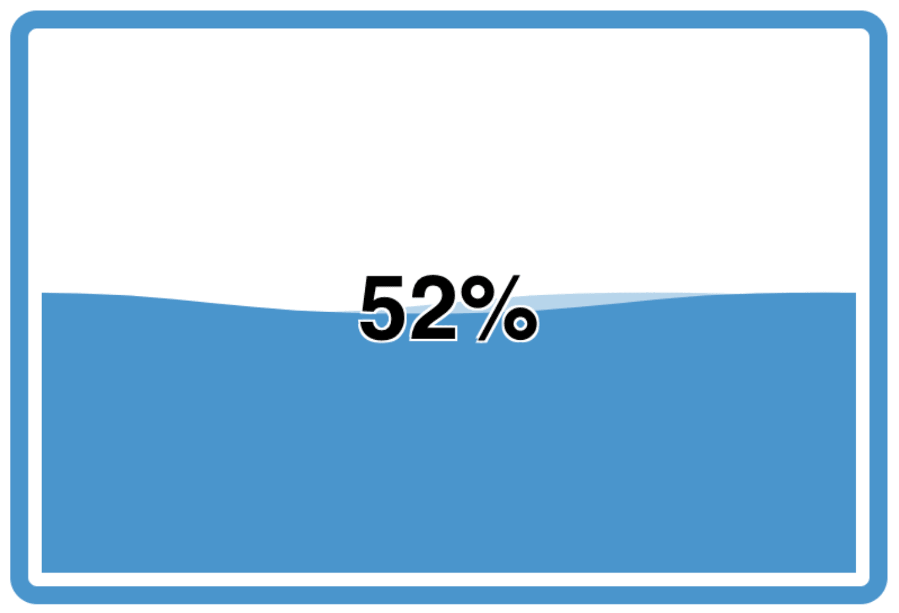

At FlowFuse, we're constantly evolving to make sure your dashboard experience is seamless and efficient. This month, we're excited to introduce several new features that enhance your interaction with the platform. From organizing your data with Tabs to visualizing critical information with new Gauges, we've got you covered.

<!--more-->

## New Layout: Tabs

We know that managing multiple data sources and visualizations can get overwhelming. To streamline your workflow, we've introduced a new layout: Tabs.

Tabs allow you to organize your widgets into separate, easily navigable sections, reducing clutter and making it easier to focus on specific datasets. Whether you're monitoring system performance, tracking KPIs, or managing IoT devices, Tabs will help you stay organized and efficient.

{data-zoomable}
_Screenshot showing a tab layout in Dashboard_

## New Widget: Number Input

Introducing the Number Input widget — a versatile addition that allows users to input numerical values directly into the dashboard. Whether you're setting thresholds, configuring parameters, or simply inputting data, this widget makes it easy to adjust values with precision. It’s ideal for use cases where user interaction with numerical data is required, such as controlling devices or updating settings in real time.

{data-zoomable}
_Screenshot showing a number input widget with Dashboard_

You can try the Number Input now in our [live Dashboard running on FlowFuse](https://dashboard-demos.flowfuse.cloud/dashboard/number-input)

## New Gauges

Data visualization is a cornerstone of any effective dashboard. We’re excited to introduce two new gauges designed to provide at-a-glance insights into your key metrics.

### Battery Charge

Monitoring battery levels is crucial for applications that rely on mobile or remote devices. Our new Battery Gauge provides a clear visual representation of battery status, allowing you to quickly assess power levels and take action if necessary. It’s perfect for IoT deployments, mobile sensors, or any system where battery life is a key consideration.

{data-zoomable}
_Screenshot showing a battery gauge with Dashboard_

You can try the Tank Level now in our [live Dashboard running on FlowFuse](https://dashboard-demos.flowfuse.cloud/dashboard/gauge#battery-charge)

### Tank Level

Managing fluid levels in tanks is a common requirement across industries. The new Tank Level Gauge gives you a straightforward way to monitor liquid or gas levels in real time. Whether you're tracking water in a reservoir, fuel in a tank or any other fluid. this gauge provides the precision and clarity you need to maintain operational efficiency.

{data-zoomable}
_Screenshot showing a partially filled tank level gauge with Dashboard_

You can try the Tank Level now in our [live Dashboard running on FlowFuse](https://dashboard-demos.flowfuse.cloud/dashboard/gauge#tank-level)

## What else is new?

You can find the full 1.15.0 Release Notes [here](https://github.com/FlowFuse/node-red-dashboard/releases/tag/v1.15.0).

Just to highlight a few, particularly valuable, updates and fixes:

 - UI Switch - Introduced an "Indicator" mode and enhanced memory handling for better performance.
 - UI Table - Added a "Button" column type for improved interactivity.
 - UI Button - Color customisation now available, without needing to write overriding CSS.
 - Dynamic Properties - Added dynamic property support for `UI-Text-Input` widget.

 ## What's Next?

 Work has already begun on the next release, `1.16.0`, you can see what items we have queued up [here](https://github.com/orgs/FlowFuse/projects/15/views/1), if you've got any feedback or suggestions, please do let us know, and feel free to open new issues on our [GitHub](https://github.com/FlowFuse/node-red-dashboard/issues)