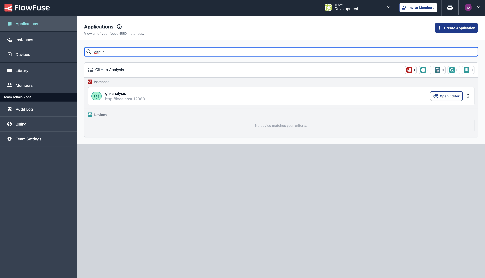

FlowFuse 2.7 has had a big focus on user experience improvements, particularly centered around teams running at large scales, with over a thousand devices and instances. With this in mind, we've introduced a new search feature that allows you to search across all of your FlowFuse instances, devices and applications from a single place, made it easier to manage your devices with bulk actions, introduced a new notifications inbox to give you a clearer picture on activity across your team, and just for good measure, we've also extended the AI-infused Node-RED experience to the JSON Editor.

<!--more-->

## FlowFuse Expert in the JSON Editor

Last release we saw the introduction of the FlowFuse Expert, and in this release we're rolling this out further to include Node-RED's JSON Editor. 

{data-zoomable}
_(Left) Screenshot of the AI prompt for a list of 4-legged creatures and (Right) the resulting JSON generated by the FlowFuse Expert_

{data-zoomable}
_(Left) Screenshot of the AI prompt input for a list of simulated devices and (Right) the resulting JSON generated by the FlowFuse Expert_

This new feature empowers you to create custom data sets within seconds, meaning you can sketch out Dashboards or test Node-RED flows before connecting to real, production environments.

## Managing Resources at Scale

As mentioned in the introduction, a big focus on this release, and moving forward into the next couple too, is around improving the user experience when managing large numbers of devices and instances.

### Centralized Search

We have customers with over a thousand devices and instances running in FlowFuse. It can be very difficult to find the resource you're looking for. That's why we've introduced a new search feature that allows you to search across all of your FlowFuse instances, devices and applications from a single place.

{data-zoomable}
_Screenshot showing the new Application Search feature in FlowFuse_

The search filters as you type, making it easy to find the resource you're looking for. It will keep reference to any applications and or child instances/devices where appropriate too.

### Notifications Inbox

{data-zoomable}
_Screenshot showing the new Notifications Inbox in FlowFuse_

This is a first step in introducing richer notifications across FlowFuse. We've introduced a new notifications inbox that will show you all the activity across your team. Currently, this just shows new team invites, but will soon show instance/device activity that needs your attention and more.

### Bulk Device Actions

We've now enabled the ability to perform bulk actions on devices in FlowFuse. This is particularly useful for managing large numbers of devices, where you might want to update the settings, or delete multiple devices at once.

{data-zoomable}
_Screenshot showing the new Bulk Device Actions feature in FlowFuse_

For now, we just support bulk delete, but we're planning to add [more bulk actions](https://github.com/FlowFuse/flowfuse/issues/2381) in the very near future.

### And Much More...

For a full list of everything that went into our 2.7 release, you can check out the [release notes](https://github.com/FlowFuse/flowfuse/releases/tag/v2.7.0).

We're always working to enhance your experience with FlowFuse. We're always interested in your thoughts about FlowFuse too. Your feedback is crucial to us, and we'd love to hear about your experiences with the new features and improvements. Please share your thoughts, suggestions, or report any [issues on GitHub](https://github.com/FlowFuse/flowfuse/issues/new/choose). 

Together, we can make FlowFuse better with each release!

## Try it out

### Self-Hosted

We're confident you can have self managed FlowFuse running locally in under 30 minutes. You can install using [Docker](/docs/install/docker/) or [Kubernetes](/docs/install/kubernetes/).

### FlowFuse Cloud

The quickest and easiest way to get started with FlowFuse is on our own hosted instance, FlowFuse Cloud: [Get started for free]() now, and you'll have your own Node-RED instances running in the Cloud within minutes.

## Upgrading FlowFuse

If you're using [FlowFuse Cloud]({{ site.appURL }}), then there is nothing you need to do - it's already running 2.7, and you may have already been playing with the new features.

If you installed a previous version of FlowFuse and want to upgrade, our documentation provides a
guide for [upgrading your FlowFuse instance](/docs/upgrade/).

## Getting help

Please check FlowFuse's [documentation](/docs/) as the answers to many questions are covered there. Additionally you can go to the [community forum](https://discourse.nodered.org/c/vendors/flowfuse/24) if you have
any feedback or feature requests.
