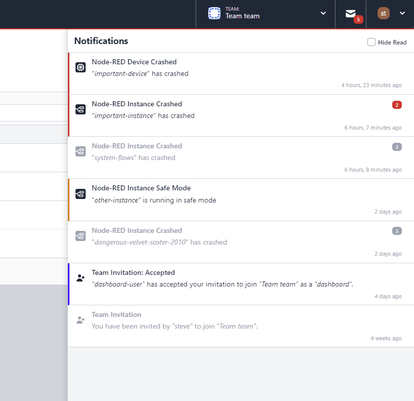
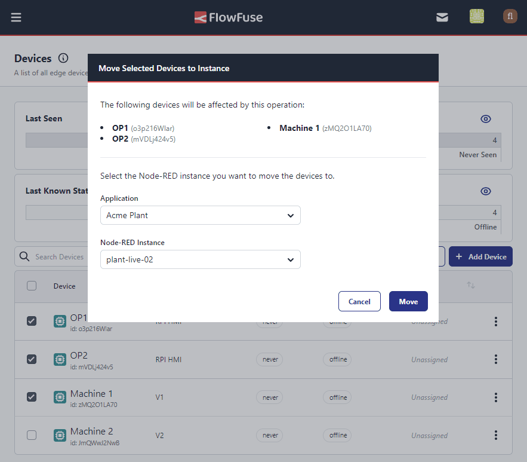

FlowFuse 2.8 sees a new major feature introduced to the platform. The first iteration of the "Static Assets Service" is now available, allowing you to host and serve static files from your FlowFuse instance, giving you easy access to file storage for your applications, and seamless integration of those assets and files within Node-RED.

<!--more-->

## Static Assets Service

The Static Assets Service allows you to host and serve static files from your FlowFuse instance. This feature is particularly useful for applications that require file storage, such as images, videos, or static data sets. 

With the Static Assets Service, you can upload files directly to your FlowFuse instance and access them from your Node-RED flows, like so:

<video controls>
   <source src="https://website-data.s3.eu-west-1.amazonaws.com/Assets+Service+Demo.mp4" type="video/mp4">
   Your browser does not support the video tag.
</video>

This is the first step in this new feature set, with more enhancements planned for future releases, whereby you'll also be able to configure access control to public HTTP endpoints for easy access in your Dashboards.

## LDAP Service Improvements

Team Membership in FlowFuse can now be automatically managed using LDAP groups. This means that you can now assign roles to LDAP groups, and when a user is added to that group in your LDAP server, they will automatically be assigned the respective role in FlowFuse.

This also extends to the management of FlowFuse Admin users, which was previously only supported for SAML SSO.

The Admin management feature is available for those running self-hosted FlowFuse.

## Notifications Improvements

Last release we introduced the [Notifications Inbox](/blog/2024/08/flowfuse-2-7-release#notifications-inbox), and in this release we're starting to expand on the notifications that you wil receive in FlowFuse, starting with alerts when your Node-RED instances and devices crash unexpectedly, and when instances start in "Safe Mode".

{data-zoomable}
_Screenshot showing some example notifications to inform users of unexpected crashes_

We're also added filters to show "Read" notifications, and grouping together similar notifications so that it's easy to parse if you have many notifications of the same type.

## Managing Devices at Scale

As promised in the [FlowFuse 2.7 Release](/blog/2024/08/flowfuse-2-7-release#bulk-device-actions), we've expanded the actions you can take when working with many Devices at once, which now includes the ability to move Devices between Applications and Instances.

{data-zoomable}
_Screenshot to show the new "Move to Instance" and "Move to Application" bulk actions_

## Stricter Approach to Expired Licenses

We've made some changes to how FlowFuse handles expired licenses for self-hosted users.

If your license has expired, you will now be unable to access your FlowFuse instance until you renew your license. This is to ensure that you are always using the latest version of FlowFuse and have access to the latest features and security updates.

If you are currently running an older version of FlowFuse with an expired license please [contact the Sales team](/contact-us/) to discuss renewing your license before upgrading to FlowFuse 2.8. You can check your current license on the "Admin Settings" > "Overview" page.

## And Much More...

For a full list of everything that went into our 2.8 release, you can check out the [release notes](https://github.com/FlowFuse/flowfuse/releases/tag/v2.8.0).

We're always working to enhance your experience with FlowFuse. We're always interested in your thoughts about FlowFuse too. Your feedback is crucial to us, and we'd love to hear about your experiences with the new features and improvements. Please share your thoughts, suggestions, or report any [issues on GitHub](https://github.com/FlowFuse/flowfuse/issues/new/choose). 

Together, we can make FlowFuse better with each release!

## Try it out

### Self-Hosted

We're confident you can have self managed FlowFuse running locally in under 30 minutes. You can install using [Docker](/docs/install/docker/) or [Kubernetes](/docs/install/kubernetes/).

### FlowFuse Cloud

The quickest and easiest way to get started with FlowFuse is on our own hosted instance, FlowFuse Cloud: [Get started for free]({{ site.onboardingURL }}) now, and you'll have your own Node-RED instances running in the Cloud within minutes.

## Upgrading FlowFuse

If you're using [FlowFuse Cloud]({{ site.appURL }}), then there is nothing you need to do - it's already running 2.8, and you may have already been playing with the new features.

If you installed a previous version of FlowFuse and want to upgrade, our documentation provides a guide for [upgrading your FlowFuse instance](/docs/upgrade/).

If you have an Enterprise license please make sure to review this [changelog entry](/changelog/2024/08/enterprise-license-update)

## Getting help

Please check FlowFuse's [documentation](/docs/) as the answers to many questions are covered there. Additionally you can go to the [community forum](https://discourse.nodered.org/c/vendors/flowfuse/24) if you have
any feedback or feature requests.
