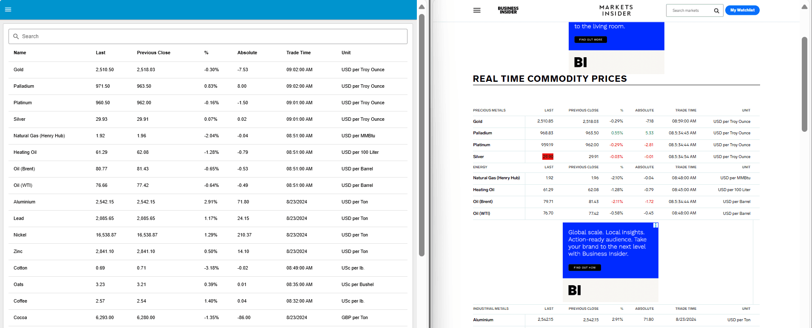

Have you ever needed to scrape data from websites to monitor news, track competitors, or gather insights about your industry? In this guide, you'll learn how to use Node-RED for efficient web scraping, allowing you to extract and manage data from various websites seamlessly. Whether you're looking to keep tabs on the latest articles, product mentions, or market trends, this step-by-step approach will help you set up Node-RED, configure scraping flows, and handle data extraction effectively.

<!-- more -->

## What is Web Scraping?

Web scraping is a technique used to extract data from websites automatically. Instead of manually copying information from web pages, web scraping uses tools or scripts to access and retrieve data from the internet efficiently. This process allows you to gather large volumes of information quickly, which is useful for tasks such as tracking market trends, aggregating news, or collecting product details.

By automating data collection, web scraping helps in saving time and reducing human error. It enables users to extract and analyze structured data from various sources, making it easier to compile and utilize information for research, business intelligence, or other purposes.

## Why Use Web Scraping If APIs Are Available?

APIs are a convenient way to access data from websites, but not all sites offer APIs, or their APIs may not provide the specific data you need.

Web scraping can be useful when APIs are not available or do not meet your requirements. It allows you to collect data directly from web pages, which can be helpful for tasks like competitive analysis, market research, or tracking specific online content.

## How Web Scraping Works?

Web scraping involves a systematic approach to extracting data from websites using automated tools or scripts. The process begins with sending an HTTP request to a website's server, requesting access to a specific webpage. In response, the server provides the HTML content of the page. This HTML code contains the structured information displayed on the webpage, organized in a format that describes the layout and content.

Once the HTML is received, the next step is parsing it. Parsing involves analyzing the HTML structure to identify and extract the data of interest. This may include navigating through nested elements, locating specific tags, and using selectors to target precise content such as text blocks, images, or links. The extracted data is then processed and stored in a format that suits the user's needs, whether it be a database, a CSV file, or another format suitable for analysis.

## Web scrapping with Node-RED 

In this section, we will guide you through the process of scraping data from publicly available websites using Node-RED. We'll start with a demonstration of extracting a table of commodity prices form the public website.

### Sending Requests to a Webpage

To start scraping data, follow these steps to send an HTTP GET request to the webpage:

1. Drag the **inject** node onto the canvas. This node will allow you to manually trigger the HTTP request or set it to fire at specific intervals.
2. Drag the **http request** node onto the canvas. Double-click it to configure and set the **Method** to `GET`. Enter the URL of the webpage you want to scrape (e.g., `https://markets.businessinsider.com/commodities/realtime-list`).
3. Drag the **debug** node onto the canvas.
4. Connect the **inject** node's output to the input of the **http request** node and the **http request** node's output to the input of the **debug** node.
5. Click **Deploy** to save and deploy your flow.

Once deployed, click the **inject** button. You will see the raw HTML printed in the debug panel.

### Parsing and Extracting Data from HTML

Next, we need to process the raw HTML to extract meaningful data. This involves parsing the HTML content and identifying the specific information you want. To do this, first analyze the HTML structure of the webpage by opening the browser’s developer tools (press Ctrl + I or F12) and inspecting the elements to locate where the data is and in which HTML elements it resides.

#### Analyzing HTML Structure

Begin by analyzing the HTML structure of the webpage. Open your browser’s developer tools (press Ctrl + I or F12) and inspect the elements to locate where the data resides and in which HTML elements it is contained. For example, on a page with commodity prices, you might find that the data is organized within `<table>` tags, with `<tbody>` containing rows `<tr>`, and individual data items within `<td>` tags.

To extract all rows of the table, use the selector "table > tbody > tr". If you need to be more specific (e.g., targeting a specific table), adjust your selector accordingly to ensure you capture the correct data.

{data-zoomable}
_Image showing the structer of the page and the data which we needed to extract_

#### Using Node-RED to extract data

1. Drag the **html** node onto the canvas.
2. Double-click the **html** node and enter the selector `table > tbody > tr` into the "Selector" field.
3. Set the output to "only the text of element" and keep other settings default.
4. Drag the **debug** node onto the canvas.
5. Connect the output of the **http request** node to the input of the **html** node and the output of the **html** node to the input of the **debug** node.
6. Click **Deploy** to save and deploy your flow.

When you click the **inject** button, you will see the array containing the text content from each `<tr>` tag. While this data is a good starting point, it is not yet in a format that is directly useful for analysis. To make the data more useful, you'll need to transform it into objects with meaningful properties.

### Transforming Data into Structured Objects

To transform the data into structured objects, you can use JavaScript in a Node-RED function node. If you're familiar with JavaScript, this process is straightforward. If not, you can use FlowFuse Assistant to generate the necessary function. For more information, refer to this LinkedIn Post for a quick guide. To follow the steps manually:

1. Drag the **function** node onto the canvas.
2. Double-click the **function** node and paste the following JavaScript code:

```js
let data = msg.payload;

// Initialize an empty array to hold the result
const commodities = [];

// Define the common fields for each commodity
const fields = [
    'name',
    'currentPrice',
    'previousPrice',
    'percentChange',
    'change',
    'time',
    'unit'
];

// Loop through each entry and extract data
data.forEach(entry => {
    // Check if the entry is non-empty
    if (entry.trim()) {
        // Split the entry into lines
        const lines = entry.trim().split('\n\t\t\t\t\t\t\t\t\t\t').filter(line => line.trim() !== '');

        // Create a new commodity object
        const commodity = {};

        // Assign values to the commodity object based on the lines
        fields.forEach((field, index) => {
            commodity[field] = lines[index] || '';
        });

        // Add the commodity object to the array
        commodities.push(commodity);
    }
});

msg.payload = commodities;
return msg;
```

3. Drag the **debug** node onto the canvas.
4. Connect the output of the html node to the input of the **function** node, and the output of the **function** node to the input of the debug node.
5. Click **Deploy** to save and deploy your flow.

When you click the inject button again, you will see that the data is now structured and formatted. The output will contain objects with properties such as commodity name, current price, previous price, etc. This data can now be displayed on the FlowFuse dashboard table. For more details, refer to the [FlowFuse table widget](https://dashboard.flowfuse.com/nodes/widgets/ui-table.html).


{data-zoomable}
_Image showing the table we created on the FlowFuse dashboard and the original webpage with the table]_

## Conclusion

You’ve now learned how to use Node-RED for web scraping, from sending requests and parsing HTML to transforming data into useful formats. This approach streamlines data collection from websites, making it easier to manage and analyze information efficiently.
