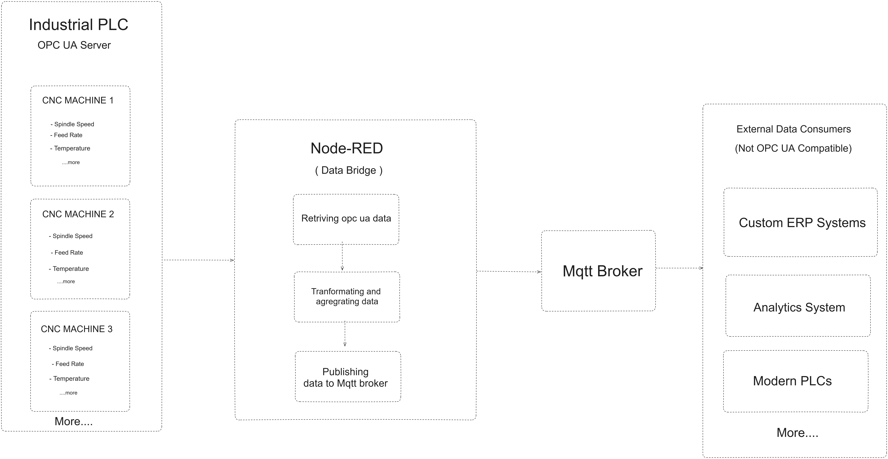

Have you ever found yourself trying to connect old industrial systems with new IoT tools? Maybe you have machinery that uses OPC UA, but your data is sent through MQTT. How do you make these systems work together smoothly?

<!-- more -->

In this guide, we'll demonstrate how to use Node-RED to bridge OPC UA data to MQTT. This integration will streamline your data flow and enhance real-time monitoring, helping you modernize your setup and improve communication between systems.

### Why Bridge OPC UA to MQTT

{data-zoomable}
_Diagram showing the data flow when bridging OPC UA to MQTT to enable communication between non-OPC UA compatible systems and devices._

In modern industrial environments, integrating systems with different communication protocols can be a significant challenge. For example, a CNC machine on the factory floor might use OPC UA, while some cloud solutions, edge devices, and other systems, such as custom ERP solutions and IoT applications, might rely on MQTT protocol. This is where bridging OPC UA to MQTT becomes highly beneficial.

By converting OPC UA data into MQTT messages, you make the data from the CNC machine accessible to a wider range of systems that use MQTT, which is a more universally supported messaging protocol. This bridging solution simplifies the integration process, allowing diverse systems to communicate effectively without needing direct OPC UA support.

**Node-RED** is perfect for this job. It can connect both OPC UA and MQTT, making it easy to transform and route data between different systems. Its flexibility and support for many protocols make it great for integrating various industrial hardware and software. For more on how Node-RED can improve industrial operations, check out [Building on FlowFuse: Remote Device Monitoring](/blog/2024/07/building-on-flowfuse-devices/).

## Bridging OPC UA Data to MQTT with Node-RED

In this section, I'll demonstrate how to bridge OPC UA data to MQTT using Node-RED. We will use simulated OPC UA server data from a CNC machine as an example. The goal is to show how you can efficiently transfer this data to an MQTT broker, making it accessible to a variety of applications and systems.

### Prequiste

- OPC UA Server : Make sure you have an OPC UA server configured and running with the necessary data. For this blog, we'll use the Prosys OPC UA Simulation Server, which simulates data of CNC machine for us designed for testing OPC UA client applications and learning the technology. You can download it from [here](https://prosysopc.com/products/opc-ua-simulation-server/).

- [node-red-contrib-opcua](https://flows.nodered.org/node/node-red-contrib-opcua): install the node-red contrib package that will enable integration of opcua in Node-RED.

### Retrieving Data from the OPC UA Server

To begin retrieving data from your OPC UA server using Node-RED, follow these steps:

1. Drag the Inject node onto the canvas. Double-click on the node to open its configuration settings. Set the `msg.topic` to the node ID and datatype of the property you wish to read.
2. Drag the OPC UA Client node onto the canvas. Double-click on it to open its configuration settings. Click the "+" icon next to the Endpoint field and enter the URL of your running OPC UA server. Configure the security policy and mode according to your server setup. If you are using the Prosys OPC UA Simulation Server and have not enabled any security features, you can leave the security policy and mode as "None."
3. In the OPC UA Client node settings, select the action type as "READ." This instructs Node-RED to read data from the OPC UA server.
4. If your OPC UA server uses security features, specify the path to your certificate files in the relevant fields. If no security is configured, this step can be skipped.
5. Drag the Debug node onto the canvas. This will help you verify the data retrieved from the OPC UA server.
6. Connect the output of the Inject node to the input of the OPC UA Client node. Then, connect the output of the OPC UA Client node to the input of the Debug node. This setup ensures that when the Inject node triggers, it sends data to the OPC UA Client node, and the results are displayed in the Debug node.
7. Deploy the flow by clicking the "Deploy" button in the top right corner. To test the setup, press the Inject button.

You can follow the same steps to retrieve other property values from the OPC UA server. In this example, we are retrieving four simulated data properties: the name of the cycle time, temperature, and spindle speed of CNC machine. Your setup might differ depending on the properties and data available on your OPC UA server.

### Transforming and Aggregating Data

Once you have successfully retrieved data from your OPC UA server, the next step is to transform and aggregate this data to make it suitable for publishing to an MQTT broker. In this demonstration, we will aggregate the retrieved individual property values into a single object. Depending on your specific needs, you might choose to split the object properties and send them separately or perform various calculations and transformations on the data.

1. Drag the Change node onto the canvas.
2. Double-click on the node and set `msg.topic` to the name of the property you want to set for the retrieved data. In this context, set `msg.topic` to `'cycle-time'`, which will be the key in the object that we will create.
3. Drag the Join node onto the canvas. Set the mode to manual, with the option to create `msg.payload` using the values of `msg.topic` as keys. Set the count to 3 and ensure that the interval for all of the Inject nodes connected to the OPC UA client is the same. This ensures that the data is collected and aggregated correctly at the same time.
4. Connect the output of the OPC UA client node (which retrieves the data) to the input of the Change node. For example, if I have set the Change node for the 'cycle-time' data property, connect it to the OPC UA client node that retrieves this data.
5. Connect the output of the change node to the input of join node.
6. Repeat this process for all of your data properties.

### Sending Data to the MQTT Broker

Now, in this section, we will show you how to send the collected data to an MQTT broker:

1. Drag the mqtt out node onto the canvas.
2. Double-click on it and configure it with your MQTT broker details. For this guide, I am utilizing the [free HiveMQ public broker](https://www.hivemq.com/mqtt/public-mqtt-broker/) which is specially desinged for testing and learning purpose.
3. Set the topic for your data in the MQTT Out node.
4. Connect the output of the Join node to the input of the mqtt out node.
5. Deploy the flow. After deploying, you will see the status "connected" with a green dot at the bottom of each node, indicating that you have successfully connected to your MQTT broker.

### Retrieving Data from MQTT Broker

For systems that don't support OPC UA, you might need to retrieve data from the MQTT broker. This is particularly useful when integrating with systems that can only consume MQTT messages. To complete this setup, follow these steps to retrieve and utilize the data sent to the MQTT broker:

1. Drag the mqtt in node onto the canvas.
2. Double-click on it and configure it with your MQTT broker details, matching those used in the mqtt out node. Set the topic to match the one used when sending data.
3. Connect the output of the mqtt in node to a Debug node to verify that data is being received correctly.
4. Deploy the flow. The Debug node will display incoming MQTT messages, allowing you to confirm that your data integration is working as expected.

### Up Next

- [Using MQTT with Node-RED](https://flowfuse.com/blog/2023/07/using-mqtt-with-node-red/)
  Learn how to integrate MQTT with Node-RED to enhance your IoT solutions with real-time data messaging.

- [How to Build an OPC UA Client Dashboard in Node-RED](https://flowfuse.com/blog/2023/07/how-to-build-a-opc-client-dashboard-in-node-red/)
  Follow a step-by-step guide to create a comprehensive OPC UA client dashboard in Node-RED for effective monitoring and control.

- [Building a Secure OPC UA Server in Node-RED](https://flowfuse.com/node-red/protocol/opa-ua/)
  Explore best practices for configuring a secure OPC UA server in Node-RED to ensure safe and reliable data exchange.

- [How to Deploy a Basic OPC UA Server in Node-RED](https://flowfuse.com/blog/2023/07/how-to-deploy-a-basic-opc-ua-server-in-node-red/)
  Learn how to quickly deploy a basic OPC UA server in Node-RED for testing and development purposes.

- [Node-RED as a No-Code EtherNet/IP to S7 Protocol Converter](https://flowfuse.com/blog/2023/06/node-red-as-a-no-code-ethernet_ip-to-s7-protocol-converter/)
  Discover how to use Node-RED to seamlessly convert EtherNet/IP to S7 protocols with Node-RED.
