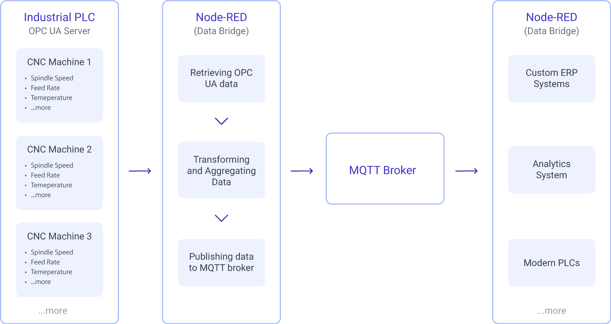
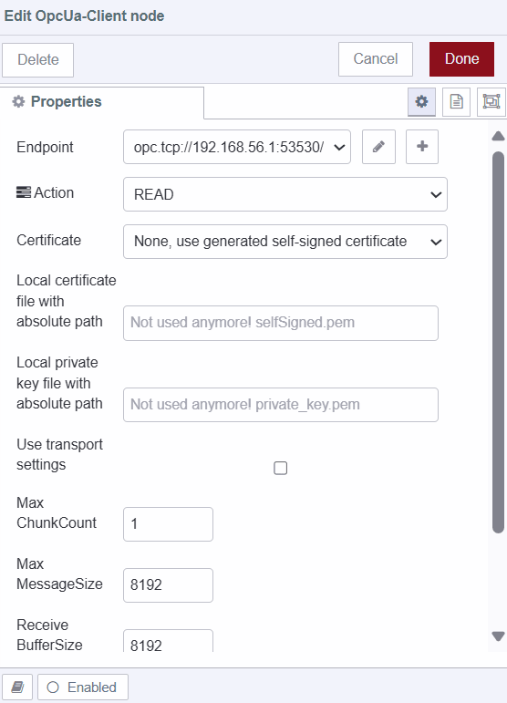
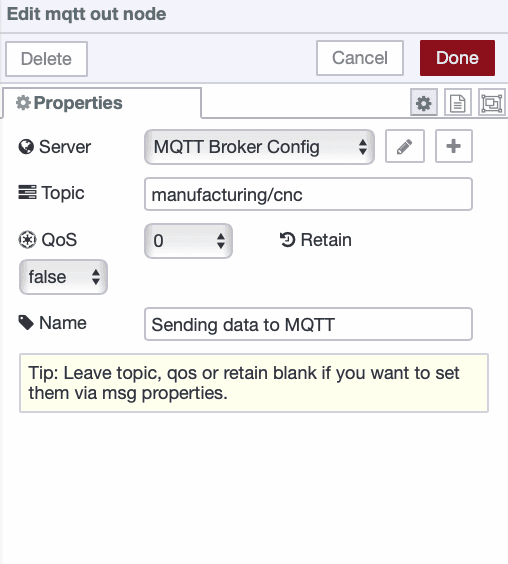

Have you ever found yourself trying to connect old industrial systems with new IoT tools? This is a common scenario when trying to digitally transform while setting up your Unified Name Space. Maybe you have machinery that uses OPC UA, but your data is sent through MQTT. How do you make these systems work together smoothly?  

<!--more-->

In this guide, we'll demonstrate how to use Node-RED to bridge OPC UA data to MQTT. This integration will streamline your data flow and enhance real-time monitoring, helping you modernize your setup and improve communication between systems.

### Why Bridge OPC UA to MQTT

{data-zoomable}
_Diagram showing the data flow when bridging OPC UA to MQTT to enable communication between non-OPC UA compatible systems and devices._

In modern industrial environments, integrating systems with different communication protocols can be a significant challenge. For example, a CNC machine on the factory floor might use OPC UA, while some cloud solutions, edge devices, and other systems, such as custom ERP solutions and IoT applications, might rely on MQTT protocol. This is where bridging OPC UA to MQTT becomes highly beneficial.

By converting OPC UA data into MQTT messages, you make the data from the CNC machine accessible to a broader range of systems that use MQTT, which is a more universally supported messaging protocol. This bridging solution simplifies the integration process, allowing diverse systems to communicate effectively without needing direct OPC UA support.

**Node-RED** is perfect for this job. It can connect both OPC UA and MQTT, making it easy to transform and route data between different systems. Its flexibility and support for many protocols make it great for integrating various industrial hardware and software. For more on how Node-RED can improve industrial operations, check out [Building on FlowFuse: Remote Device Monitoring](/blog/2024/07/building-on-flowfuse-devices/).

## Bridging OPC UA Data to MQTT with Node-RED

In this section, I'll demonstrate how to bridge OPC UA data to MQTT using Node-RED. We will use simulated OPC UA server data from a CNC machine as an example. The goal is to show how you can efficiently transfer this data to an MQTT broker, making it accessible to various applications and systems.

### Prerequisite

- OPC UA Server: Make sure you have an OPC UA server configured and running with the necessary data. For this blog, we'll use the Prosys OPC UA Simulation Server, which simulates data from CNC machines designed for testing OPC UA client applications and learning the technology. You can download it from [here](https://prosysopc.com/products/opc-ua-simulation-server/).

- FlowFuse Account: A FlowFuse account lets you quickly create, deploy, and manage Node-RED instances in the cloud. [sign up now](?utm_campaign=60718323-BCTA&utm_source=blog&utm_medium=cta&utm_term=high_intent&utm_content=Bridging%20OPC%20UA%20Data%20to%20MQTT%20with%20Node-RED).

- [node-red-contrib-opcua](https://flows.nodered.org/node/node-red-contrib-opcua): install the node-red contrib package that will enable integration of opcua in Node-RED.

- MQTT Broker: We’ll need an MQTT broker for data communication. FlowFuse offers an integrated MQTT Broker Service within Platform for easy setup. For more details, check out [FlowFuse's MQTT Broker Announcement](/blog/2024/10/announcement-mqtt-broker/).

### Retrieving Data from the OPC UA Server

To begin retrieving data from your OPC UA server using Node-RED, follow these steps:

1. Drag the **inject** node onto the canvas.
2. Drag the **change** node onto the canvas and double-click on the node to open its configuration settings. Set the `msg.topic` to the node ID and datatype of the property you wish to read.

{data-zoomable}
_(Left) Image of the Change node setting the 'msg.topic' to retrieve the cycle time data and (Right) the OPC UA Prosys interface._

2. Drag the **OpcUa-Client** node onto the canvas. Double-click on it to open its configuration settings. Click the "+" icon next to the Endpoint field and enter the URL of your running OPC UA server. Configure the security policy and mode according to your server setup. If you use the Prosys OPC UA Simulation Server and have not enabled any security features, you can leave the security policy and mode as "None."

{data-zoomable}
_Configuring opc-ua node with the opc ua server endpoint_

3. In the **OpcUa-Client** node settings, select the action type as "READ." This instructs Node-RED to read data from the OPC UA server.

{data-zoomable}
_Configuring OpcUa-Client node to select the read operation_

4. If your OPC UA server uses security features, specify the path to your certificate files in the relevant fields. If no security is configured, this step can be skipped.
5. Drag the **debug** node onto the canvas. The output will help you verify the data retrieved from the OPC UA server.
6. Connect the output of the **inject** node to the input of the **change** node and the output of the **change** node to the input of the **OpcUa-Client** node. Then, connect the output of the **OpcUa-Client** node to the input of the **debug** node. This setup ensures that when the **inject** node triggers, it sends data to the **OpcUa-Client** node, and the results are displayed in the Debug node.
7. Deploy the flow by clicking the "Deploy" button in the top right corner. To test the setup, press the Inject button.

You can follow the same steps to retrieve other property values from the OPC UA server. In this example, we are retrieving four simulated data properties: the cycle time, temperature, and spindle speed of the simulated CNC machine. Your setup might differ depending on the properties and data available on your OPC UA server.

### Transforming and Aggregating Data

Once you have successfully retrieved data from your OPC UA server, the next step is to transform and aggregate this data to make it suitable for publishing to an MQTT broker. This demonstration, we will aggregate the retrieved individual property values into a single object. Depending on your specific needs, you might choose to split the object properties and send them separately or perform various calculations and transformations on the data.

1. Drag the **change** node onto the canvas.
2. Double-click on the node and set `msg.topic` to the name of the property you want to set for the retrieved data. In this context, set `msg.topic` to `'cycle-time'`, which will be the key in the object that we will create.

{data-zoomable}
_Setting the msg.topic with the change node to retrieve data from the OPC UA server._

3. Drag the **join** node onto the canvas. Set the mode to manual, with the option to create `msg.payload` using the values of `msg.topic` as keys. Set the count to 3 and ensure that the interval for all of the **inject** nodes triggering data retrieval is the same. This ensures that the data is collected and aggregated correctly at the same time.
4. Connect the output of the **OpcUa-Client** node (which retrieves the data) to the input of the **change** node. For example, if I have set the **change** node for the 'cycle-time' data property, connect it to the **OpcUa-Client** node that retrieves this data.
5. Connect the output of the **change** node to the input of the **join** node.
6. Repeat this process for all of your data properties.

### Sending Data to the MQTT Broker

Now, in this section, we will show you how to send the collected data to an MQTT broker:

1. Drag the **mqtt out** node onto the canvas.
2. Double-click on it and configure it with your MQTT broker details.

{data-zoomable}
_Configuring the mqtt out node with broker information_

3. Set the topic for your data in the **mqtt out** node.
4. Connect the output of the **join** node to the input of the **mqtt out** node.
5. Deploy the flow. After deploying, you will see the status "connected" with a green dot at the bottom of each node, indicating that you have successfully connected to your MQTT broker.

{data-zoomable}
_Image showing the successful bridging of OPC UA data to MQTT_


[{"id":"a099aefb08837e70","type":"OpcUa-Client","z":"807758ec576fbfd8","endpoint":"9dd56eda04f5c5b5","action":"read","deadbandtype":"a","deadbandvalue":1,"time":10,"timeUnit":"s","certificate":"n","localfile":"","localkeyfile":"","securitymode":"None","securitypolicy":"None","useTransport":false,"maxChunkCount":1,"maxMessageSize":8192,"receiveBufferSize":8192,"sendBufferSize":8192,"name":"","x":480,"y":320,"wires":[["f5fd1ffafdfe790f"],[]]},{"id":"1aa02b27b99dfe9d","type":"mqtt out","z":"807758ec576fbfd8","name":"","topic":"/manufacturing/cnc","qos":"2","retain":"true","respTopic":"","contentType":"","userProps":"","correl":"","expiry":"","broker":"abd4e6202945fee3","x":1390,"y":380,"wires":[]},{"id":"d565ae620d90498a","type":"OpcUa-Client","z":"807758ec576fbfd8","endpoint":"9dd56eda04f5c5b5","action":"read","deadbandtype":"a","deadbandvalue":1,"time":10,"timeUnit":"s","certificate":"n","localfile":"","localkeyfile":"","securitymode":"None","securitypolicy":"None","useTransport":false,"maxChunkCount":1,"maxMessageSize":8192,"receiveBufferSize":8192,"sendBufferSize":8192,"name":"","x":480,"y":400,"wires":[["fc4b83a8a0be3a35"],[]]},{"id":"0e0614ada3269627","type":"OpcUa-Client","z":"807758ec576fbfd8","endpoint":"9dd56eda04f5c5b5","action":"read","deadbandtype":"a","deadbandvalue":1,"time":10,"timeUnit":"s","certificate":"n","localfile":"","localkeyfile":"","securitymode":"None","securitypolicy":"None","useTransport":false,"maxChunkCount":1,"maxMessageSize":8192,"receiveBufferSize":8192,"sendBufferSize":8192,"name":"","x":480,"y":480,"wires":[["e1c4fe72e4f37b6a"],[]]},{"id":"f5fd1ffafdfe790f","type":"change","z":"807758ec576fbfd8","name":"Set the topic for the data","rules":[{"t":"set","p":"topic","pt":"msg","to":"cycle-time","tot":"str"}],"action":"","property":"","from":"","to":"","reg":false,"x":730,"y":300,"wires":[["913e9de1324a6f21"]]},{"id":"fc4b83a8a0be3a35","type":"change","z":"807758ec576fbfd8","name":"Set the topic for the data","rules":[{"t":"set","p":"topic","pt":"msg","to":"spindle-speed","tot":"str"}],"action":"","property":"","from":"","to":"","reg":false,"x":730,"y":380,"wires":[["913e9de1324a6f21"]]},{"id":"e1c4fe72e4f37b6a","type":"change","z":"807758ec576fbfd8","name":"Set the topic for the data","rules":[{"t":"set","p":"topic","pt":"msg","to":"temperature","tot":"str"}],"action":"","property":"","from":"","to":"","reg":false,"x":730,"y":460,"wires":[["913e9de1324a6f21"]]},{"id":"913e9de1324a6f21","type":"join","z":"807758ec576fbfd8","name":"Create object from those three data property ","mode":"custom","build":"object","property":"payload","propertyType":"msg","key":"topic","joiner":"\\n","joinerType":"str","useparts":false,"accumulate":false,"timeout":"","count":"3","reduceRight":false,"reduceExp":"","reduceInit":"","reduceInitType":"","reduceFixup":"","x":1080,"y":380,"wires":[["1aa02b27b99dfe9d"]]},{"id":"3339483f64116fce","type":"mqtt in","z":"807758ec576fbfd8","name":"","topic":"/manufacturing/cnc","qos":"2","datatype":"auto-detect","broker":"abd4e6202945fee3","nl":false,"rap":true,"rh":0,"inputs":0,"x":170,"y":660,"wires":[["d881d251071bd317"]]},{"id":"d881d251071bd317","type":"debug","z":"807758ec576fbfd8","name":"debug 1","active":true,"tosidebar":true,"console":false,"tostatus":false,"complete":"false","statusVal":"","statusType":"auto","x":460,"y":660,"wires":[]},{"id":"55f43460af9601ec","type":"comment","z":"807758ec576fbfd8","name":"Retrieving the data from mqtt","info":"","x":320,"y":600,"wires":[]},{"id":"628ab54495901021","type":"comment","z":"807758ec576fbfd8","name":"Bridging OPC UA data to MQTT","info":"","x":350,"y":240,"wires":[]},{"id":"ce6b8a0e2c8a895d","type":"change","z":"807758ec576fbfd8","name":"","rules":[{"t":"set","p":"topic","pt":"msg","to":"ns=3;i=1010,datatype=float","tot":"str"}],"action":"","property":"","from":"","to":"","reg":false,"x":290,"y":320,"wires":[["a099aefb08837e70"]]},{"id":"50fe2b9310d3bb3f","type":"change","z":"807758ec576fbfd8","name":"","rules":[{"t":"set","p":"topic","pt":"msg","to":"ns=3;i=1011,datatype=basedatatype","tot":"str"}],"action":"","property":"","from":"","to":"","reg":false,"x":290,"y":400,"wires":[["d565ae620d90498a"]]},{"id":"9cf691f55748d013","type":"change","z":"807758ec576fbfd8","name":"","rules":[{"t":"set","p":"topic","pt":"msg","to":"ns=3;i=1012,datatype=float","tot":"str"}],"action":"","property":"","from":"","to":"","reg":false,"x":290,"y":480,"wires":[["0e0614ada3269627"]]},{"id":"de74dabc616c3094","type":"inject","z":"807758ec576fbfd8","name":"","props":[{"p":"payload"},{"p":"topic","vt":"str"}],"repeat":"","crontab":"","once":false,"onceDelay":0.1,"topic":"","payload":"","payloadType":"date","x":120,"y":400,"wires":[["ce6b8a0e2c8a895d","50fe2b9310d3bb3f","9cf691f55748d013"]]},{"id":"9dd56eda04f5c5b5","type":"OpcUa-Endpoint","endpoint":"opc.tcp://Roni:53530/OPCUA/SimulationServer","secpol":"None","secmode":"None","none":true,"login":false,"usercert":false,"usercertificate":"","userprivatekey":""},{"id":"abd4e6202945fee3","type":"mqtt-broker","name":"","broker":"http://broker.hivemq.com","port":"1883","clientid":"","autoConnect":true,"usetls":false,"protocolVersion":"4","keepalive":"60","cleansession":true,"autoUnsubscribe":true,"birthTopic":"","birthQos":"0","birthRetain":"false","birthPayload":"","birthMsg":{},"closeTopic":"","closeQos":"0","closeRetain":"false","closePayload":"","closeMsg":{},"willTopic":"","willQos":"0","willRetain":"false","willPayload":"","willMsg":{},"userProps":"","sessionExpiry":""}]


## Bridging MQTT Data to OPC UA

In addition to bridging data from OPC UA to MQTT, you might also need to send data from MQTT back to an OPC UA server. This is often required in scenarios where external systems, such as Manufacturing Execution Systems (MES), need to update or control machinery settings.

For example, an MES can send commands or configuration changes via MQTT, which then need to be applied to an OPC UA-controlled machine.

1. Drag an **mqtt in** node onto the Node-RED canvas and configure it with your MQTT broker details and the appropriate topic where the MES publishes commands.
2. Drag the **change** node onto the canvas, Set the `msg.topic` to the node ID and datatype of the property you wish to update.
3. Add an **OpcUa-Client** node to the canvas and configure it with your OPC UA server. Set the action type to "WRITE" to send the received data.
4. Connect the output of the **mqtt in** node to the input of the **change** node, and the output of the **change** node to the input of the **OpcUa-Client** node.

{data-zoomable}
_Image showing the successful bridging of OPC UA data to MQTT_


[{"id":"a099aefb08837e70","type":"OpcUa-Client","z":"FFF0000000000001","endpoint":"9dd56eda04f5c5b5","action":"write","deadbandtype":"a","deadbandvalue":1,"time":10,"timeUnit":"s","certificate":"n","localfile":"","localkeyfile":"","securitymode":"None","securitypolicy":"None","useTransport":false,"maxChunkCount":1,"maxMessageSize":8192,"receiveBufferSize":8192,"sendBufferSize":8192,"name":"","x":760,"y":220,"wires":[[],[]]},{"id":"628ab54495901021","type":"comment","z":"FFF0000000000001","name":"Bridging MQTT to OPC UA","info":"","x":510,"y":140,"wires":[]},{"id":"ce6b8a0e2c8a895d","type":"change","z":"FFF0000000000001","name":"","rules":[{"t":"set","p":"topic","pt":"msg","to":"ns=3;i=1010,datatype=Boolean","tot":"str"},{"t":"set","p":"payload","pt":"msg","to":"paylad","tot":"msg"}],"action":"","property":"","from":"","to":"","reg":false,"x":540,"y":220,"wires":[["a099aefb08837e70"]]},{"id":"0a89ebd0d9f6f577","type":"mqtt in","z":"FFF0000000000001","name":"","topic":"command/cnc/","qos":"2","datatype":"auto-detect","broker":"abd4e6202945fee3","nl":false,"rap":true,"rh":0,"inputs":0,"x":300,"y":220,"wires":[["ce6b8a0e2c8a895d"]]},{"id":"4cf4e425d075722a","type":"mqtt out","z":"FFF0000000000001","name":"","topic":"command/cnc/","qos":"1","retain":"","respTopic":"","contentType":"","userProps":"","correl":"","expiry":"","broker":"abd4e6202945fee3","x":660,"y":400,"wires":[]},{"id":"8e339e511c573905","type":"inject","z":"FFF0000000000001","name":"","props":[{"p":"payload"}],"repeat":"","crontab":"","once":false,"onceDelay":0.1,"topic":"","payload":"false","payloadType":"bool","x":330,"y":400,"wires":[["4cf4e425d075722a"]]},{"id":"9c33cff54b0aca15","type":"comment","z":"FFF0000000000001","name":"Sending Command","info":"","x":490,"y":340,"wires":[]},{"id":"9dd56eda04f5c5b5","type":"OpcUa-Endpoint","endpoint":"opc.tcp://Roni:53530/OPCUA/SimulationServer","secpol":"None","secmode":"None","none":true,"login":false,"usercert":false,"usercertificate":"","userprivatekey":""},{"id":"abd4e6202945fee3","type":"mqtt-broker","name":"","broker":"http://broker.hivemq.com","port":"1883","clientid":"","autoConnect":true,"usetls":false,"protocolVersion":"4","keepalive":"60","cleansession":true,"autoUnsubscribe":true,"birthTopic":"","birthQos":"0","birthRetain":"false","birthPayload":"","birthMsg":{},"closeTopic":"","closeQos":"0","closeRetain":"false","closePayload":"","closeMsg":{},"willTopic":"","willQos":"0","willRetain":"false","willPayload":"","willMsg":{},"userProps":"","sessionExpiry":""}]


### Up Next

- [Using MQTT with Node-RED](/node-red/protocol/mqtt/)
  Learn how to integrate MQTT with Node-RED to enhance your IoT solutions with real-time data messaging.

- [How to Build an OPC UA Client Dashboard in Node-RED](/blog/2023/07/how-to-build-a-opc-client-dashboard-in-node-red/)
  Follow a step-by-step guide to create a comprehensive OPC UA client dashboard in Node-RED for effective monitoring and control.

- [Building a Secure OPC UA Server in Node-RED](/node-red/protocol/opc-ua/)
  Explore best practices for configuring a secure OPC UA server in Node-RED to ensure safe and reliable data exchange.

- [How to Deploy a Basic OPC UA Server in Node-RED](/blog/2023/07/how-to-deploy-a-basic-opc-ua-server-in-node-red/)
  Learn how to quickly deploy a basic OPC UA server in Node-RED for testing and development purposes.

- [Node-RED as a No-Code EtherNet/IP to S7 Protocol Converter](/blog/2023/06/node-red-as-a-no-code-ethernet_ip-to-s7-protocol-converter/)
  Discover how to use Node-RED to seamlessly convert EtherNet/IP to S7 protocols with Node-RED.
