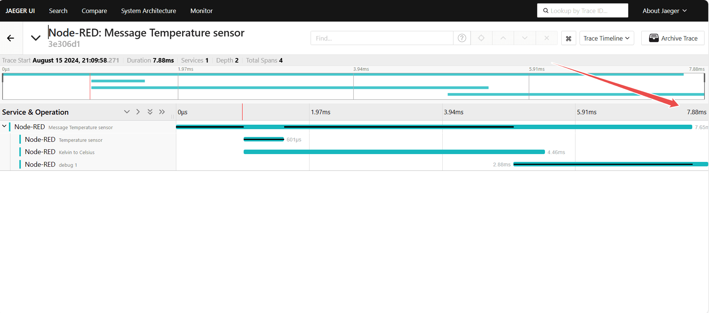

Have you ever found yourself frustrated by unexpected delays in your Node-RED flows, wondering where the bottlenecks are hiding? Even small latency issues can have a big impact on your system's performance. That's where Open Telemetry comes in. With its powerful distributed tracing capabilities, you can finally take control and get a clear view of how your flows are performing in real time.

<!--more-->

Integrating Open Telemetry with Node-RED allows you to monitor latency across your flows. By implementing distributed tracing, you’ll gain the ability to see exactly where delays occur, helping you optimize performance and ensure your IoT applications run efficiently.

## What is Distributed Tracing and How Does Open Telemetry Help?

Distributed tracing is a method used to track and observe the flow of requests through different services within a distributed system. It provides insights into how requests are handled, where delays occur, and how different components interact. By visualizing the path of a request across your system, distributed tracing helps you identify performance bottlenecks and optimize the overall efficiency of your applications.

### What is OpenTelemetry?

Open Telemetry is an open-source framework designed to help you monitor and understand your software systems. It collects and organizes data on how your applications perform and behave, allowing you to track requests as they move through various services. Open Telemetry provides a standardized way to gather and analyze telemetry data, including traces, metrics, and logs, to give you a comprehensive view of your system’s performance.

In Node-RED The Open Telemetry module helps track messages by creating "spans" that record details about each message's journey. Every time a message moves from one node to another, a span is created to capture where it came from, where it’s going, and how long it took. These spans are linked together, showing the entire path of the message through the system. This makes it easier to spot slowdowns, fix problems, and improve how data moves through Node-RED. The module also makes sure this tracking information follows the message as it moves across different nodes and external services.

## Tracing in Node-RED Flows using Opentelemetry

In a manufacturing plant, Node-RED manages different machines and sensors. Suppose there's a problem with the production line, such as a delay in processing or a GPIO node experiencing issues reading data. With Open Telemetry integrated, you can trace the data flow through the system to see exactly where the issue is happening. This helps you quickly identify whether the problem is with a specific node that is reading the machine data or a delay in data processing, allowing you to fix the issue faster and keep the production line running smoothly.

For demonstration purposes, we will use a flow that simulates sensor reading and data processing. We will monitor this flow using Open Telemetry to track data across the system, identify bottlenecks, and optimize performance.


[{"id":"78e4a1255f9d0ad1","type":"group","z":"45e56b4089cada94","name":"","style":{"label":true},"nodes":["636ac7b4d798a5c4","ac87db82c2ab66f5","c8a1749629359031","c0d30281031f07db"],"x":34,"y":139,"w":852,"h":82},{"id":"636ac7b4d798a5c4","type":"inject","z":"45e56b4089cada94","g":"78e4a1255f9d0ad1","name":"Temperature sensor","props":[{"p":"payload"}],"repeat":"","crontab":"","once":true,"onceDelay":0.1,"topic":"","payload":"300","payloadType":"jsonata","x":180,"y":180,"wires":[["c8a1749629359031"]]},{"id":"ac87db82c2ab66f5","type":"debug","z":"45e56b4089cada94","g":"78e4a1255f9d0ad1","name":"debug 1","active":true,"tosidebar":true,"console":false,"tostatus":false,"complete":"payload","targetType":"msg","statusVal":"","statusType":"auto","x":780,"y":180,"wires":[]},{"id":"c8a1749629359031","type":"change","z":"45e56b4089cada94","g":"78e4a1255f9d0ad1","name":"Kelvin to Celsius","rules":[{"t":"set","p":"payload","pt":"msg","to":"payload - 273.15","tot":"jsonata"}],"action":"","property":"","from":"","to":"","reg":false,"x":400,"y":180,"wires":[["c0d30281031f07db"]]},{"id":"c0d30281031f07db","type":"delay","z":"45e56b4089cada94","g":"78e4a1255f9d0ad1","name":"","pauseType":"delay","timeout":"2","timeoutUnits":"seconds","rate":"1","nbRateUnits":"1","rateUnits":"second","randomFirst":"1","randomLast":"5","randomUnits":"seconds","drop":false,"allowrate":false,"outputs":1,"x":600,"y":180,"wires":[["ac87db82c2ab66f5"]]}]


Deploy the flow above, and you might see a delay in the data shown on the debug panel. For this example, we added a Delay node before the Change node that converts temperature data from Kelvin to Celsius. While this delay is visible here, finding such delays in larger flows with many nodes can be difficult and time-consuming. Open Telemetry makes this easier by giving you detailed traces that show where delays or issues are happening

### Prerequisite

Before you start, ensure you have the following:

- [node-red-contrib-opentelemetry](https://flows.nodered.org/node/node-red-contrib-opentelemetry) : Install this Node-RED module via the Node-RED Palette Manager.
- Open Telemetry exporter: Set up an Open Telemetry exporter to send trace data to a backend. For details on available exporters, visit [Open Telemetry Exporters](https://opentelemetry.io/docs/instrumentation/js/exporters/). For this guide, I have set up the [Jaeger](https://jaegertracing.io/).

### Setting Open Telemetry in Node-RED

_Screenshot showing the configuration of opentelmetry node_

1. Drag an `OTEL` node onto the canvas.
2. Double-click on the node and set the URL to your exporter endpoint (e.g., `http://localhost:4318/v1/traces` for a locally running Jaeger exporter). Provide a name for the service according to your preference, and set the Prefix, which will be added to the root Node-RED span name before the initial node name (you can keep it as "Message" if preferred).
3. In the Ignore field, add the names of nodes you want to exclude from Open Telemetry tracing.
4. In the Propagate field, add the names of nodes if you want them to forward trace headers to external systems or other nodes in the flow. This ensures that these nodes participate in the distributed trace, allowing the trace context to be maintained across different components.
5. Set the Timeout to define how long (in seconds) the OTEL node should wait before ending and discarding a message that has not been modified.
6. Now deploy the flow by clicking on the top-right deploy button.

Once the flow is deployed, Open Telemetry will start collecting and sending trace data to your specified exporter.

### Monitoring Performance Using the Exporter Web UI

Now, let's monitor the performance and latency between each node to identify delays. For this section, I am assuming you have Jaeger running as your exporter.

1. Open the Jaeger web UI in your browser. By default, it will be available at `http://localhost:16686/`.
2. Navigate to the "Search" by clicking on the "Search" option at the top.
3. Select the service name that you configured in the OTEL node from the service field. Once selected, you will see all the traces for each interaction in the flow. You can filter the traces by specific nodes using the operation field.
4. To monitor and find issues, select the desired trace and click on the "Find Trace" button. Click on the first trace to examine it.

Once the trace opens, you will see the duration taken by each node to process and pass data. Notice the time taken by the delay node, which is 2 seconds, indicating the problem. By clicking on the green line corresponding to this delay node, you can view more detailed information about the trace.

_Image showing the tototal duration taken by the flow_

Since the issue was identified with the delay node, let's remove that delay node.


[{"id":"636ac7b4d798a5c4","type":"inject","z":"350fb9fbb98012be","name":"Temperature sensor","props":[{"p":"payload"}],"repeat":"","crontab":"","once":true,"onceDelay":0.1,"topic":"","payload":"300","payloadType":"jsonata","x":200,"y":100,"wires":[["c8a1749629359031"]]},{"id":"ac87db82c2ab66f5","type":"debug","z":"350fb9fbb98012be","name":"debug 1","active":true,"tosidebar":true,"console":false,"tostatus":false,"complete":"payload","targetType":"msg","statusVal":"","statusType":"auto","x":640,"y":100,"wires":[]},{"id":"c8a1749629359031","type":"change","z":"350fb9fbb98012be","name":"Kelvin to Celsius","rules":[{"t":"set","p":"payload","pt":"msg","to":"payload - 273.15","tot":"jsonata"}],"action":"","property":"","from":"","to":"","reg":false,"x":420,"y":100,"wires":[["ac87db82c2ab66f5"]]}]


After updating the flow, redeploy the flow and check the traces again. You should see that the total time has been reduced significantly, with the overall flow now taking around 8 milliseconds instead of the previous 2 seconds. This demonstrates how Open Telemetry helps in identifying and resolving performance issues in your Node-RED flows.

_Image showing the total duration taken by the flow after fixing the issue_

Throughout this guide, we’ve interacted with an exporter which is running locally. However, by deploying and setting up your exporter on a server, you can remotely monitor the performance of your Node-RED flows. This setup enables you to oversee your system's performance from anywhere, making it easier to detect and address issues promptly.

## Enhancing Monitoring and Optimization with FlowFuse

While OpenTelemetry excels at tracing and optimizing Node-RED flows, FlowFuse offers a powerful solution for managing and monitoring Node-RED instances. It streamlines the creation, deployment, and management of instances, allowing you to deploy your applications with a single click and minimizing deployment complexity and errors.

FlowFuse also boosts collaboration and security through features like team management, role-based access control, multi-factor authentication, and snapshot recovery. These capabilities ensure effective management, secure access, and easy recovery from changes, making FlowFuse an essential tool for optimizing and overseeing your Node-RED deployments.

{% include "cta.njk", cta_url: "/get-started?utm_campaign=60718323-BCTA&utm_source=blog&utm_medium=cta&utm_term=high_intent&utm_content=Monitoring%20and%20Optimizing%20Node-RED%20Flows%20with%20Open%20Telemetry", cta_type: "signup", cta_text: "" %}

## Conclusion

Integrating OpenTelemetry with Node-RED enables you to efficiently trace and resolve delays in your flows, ensuring smoother and more efficient operation of your IoT applications. By following the steps outlined in this guide, you can leverage distributed tracing to identify performance bottlenecks and optimize your flows effectively. With OpenTelemetry's detailed insights and FlowFuse's robust features, you'll be well-equipped to maintain peak performance and manage your Node-RED environment seamlessly.

