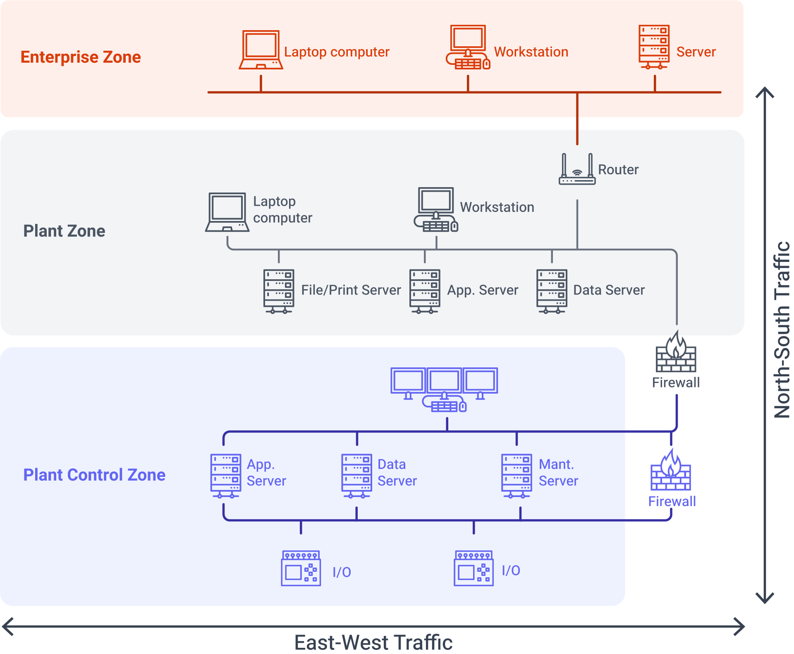

To democratize technology means to make it accessible to the masses. The Industrial Revolution exemplified this, continually transforming technology to benefit a broader audience. This ranges from the discovery of fire to the development of the wheel, assembly lines, and the Universal Namespace (UNS)—with the common goal of sharing valuable new technologies. Our focus here will be on Industry 3.0 and 4.0 and the direction we are heading.

<!--more-->

## Industry 3.0: The Rise of PLCs

Industry 3.0 saw significant acceleration with the advent of Programmable Logic Controllers (PLCs). These devices transitioned the use of physical relays into their electronic counterparts. Initially, PLCs were programmed using five languages outlined by IEC 61134-3. This standard laid the groundwork for modern PLC programming, with Ladder Logic emerging as a popular method due to its visual similarity to traditional relay logic. This eased the transition for many engineers from physical to digital logic design, arguably creating one of the first widely adopted low-code solutions.

## Industry 4.0: Embracing Connectivity

The essence of Industry 4.0 has been connectivity, primarily marked by the industrial adoption of Ethernet’s physical layer. While previous solutions facilitated device communication on the same level (East-West traffic), they fell short of enabling what we now consider North-South communication. Ethernet, originally designed for IT infrastructure communication, had to be adapted for operational technology (OT) through the development of protocols like EthernetIP, EtherCAT, and Profinet, specifically designed for East-West traffic. However, these protocols evolved to also support data capture from systems using drivers like S7, marking a transformative phase in the industry that enabled real-time data-driven decision-making.

{data-zoomable}
_Network Traffic Diagram_

## The Evolution of Data Handling Models

This period also witnessed the rise of ISA-95 and the Purdue Model, which were instrumental in structuring data transport between layers. Each layer chose protocols best suited to its needs, creating a point-to-point model that, while effective, was cumbersome to establish. Although some organizations emerged as industry leaders by successfully implementing this architecture, they often struggled with the last 5%+ of integration and incorporate of modern technologies. Seemingly simple tasks were complex due to data not being in the right place or in the right format, stripping away vital meta-information not considered during the initial data point definition.

## Redefining Industry 4.0: The Birth of Industry 4.5

This leads us to revisit our strategies, refining solutions like the Digital Thread and the UNS to continue advancing Industry 4.0's connectivity initiatives. The upcoming iteration, which could be termed Industry 4.5, aims to enhance this connectivity by integrating applications that add a new layer of complexity and capability to connectivity issues.

## The Role of FlowFuse in Industry 4.5

An example of this integration is how companies might choose FlowFuse, a platform that not only provides application-building capabilities but also solves connectivity challenges. Organizations might use FlowFuse as a complete solution or augment it with bespoke applications, similar to how vanilla Node-RED is currently being adopted in the industry.

## The Future

In conclusion, the democratization of technology in industrial contexts not only makes powerful tools widely accessible but also continuously evolves to meet the changing needs of the industry. As we look towards Industry 4.5 and beyond, the focus will increasingly be on how applications can enhance connectivity to drive further innovation and efficiency.