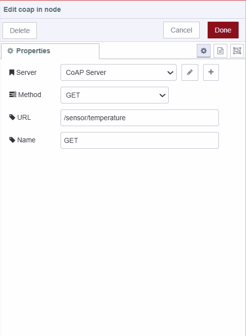
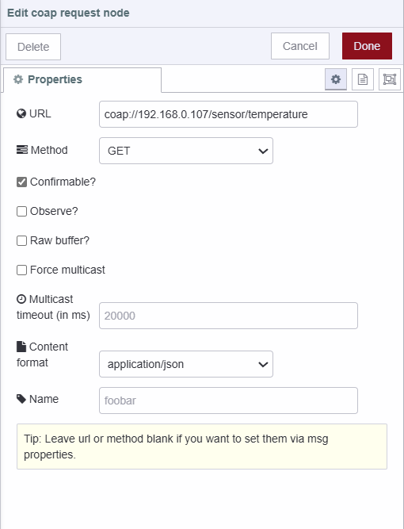

Have you ever wondered how to make communication between IoT devices more efficient, especially when dealing with limited resources? In this blog, we’ll explore CoAP (Constrained Application Protocol), a protocol designed for low-power, resource-constrained environments. We’ll compare CoAP with HTTPS and MQTT, and show you how to integrate CoAP with Node-RED for seamless data communication.

## What is CoAP and why it matters?

CoAP (Constrained Application Protocol) is a specialized protocol designed for the Internet of Things (IoT) and other environments where resources are limited. Unlike traditional HTTP, which relies on the heavier TCP (Transmission Control Protocol), CoAP uses UDP (User Datagram Protocol). This allows CoAP to offer lower overhead and reduced latency, making it much more efficient for devices with limited power and bandwidth.

**Why does this matter?** Take a battery-powered Raspberry Pi used for monitoring environmental conditions such as temperature and humidity. With CoAP, the Raspberry Pi can send and receive data more efficiently, conserving battery life and operating effectively even in low-bandwidth areas. By minimizing the energy required for communication, CoAP helps extend the device’s operational life and ensures reliable data transmission, which is essential for maintaining accurate and continuous monitoring in remote or resource-constrained settings.

## Comparing Resource Consumption of HTTPS, MQTT, and CoAP for Temperature Data Transmission

To understand how different protocols perform in real-world scenarios, let’s compare HTTPS, MQTT, and CoAP. We'll look at how each protocol handles the task of sending temperature data to a server. For this comparison, we'll assume the following typical setup:

- Payload: Each message contains 50 bytes of temperature data.
- Frequency: The system sends 100 messages per second.

**Note**: The values presented are approximate and calculated based on typical characteristics of each protocol under common conditions. Actual values may vary depending on specific implementations and network environments.

| Protocol | Payload (bytes) | Message Size Overhead (bytes) | Total Data Sent per Message (bytes) | Bandwidth Usage Calculation                        | Bandwidth Usage (kbps) | Latency (ms) | CPU Usage (%) | Memory Usage (MB) | Typical Use Cases                     |
|----------|------------------|-------------------------------|--------------------------------------|----------------------------------------------------|------------------------|--------------|---------------|-------------------|---------------------------------------|
| **HTTPS**| 50               | 500                           | 550                                  | (550 bytes/message × 100 messages/second × 8 bits/byte) / 1000 | 440                    | 100          | 10% to 50%           | 100               | Web Services, API Communication       |
| **MQTT** | 50               | 100                           | 150                                  | (150 bytes/message × 100 messages/second × 8 bits/byte) / 1000 | 120                    | 50           | 5% to 30%          | 50                | IoT, Telemetry, Messaging             |
| **CoAP** | 50               | 20                            | 70                                   | (70 bytes/message × 100 messages/second × 8 bits/byte) / 1000  | 56                     | 10           | 2% to 20%          | 20                | IoT, Low-Power Sensor Networks        |

## Using CoAP with Node-RED

In this section, we'll explore how to use CoAP with Node-RED to enable efficient communication between devices. I'll walk you through an example where a Raspberry Pi reads temperature data from a sensor, and a Windows machine requests this data using CoAP.

### Prerequisites

- **Node-RED**: Ensure that the Node-RED is installed and running on both of your hardware devices: one acting as the server and the other as the client machine.

- **node-red-contrib-coap**: Install the `node-red-contrib-coap` package in your Node-RED environment. This package provides the CoAP nodes needed for integration.

For detailed instructions on setting up the Node-RED on your various hardware devices, refer to [Setting up Node-RED on Different Hardware](/node-red/hardware/).

### Setting up the CoAP Server

Setting up a CoAP server in Node-RED is similar to setting up an HTTP server. CoAP uses a request-response model similar to HTTP with methods like GET, POST, DELETE, and PUT, making it straightforward if you're familiar with HTTP servers in Node-RED.

If you are not fimilier with how to set up HTTP servers in Node-RED, refer to [Creating REST APIs with Node-RED](https://flowfuse.com/node-red/integration-technologies/rest/).

{data-zoomable}
_Screenshot showing the settings of the coap-in node_

1. Drag the `coap-in` node onto the canvas.
2. Double-click on the node and click on the "+" next to the "Server" field. Provide a name for the configuration, set the port to the default `5683` (the standard port for CoAP), and check the "Use UDP6 Agent" box if you want to enable IPv6 support.
3. Click "Add" to save the server configuration.
4. Select the GET method.
5. Enter the URL endpoint for the CoAP server, which specifies the path where the CoAP server will listen for incoming requests.
6. Click "Done" to save the configuration.
7. Drag the `change` node onto the canvas and set `msg.payload` to `flow.temp` (assuming you're storing the temperature value in this context variable).
8. Drag the `coap-response` node onto the canvas and set the status to 200 and content format to application/json.
9. Connect the `coap-in` node's output to the input of the `change` node and the output of the `change` node to the input of the `coap-response` node.

Our CoAP server is now set up on a low-overhead device that performs specific tasks and is capable of handling requests. This setup allows the server to communicate and share data with other devices efficiently, making it ideal for scenarios where power efficiency and minimal resource usage are crucial.

### Requesting Data from the Server

{data-zoomable}
_Screenshot showing settings of coap-request node_

1. Drag the `inject` node onto the canvas.
2. Drag the `coap-request` node onto the canvas.
3. Double-click on the `coap-request` node, set the URL to `coap://<ip-address>/sensor/temperature`, replacing `<ip-address>` with the IP address of your device running the CoAP server.
4. Select the method to `GET`.
5. Enable the `Confirmable` option to ensure reliability.
6. Enable the `Observe` option if you want to receive updates whenever the data changes.
7. Enable the `Raw Buffer` option if you need the raw data format.
8. To force multicast, enable the `Force Multicast` option and replace the IP address with `224.0.1.187` in the URL, which is a standard multicast address.
9. Drag the `debug` node onto the canvas that will print the output.
10. Connect the output of the `inject` node to the input of the `coap-request` node.
11. Connect the output of the `coap-request` node to the input of the `debug` node.

Deploy the flow by clicking the top-right deploy button. Now You can then click the inject button to retrieve data, or set an interval in the inject node to retrieve data automatically after specific interval of time.

{data-zoomable}
_Image showing Node-RED instances, one running as a CoAP server and the other as a client requesting data_

### When Not to Use CoAP

CoAP is designed to be efficient for constrained environments and IoT devices, but it’s important to understand when it might not be the best choice.

- **For Devices Requiring Strong Security**: CoAP, by default, does not offer as much built-in security as HTTPS. If your IoT devices need to handle sensitive data or require strong encryption to ensure privacy and security, you might need to opt for protocols like HTTPS that provide more robust security features.

- **For Devices with Complex Communication Needs**: CoAP is great for simple, efficient communication, but if your devices need to engage in complex interactions or require advanced session management, you might find that protocols with more extensive capabilities, such as HTTP, are better suited to your needs.

- **For Devices Operating in High-Bandwidth Environments**: CoAP is optimized for scenarios where network bandwidth is limited. If your devices are in an environment where there is ample bandwidth and they need to transfer large amounts of data or handle high data rates, other protocols like MQTT or HTTP might offer better performance due to their ability to manage larger payloads and more intricate data exchanges.

## Conclusion

CoAP is a great choice for IoT devices and situations where resources are limited. It’s more efficient than HTTP and MQTT because it uses less power and handles data more quickly due to its use of UDP. While HTTP and MQTT might be better for cases where strong security or complex interactions are needed, CoAP is ideal for low-power, resource-constrained environments. Choosing the right protocol depends on your specific needs, balancing efficiency, security, and complexity.