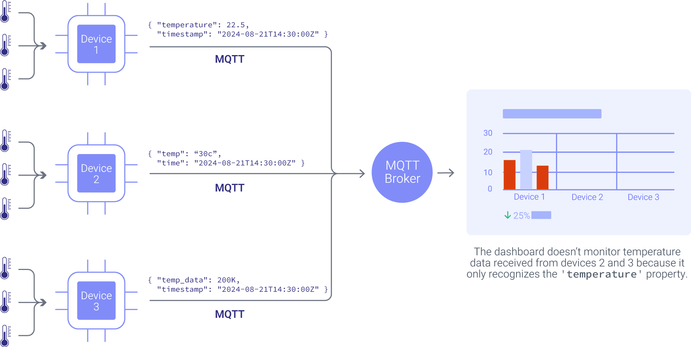
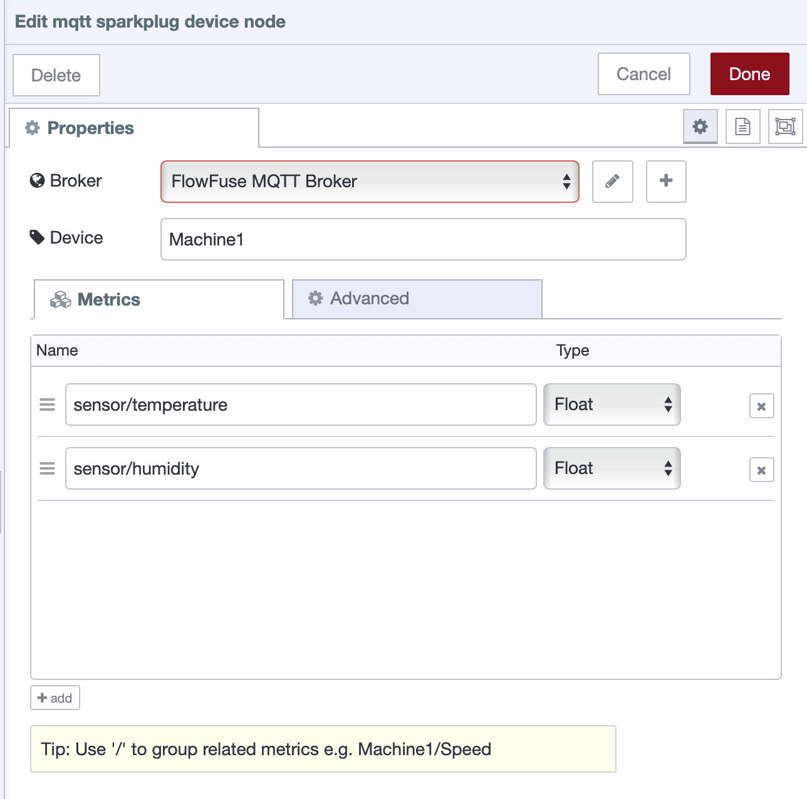
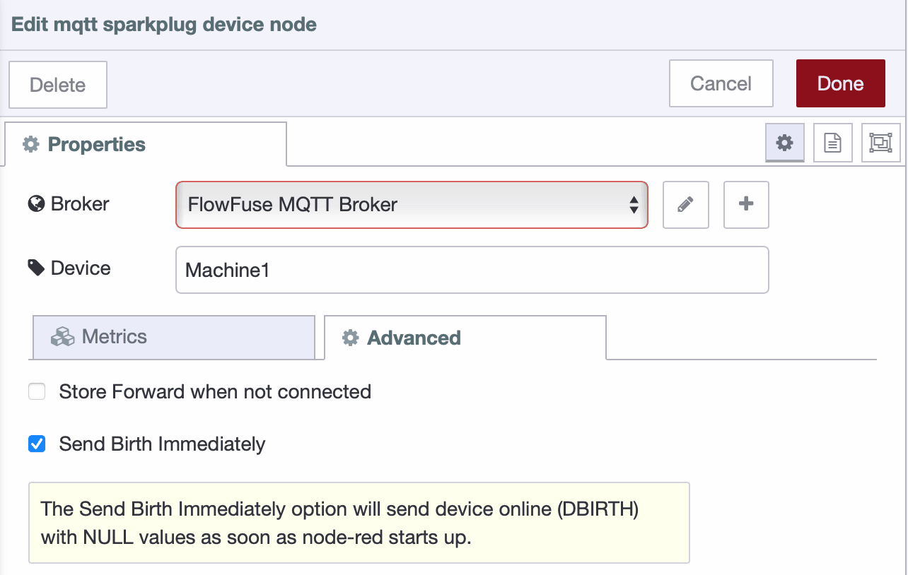

Connected devices can generate a lot of data, but without a standardized format, managing and consuming it can be tricky. MQTT certainly simplifies getting your messages delivered but it does not enforce any structure. This is where MQTT Sparkplug B helps by providing a clear, standardized format for data. In this guide, we’ll show you how to use MQTT Sparkplug B with Node-RED to make managing your device data easier and more organized.

<!--more-->

## What is MQTT Sparkplug?

*Sparkplug B* is an open-source specification governed by the [Eclipse Foundation Specification Process (EFSP)](https://www.eclipse.org/projects/efsp/). Its aims include defining an MQTT Topic Namespace and payload format that can be applied generically to the overall IIoT market sector in particular meeting the requirements of real-time SCADA/Control HMI solutions.

Take for example a factory where every machine sends data using different formats and non-standardized topic structures. Parsing this data is certainly possible but it introduces complexity, increases the risk of errors, and complicates maintenance. A consistent format can greatly simplify integration and reduce these challenges.

{data-zoomable}
_Manufacturing dashboard monitoring non-standardized data_

Sparkplug B simplifies things by standardizing the data format and structure, making it easier to integrate and manage data from different sources.

{data-zoomable}
_Manufacturing dashboard effectively monitoring data from devices using MQTT Sparkplug B's standardized data format_

## Understanding MQTT Sparkplug B Message Types, Payloads, and Topic Structures

Now that we have an overview of Sparkplug B and its role in standardizing data formats, it’s time to dive deeper into how this protocol structures its payloads and topics. Understanding these details will give you insight into how Sparkplug B efficiently manages data in complex industrial environments and will assist you in implementing it effectively in your own projects.

Sparkplug B utilizes Google Protocol Buffers (Protobufs) for encoding its messages. Protobufs offer a compact and fast way to serialize structured data, preserving MQTT's lightweight nature while introducing a robust framework for handling complex data.

### Types of Sparkplug B Messages

Sparkplug B defines several message types to handle different aspects of communication:

- **NBIRTH**: Sent by a node when it first connects to the system, announcing its presence and the metrics it will report. This type of message is published when an MQTT Sparkplug Out node or an EoN node connects to the broker.
- **NDATA**: Periodically sent by a node to update the values of its metrics.
- **NDEATH**: Indicates that an MQTT Sparkplug Out node or an EoN node has disconnected or is no longer available.
- **NCMD**: Allows for sending commands to a device for remote control or configuration.
- **DBIRTH**: Sent by a device upon connection to the MQTT broker, usually for initial setup or updates.
- **DDEATH**: Indicates that a device has been removed or is no longer available, complementing `NDEATH`.

### Key Components of a Sparkplug B Payload

When dealing with Sparkplug B messages, such as `NBIRTH`, `NDATA`, `NDEATH`, `NCMD`, `DBIRTH`, `DDEATH` the payloads include several key components.

- **Timestamp**: Every Sparkplug B payload includes a timestamp to record the exact time the data was captured. This is essential for understanding the timing and relevance of the data.
- **Metrics**: Metrics are data points within the payload, crucial for `NBIRTH`, `NDATA`, `DBIRTH`, and `DDEATH`,  messages. Each metric includes:
  - **Name**: The identifier for the metric (e.g., "Temperature").
  - **Alias**: A shorthand identifier for metrics name to reduce the payload size.
  - **Timestamp**: The time when the metric was sampled or updated.
  - **Datatype**: The type of data (e.g., Integer, Float, String).
  - **Value**: The actual data being communicated.
  - **Flags**: Indicators such as `is_historical`, `is_transient`, and `is_null`.
- **Sequence Number**: Each message includes a sequence number that increments with each new message. This helps detect any missing messages and ensures data consistency.

### Topic Naming Conventions

To effectively manage and route messages in Sparkplug B, it uses a well-structured topic namespace. This structured approach ensures that messages are organized logically and can be easily identified and processed by different systems

The topic namespace in Sparkplug B follows a specific format:

```
spBv1.0/[Group ID]/[Message Type]/[EON Node ID]/[Device ID]
```

- **[Group ID]**: Represents the group or application context.
- **[Message Type]**: Specifies the type of message (e.g., NBIRTH, NDATA).
- **[EON Node ID]**: Identifies the edge node or system.
- **[Device ID]**: Identifies the specific device (if applicable).

## Using MQTT Sparkplug with Node-RED

In this section, we'll explore an example where Machine1 on the factory floor sends temperature and humidity data to an MQTT broker. We’ll cover how to integrate MQTT Sparkplug B into Node-RED and demonstrate basic operations such as sending and receiving data using MQTT Sparkplug B and more.

### Prerequisite

Before you begin, ensure you have the following:

- [node-red-contrib-mqtt-sparkplug-plus](https://flows.nodered.org/node/node-red-contrib-mqtt-sparkplug-plus): Install this Node-RED package for Sparkplug B support via palette manager.
- MQTT Broker: Make sure you have your MQTT broker configuration details ready.
- 
### Configuring Node-RED for MQTT Sparkplug B

1. Drag any mqtt sparkplug node onto the canvas.
2. Double-click the mqtt sparkplug node to open the configuration panel.
3. Click the "+" icon next to the "Broker" field. Enter your MQTT broker's host address (e.g., `mqtt.example.com`), specify the port number (e.g., `1883` for unencrypted or `8883` for TLS), and configure the TLS settings if required. Enter the username and password if authentication is needed. Optionally, enter a Client ID or leave it blank for auto-generation. Set the "Keep Alive" interval (default is 60 seconds).
4. Switch to the Sparkplug tab by clicking the Sparkplug option in the top-right corner.
5. Enter a name in the "Name" field (this will be the Edge Node ID). Enter the group name in the "Group" field. Select "No" for the compression setting. Enable the "Use Alias for Metrics" option if you prefer not to send the full metric names every time and use aliases instead.
6. Click "Add" to save the configuration.

  
_Screenshot showing the configuration of Sparkplug broker config node_

### Sending Data to MQTT with Sparkplug B

1. Drag the inject node onto the canvas. Set the `msg.payload` to the metrics you want to send and set the repeat interval according to your preference. This inject node could be any node that triggers the data sending. For testing purpose, you can use the following JSONata expression to simulate temperature and humidly metrics:

    ```json
    {
        "metrics": [
            {
                "name": "sensor/temperature",
                "value": $random() * 100
            },
            {
                "name": "sensor/humidity",
                "value": $random() * 100
            }
        ]
    }
    ```

2. Drag the mqtt sparkplug device node onto the canvas.
3. Double-click the mqtt sparkplug device node to open the configuration panel. Add the metric names that you will be sending by clicking the bottom-left "Add" button. Ensure that the names match the metric names in the payload you are sending and specify the data types for each metric.

  
_Screenshot showing the Sparkplug Device node configuration and the "Add" button for defining metrics_

4. Switch to the Advanced tab by clicking the "Advanced" option at the top-right.

5. Enable the "Send Birth Immediately" option. This ensures that a Birth message (DBIRTH) is sent immediately upon deployment and connection to the MQTT broker. Note that enabling this option will send the `DBIRTH` message when the device node connects, but an `NBIRTH` message will be sent successful connection of mqtt sparkplug out node if you are using.

  
_Screenshot showing the Sparkplug Device node configuration and the "Add" button for defining metrics_

6. Optionally, enable Store and Forward when not connected to ensure that messages are stored and sent once the connection is re-established. To use this option, make sure you have enabled it in the mqtt sparkplug broker config node and specified the destination.
7. Connect the inject node's output to the mqtt sparkplug device node's input.
8. Deploy the flow by clicking the top-right "Deploy" button.

Once you deploy the flow and all devices connect to the MQTT broker, the system automatically send a `DBIRTH` message as soon as each device within the node connects, signalling that the device is ready for data transmission.


[{"id":"f2864f2b830e3590","type":"mqtt sparkplug device","z":"239c9025714089d3","name":"Machine1","metrics":{"sensor/temperature":{"dataType":"Float","name":"sensor/temperature"},"sensor/humidity":{"dataType":"Float","name":"sensor/humidity"}},"broker":"0d831bd9ba588536","birthImmediately":true,"bufferDevice":false,"x":380,"y":320,"wires":[["3dfc9b74f5e36bec"]]},{"id":"90cc413f58871fc1","type":"inject","z":"239c9025714089d3","name":"Send Metrics","props":[{"p":"payload"},{"p":"topic","vt":"str"}],"repeat":"","crontab":"","once":false,"onceDelay":0.1,"topic":"","payload":"{    \"metrics\": [        {            \"name\": \"sensor/temperature\",            \"value\": $random()*100        },        {            \"name\": \"sensor/humidity\",            \"value\": $random()*100        }    ]}","payloadType":"jsonata","x":130,"y":320,"wires":[["f2864f2b830e3590"]]},{"id":"3dfc9b74f5e36bec","type":"debug","z":"239c9025714089d3","name":"","active":true,"tosidebar":true,"console":false,"tostatus":false,"complete":"payload","targetType":"msg","statusVal":"","statusType":"auto","x":650,"y":320,"wires":[]},{"id":"0d831bd9ba588536","type":"mqtt-sparkplug-broker","name":"Local Host","deviceGroup":"My Devices","eonName":"Node-Red","broker":"localhost","port":"1883","tls":"","clientid":"","usetls":false,"protocolVersion":"4","keepalive":"60","cleansession":true,"enableStoreForward":false,"compressAlgorithm":"","aliasMetrics":true,"manualEoNBirth":false,"primaryScada":""}]


### Receiving Data from MQTT with Sparkplug B

1. Drag the mqtt sparkplug in node onto the canvas.
2. Double-click the node and configure the broker settings.
3. Enter the topic in the "Topic" field in the format `namespace/group_id/message_type/edge_node_id/[device_id]`. Use `DDATA` for receiving metrics you are sending using device node or a wildcard like `spBv1.0/group_id/+/+/[device_id]` to listen to all message types from a specific device.
4. Select the desired "QoS" level.
5. Drag a debug node onto the canvas.
6. Connect the mqtt sparkplug in node’s output to the debug node’s input.
7. Click "Deploy" to save and run the flow.

Now you will be able to see the `DBIRTH`, and `DDATA` messages printed on the debug panel.


[{"id":"a98c49d80bb5c4ee","type":"mqtt sparkplug in","z":"239c9025714089d3","name":"","topic":"spBv1.0/My Devices/DDATA/Node-RED/Machine1","qos":"2","broker":"0d831bd9ba588536","x":330,"y":120,"wires":[["655761fb21409216"]]},{"id":"655761fb21409216","type":"debug","z":"239c9025714089d3","name":"debug 1","active":true,"tosidebar":true,"console":false,"tostatus":false,"complete":"payload","targetType":"msg","statusVal":"","statusType":"auto","x":800,"y":120,"wires":[]},{"id":"0d831bd9ba588536","type":"mqtt-sparkplug-broker","name":"Local Host","deviceGroup":"My Devices","eonName":"Node-Red","broker":"localhost","port":"1883","tls":"","clientid":"","usetls":false,"protocolVersion":"4","keepalive":"60","cleansession":true,"enableStoreForward":false,"compressAlgorithm":"","aliasMetrics":true,"manualEoNBirth":false,"primaryScada":""}]


### Sending Commands for devices and EoN nodes

Beyond data exchange, MQTT Sparkplug B allows you to send commands for managing devices and Edge of Network (EoN) nodes, such as initiating a device's rebirth or signalling its death.

1. Drag inject node onto the canvas.
2. Set the `msg.command` in the inject node to the desired command. For instance, you can use the following JSON object to send a command that triggers a device's death:

```json
    {
        "device" : {
            "death" : true
        }
    }   
```

Alternatively, to send a command that triggers a device's rebirth, use:

```json
    {
        "device" : {
            "rebirth" : true
        }
    }   
```

3. Connect the output of the inject node to the input of the relevant mqtt sparkplug device node.
4. Deploy the flow by clicking the Deploy button at the top-right of the Node-RED interface.
5. Click the inject node’s button to send the command.

In this example, we've used an inject node to manually send commands, but you can also trigger these commands based on other inputs or conditions within your flow, such as device status or sensor data. For more information on available commands and advanced configurations, refer to the [MQTT Sparkplug nodes documentation](https://flows.nodered.org/node/node-red-contrib-mqtt-sparkplug-plus).


[{"id":"f2864f2b830e3590","type":"mqtt sparkplug device","z":"239c9025714089d3","name":"Machine1","metrics":{"sensor/temperature":{"dataType":"Float"},"sensor/humidity":{"dataType":"Float"}},"broker":"0d831bd9ba588536","birthImmediately":true,"bufferDevice":false,"x":440,"y":320,"wires":[["3dfc9b74f5e36bec"]]},{"id":"90cc413f58871fc1","type":"inject","z":"239c9025714089d3","name":"Send connect command","props":[{"p":"command","v":"{\"node\":{\"connect\":true}}","vt":"jsonata"}],"repeat":"","crontab":"","once":false,"onceDelay":0.1,"topic":"","x":170,"y":260,"wires":[["f2864f2b830e3590"]]},{"id":"3dfc9b74f5e36bec","type":"debug","z":"239c9025714089d3","name":"","active":true,"tosidebar":true,"console":false,"tostatus":false,"complete":"payload","targetType":"msg","statusVal":"","statusType":"auto","x":650,"y":320,"wires":[]},{"id":"915ca0772eebee04","type":"inject","z":"239c9025714089d3","name":"Send rebirth command","props":[{"p":"command","v":"{\"device\":{\"rebirth\":true}}","vt":"json"}],"repeat":"","crontab":"","once":false,"onceDelay":0.1,"topic":"","x":160,"y":320,"wires":[["f2864f2b830e3590"]]},{"id":"696db58cc9eb029d","type":"inject","z":"239c9025714089d3","name":"Send death command","props":[{"p":"command","v":"{\"device\":{\"death\":true}}","vt":"json"}],"repeat":"","crontab":"","once":false,"onceDelay":0.1,"topic":"","x":160,"y":380,"wires":[["f2864f2b830e3590"]]},{"id":"0d831bd9ba588536","type":"mqtt-sparkplug-broker","name":"Local Host","deviceGroup":"My Devices","eonName":"Node-Red","broker":"localhost","port":"1883","tls":"","clientid":"","usetls":false,"protocolVersion":"4","keepalive":"60","cleansession":true,"enableStoreForward":false,"compressAlgorithm":"","aliasMetrics":true,"manualEoNBirth":true,"primaryScada":""}]


If you need more flexibility in defining topic names when sending data, you can use the mqtt sparkplug out node. It’s quite similar to the standard mqtt out node but is designed to handle Sparkplug-encoded messages. Below is an example showing how to use the mqtt sparkplug out node with in nodes.


[{"id":"bbe3765e67eed956","type":"mqtt sparkplug in","z":"f098830cc10afc2f","name":"","topic":"spBv1.0/+/+/#","qos":"2","broker":"0d831bd9ba588536","x":150,"y":100,"wires":[["d45ff4446380beaa"]]},{"id":"3b2b9788c51d5c3b","type":"mqtt sparkplug out","z":"f098830cc10afc2f","name":"","topic":"spBv1.0/My Devices/NDATA/Node-Red","qos":"","retain":"","broker":"0d831bd9ba588536","x":510,"y":200,"wires":[]},{"id":"d45ff4446380beaa","type":"debug","z":"f098830cc10afc2f","name":"","active":true,"tosidebar":true,"console":false,"tostatus":false,"complete":"false","statusVal":"","statusType":"auto","x":410,"y":100,"wires":[]},{"id":"dc73048fd385783a","type":"inject","z":"f098830cc10afc2f","name":"Send Metrics","props":[{"p":"payload"}],"repeat":"","crontab":"","once":false,"onceDelay":0.1,"topic":"","payload":"{    \"metrics\": [        {            \"name\": \"sensor/temperature\",            \"value\": $random(),            \"type\": \"Float\"        },        {            \"name\": \"sensor/humidity\",            \"value\": $random(),            \"type\": \"Float\"        }    ]}","payloadType":"jsonata","x":170,"y":220,"wires":[["3b2b9788c51d5c3b"]]},{"id":"0d831bd9ba588536","type":"mqtt-sparkplug-broker","name":"Local Host","deviceGroup":"My Devices","eonName":"Node-Red","broker":"localhost","port":"1883","tls":"","clientid":"","usetls":false,"protocolVersion":"4","keepalive":"60","cleansession":true,"enableStoreForward":false,"compressAlgorithm":"","aliasMetrics":true,"manualEoNBirth":false,"primaryScada":""}]



_Images of some Sparkplug messages printed on debug panel_

## Up Next

- [Using MQTT With Node-RED](/node-red/protocol/mqtt/): This guide provides a basic overview of how to integrate MQTT with Node-RED, offering a foundational understanding for beginners who are just starting with this protocol.
- [How to Use MQTT With Node-RED](/blog/2024/06/how-to-use-mqtt-in-node-red/): This comprehensive guide delves into the detailed steps and advanced techniques for effectively using MQTT within Node-RED, including practical examples to help you apply these concepts in real-world scenarios.
