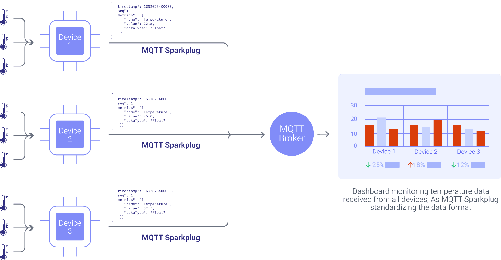
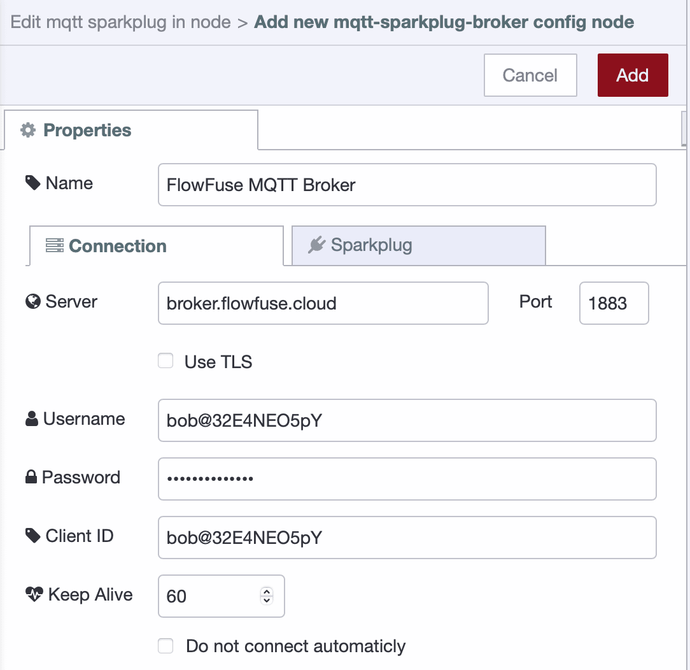

Connected devices can generate a lot of data, but without a standardized format, managing and consuming it can be tricky. MQTT certainly simplifies getting your messages delivered but it does not enforce any structure. This is where MQTT Sparkplug B helps by providing a clear, standardized format for data. In this guide, we’ll show you how to use MQTT Sparkplug B with Node-RED to make managing your device data easier and more organized.

<!--more-->

## What is MQTT Sparkplug?

MQTT Sparkplug B is an open-source specification governed by the [Eclipse Foundation Specification Process (EFSP)](https://www.eclipse.org/projects/efsp/). It defines a standardized MQTT topic namespace and payload format specifically designed for Industrial IoT (IIoT), with particular focus on real-time [SCADA](/scada/), control systems, and [HMI](/blog/2025/11/building-hmi-for-equipment-control/) solutions.

At its core, Sparkplug B extends MQTT 3.1.1 by adding structured topic namespace conventions, Google Protocol Buffer encoded payloads, state-aware birth and death certificates, metric aliasing for bandwidth optimization, and store-and-forward capabilities for intermittent connectivity. These additions transform MQTT from a simple messaging protocol into a complete industrial communication framework.

### The Industrial Integration Problem

In typical factory environments, every machine manufacturer implements MQTT differently. Consider a real-world scenario where Machine A publishes temperature data to `factory/line1/temp` with a JSON payload containing the temperature value. Meanwhile, Machine B sends its data to `sensors/machineB/env` with a completely different JSON structure that includes both temperature and timestamp. Machine C takes yet another approach, publishing raw numeric values to `data/mc/status` with no context or metadata.

Each device requires custom parsing logic, error handling, and documentation. Integration complexity grows exponentially with each new device type. Your development team spends weeks building and maintaining custom parsers instead of focusing on business logic.


*Dashboard complexity increases exponentially without standardized data formats*

With Sparkplug B standardization, all devices publish to structured topics following the format `spBv1.0/Factory/DDATA/Line1/MachineA` with consistent Protocol Buffer payloads. Each message contains typed metrics, timestamps, and quality indicators. Integration becomes predictable and maintainable. When you add a new device, it automatically describes its capabilities through birth certificates, eliminating the need for custom integration code.


*Standardized format enables reliable data aggregation across heterogeneous devices*

## Sparkplug B Architecture Patterns

Several architectural patterns have emerged from production Sparkplug B deployments. Understanding these patterns helps you design scalable, maintainable systems.

### Edge Node Architecture

The edge node serves as the gateway between physical devices and the MQTT broker. A single edge node typically manages multiple devices, publishing aggregate birth certificates and handling communication for all attached devices. This centralized approach simplifies device management and reduces broker connections.

Edge nodes implement store-and-forward buffering to handle temporary connectivity loss. When the broker becomes unreachable, the edge node buffers data locally. After reconnection, it publishes buffered data with historical flags set, allowing applications to distinguish between real-time and historical data.

The edge node monitors broker connectivity and automatically publishes `NBIRTH` after reconnection. It manages sequence numbers across all messages from its devices, enabling applications to detect lost messages. Many edge nodes implement local data processing, filtering, and aggregation before publishing to reduce bandwidth and broker load.

### Primary Application Pattern

The primary application concept allows edge nodes to adapt their behavior based on application state. A designated primary application publishes STATE messages indicating its operational status. Edge nodes subscribe to these STATE messages and adjust their reporting frequency or metrics based on whether the primary application is online.

For example, an edge node might publish data every second when the primary SCADA application is connected but reduce to every 60 seconds when no primary application is available. This adaptive behavior conserves bandwidth and broker resources while ensuring data availability when needed.

### Command and Control Flow

Sparkplug B enables bidirectional communication through `NCMD` and `DCMD` messages. Applications publish commands to specific topics, and edge nodes or devices execute the commands and respond with updated metric values in `NDATA` or `DDATA` messages.

Command messages use the same Protocol Buffer format as data messages but flow in the opposite direction. Applications might send a write command to change a setpoint, a rebirth command to request fresh birth certificates, or a custom command to trigger device-specific actions. The standardized command structure enables generic control applications that work with any Sparkplug-compliant device.

## The MQTT Sparkplug Specification for IIoT

Now that we have an overview of Sparkplug B and its role in standardizing data formats, it’s time to dive deeper into how this protocol structures its payloads and topics. Understanding these details will give you insight into how Sparkplug B efficiently manages data in complex industrial environments and will assist you in implementing it effectively in your own projects.

Sparkplug B utilizes Google Protocol Buffers (Protobufs) for encoding its messages. Protobufs offer a compact and fast way to serialize structured data, preserving MQTT's lightweight nature while introducing a robust framework for handling complex data.

### The MQTT Sparkplug Specification for IIoT

The Sparkplug B specification addresses critical industrial requirements that standard MQTT implementations typically handle inconsistently. The specification is built around several core concepts that work together to create a robust industrial messaging framework.

### Topic Namespace Architecture

Sparkplug B enforces a hierarchical topic namespace that follows a specific pattern: `spBv1.0/{group_id}/{message_type}/{edge_node_id}/{device_id}`. The namespace starts with the protocol version identifier `spBv1.0`, ensuring clients can identify Sparkplug messages. The group_id provides logical grouping such as factory, building, or region. The message_type specifies whether this is a birth certificate, data update, death notification, or command. The edge_node_id identifies the gateway or edge node, and optionally, a device_id can specify individual devices under that edge node.

For example, a temperature sensor in a manufacturing facility might publish to `spBv1.0/Manufacturing/DDATA/Gateway01/TempSensor05`. This structured approach eliminates ambiguity and enables automatic topic subscription patterns.

### Protocol Buffer Payloads

Rather than using JSON or other text-based formats, Sparkplug B employs [Google Protocol Buffers](/blog/2025/12/node-red-buffer-parser-industrial-data/) for message encoding. This choice delivers several advantages in industrial environments. The compact binary format produces significantly smaller messages than JSON, reducing bandwidth consumption on constrained networks. Protocol Buffers provide strongly typed data fields, eliminating parsing ambiguities. The format supports backward compatibility, allowing older clients to work with newer message versions. Finally, efficient parsing performance matters when handling thousands of messages per second.

### State Management System

The specification includes explicit state awareness through birth and death certificates. When an edge node or device connects to the broker, it publishes a birth certificate (`NBIRTH` for nodes, `DBIRTH` for devices) that declares all available metrics, their data types, and initial values. This self-description capability means applications can discover device capabilities automatically without external configuration files.

When devices disconnect, either gracefully or due to network failure, death certificates (`NDEATH`/`DDEATH`) signal the disconnection to all subscribers. The MQTT Last Will and Testament feature ensures death certificates publish even when devices lose connectivity unexpectedly. Sequence numbers in every message enable detection of lost messages, while timestamps provide temporal context for all data points.

### Metric Definition Framework

Each metric in Sparkplug B carries comprehensive metadata beyond just a name and value. The specification supports a wide range of data types including various integer sizes (Int8 through Int64, both signed and unsigned), floating-point numbers (Float and Double), Boolean values, strings, timestamps, UUIDs, binary data, and complex structures like datasets and templates.

Every metric includes a timestamp indicating when the value was captured, not just when it was transmitted. Quality flags indicate whether data is historical (stored and forwarded), transient (not to be stored), or null (sensor failure). This rich metadata enables applications to make informed decisions about data processing and storage.

### Message Types and Their Purposes

Sparkplug B defines specific message types for different communication needs. `NBIRTH` messages announce edge node connection and available metrics. `NDATA` messages carry periodic metric updates from edge nodes. `NDEATH` messages signal edge node disconnection. `DBIRTH`, `DDATA`, and `DDEATH` provide the same functions for devices under edge nodes.`NCMD` and `DCMD` enable command and control, allowing applications to send instructions to nodes and devices. STATE messages, published by primary applications, indicate application health and readiness.

## Sparkplug B vs Plain MQTT: Understanding the Differences

While both [plain MQTT](/blog/2024/06/how-to-use-mqtt-in-node-red/) and Sparkplug B use the same MQTT transport protocol, they solve **very different problems**.
Plain MQTT focuses on moving messages reliably, whereas Sparkplug B defines **how industrial data should be structured, identified, and managed** across devices and applications.

The table below highlights the practical differences that matter when designing real-world IIoT and SCADA systems.


| Category                   | Plain MQTT                                | MQTT Sparkplug B                               |
| -------------------------- | ----------------------------------------- | ---------------------------------------------- |
| **What it is**             | Messaging protocol                        | Industrial IoT specification built on MQTT     |
| **Primary purpose**        | Message transport                         | Standardized industrial data exchange          |
| **Topic structure**        | Fully custom, no enforced rules           | Strict, standardized namespace (`spBv1.0/...`) |
| **Payload format**         | JSON, text, or custom binary              | Google Protocol Buffers (binary, compact)      |
| **Payload consistency**    | Varies by device and vendor               | Guaranteed consistent structure                |
| **Data typing**            | Not enforced                              | Strongly typed metrics                         |
| **Device discovery**       | Manual configuration                      | Automatic via NBIRTH / DBIRTH                  |
| **State awareness**        | Limited (LWT only)                        | Full lifecycle (BIRTH, DATA, DEATH)            |
| **Message loss detection** | Not supported                             | Sequence numbers included                      |
| **Timestamps**             | Optional, application-defined             | Mandatory per metric                           |
| **Data quality flags**     | Custom implementation                     | Built-in (historical, transient, null)         |
| **Bandwidth efficiency**   | Lower (JSON overhead)                     | Higher (protobuf + metric aliasing)            |
| **Metric aliasing**        | Not available                             | Supported                                      |
| **Command & control**      | Custom topics and logic                   | Standardized NCMD / DCMD                       |
| **Interoperability**       | Low (vendor-specific)                     | High (vendor-neutral)                          |
| **Human readability**      | High                                      | Low (binary encoded)                           |
| **Debugging effort**       | Easy with basic tools                     | Requires Sparkplug-aware tools                 |
| **Scalability**            | Depends on custom design                  | Designed for large-scale IIoT                  |
| **Security**               | MQTT-level (TLS, ACLs)                    | MQTT-level (same as plain MQTT)                |
| **Learning curve**         | Low                                       | Medium to high                                 |
| **Best fit use cases**     | Small systems, prototypes, simple sensors | SCADA, HMI, multi-vendor industrial systems    |

## Using MQTT Sparkplug B with Node-RED

Now that we understand what Sparkplug B is and how it structures industrial data, let’s see how to use it in practice with Node-RED.

[Node-RED](/node-red/) is a popular low-code tool for building IoT and industrial data flows. It’s widely used at the edge to connect devices, process data, and integrate with MQTT brokers. With dedicated Sparkplug nodes, Node-RED makes it easy to publish and consume Sparkplug B messages without manually handling topics, protobufs, or state management.

To run Node-RED reliably in production—especially for industrial and edge deployments, [FlowFuse](/) provides a managed platform for deploying, scaling, and managing Node-RED instances. FlowFuse also includes a built-in MQTT broker, making it simple to get started with Sparkplug B without additional infrastructure.

[Create a free FlowFuse account](https://app.flowfuse.com/account/create) to deploy Node-RED, connect devices, and start working with MQTT Sparkplug B in minutes.

In the following example, we’ll configure a Node-RED flow where a factory machine publishes temperature and humidity data using Sparkplug B, and then consumes that data downstream.

### Prerequisite

Before you begin, ensure you have the following:

- node-red-contrib-mqtt-sparkplug-plus: Install this [Node-RED package for Sparkplug B](https://flows.nodered.org/node/node-red-contrib-mqtt-sparkplug-plus) support via palette manager.
- MQTT Broker: An MQTT broker is required to send and receive data between clients. If you do not already have one, FlowFuse offers a built-in MQTT broker service that simplifies the process of using MQTT with Node-RED—no external setup required. To learn how to use the FlowFuse MQTT Broker and create and manage clients, refer to the [FlowFuse MQTT documentation](/docs/user/teambroker/).

### Configuring Node-RED for MQTT Sparkplug B

1. Drag any mqtt sparkplug node onto the canvas.
2. Double-click the mqtt sparkplug node to open the configuration panel.
3. Click the "+" icon next to the "Broker" field. Enter your MQTT broker's host address (e.g., `broker.flowfuse.cloud`), specify the port number (e.g., `1883` for unencrypted or `8883` for TLS), and configure the TLS settings if required. Enter the username and password, enter a Client ID, Set the "Keep Alive" interval (default is 60 seconds).
4. Switch to the Sparkplug tab by clicking the Sparkplug option in the top-right corner.
5. Enter a name in the "Name" field (this will be the Edge Node ID). Enter the group name in the "Group" field. Select "No" for the compression setting. Enable the "Use Alias for Metrics" option if you prefer not to send the full metric names every time and use aliases instead.
6. Click "Add" to save the configuration.

  
_Screenshot showing the configuration of Sparkplug broker config node_

### Sending Data to MQTT with Sparkplug B

1. Drag the inject node onto the canvas. Set the `msg.payload` to the metrics you want to send and set the repeat interval according to your preference. This inject node could be any node that triggers the data sending. For testing purpose, you can use the following JSONata expression to simulate temperature and humidly metrics:

    ```json
    {
        "metrics": [
            {
                "name": "sensor/temperature",
                "value": $random() * 100
            },
            {
                "name": "sensor/humidity",
                "value": $random() * 100
            }
        ]
    }
    ```

2. Drag the mqtt sparkplug device node onto the canvas.
3. Double-click the mqtt sparkplug device node to open the configuration panel. Add the metric names that you will be sending by clicking the bottom-left "Add" button. Ensure that the names match the metric names in the payload you are sending and specify the data types for each metric.

  
_Screenshot showing the Sparkplug Device node configuration and the "Add" button for defining metrics_

4. Switch to the Advanced tab by clicking the "Advanced" option at the top-right.

5. Enable the "Send Birth Immediately" option. This ensures that a Birth message (DBIRTH) is sent immediately upon deployment and connection to the MQTT broker. Note that enabling this option will send the `DBIRTH` message when the device node connects, but an `NBIRTH` message will be sent successful connection of mqtt sparkplug out node if you are using.

  
_Screenshot showing the Sparkplug Device node configuration and the "Add" button for defining metrics_

6. Optionally, enable Store and Forward when not connected to ensure that messages are stored and sent once the connection is re-established. To use this option, make sure you have enabled it in the mqtt sparkplug broker config node and specified the destination.
7. Connect the inject node's output to the mqtt sparkplug device node's input.
8. Deploy the flow by clicking the top-right "Deploy" button.

Once you deploy the flow and all devices connect to the MQTT broker, the system automatically send a `DBIRTH` message as soon as each device within the node connects, signalling that the device is ready for data transmission.


[{"id":"f2864f2b830e3590","type":"mqtt sparkplug device","z":"239c9025714089d3","name":"Machine1","metrics":{"sensor/temperature":{"dataType":"Float","name":"sensor/temperature"},"sensor/humidity":{"dataType":"Float","name":"sensor/humidity"}},"broker":"0d831bd9ba588536","birthImmediately":true,"bufferDevice":false,"x":380,"y":320,"wires":[["3dfc9b74f5e36bec"]]},{"id":"90cc413f58871fc1","type":"inject","z":"239c9025714089d3","name":"Send Metrics","props":[{"p":"payload"},{"p":"topic","vt":"str"}],"repeat":"","crontab":"","once":false,"onceDelay":0.1,"topic":"","payload":"{    \"metrics\": [        {            \"name\": \"sensor/temperature\",            \"value\": $random()*100        },        {            \"name\": \"sensor/humidity\",            \"value\": $random()*100        }    ]}","payloadType":"jsonata","x":130,"y":320,"wires":[["f2864f2b830e3590"]]},{"id":"3dfc9b74f5e36bec","type":"debug","z":"239c9025714089d3","name":"","active":true,"tosidebar":true,"console":false,"tostatus":false,"complete":"payload","targetType":"msg","statusVal":"","statusType":"auto","x":650,"y":320,"wires":[]},{"id":"0d831bd9ba588536","type":"mqtt-sparkplug-broker","name":"Local Host","deviceGroup":"My Devices","eonName":"Node-Red","broker":"localhost","port":"1883","tls":"","clientid":"","usetls":false,"protocolVersion":"4","keepalive":"60","cleansession":true,"enableStoreForward":false,"compressAlgorithm":"","aliasMetrics":true,"manualEoNBirth":false,"primaryScada":""}]


### Receiving Data from MQTT with Sparkplug B

1. Drag the mqtt sparkplug in node onto the canvas.
2. Double-click the node and configure the broker settings.
3. Enter the topic in the "Topic" field in the format `namespace/group_id/message_type/edge_node_id/[device_id]`. Use `DDATA` for receiving metrics you are sending using device node or a wildcard like `spBv1.0/group_id/+/+/[device_id]` to listen to all message types from a specific device.
4. Select the desired "QoS" level.
5. Drag a debug node onto the canvas.
6. Connect the mqtt sparkplug in node’s output to the debug node’s input.
7. Click "Deploy" to save and run the flow.

Now you will be able to see the `DBIRTH`, and `DDATA` messages printed on the debug panel.


[{"id":"a98c49d80bb5c4ee","type":"mqtt sparkplug in","z":"239c9025714089d3","name":"","topic":"spBv1.0/My Devices/DDATA/Node-RED/Machine1","qos":"2","broker":"0d831bd9ba588536","x":330,"y":120,"wires":[["655761fb21409216"]]},{"id":"655761fb21409216","type":"debug","z":"239c9025714089d3","name":"debug 1","active":true,"tosidebar":true,"console":false,"tostatus":false,"complete":"payload","targetType":"msg","statusVal":"","statusType":"auto","x":800,"y":120,"wires":[]},{"id":"0d831bd9ba588536","type":"mqtt-sparkplug-broker","name":"Local Host","deviceGroup":"My Devices","eonName":"Node-Red","broker":"localhost","port":"1883","tls":"","clientid":"","usetls":false,"protocolVersion":"4","keepalive":"60","cleansession":true,"enableStoreForward":false,"compressAlgorithm":"","aliasMetrics":true,"manualEoNBirth":false,"primaryScada":""}]


### Sending Commands for devices and EoN nodes

Beyond data exchange, MQTT Sparkplug B allows you to send commands for managing devices and Edge of Network (EoN) nodes, such as initiating a device's rebirth or signalling its death.

1. Drag inject node onto the canvas.
2. Set the `msg.command` in the inject node to the desired command. For instance, you can use the following JSON object to send a command that triggers a device's death:

```json
    {
        "device" : {
            "death" : true
        }
    }   
```

Alternatively, to send a command that triggers a device's rebirth, use:

```json
    {
        "device" : {
            "rebirth" : true
        }
    }   
```

3. Connect the output of the inject node to the input of the relevant mqtt sparkplug device node.
4. Deploy the flow by clicking the Deploy button at the top-right of the Node-RED interface.
5. Click the inject node’s button to send the command.

In this example, we've used an inject node to manually send commands, but you can also trigger these commands based on other inputs or conditions within your flow, such as device status or sensor data. For more information on available commands and advanced configurations, refer to the [MQTT Sparkplug nodes documentation](https://flows.nodered.org/node/node-red-contrib-mqtt-sparkplug-plus).


[{"id":"f2864f2b830e3590","type":"mqtt sparkplug device","z":"239c9025714089d3","name":"Machine1","metrics":{"sensor/temperature":{"dataType":"Float"},"sensor/humidity":{"dataType":"Float"}},"broker":"0d831bd9ba588536","birthImmediately":true,"bufferDevice":false,"x":440,"y":320,"wires":[["3dfc9b74f5e36bec"]]},{"id":"90cc413f58871fc1","type":"inject","z":"239c9025714089d3","name":"Send connect command","props":[{"p":"command","v":"{\"node\":{\"connect\":true}}","vt":"jsonata"}],"repeat":"","crontab":"","once":false,"onceDelay":0.1,"topic":"","x":170,"y":260,"wires":[["f2864f2b830e3590"]]},{"id":"3dfc9b74f5e36bec","type":"debug","z":"239c9025714089d3","name":"","active":true,"tosidebar":true,"console":false,"tostatus":false,"complete":"payload","targetType":"msg","statusVal":"","statusType":"auto","x":650,"y":320,"wires":[]},{"id":"915ca0772eebee04","type":"inject","z":"239c9025714089d3","name":"Send rebirth command","props":[{"p":"command","v":"{\"device\":{\"rebirth\":true}}","vt":"json"}],"repeat":"","crontab":"","once":false,"onceDelay":0.1,"topic":"","x":160,"y":320,"wires":[["f2864f2b830e3590"]]},{"id":"696db58cc9eb029d","type":"inject","z":"239c9025714089d3","name":"Send death command","props":[{"p":"command","v":"{\"device\":{\"death\":true}}","vt":"json"}],"repeat":"","crontab":"","once":false,"onceDelay":0.1,"topic":"","x":160,"y":380,"wires":[["f2864f2b830e3590"]]},{"id":"0d831bd9ba588536","type":"mqtt-sparkplug-broker","name":"Local Host","deviceGroup":"My Devices","eonName":"Node-Red","broker":"localhost","port":"1883","tls":"","clientid":"","usetls":false,"protocolVersion":"4","keepalive":"60","cleansession":true,"enableStoreForward":false,"compressAlgorithm":"","aliasMetrics":true,"manualEoNBirth":true,"primaryScada":""}]


If you need more flexibility in defining topic names when sending data, you can use the mqtt sparkplug out node. It’s quite similar to the standard mqtt out node but is designed to handle Sparkplug-encoded messages. Below is an example showing how to use the mqtt sparkplug out node with in nodes.


[{"id":"bbe3765e67eed956","type":"mqtt sparkplug in","z":"f098830cc10afc2f","name":"","topic":"spBv1.0/+/+/#","qos":"2","broker":"0d831bd9ba588536","x":150,"y":100,"wires":[["d45ff4446380beaa"]]},{"id":"3b2b9788c51d5c3b","type":"mqtt sparkplug out","z":"f098830cc10afc2f","name":"","topic":"spBv1.0/My Devices/NDATA/Node-Red","qos":"","retain":"","broker":"0d831bd9ba588536","x":510,"y":200,"wires":[]},{"id":"d45ff4446380beaa","type":"debug","z":"f098830cc10afc2f","name":"","active":true,"tosidebar":true,"console":false,"tostatus":false,"complete":"false","statusVal":"","statusType":"auto","x":410,"y":100,"wires":[]},{"id":"dc73048fd385783a","type":"inject","z":"f098830cc10afc2f","name":"Send Metrics","props":[{"p":"payload"}],"repeat":"","crontab":"","once":false,"onceDelay":0.1,"topic":"","payload":"{    \"metrics\": [        {            \"name\": \"sensor/temperature\",            \"value\": $random(),            \"type\": \"Float\"        },        {            \"name\": \"sensor/humidity\",            \"value\": $random(),            \"type\": \"Float\"        }    ]}","payloadType":"jsonata","x":170,"y":220,"wires":[["3b2b9788c51d5c3b"]]},{"id":"0d831bd9ba588536","type":"mqtt-sparkplug-broker","name":"Local Host","deviceGroup":"My Devices","eonName":"Node-Red","broker":"localhost","port":"1883","tls":"","clientid":"","usetls":false,"protocolVersion":"4","keepalive":"60","cleansession":true,"enableStoreForward":false,"compressAlgorithm":"","aliasMetrics":true,"manualEoNBirth":false,"primaryScada":""}]



_Images of some Sparkplug messages printed on debug panel_

## Best Practices for Production Deployments

Getting Sparkplug B working is only the first step. Running it reliably in production means thinking about naming, state, performance, and failure handling from day one. The best practices below focus on the things that matter most once your system is live—keeping data trustworthy, networks efficient, and recovery predictable.

- **Name things like you mean it**
  Use clear group, edge, and device names that match your factory or system layout. Future you will thank you.

- **Birth messages are non-negotiable**
  Always send `NBIRTH` and `DBIRTH` on start and reconnect. If apps don’t see a birth, they don’t trust the data.

- **Alias your metrics**
  Turn on metric aliasing to cut payload size and keep networks fast and efficient.

- **Listen for Death messages**
  `NDEATH` and `DDEATH` are early warning signals. Use them to detect failures instantly.

- **Buffer with intent**
  Store-and-forward is great for flaky networks—just don’t let backlogs pile up unchecked.

- **Lock down MQTT early**
  Use TLS, authentication, and topic permissions from day one. Security is easier before go-live.

- **Break it on purpose**
  Restart brokers and edge nodes during testing. A system that recovers cleanly is production-ready.

## Conclusion

MQTT Sparkplug B transforms MQTT from a simple messaging protocol into a robust, standardized framework for industrial IoT. By enforcing structured topics, typed metrics, state awareness, and efficient payloads, it makes integrating heterogeneous devices predictable, scalable, and reliable.

Following best practices—clear naming, birth/death messages, metric aliasing, buffering, security, and deliberate testing—ensures your system runs smoothly in production and avoids costly downtime.

For teams looking to get Sparkplug B up and running quickly, [FlowFuse](https://app.flowfuse.com/account/create) provides a production-ready, easy-to-use platform. With minimal setup and no advanced skills required, you can deploy, scale, and monitor industrial flows in minutes. Start building your reliable, standardized IIoT solution today.
