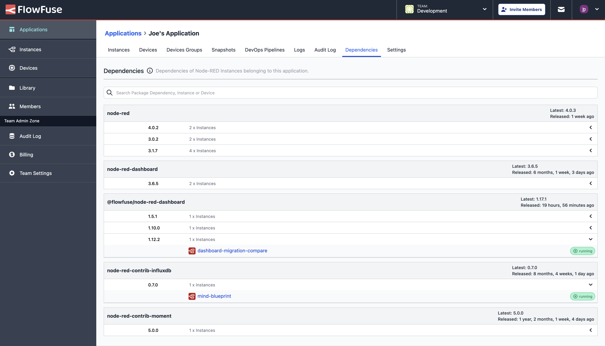

FlowFuse 2.9 bring improvements in application maintenance with the new "Software Bill of Materials" and in building full stack applications, with an iteration on the "Static Asset Service", by providing the option to "share" your assets assets publicly, making them consumable by external services and your Dashboards.

<!--more-->

## Software Bill of Materials

This release sees the introduction of a new feature for our Enterprise customers, the Software Bill of Materials (SBOM).

{data-zoomable}

This view is available for all of your Applications in FlowFuse, and provides a detailed breakdown of all packages running in your Node-RED instances within your applications, making it easier to trace down out of date packages and keep on top of the security and integrity of your applications.

In the above screenshot, we get a clear picture of the different versions of Node-RED that I'm running, as well as the different packages that are installed in each of my instances. Highlighting in particular that I have some out-of-date versions of `@flowfuse/node-red-dashboard`.

It's possible to expand the detail for each entry to see which instances are running the respective package, and consequently jump in to update them if appropriate.

## Static Assets Service

[Last release](/blog/2024/08/flowfuse-2-8-release) we published the new "Static Assets Service". This new feature provided an easy way to upload files alongside your Node-RED instances, and make them easily accessible in your Node-RED Editor.

In this new release we've expanded on that feature, now allowing you to make those files publicly accessible via a URL, making them available for consumption in your Dashboards, or wherever else you may want to consume that content.

<video controls>
   <source src="https://website-data.s3.eu-west-1.amazonaws.com/Assets+Service+Demo+-+Part+2.mp4" type="video/mp4">
   Your browser does not support the video tag.
</video>

This unlocks a new set of possibilities for building full stack applications in FlowFuse, for examples, making it easy to customize branding in your Dashboard to match your company's branding, or to serve up images and other assets to your users.

## And Much More...

For a full list of everything that went into our 2.9 release, you can check out the [release notes](https://github.com/FlowFuse/flowfuse/releases/tag/v2.9.0).

We're always working to enhance your experience with FlowFuse. We're always interested in your thoughts about FlowFuse too. Your feedback is crucial to us, and we'd love to hear about your experiences with the new features and improvements. Please share your thoughts, suggestions, or report any [issues on GitHub](https://github.com/FlowFuse/flowfuse/issues/new/choose). 

Together, we can make FlowFuse better with each release!

## Coming Soon: MQTT Broker

FlowFuse already makes extensive use of MQTT under the covers. It provides the connection for our [Project Nodes](/docs/user/projectnodes/) that make it very simple to move data between your Node-RED instances.

We're now working on opening up the broker to allow teams to connect their MQTT devices to the platform without having to manage their own broker infrastructure.

This feature will allow you to run and manage your own MQTT Clients alongside your Node-RED instances, making it easier to build full-stack IoT applications with FlowFuse.

We do not have a precise release date for this just yet, but we're hoping to having this in for 2.10 or 2.11. Keep an eye out for more information on this in the coming weeks. If this feature is of interest to you, please do [reach out](/contact-us) and help us shape it to make sure it meets your needs.

## Try FlowFuse

### Self-Hosted

We're confident you can have self managed FlowFuse running locally in under 30 minutes. You can install FlowFuse using [Docker](/docs/install/docker/) or [Kubernetes](/docs/install/kubernetes/).

### FlowFuse Cloud

The quickest and easiest way to get started with FlowFuse is on our own hosted instance, FlowFuse Cloud.

[Get started for free]() now, and you'll have your own Node-RED instances running in the Cloud within minutes.

## Upgrading FlowFuse

If you're using [FlowFuse Cloud]({{ site.appURL }}), then there is nothing you need to do - it's already running 2.9, and you may have already been playing with the new features.

If you installed a previous version of FlowFuse and want to upgrade, our documentation provides a guide for [upgrading your FlowFuse instance](/docs/upgrade/).

If you have an Enterprise license please make sure to review this [changelog entry](/changelog/2024/08/enterprise-license-update)

## Getting help

Please check FlowFuse's [documentation](/docs/) as the answers to many questions are covered there. Additionally you can go to the [community forum](https://discourse.nodered.org/c/vendors/flowfuse/24) if you have
any feedback or feature requests.