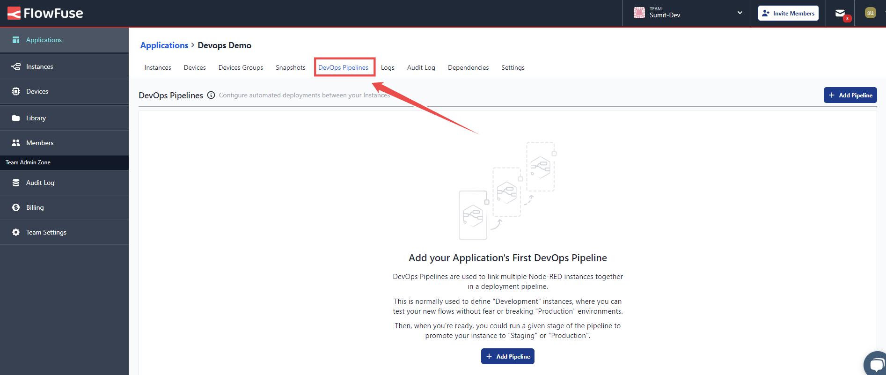
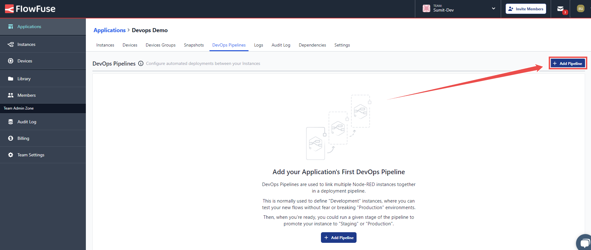
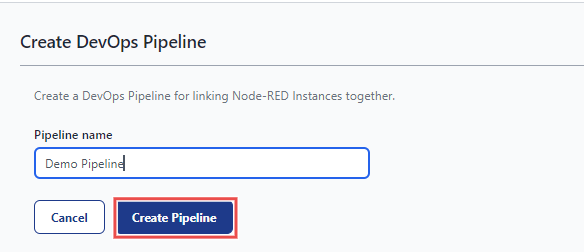
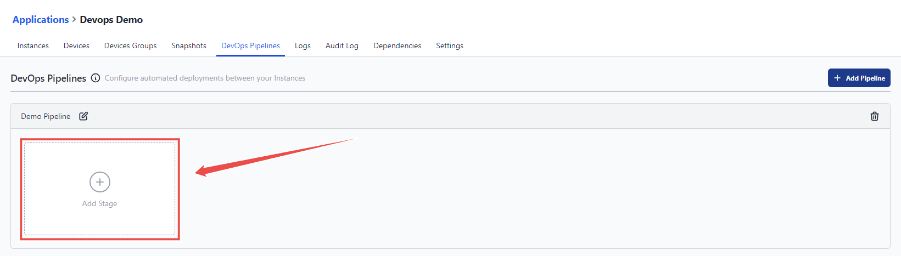
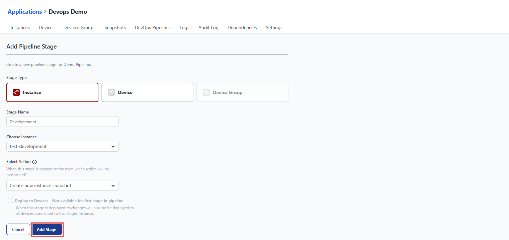
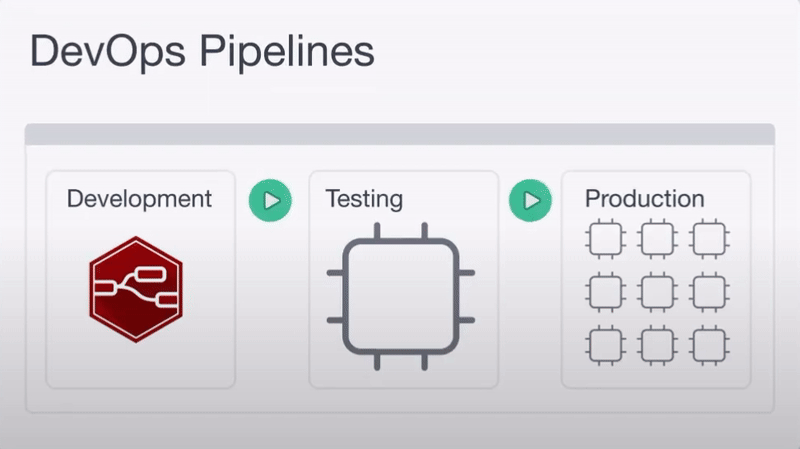
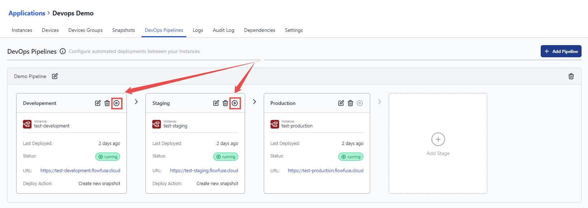

When deploying a critical application flow update in your manufacturing or automotive facility, it is important to include various stages of testing and validation. The smallest errors can lead to a floor crash or a production halt. In such industries, having a quick and reliable deployment process is essential for maintaining efficiency and safety.
<!--more-->
For developers using Node-RED, setting up a comprehensive DevOps pipeline can make all the difference. In this blog, we’ll explore how to build and automate DevOps pipelines specifically for Node-RED deployments. You’ll discover practical tips and tools to streamline your process, ensuring your applications are always ready to support your operations.

## What Exactly is a DevOps Pipeline?

A DevOps pipeline is an automated process that helps developers move their code from development to production smoothly. In a pipeline, each step depends on the one before it, ensuring every update is properly tested and ready for use. The main stages are:

1. **Development:** This is where developers build and test their application. Testing ensures that basic issues are caught early.
2. **Staging/Testing:** In this stage, the code is deployed to a staging environment that closely mimics the live system. Here, the application is tested in real-world conditions to catch any remaining bugs or issues.
3. **Production:** When everything works fine in staging, the code is deployed to production, making it live and accessible to users.

## How to Create DevOps Pipelines for Node-RED Deployments

Creating DevOps pipelines manually for your Node-RED deployments can be time-consuming, expensive, and require considerable technical expertise. **FlowFuse** simplifies the creation of DevOps pipelines for Node-RED deployments.

    
<a href="/">FlowFuse</a> enhances collaboration, security, and scalability for your Node-RED applications, making the deployment and management of edge devices seamless. With a centralized platform and an intuitive visual interface, FlowFuse allows you to connect, collect, transform, and visualize data effortlessly.

### Steps to Create a DevOps Pipeline:

1. Go to the **FlowFuse platform** and navigate to the application where your Node-RED instances are located. Ensure you have instances set up for all stages, including production devices or instances.

{data-zoomable}
_Image showing option to switch to DevOps pipelines tab from top menu_

2. Switch to the **DevOps Pipelines** option from the top menu.

{data-zoomable}
_Click the 'Add Pipeline' button to start creating your DevOps pipeline in FlowFuse_

3. Click the **Add Pipeline** button in the top right corner to create the pipeline.

{data-zoomable}
_Fill out the form to give your pipeline a name_

4. Once you click **Add Pipeline**, a form opens in the next window. Enter the name for your pipeline and click **Create Pipeline**.

{data-zoomable}
_Add stages to your pipeline for different deployment environments, such as development, testing, and production_

5. Next, you'll see an option to create stages by clicking **Add Stage**.

{data-zoomable}
_Configure each stage by selecting an instance, device, or device group, and define the deployment actions_

6. In the window that opens, select the **stage type** based on whether it's an instance, device, or device group.
7. Enter the name for the stage in the **Stage Name** field.
8. Choose an instance, device, or device group for the stage.
9. Next, configure which action should be performed when this stage is pushed to the next:
   - **Create New [Snapshot](/docs/user/high-availability/):** Generates a new snapshot using the current flows and settings.
   - **Use Latest Instance Snapshot:** Uses the most recent existing snapshot of the instance. The deployment will fail if no snapshot exists.
   - **Prompt to Select Snapshot:** Prompts at deploy time to select which snapshot from the source stage should be copied to the next stage.
10. Check the option **Deploy to Devices** if you want changes to be deployed to all devices connected to this stage’s instance when the stage is deployed.

Once you’ve created your initial stage, you can add more stages by following the same process. This flexibility allows you to tailor your DevOps pipeline to meet the specific needs of your Node-RED deployment.

{data-zoomable}
*Image: DevOps animation showing application deployment to production securely.*

For example, in development, you might have a Node-RED instance in the cloud to build your application. During staging, you could test the setup with a single device. Finally, in production, you can deploy the tested application to thousands of devices in a device group, saving time and ensuring smooth deployment at scale.

## Running a Pipeline Stage

Once your pipeline is set up, you are ready to run it and deploy your changes across each stage. Here's how to do it:

{data-zoomable}
_Click the 'Run Pipeline' button to initiate the automated deployment process across all configured stages_

1. Click the run pipeline stage option. For each stage, this button will be available, except for the last one. Simply click it to start the deployment process.
2. Once initiated, the deployment will automatically progress from the leftmost stage to the rightmost stage. It will copy all settings, environments, and flows and deploy them to the next stage. However, for environment variables, only the keys will be copied—you will need to manually add the values for each.

It’s essential to remember that each stage acts as either a source or a target: stages (except the last) push forward, while stages (except the first) receive the results from the previous one. This ensures your deployment flows in an organized, left-to-right manner, with no steps overlooked. Also, it is important to note that when deploying to devices, only one Device Group can be included, and it must be the final stage. This ensures that all changes are fully tested and verified before reaching production, guaranteeing a safe and reliable deployment.

## Importance of DevOps Pipelines

- **High Availability:** FlowFuse provides [high availability](/docs/user/high-availability/) features for your Node-RED application, ensuring continuous operation. In an HA instance, flows cannot be directly modified, and the editor is disabled. A DevOps pipeline must be created to deploy new flows to the instance.
- **Instance Protection Mode:** FlowFuse offers a protection mode that restricts modifications to flows, allowing only Team Owners to trigger a DevOps pipeline deployment to the instance.

## Conclusion

Setting up DevOps pipelines for Node-RED helps ensure safe and efficient deployments. By automating the process, you can quickly test and roll out updates, minimizing errors and downtime. This approach is essential for maintaining smooth operations in manufacturing and automotive environments.
