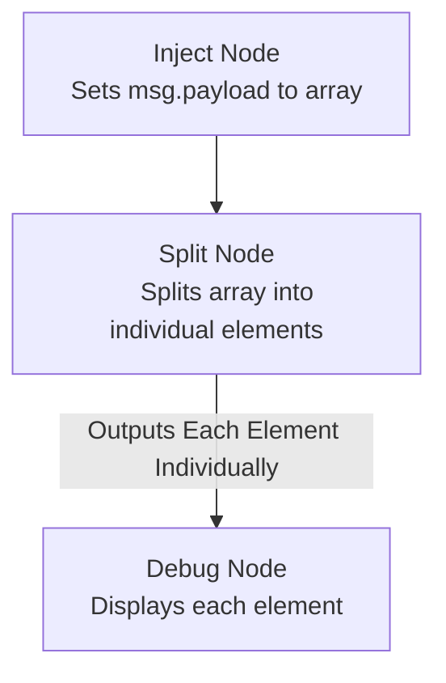

Loops are the engine that drives repetitive tasks in programming, making automation smooth and efficient. In Node-RED, they help automate processes like iterating over arrays, updating counters, or repeating actions based on conditions. Whether you’re handling data or automating repetitive tasks, loops make your flows more dynamic and streamlined.

<!--more-->

In this guide, we'll show you how to easily implement loops in Node-RED, making your workflows more efficient and flexible.

## What is a Loop?

A [loop](https://developer.mozilla.org/en-US/docs/Web/JavaScript/Guide/Loops_and_iteration) is a programming construct that repeats a set of instructions until a condition is met. There are two main types of loops:

- **For Loop**: Executes a block of code a specific number of times. Also known as a fixed number loop, it is ideal for iterating through a range of values or items in a list, where the number of iterations is known in advance.
- **While Loop**: Repeats a block of code as long as a specified condition remains true. Useful when the number of iterations isn’t known beforehand, and the loop continues based on a condition.
- **Do...While Loop**: Similar to the while loop, but guarantees that the code block is executed at least once before the condition is tested.
- **For...of / ForEach Loop**: Iterates over iterable objects like arrays or maps, accessing each element.

## Implementing Loops in Node-RED

In this section, we’ll explore how to implement loops in Node-RED. First, we’ll demonstrate how to achieve looping with core nodes. Then, we’ll show how to accomplish similar tasks using custom nodes. We’ll also cover some essential operations typically performed using loops, providing practical examples to enhance your Node-RED flows.

### Implementing Loops in Node-RED with Core Nodes

#### While Loop

To demonstrate a while loop, we'll create a flow that runs until the string we initialize contains the "Z" character, which will be shown on the debug panel.

1. Drag an **Inject** node onto the canvas. This node will be used to trigger the start of the loop.
2. Add a **Change** node to the canvas. Configure it to set `msg.i` to an empty string (`""`). Connect the **Inject** node to this **Change** node to initialize the string variable.
3. Place a **Switch** node on the canvas. Set it to check if `msg.i` contains the character "Z". Add an additional rule for when the condition is not met (`otherwise`). Connect the output of the **Change** node to the input of the **Switch** node.
4. Add a **Function** node onto the canvas. Use the following JavaScript to randomly append a character to the string:
    ```javascript
    msg.i += String.fromCharCode(65 + Math.floor(Math.random() * 26)); // Append a random uppercase letter
    return msg;
    ```
    Connect this **Function** node to the second output of the **Switch** node. Then, connect the output of this **Function** node back to the input of the **Switch** node to repeat the process.
5. Drag a **Debug** node onto the canvas and connect it to the second output of the **Switch** node. This node will display the current value of `msg.i` on the debug panel.
6. Add another **Change** node. Set `msg.payload` to `'completed'`. Connect this **Change** node to the first output of the **Switch** node, and then link it to another **Debug** node to show the completion message.

The loop continues to append a random character to the string and print the value until it contains "Z". Once the condition (`msg.i` contains "Z") is true, the flow prints a "completed" message and ends the loop.


[{"id":"7f896d5303f3d374","type":"group","z":"a3aa840957f658c6","name":"While Loop","style":{"label":true},"nodes":["2e73c592.d18c3a","b70d1dec.48f2e","64c1427a.9b3ebc","434af4eb.bcb50c","8498d15ec3630e42","44c14cd5fef57141","aa0c992ecda83e16"],"x":74,"y":759,"w":972,"h":222},{"id":"2e73c592.d18c3a","type":"switch","z":"a3aa840957f658c6","g":"7f896d5303f3d374","name":"Does the msg.i contains Z","property":"i","propertyType":"msg","rules":[{"t":"cont","v":"Z","vt":"str"},{"t":"else"}],"checkall":"true","repair":false,"outputs":2,"x":630,"y":860,"wires":[["44c14cd5fef57141"],["64c1427a.9b3ebc","aa0c992ecda83e16"]]},{"id":"b70d1dec.48f2e","type":"debug","z":"a3aa840957f658c6","g":"7f896d5303f3d374","name":"End","active":true,"tosidebar":true,"console":false,"tostatus":false,"complete":"true","targetType":"full","statusVal":"","statusType":"auto","x":950,"y":800,"wires":[]},{"id":"64c1427a.9b3ebc","type":"debug","z":"a3aa840957f658c6","g":"7f896d5303f3d374","name":"Output \"i\"","active":true,"tosidebar":true,"console":false,"tostatus":false,"complete":"i","targetType":"msg","statusVal":"","statusType":"auto","x":940,"y":880,"wires":[]},{"id":"434af4eb.bcb50c","type":"inject","z":"a3aa840957f658c6","g":"7f896d5303f3d374","name":"Start","props":[{"p":"payload"}],"repeat":"","crontab":"","once":false,"onceDelay":"","topic":"","payload":"[\"hello\",\"run\",\"why\"]","payloadType":"json","x":170,"y":860,"wires":[["8498d15ec3630e42"]]},{"id":"8498d15ec3630e42","type":"change","z":"a3aa840957f658c6","g":"7f896d5303f3d374","name":"initilized i with empty string","rules":[{"t":"set","p":"i","pt":"msg","to":"","tot":"str"}],"action":"","property":"","from":"","to":"","reg":false,"x":360,"y":860,"wires":[["2e73c592.d18c3a"]]},{"id":"44c14cd5fef57141","type":"change","z":"a3aa840957f658c6","g":"7f896d5303f3d374","name":"Set completed","rules":[{"t":"set","p":"payload","pt":"msg","to":"Completed","tot":"str"}],"action":"","property":"","from":"","to":"","reg":false,"x":760,"y":800,"wires":[["b70d1dec.48f2e"]]},{"id":"aa0c992ecda83e16","type":"function","z":"a3aa840957f658c6","g":"7f896d5303f3d374","name":"Append Random Letter","func":"// add ASCII char from 32 to 126\nmsg.i += String.fromCharCode(Math.random()*26 + 65);\nreturn msg;","outputs":1,"timeout":"","noerr":0,"initialize":"","finalize":"","libs":[],"x":690,"y":940,"wires":[["2e73c592.d18c3a"]]}]


#### For Loop

Implementing a for loop in Node-RED involves managing iteration in a way that is somewhat different from traditional programming loops. While a while loop continues as long as a specified condition remains true, a for loop typically iterates a set number of times based on an index or a range. For demonstration, we'll simulate a for loop by incrementing an index to access array elements one by one, rather than using a continuous condition check, this example will help you understand how to manage counter variables and access the array elements in node-red.

1. Drag an **Inject** node onto the canvas and set the `msg.payload` to `["foo","bar","foobar"]`. This node will trigger the start of the loop and provide the array we want to process.
2. Add a **Change** node to initialize the loop counter. Configure it to set `msg.i` to `0`, and connect the **Inject** node to this **Change** node.
3. Next, drag a **Switch** node onto the canvas. Configure it to check if `msg.i` is equal to  the array length (`msg.i == msg.payload.length`). Add an additional rule for when this condition is not met (`otherwise`). Connect the **Change** node to the **Switch** node.
4. Add another **Change** node to increment the counter. Configure it to set `msg.i` to `msg.i + 1` using a JSONata expression. Connect this **Change** node to the output of the **Switch** node where the condition (`msg.i < msg.payload.length`) is true means second output (otherwise).
5. To access and display the array elements, drag a **Change** node onto the canvas. Configure it to set `msg.payload` to `msg.payload[msg.i]`, accessing the array element at the current index. Connect this **Change** node to the **Switch** node's true output.
6. Attach a **Debug** node to the output of this **Change** node to print the current array element.
7. For the final step, add another **Change** node to signal when the loop has completed. Configure it to set `msg.payload` to `'completed'`, and connect it to the output of the **Switch** node where the loop condition is false. Finally, attach a **Debug** node to display the completion message.

This flow will iterate through the array, printing each element until all elements have been accessed. Once the loop reaches the end of the array, it prints a "completed" message and terminates.


[{"id":"2642825507908bbc","type":"loop","z":"a3aa840957f658c6","name":"","kind":"fcnt","count":"100","initial":"1","step":"1","condition":"msg.payload.substr(-1) != \"Z\"","conditionType":"js","when":"after","enumeration":"enum","enumerationType":"msg","limit":"10000","loopPayload":"loop-val","finalPayload":"final-last","x":410,"y":220,"wires":[["520234e5d604dfba"],["9d99c077ced9da6a","a2d7bb92556f7e0a"]]},{"id":"ceef4c4a1133ee5d","type":"inject","z":"a3aa840957f658c6","name":"","props":[{"p":"payload"}],"repeat":"","crontab":"","once":false,"onceDelay":0.1,"topic":"","payload":"","payloadType":"str","x":170,"y":220,"wires":[["2642825507908bbc"]]},{"id":"520234e5d604dfba","type":"debug","z":"a3aa840957f658c6","name":"","active":true,"tosidebar":true,"console":false,"tostatus":false,"complete":"loop","targetType":"msg","statusVal":"","statusType":"auto","x":620,"y":220,"wires":[]},{"id":"9eedb32222f0e8de","type":"comment","z":"a3aa840957f658c6","name":"Show final status","info":"","x":640,"y":180,"wires":[]},{"id":"9d99c077ced9da6a","type":"debug","z":"a3aa840957f658c6","name":"","active":true,"tosidebar":true,"console":false,"tostatus":false,"complete":"payload","targetType":"msg","statusVal":"","statusType":"auto","x":630,"y":320,"wires":[]},{"id":"a4eaa51bc6c0a03b","type":"comment","z":"a3aa840957f658c6","name":"Show string","info":"","x":630,"y":360,"wires":[]},{"id":"e97701f145811445","type":"comment","z":"a3aa840957f658c6","name":"Repeat until 100","info":"","x":380,"y":180,"wires":[]},{"id":"a2d7bb92556f7e0a","type":"change","z":"a3aa840957f658c6","name":"","rules":[{"t":"set","p":"payload","pt":"msg","to":"","tot":"str"}],"action":"","property":"","from":"","to":"","reg":false,"x":400,"y":280,"wires":[["2642825507908bbc"]]}]


## For...of / ForEach Loop

When you need to iterate through data, such as accessing array elements or object properties, split method fits well, even though it isn't exactly a traditional `for...of` or `forEach` loop. 

1. Drag an **Inject** node onto the canvas and set the `msg.payload` to `["foo", "bar", "foobar"]`.
2. Drag a **Split** node onto the canvas. Keep the default settings, but if you are working with a string, ensure you select "Split using" the correct delimiter.
3. Drag a **Debug** node onto the canvas and connect it to the **Split** node’s output.

Now, once you click the **Inject** button, it will iterate through all the elements and print them in the debug window. 

If you want to learn more about how you can map, sort, filter, and reduce data using this approach, we recommend checking out this guide: [How to Filter, Map, Sort, and Reduce Data in Node-RED](/blog/2024/06/filtering-mapping-sorting-reducing-with-node-red/).




[{"id":"2add2705d262010d","type":"inject","z":"a3aa840957f658c6","name":"Array","props":[{"p":"payload"}],"repeat":"","crontab":"","once":false,"onceDelay":0.1,"topic":"","payload":"[\"foo\",\"bar\",\"foobar\"]","payloadType":"json","x":870,"y":2260,"wires":[["40333c736844a0c1"]]},{"id":"40333c736844a0c1","type":"split","z":"a3aa840957f658c6","name":"","splt":"\\n","spltType":"str","arraySplt":1,"arraySpltType":"len","stream":false,"addname":"","property":"payload","x":1050,"y":2240,"wires":[["3337ba024a363a15"]]},{"id":"3337ba024a363a15","type":"debug","z":"a3aa840957f658c6","name":"","active":true,"tosidebar":true,"console":false,"tostatus":false,"complete":"true","targetType":"full","statusVal":"","statusType":"auto","x":1210,"y":2240,"wires":[]},{"id":"2f7d2aab12b3b4e9","type":"inject","z":"a3aa840957f658c6","name":"Object","props":[{"p":"payload"},{"p":"topic","vt":"str"}],"repeat":"","crontab":"","once":false,"onceDelay":0.1,"topic":"","payload":"{\"first\":\"Hello World\",\"second\":8,\"third\":true}","payloadType":"json","x":870,"y":2180,"wires":[["40333c736844a0c1"]]}]


### Implementing Loops in Node-RED with Custom node

Throughtout this section we will show you how you can implement loops in ndoe-red with custom nodes easily, there are plenty of custom nodes that can be used to achieve the loop but we will going use the popular one [node-red-contrib-loop](https://flows.nodered.org/node/node-red-contrib-loop), before moving further make sure to install it by palette manager also for demostration purpose we will use same example we used in the above sections.

#### While Loop / Do..While Loop

1. Drag the **Inject** node onto the canvas.
2. Drag the **Loop** node onto the canvas, double-click it, and set the kind to **Condition**. Set the condition to `msg.payload.includes("Z") !== true` as JavaScript. The condition kind offers a lot of flexibility as it allows adding conditions in JavaScript, regex, and JSONata. Next, set the "When test" option to "after" to make the loop behave like a do-while loop, which will execute at least once before checking the condition.
3. Drag the **Function** node onto the canvas. Add the following JavaScript code to it and connect its input to the second output of the **Loop** node:

    ```javascript
    msg.i += String.fromCharCode(65 + Math.floor(Math.random() * 26)); // Append a random uppercase letter
    return msg;
    ```

4. Drag the **Delay** node onto the canvas, set the delay to 0.5 milliseconds. When using the condition kind of loop, it is important to use the **Delay** node with this loop custom node to avoid creating an infinite loop. Connect the **Delay** node's input to the output of the **Function** node, and connect its output to the input of the **Loop** node.
5. Drag a **Debug** node onto the canvas and connect its input to the output of the **Function** node. This will print the current `msg.payload` after each iteration.
6. Drag another **Debug** node onto the canvas and connect its input to the first output of the **Loop** node. This will print when the loop exits, indicating that the condition has been met.


[{"id":"3ba931b1.fb48d6","type":"loop","z":"a3aa840957f658c6","name":"","kind":"cond","count":"10","initial":"1","step":"1","condition":"msg.payload.includes(\"Z\") != true","conditionType":"js","when":"after","enumeration":"enum","enumerationType":"msg","limit":"","loopPayload":"loop-keep","finalPayload":"final-last","x":1540,"y":2220,"wires":[["5aef28e.0f9e7d8"],["e88b0e8c.d39858"]]},{"id":"2d297dfa.6e660a","type":"inject","z":"a3aa840957f658c6","name":"","props":[{"p":"payload"}],"repeat":"","crontab":"","once":false,"onceDelay":0.1,"topic":"","payload":"","payloadType":"str","x":1310,"y":2220,"wires":[["3ba931b1.fb48d6"]]},{"id":"5aef28e.0f9e7d8","type":"debug","z":"a3aa840957f658c6","name":"","active":true,"tosidebar":true,"console":false,"tostatus":false,"complete":"loop","targetType":"msg","statusVal":"","statusType":"auto","x":1760,"y":2220,"wires":[]},{"id":"90c49008.053a58","type":"comment","z":"a3aa840957f658c6","name":"Example: Conditional loop","info":"","x":1350,"y":2120,"wires":[]},{"id":"9a725668.330148","type":"comment","z":"a3aa840957f658c6","name":"Show final status","info":"","x":1780,"y":2180,"wires":[]},{"id":"e88b0e8c.d39858","type":"function","z":"a3aa840957f658c6","name":"","func":"// add ASCII char from 32 to 126\nmsg.payload += String.fromCharCode(Math.random()*26 + 65);\nreturn msg;","outputs":1,"noerr":0,"initialize":"","finalize":"","x":1380,"y":2320,"wires":[["66144af4.d1ec9c","9c48f336.471ea"]]},{"id":"9c48f336.471ea","type":"debug","z":"a3aa840957f658c6","name":"","active":true,"tosidebar":true,"console":false,"tostatus":false,"complete":"false","statusVal":"","statusType":"auto","x":1770,"y":2320,"wires":[]},{"id":"66144af4.d1ec9c","type":"delay","z":"a3aa840957f658c6","name":"","pauseType":"delay","timeout":"500","timeoutUnits":"milliseconds","rate":"1","nbRateUnits":"1","rateUnits":"second","randomFirst":"1","randomLast":"5","randomUnits":"seconds","drop":false,"outputs":1,"x":1570,"y":2295,"wires":[["3ba931b1.fb48d6"]]},{"id":"75c6b326.e934d4","type":"comment","z":"a3aa840957f658c6","name":"Show string","info":"","x":1770,"y":2360,"wires":[]},{"id":"77ac6763.8e54b8","type":"comment","z":"a3aa840957f658c6","name":"Add char to string","info":"","x":1410,"y":2360,"wires":[]},{"id":"99b265b4.e2d3c8","type":"comment","z":"a3aa840957f658c6","name":"Repeat until string doesn't finish with \"Z\"","info":"","x":1520,"y":2180,"wires":[]}]


#### For Loop

1. Drag an **Inject** node onto the canvas and set the `msg.payload` to `["foo", "bar", "foobar"]`. This node will trigger the start of the loop and provide the array we want to process.
2. Drag a **Change** node onto the canvas. Configure it to set `msg.count` to `msg.payload.length`, which will store the length of the array. Connect the **Inject** node to this **Change** node.
3. Drag a **Loop** node onto the canvas, double-click on it, and set the kind to **Fixed**. Leave the "count" field empty as we are setting it dynamically using `msg.count`. Set the initial value to `0` and the step value to `1`. Set the loop payload to the original `msg.payload`.
4. Next, drag a **Change** node onto the canvas and configure it to either clear `msg.payload` or set `msg.payload` to itself. This ensures that the payload remains unchanged. Connect its input to the output of the **Loop** node and then connect its output back to the input of the **Loop** node. This setup allows the loop to repeat.
5. Then, drag another **Change** node onto the canvas. Configure this node to set `msg.payload` to `msg.payload[msg.loop.value]`, which extracts the current array element using the loop’s counter (`msg.loop.value`). The **Loop** node generates properties like `value`, which is the counter we are incrementing.
6. Finally, drag a **Debug** node onto the canvas and connect it to the output of the previous **Change** node to print the current array element in each iteration.


[{"id":"2ffc3d07.23e6fa","type":"inject","z":"a3aa840957f658c6","name":"","props":[{"p":"payload"}],"repeat":"","crontab":"","once":false,"onceDelay":0.1,"topic":"","payload":"[\"foo\",\"bar\",\"foobar\"]","payloadType":"json","x":1150,"y":2360,"wires":[["880a2501f7d153ba"]]},{"id":"6e1118b1.449db8","type":"loop","z":"a3aa840957f658c6","name":"","kind":"fcnt","count":"","initial":"0","step":"1","condition":"","conditionType":"js","when":"before","enumeration":"enum","enumerationType":"msg","limit":"","loopPayload":"loop-orig","finalPayload":"final-last","x":1650,"y":2380,"wires":[["44f1a29403157bba"],["bd58a956.c036b"]]},{"id":"ea852667d724cfb1","type":"change","z":"a3aa840957f658c6","name":"","rules":[{"t":"set","p":"payload","pt":"msg","to":"payload[msg.loop.value]","tot":"msg"}],"action":"","property":"","from":"","to":"","reg":false,"x":1700,"y":2480,"wires":[["60a8f138.0909a"]]},{"id":"880a2501f7d153ba","type":"change","z":"a3aa840957f658c6","name":"Set Pass Count","rules":[{"t":"set","p":"count","pt":"msg","to":"payload.length","tot":"msg"}],"action":"","property":"","from":"","to":"","reg":false,"x":1380,"y":2380,"wires":[["6e1118b1.449db8"]]},{"id":"bd58a956.c036b","type":"change","z":"a3aa840957f658c6","name":"","rules":[],"action":"","property":"","from":"","to":"","reg":false,"x":1460,"y":2480,"wires":[["6e1118b1.449db8","ea852667d724cfb1"]]},{"id":"60a8f138.0909a","type":"debug","z":"a3aa840957f658c6","name":"","active":true,"tosidebar":true,"console":false,"tostatus":false,"complete":"payload","targetType":"msg","statusVal":"","statusType":"auto","x":1910,"y":2480,"wires":[]},{"id":"44f1a29403157bba","type":"debug","z":"a3aa840957f658c6","name":"","active":true,"tosidebar":true,"console":false,"tostatus":false,"complete":"payload","targetType":"msg","statusVal":"","statusType":"auto","x":1910,"y":2380,"wires":[]}]


#### For...of / ForEach Loop

1. Drag an **Inject** node onto the canvas and set the `msg.payload` to `[6, 14, 36, -8, 100]`. This node will trigger the loop and provide the array of numbers to process.
2. Drag a **Loop** node onto the canvas. Set the **Kind** to **Enumeration** and choose `msg.payload` as the enumeration source. This configuration will loop through each value in the array. Set the loop payload to the current value being processed (`value`).
3. Drag a **Change** node onto the canvas and configure it to either clear `msg.payload` or set `msg.payload` to itself. This ensures that the payload remains unchanged during each iteration. Connect its input to the output of the **Loop** node, then connect its output back to the input of the **Loop** node to create the loop.
4. Finally, drag a **Debug** node onto the canvas and connect it to the second output of the **Loop** node. This will display the current value being processed in the loop.

With the **Enumeration** kind, you can iterate through different types of data such as arrays, strings, objects, and more, making this loop versatile for handling various data structures.


[{"id":"38630ff1.21721","type":"inject","z":"a3aa840957f658c6","name":"Object","props":[{"p":"payload"},{"p":"topic","vt":"str"}],"repeat":"","crontab":"","once":false,"onceDelay":0.1,"topic":"","payload":"{\"first\":\"Hello World\",\"second\":8,\"third\":true}","payloadType":"json","x":1150,"y":1980,"wires":[["f009e0e9.24576"]]},{"id":"f009e0e9.24576","type":"loop","z":"a3aa840957f658c6","name":"","kind":"enum","count":"","initial":"","step":"","condition":"","conditionType":"js","when":"before","enumeration":"payload","enumerationType":"msg","limit":"","loopPayload":"loop-val","finalPayload":"final-orig","x":1460,"y":2020,"wires":[["cf52b6dd.5febb8"],["33031c0e.1b115c","6e593ff2.dc94c"]]},{"id":"cf52b6dd.5febb8","type":"debug","z":"a3aa840957f658c6","name":"","active":true,"tosidebar":true,"console":false,"tostatus":false,"complete":"loop","targetType":"msg","statusVal":"","statusType":"auto","x":1670,"y":2000,"wires":[]},{"id":"33031c0e.1b115c","type":"change","z":"a3aa840957f658c6","name":"","rules":[],"action":"","property":"","from":"","to":"","reg":false,"x":1470,"y":2120,"wires":[["f009e0e9.24576"]]},{"id":"b28b06f1.38eb48","type":"inject","z":"a3aa840957f658c6","name":"Array","props":[{"p":"payload"}],"repeat":"","crontab":"","once":false,"onceDelay":0.1,"topic":"","payload":"[\"foo\",\"bar\",\"foobar\"]","payloadType":"json","x":1150,"y":2040,"wires":[["f009e0e9.24576"]]},{"id":"6e593ff2.dc94c","type":"debug","z":"a3aa840957f658c6","name":"","active":true,"tosidebar":true,"console":false,"tostatus":false,"complete":"true","targetType":"full","statusVal":"","statusType":"auto","x":1660,"y":2120,"wires":[]}]


