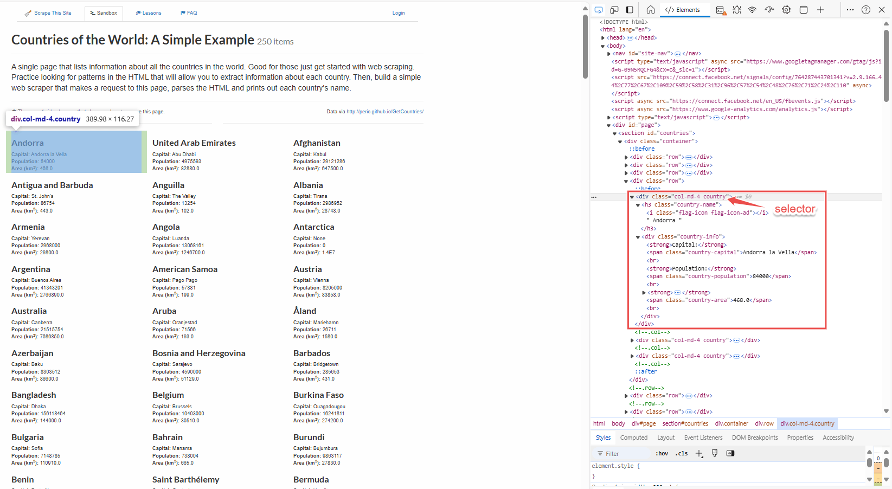
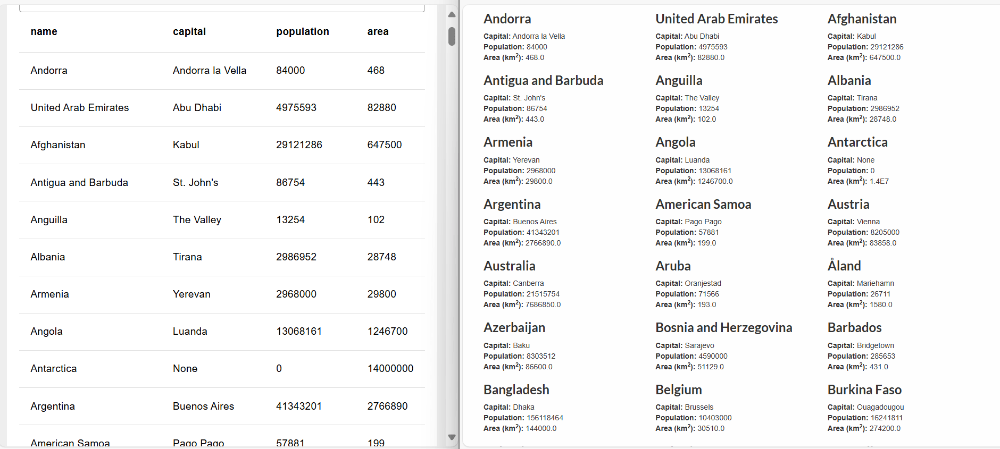

Have you ever needed to scrape website data to monitor news, track competitors, or gather insights about your industry? In this guide, you'll learn how to use Node-RED for efficient web scraping, allowing you to extract and manage data from various websites seamlessly. Whether you're looking to keep tabs on the latest articles, product mentions, or market trends, this step-by-step approach will help you set up Node-RED, configure scraping flows, and handle data extraction effectively.

<!--more-->

## What is Web Scraping?

Web scraping is a technique for automatically extracting data from websites. Instead of manually copying information from web pages, web scraping uses tools or scripts to access and retrieve data from the Internet efficiently. This process allows you to quickly gather large volumes of information, which is helpful for tasks such as tracking market trends, aggregating news, or collecting product details.

By automating data collection, web scraping helps save time and reduce human error. It enables users to extract and analyze structured data from various sources, making it easier to compile and utilize information for research, business intelligence, or other purposes.

## Why Use Web Scraping If APIs Are Available?

APIs are a convenient way to access data from websites, but not all sites offer APIs, or their APIs may not provide the specific data you need.

Web scraping can be helpful when APIs are unavailable or do not meet your requirements. It allows you to collect data directly from web pages, which can be beneficial for tasks like competitive analysis, market research, or tracking specific online content.

## How Web Scraping Works?

Web scraping involves systematically extracting data from websites using automated tools or scripts. The process begins with sending an HTTP request to a website's server, requesting access to a specific webpage. In response, the server provides the HTML content of the page. This HTML code contains the structured information displayed on the webpage, organized in a format that describes the layout and content.

Once the HTML is received, the next step is parsing it. Parsing involves analyzing the HTML structure to identify and extract the data of interest. This may include navigating through nested elements, locating specific tags, and using selectors to target precise content such as text blocks, images, or links. The extracted data is then processed and stored in a format that suits the user's needs, whether a database, a CSV file, or another format suitable for analysis.

## Web scrapping with Node-RED 

In this section, we will guide you through the process of scraping data from publicly available websites using Node-RED and demonstrate how to extract data from a website specifically designed for scraping practice. For this example, we will scrape country data from the page at `https://www.scrapethissite.com/pages/simple/.`

### Sending Requests to a Webpage

To start scraping data, follow these steps to send an HTTP GET request to the webpage:

1. Drag the ** inject ** node onto the canvas. This node allows you to manually trigger the HTTP request or set it to fire at specific intervals.
2. Drag the **http request** node onto the canvas. Double-click it to configure and set the **Method** to `GET.` Enter the webpage URL you want to scrape (e.g., `https://www.scrapethissite.com/pages/simple/`).
3. Drag the **debug** node onto the canvas.
4. Connect the **inject** node's output to the input of the **http request** node and the **http request** node's output to the input of the **debug** node.
5. Click **Deploy** to save and deploy your flow.

Once deployed, click the **inject** button. You will see the raw HTML printed in the debug panel.

### Parsing and Extracting Data from HTML

Next, we need to process the raw HTML to extract meaningful data. This involves parsing the HTML content and identifying the specific information you want. To do this, first analyze the HTML structure of the webpage by opening the browser’s developer tools (press Ctrl + I or F12) and inspecting the elements to locate where the data is and in which HTML elements it resides.

#### Analyzing HTML Structure

Begin by analyzing the HTML structure of the webpage. Open your browser’s developer tools (press Ctrl + shift + c) and inspect the elements to locate where the data resides and which HTML elements are contained. For example, on a page, you can see countries, each with its capital population and area; click your mouse on that element, and in the developer tool, you will navigate to that element's HTML. Now, find out the selector you can use to select those elements; in the countries page, you will see all of those countries' information is in the element that has the '.countries' class, so when using that class, we can extract all of the countries' data.

{data-zoomable}
_Image showing the structure of the page and the data which we needed to extract_

#### Using Node-RED to extract data

1. Drag the **html** node onto the canvas.
2. Double-click the **html** node and enter the selector `.countries` into the "Selector" field.
3. Set the output to "only the text of element" and keep other settings default.
4. Drag the **debug** node onto the canvas.
5. Connect the output of the **http request** node to the input of the **html** node and the output of the **html** node to the input of the **debug** node.
6. Click **Deploy** to save and deploy your flow.

When you click the **inject** button, you will see the array containing the text content from each `.countries` div. While this data is a good starting point, it has yet to be in a format that is directly useful for analysis. To make the data more helpful, you'll need to transform it into objects with meaningful properties.

### Transforming Data into Structured Objects

You can use JavaScript in a Node-RED function node to transform the data into structured objects. If you're familiar with JavaScript, this process is straightforward. If not, you can use FlowFuse Assistant to generate the necessary function. For more information, refer to our this [LinkedIn Post](https://www.linkedin.com/posts/flowfuse_flowfuse-nodered-automation-activity-7226171132796637184-vKKt?utm_source=share&utm_medium=member_desktop) for a quick guide. To follow the steps manually:

1. Drag the **function** node onto the canvas.
2. Double-click the **function** node and paste the following JavaScript code:

```js
const convertArrayToObject = (arr) => {
    const result = arr.map(item => {
        const [name, capital, population, area] = item
            .split(/Capital: |Population: |Area \(km2\): /)
            .map(part => part.trim());

        return {
            name,
            capital,
            population: parseInt(population, 10),
            area: parseFloat(area)
        };
    });

    return result;
};

msg.payload = convertArrayToObject(msg.payload)

return msg;
```

3. Drag the **debug** node onto the canvas.
4. Connect the output of the html node to the input of the **function** node and the output of the **function** node to the input of the debug node.
5. Click **Deploy** to save and deploy your flow.

When you click the inject button again, you will see that the data is now structured and formatted. The output will contain objects with properties such as name, capital, population, and area. This data can now be displayed on the FlowFuse dashboard table. For more details, refer to the [FlowFuse table widget](https://dashboard.flowfuse.com/nodes/widgets/ui-table.html).

{data-zoomable}
_Left side: Image showing the table we created on the FlowFuse dashboard. Right side: The original webpage with countries._

## Legal and Ethical Considerations

While web scraping is a powerful tool for collecting data, it is essential to be aware of the legal and ethical implications. Web scraping itself is not inherently illegal, but its legality depends on various factors, including the website's terms of service and the data being scraped.

### Legal Aspects

- **Respect Terms of Service**: Many websites have terms of service that explicitly prohibit scraping. Constantly review and adhere to these terms to avoid legal issues.
- **Intellectual Property**: Be mindful of intellectual property rights. Avoid scraping content that is copyrighted or proprietary without permission.
- **Data Privacy**: Ensure you comply with data protection regulations such as GDPR or CCPA when handling personal data. Scraping personal information without consent can lead to legal consequences.

### Ethical Considerations

- **Respect Website Performance**: Avoid overloading a website with excessive requests. Implement rate limiting and respect the website's robots.txt file to prevent disrupting normal operations.
- **Use Data Responsibly**: Handle the scraped data ethically and responsibly. Please do not use it for malicious purposes or in a way that could harm individuals or organizations.

Following these guidelines, you can use web scraping tools like Node-RED effectively while respecting legal and ethical boundaries.

## Conclusion

You’ve now learned to use Node-RED for web scraping, from sending requests and parsing HTML to transforming data into practical formats. This approach streamlines data collection from websites, making it easier to manage and analyze information efficiently.
