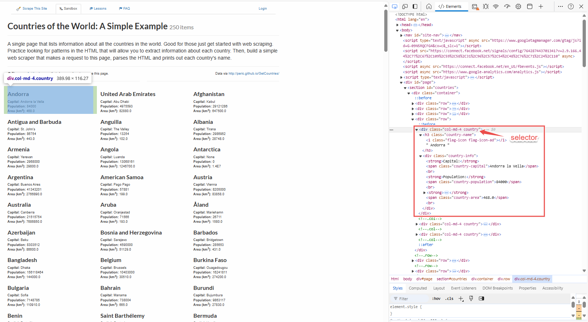
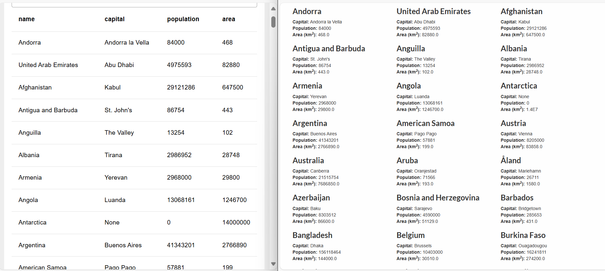

Web scraping has become an indispensable tool for monitoring news, tracking competitors, and gathering insights. In this guide, you'll learn how to harness the power of Node-RED for efficient web scraping, allowing you to extract and manage data from various websites with ease that are not exposed through an API.

<!--more-->

## What is Web Scraping?

Web scraping is a technique for automatically extracting data from websites. Instead of manually copying information from web pages, web scraping uses tools or scripts to access and retrieve data from the Internet efficiently. This process allows you to quickly gather large volumes of information, which is helpful for tasks such as tracking market trends, aggregating news, or collecting product details. By automating data collection, web scraping helps save time and reduce human error. It enables users to extract and analyze structured data from various sources, making it easier to compile and utilize information for research, business intelligence, or other purposes.

Web scraping can be helpful when APIs are unavailable or do not meet your requirements. It allows you to collect data directly from web pages, which can be beneficial for tasks like competitive analysis, market research, or tracking specific online content.

## How Does Web Scraping Works?

Web scraping involves systematically extracting data from websites using automated tools or scripts. The process begins with requesting a specific webpage. The response from the server is the HTML content of the page. This HTML code contains the structured information displayed on the webpage, organized in a format that describes the layout and content.

Once the HTML is received, the next step is parsing it. Parsing involves analyzing the HTML structure to identify and extract the data of interest. This may include navigating through nested elements, locating specific tags, and using selectors to target precise content such as text blocks, images, or links. The extracted data is then processed and stored in a format that suits the user's needs, whether a database, a CSV file, or another format suitable for analysis.

## Web scrapping with Node-RED 

In this section, we will guide you through the process of scraping data from publicly available websites using Node-RED and demonstrate how to extract data from a website specifically designed for scraping practice. For this example, we will scrape country data from the page at `https://www.scrapethissite.com/pages/simple/.`

### Sending Requests to a Webpage

To start scraping data, follow these steps to send an HTTP GET request to the webpage:

1. Drag the **inject** node onto the canvas. This node allows you to manually trigger the HTTP request or set it to fire at specific intervals.
2. Drag the **http request** node onto the canvas. Double-click it to configure and set the **Method** to `GET.` Enter the webpage URL you want to scrape (e.g., `https://www.scrapethissite.com/pages/simple/`).
3. Drag the **debug** node onto the canvas.
4. Connect the **inject** node's output to the input of the **http request** node and the **http request** node's output to the input of the **debug** node.
5. Click **Deploy** to save and deploy your flow.

Once deployed, click the **inject** button. You will see the raw HTML printed in the debug panel.

### Parsing and Extracting Data from HTML

Next, we need to process the raw HTML to extract meaningful data. This involves parsing the HTML content and identifying the specific information you want. To do this, first analyze the HTML structure of the webpage by opening the browser’s developer tools (press Ctrl + I or F12) and inspecting the elements to locate where the data is and in which HTML elements it resides.

#### Analyzing HTML Structure

Begin by analyzing the HTML structure of the webpage. Open your browser’s developer tools (press Ctrl + Shift + c ) and examine the elements to locate where the data resides and which HTML elements contain it. For example, on a page with a list of countries, each with its capital, population, and area, click on one of those countires elements to navigate to its HTML in the developer tools. Identify the selector that can be used to select those elements. On this webpage, the information about countries is contained within an element with the .countries class. You can use this class to extract all the data for the countries.

{data-zoomable}
_Image showing the structure of the page and the data which we needed to extract_

#### Using Node-RED to extract data

1. Drag the **html** node onto the canvas.
2. Double-click the **html** node and enter the selector `.countries` into the "Selector" field.
3. Set the output to "only the text of element" and keep other settings default.
4. Drag the **debug** node onto the canvas.
5. Connect the output of the **http request** node to the input of the **html** node and the output of the **html** node to the input of the **debug** node.
6. Click **Deploy** to save and deploy your flow.

When you click the **inject** button, you will see the array containing the text content from each `.countries` div. While this data is a good starting point, it has yet to be in a format that is directly useful for analysis. To make the data more helpful, you'll need to transform it into objects with meaningful properties.

### Transforming Data into Structured Objects

You can use JavaScript in a Node-RED function node to transform data into structured objects. If you are familiar with JavaScript, this process will be straightforward. However, if you are not, you can use FlowFuse Expert to generate the necessary function. For more details, refer to our [LinkedIn Post](https://www.linkedin.com/posts/flowfuse_flowfuse-nodered-automation-activity-7226171132796637184-vKKt/?utm_source=share&utm_medium=member_desktop) for a quick guide. However, in this section, we will use a low-code approach to transform the data.

1. Drag a **Split** node onto the canvas and connect it to the **HTML** node. This **Split** node will split the input array into individual string messages.
2. Drag a **Change** node onto the canvas and connect it to the **Split** node. Set `msg.name` to the following JSONata expression to extract the country name:
    ```json
    $trim($split(payload, "Capital: ")[0])
    ```

3. Set `msg.payload` to the following Jsonata expression that will extract the capital and population from the string:
    ```json
    $split($split(payload, "Capital: ")[1], "Population: ")
    ```

4. Drag another **Change** node onto the canvas and connect it to the previous **Change** node. Set `msg.capital` to the following Jsonata expression to trim and extract the value of the capital from the previously split data array:
    ```json
    $trim(payload[0])
    ```

5. Set `msg.payload` to the following Jsonata expression to split the remaining string for area extraction:
    ```json
    $split(payload[1], "Area (km2): ")
    ```

6. Drag another **Change** node onto the canvas and connect it to the **Change** node from the previous step. Set `msg.population` to the following Jsonata expression to trim and convert the population value to a number:
    ```json
    $number($trim(payload[0]))
    ```

7. Set `msg.area` to the following Jsonata expression to trim and convert the area value to a number:
    ```json
    $number($trim(payload[1]))
    ```

8. Drag another **Change** node onto the canvas and connect it to the last **Change** node. Set `msg.payload` to the following JSON object:
    ```json
    {
      "name": name,
      "capital": capital,
      "population": population,
      "area": area
    }
    ```
9. Finally, drag a **Join** node onto the canvas and connect it to the previous **Change** node. This Join node will create an array of the objects we have created.

When you click the inject button again, you will see that the data is now structured and formatted. The output will contain objects with properties such as name, capital, population, and area. This data can now be displayed on the FlowFuse dashboard table. For more details, refer to the [FlowFuse table widget](https://dashboard.flowfuse.com/nodes/widgets/ui-table.html).


[{"id":"cc3c919ad9f93cc6","type":"inject","z":"380e37fed72e6885","name":"","props":[{"p":"payload"},{"p":"topic","vt":"str"}],"repeat":"","crontab":"","once":false,"onceDelay":0.1,"topic":"","payload":"","payloadType":"date","x":280,"y":200,"wires":[["43ba04d623a8aa57"]]},{"id":"2d66b9fa2858cf5f","type":"html","z":"380e37fed72e6885","name":"","property":"payload","outproperty":"payload","tag":".country","ret":"text","as":"single","x":620,"y":200,"wires":[["c4e9a4c8.487e68"]]},{"id":"43ba04d623a8aa57","type":"http request","z":"380e37fed72e6885","name":"","method":"GET","ret":"txt","paytoqs":"ignore","url":"https://www.scrapethissite.com/pages/simple/","tls":"","persist":false,"proxy":"","insecureHTTPParser":false,"authType":"","senderr":false,"headers":[],"x":450,"y":200,"wires":[["2d66b9fa2858cf5f"]]},{"id":"8e7b462a5b5a064e","type":"ui-table","z":"380e37fed72e6885","group":"0c48f8d560157d3c","name":"","label":"text","order":1,"width":0,"height":0,"maxrows":0,"passthru":false,"autocols":true,"showSearch":true,"selectionType":"none","columns":[],"mobileBreakpoint":"sm","mobileBreakpointType":"defaults","x":1870,"y":200,"wires":[[]]},{"id":"c4e9a4c8.487e68","type":"split","z":"380e37fed72e6885","name":"Split Array","splt":"\\n","spltType":"str","arraySplt":"1","arraySpltType":"len","stream":false,"addname":"","x":810,"y":200,"wires":[["1a1e8a0a.8e7b06"]]},{"id":"1a1e8a0a.8e7b06","type":"change","z":"380e37fed72e6885","name":"Extract Name","rules":[{"t":"set","p":"name","pt":"msg","to":"$trim($split(payload, \"Capital: \")[0])","tot":"jsonata"},{"t":"set","p":"payload","pt":"msg","to":"$split($split(payload, \"Capital: \")[1], \"Population: \")","tot":"jsonata"}],"action":"","property":"","from":"","to":"","reg":false,"x":1000,"y":200,"wires":[["cfdb7c1f.9234b"]]},{"id":"cfdb7c1f.9234b","type":"change","z":"380e37fed72e6885","name":"Extract Capital & Population","rules":[{"t":"set","p":"capital","pt":"msg","to":"$trim(payload[0])","tot":"jsonata"},{"t":"set","p":"payload","pt":"msg","to":"$split(payload[1], \"Area (km2): \")","tot":"jsonata"}],"action":"","property":"","from":"","to":"","reg":false,"x":1240,"y":200,"wires":[["fb93f89b.b96138"]]},{"id":"fb93f89b.b96138","type":"change","z":"380e37fed72e6885","name":"Extract Population & Area","rules":[{"t":"set","p":"population","pt":"msg","to":"$number($trim(payload[0]))","tot":"jsonata"},{"t":"set","p":"area","pt":"msg","to":"$number($trim(payload[1]))","tot":"jsonata"},{"t":"set","p":"payload","pt":"msg","to":"{   \"name\": name,   \"capital\": capital,   \"population\": population,   \"area\": area}","tot":"jsonata"}],"action":"","property":"","from":"","to":"","reg":false,"x":1510,"y":200,"wires":[["342166ac8729e9d7"]]},{"id":"342166ac8729e9d7","type":"join","z":"380e37fed72e6885","name":"","mode":"auto","build":"object","property":"payload","propertyType":"msg","key":"topic","joiner":"\\n","joinerType":"str","accumulate":true,"timeout":"","count":"","reduceRight":false,"reduceExp":"","reduceInit":"","reduceInitType":"","reduceFixup":"","x":1710,"y":200,"wires":[["8e7b462a5b5a064e"]]},{"id":"0c48f8d560157d3c","type":"ui-group","name":"My Group","page":"d0def7a91d3b7aa1","width":"12","height":"1","order":1,"showTitle":false,"className":"","visible":"true","disabled":"false"},{"id":"d0def7a91d3b7aa1","type":"ui-page","name":"Page 1","ui":"c385dfc590b1308d","path":"/1","icon":"home","layout":"grid","theme":"6be033291dd76b17","order":1,"className":"","visible":false,"disabled":false},{"id":"c385dfc590b1308d","type":"ui-base","name":"Dashboard","path":"/dashboard","includeClientData":true,"acceptsClientConfig":["ui-notification","ui-control","ui-button"],"showPathInSidebar":false,"showPageTitle":false,"navigationStyle":"temporary","titleBarStyle":"default"},{"id":"6be033291dd76b17","type":"ui-theme","name":"Default Theme","colors":{"surface":"#202c34","primary":"#202c34","bgPage":"#eeeeee","groupBg":"#ffffff","groupOutline":"#ffffff"},"sizes":{"pagePadding":"12px","groupGap":"12px","groupBorderRadius":"4px","widgetGap":"12px","density":"default"}}]


{data-zoomable}
_Left side: Image showing the table we created on the FlowFuse dashboard. Right side: The original webpage with countries._

## Legal and Ethical Considerations

Web scraping can be a valuable tool for gathering data, but it's crucial to navigate the legal and ethical landscape responsibly. Adhere to websites' terms of service, respect intellectual property and data privacy laws, and avoid actions that could disrupt a site's operation or misuse the scraped data. By staying informed and adhering to best practices, you can harness the power of web scraping tools like Node-RED while remaining ethically and legally compliant.

## Conclusion

You’ve now learned to use Node-RED for web scraping, from sending requests and parsing HTML to transforming data into practical formats. This approach streamlines data collection from websites, making it easier to manage and analyze information efficiently.

{% include "cta.njk", cta_query: "utm_campaign=60718323-BCTA&utm_source=blog&utm_medium=cta&utm_term=high_intent&utm_content=How%20to%20Scrape%20Data%20from%20Websites%20Using%20Node-RED", cta_type: "signup", cta_text: "" %}